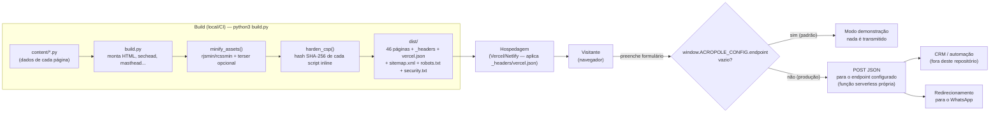

# Acrópole Capital — site institucional

Site institucional multipáginas, estático, sem framework e sem dependência de build em produção.
28 documentos HTML reais, um por rota. Nenhum item de menu rola para uma âncora fingindo ser página.

```
src/                        código-fonte e gerador
dist/                       site pronto para publicar (multipáginas real)
acropole-navegavel.html     as 28 páginas em arquivo único, para pré-visualizar
```

Para ver agora: abra `dist/index.html` no navegador, ou sirva a pasta:

```bash
cd dist && python3 -m http.server 8000
```

---

## 1. Mapa de páginas

| Rota | Arquivo | Conteúdo |
|---|---|---|
| `/` | `index.html` | Hero, posicionamento, índice de soluções, metodologia, públicos, leitura de mercado, conteúdos |
| `/sobre` | `sobre.html` | Narrativa institucional, compromissos, rede, equipe |
| `/solucoes` | `solucoes.html` | Hub das sete estruturas + tabela de adequação |
| `/solucoes/capital-de-giro` | | Página dedicada |
| `/solucoes/home-equity` | | Página dedicada |
| `/solucoes/auto-equity` | | Página dedicada |
| `/solucoes/credito-pj` | | Página dedicada |
| `/solucoes/estruturacao-de-credito` | | Página dedicada |
| `/solucoes/financiamento` | | Página dedicada |
| `/solucoes/aquisicao-e-construcao` | | Página dedicada |
| `/como-funciona` | `como-funciona.html` | Seis etapas, documentação, critérios, FAQ |
| `/empresas` | `empresas.html` | Diagnóstico empresarial, aplicações, critério de ticket |
| `/investidores` | `investidores.html` | Terreno, obra, indicadores de projeto, estrutura por fase |
| `/conteudos` | `conteudos.html` | Blog com busca e filtro por categoria |
| `/conteudos/<slug>` | | 7 artigos completos, com sumário, fontes e relacionados |
| `/contato` | `contato.html` | Formulário progressivo em três etapas |
| `/politica-de-privacidade`, `/termos-de-uso`, `/avisos-legais` | | Documentos institucionais |
| `/404` | `404.html` | Página de erro com rotas de recuperação |
| `/diagnostico` | `diagnostico.html` | Ferramenta interativa: 4 perguntas, roda 100% no navegador, aponta a estrutura mais provável sem dar valor, taxa ou prazo |
| `/governanca` | `governanca.html` | Identificação de cliente, conflito de interesses, proteção de dados, canal de conduta |

Cada página de solução tem estrutura editorial própria: contexto, quando faz sentido,
como funciona, **um cenário ilustrativo (hipotético, claramente rotulado como tal)**, para quem é, benefícios, **cuidados** e dúvidas frequentes. A seção de cuidados existe em todas: uma recomendação que só apresenta vantagens não é uma recomendação.

---

## 2. Antes de publicar: preencher os dados de contato

Abra `src/content/site.py`. No topo há um único bloco:

```python
CONTATO = {
    # Obrigatórios para publicar
    "whatsapp":  None,   # só dígitos com país e DDD. Ex.: "5531999998888"
    "email":     None,   # Ex.: "contato@acropolecapital.com.br"

    # Opcionais: se ficarem None, a linha não aparece no site
    "telefone":  None,
    "endereco":  None,
    "horario":   None,
    "linkedin":  None,
    "instagram": None,
}
```

Depois: `python3 build.py && python3 preflight.py`

**Como o site trata dado que falta.** Nada de campo vazio ou link que não leva a lugar
nenhum. Um valor `None` faz a linha inteira sumir do rodapé e da página de contato; onde o
dado é estrutural (WhatsApp, e-mail), aparece um rótulo neutro em texto — "WhatsApp a definir" —
com marcação visual discreta, **nunca um `<a>` morto**. O botão flutuante de contato aponta
para `/contato` enquanto não houver WhatsApp, e passa a apontar para o WhatsApp assim que
o número for preenchido. O número é formatado sozinho: `5531999998888` vira `(31) 99999-8888`
na tela e `https://wa.me/5531999998888` no link.

**A trava de publicação.** `preflight.py` roda depois do build, varre o HTML gerado e
**retorna código 1 enquanto houver pendência obrigatória**, listando exatamente o que falta
e em quais arquivos. Serve para plugar em CI ou em script de deploy:

```bash
python3 build.py && python3 preflight.py && ./deploy.sh
```

Estado atual da trava:

```
NÃO PUBLICAR — 9 pendência(s) obrigatória(s):
  × CONTATO['whatsapp'] não preenchido
  × CONTATO['email'] não preenchido
  × Nomes e biografias da equipe — em sobre.html
  × Data nos documentos legais — em avisos-legais.html, politica-de-privacidade.html, termos-de-uso.html
  × Foro nos Termos de Uso — em termos-de-uso.html
  × Perfis sociais no rodapé
```

Além do bloco `CONTATO`, restam textos a preencher em:

- `src/content/institucional.py` → seção **Equipe**: `[Nome do responsável]` e a biografia
- `src/content/legal.py` → `[data de publicação]` nos três documentos e `[Cidade/UF]` no foro
- `src/content/site.py` → `"domain"`, usado em canonical, Open Graph, sitemap e schema

Os documentos legais são **modelos** e precisam de revisão jurídica antes de ir ao ar.

## 2b. Ferramentas adicionadas na segunda rodada

**Diagnóstico rápido (`/diagnostico`).** Um roteador qualitativo entre as sete estruturas,
não uma calculadora de crédito. Pergunta perfil, necessidade principal, garantia disponível e,
condicionalmente, porte da operação ou se envolve obra. Devolve 1-2 direções com justificativa
curta e link para a página real da estrutura. **Não pede, não mostra e não envia nenhum dado** —
toda a lógica roda em `<script>` inline na própria página, em `content/diagnostico.py`. Isso é
proposital: um simulador que desse valor, taxa ou prazo estaria dando aconselhamento financeiro
com precisão que ninguém pode garantir antes da análise real. Testado com 5 cenários de decisão
em `test_ui.py`-style (ver seção 8).

**Governança (`/governanca`).** Natureza da atividade, identificação de cliente, conflito de
interesses, proteção de dados e um canal de conduta (e-mail). Escrita para não superafirmar:
não menciona certificação, selo ou órgão regulador que a empresa não possui.

**Cenários ilustrativos nas 7 páginas de solução.** Cada página de solução ganhou um bloco
`Cenário ilustrativo (hipotético)` logo após "quando faz sentido". São exemplos com empresas
e pessoas **explicitamente fictícias** ("Empresa fictícia de distribuição...", "Empresário
fictício com..."), com aviso de rodapé reforçando que não representam cliente real. Isso
preenche a lacuna de "mostrar a mecânica funcionando" sem fabricar prova social — que o site
nunca faz. Os textos vivem em `EXAMPLES` no topo de `content/solucoes.py`.

**Compartilhamento social.** Imagem de Open Graph própria (1200×630, `assets/social/og-image.jpg`,
53 KB), gerada a partir de uma composição HTML com os tokens de marca e rasterizada via Chromium
headless — não é uma imagem de banco. Favicon completo: SVG + PNG em 16/32/48/180/192/512px
(`assets/icons/`) e `site.webmanifest`. Sem isso, um link compartilhado no WhatsApp ou LinkedIn
aparecia sem nenhum preview visual.

## 3. Dados: o que é real e o que tem fonte

**Informação institucional** (do material da empresa): CNPJ 67.311.470/0001-47, rede de 74+
instituições no Brasil, Inglaterra, Portugal e Suíça, ticket mínimo de R$ 10 milhões em
operações corporativas estruturadas, braço financeiro próprio.

**Dados de mercado** (fontes públicas, sempre citadas na página): Banco Central (séries SGS
de concessão e taxas), Abecip (home equity 1T26, LTV e prazo médios), CBIC (lançamentos e VGL
2025), Serasa Experian (inadimplência empresarial dez/2025), Leis nº 9.514/1997, 4.728/1965 e
14.711/2023.

**Nada foi inventado.** Não há número de clientes, volume operado, taxa de aprovação, anos de
experiência ou depoimento fabricado. A página `/avisos-legais` explica como ler os dados,
inclusive a ressalva de que concessão é fluxo mensal com sazonalidade forte.

Quando as séries forem atualizadas, os números vivem em:
`src/content/home.py` (lista `MARKET`), nos campos `meta` de `src/content/solucoes.py`
e no corpo dos artigos em `src/content/conteudos.py`.

---

## 3b. Sistema visual: Specify adaptado

O sistema anterior (calcário, grafite, petróleo, latão, Newsreader serifada) foi **substituído**
pelo sistema de referência enviado pelo cliente. O que mudou:

| | Antes | Agora |
|---|---|---|
| Tipografia | Newsreader + Inter + IBM Plex Mono | **Inter, e só Inter**, verificado por medição |
| Títulos | Serifada peso 300, tracking negativo | **Inter Bold 700**, tracking −0.016 a −0.031em |
| Acento | Latão `#8e7439` | **Ciano-petróleo** (a paleta antiga, mantida a pedido) |
| Superfícies | Calcário `#efeee9` | Obsidiana `#151718` → branco → `#f6f7f9` |
| Botões | Retângulo 2px | **Pílula 40px** com sombra em camada dupla |
| Cartões | Filete 1px, canto vivo | **16px** de raio com sombra `subtle-2` |
| Grade | Ritmo editorial | **8px**, cartão 24px, seção 80px |
| Hero | Serifada branca | **Headline em gradiente** 90°, a assinatura do sistema |

Todos os valores vivem em `:root` no `site.css`, com os nomes do sistema de referência
(`--iris`, `--obsidian`, `--cloud`, `--mist`, `--iron`, `--r-button`, `--shadow-card`).

### O acento: ciano-petróleo, não o violeta da referência

A estrutura do sistema de referência foi seguida (Inter, pílulas, cartão 16px, grade de 8px,
sombra em camada dupla, headline em gradiente), mas **o violeta foi substituído pela família
ciano-petróleo** da identidade anterior, a pedido do cliente. Três degraus, cada um calibrado
para a superfície onde é usado:

| Token | Valor | Uso | Contraste |
|---|---|---|---|
| `--petrol-deep` | `#10333B` | Preenchimentos e superfícies | 13,5:1 no branco |
| `--iris` | `#125C6B` | Acento e texto sobre claro | 7,6:1 no branco |
| `--soft-iris` | `#2E93A8` | Meio do gradiente, pontos de destaque | 5,0:1 na obsidiana |
| `--cobalt-lift` | `#1D6C7E` | Fim do gradiente do título | 3,0:1 na obsidiana |
| `--iris-on-dark` | `#52BFD4` | Texto pequeno sobre superfície escura | 8,4:1 na obsidiana |

Os nomes dos tokens foram mantidos para não quebrar as regras que já os referenciavam; só os
valores mudaram. Resultado: **zero ocorrência de contraste em 17 páginas × 2 larguras.**

## 3b-bis. Padronização verificada por medição

`src/design_audit.py` abre as 28 páginas em três larguras, lê os valores **computados pelo
navegador** e acusa qualquer coisa fora dos tokens. Não é inspeção visual: é medição.

```bash
cd src && python3 build.py && python3 design_audit.py
```

Estado atual: **"Sistema consistente: nada fora da escala."**

| Dimensão | Resultado |
|---|---|
| Famílias tipográficas | **Inter**, 10.877 elementos. Nenhuma outra |
| Tamanhos | 12 · 14 · 16 · 20 · 24 · 28 · 32 · 40 · 48 · 64 px. Zero fora da escala |
| Pesos | 400 · 500 · 600 · 700. Zero fora |
| Raios | 2 · 16 · 40 · 100 px. Zero fora |
| Espaçamentos | Todos na grade de 8px |
| Cores de texto | 12 valores, todos da paleta |

### O que foi corrigido para chegar nisso

A auditoria acusou **43 desvios** na primeira execução:

1. **Escala fluida trocada por degraus.** `clamp()` produz valores intermediários em larguras
   intermediárias — 22,4px, 27,2px, 33,89px. Isso é o oposto de padronizado. A escala virou
   degraus fixos por media query (768px e 1200px), então toda largura cai exatamente num passo.
2. **Pesos 450, 480, 520, 540 e 560** (restos do sistema anterior) encaixados em 400/500/600/700.
3. **Margens em `em` convertidas para `rem`.** Uma margem de `1.05em` gera 16,8px num parágrafo
   de 16px e 14,7px num de 14px. Em `rem`, o ritmo vertical é o mesmo em todo o site.
4. **Clamps de espaçamento** substituídos por tokens da grade.
5. **Restos da paleta antiga:** o latão `#C9A867` ainda aparecia 165 vezes em estilos inline
   dos templates Python, fora do alcance da normalização do CSS. Todos trocados por token.
6. **Margem padrão do navegador em campos de formulário**, que gerava desvio de 2-3px.

### Responsividade

Testada em **oito larguras** — 360, 390, 430, 768, 1024, 1366, 1440 e 1920px — nas 24 páginas
principais: **zero overflow horizontal em qualquer combinação.**

## 3c. Versão navegável em arquivo único

`acropole-navegavel.html` (~800 KB) contém as 28 páginas em um só arquivo, com roteador de
hash (`#/sobre`, `#/solucoes/home-equity`), CSS, JS, fontes e arte todos embutidos. **Zero
requisição externa** — abre por `file://` e navega igual ao site publicado.

Serve para pré-visualizar e circular internamente em ambientes que servem um arquivo por vez
e onde link relativo entre documentos não funciona. Não há faixa de aviso nem qualquer
elemento a mais: abre direto no cabeçalho do site. **Não substitui `dist/`**: o site de
produção continua multipáginas real, com uma rota HTTP por página, que é o que interessa
para SEO e compartilhamento.

Gerado por `src/bundle.py`, que roda depois do `build.py`:

```bash
cd src && python3 build.py && python3 bundle.py
```

Três detalhes que o empacotador resolve e que costumam quebrar esse tipo de bundle:

- **Arte deduplicada.** Os SVGs entram uma única vez em `__ACR_ART__` e são aplicados por id.
  Inlinando por ocorrência, o mesmo topo de página se repetiria em 28 rotas e o arquivo
  passava de 1,7 MB — com o mapa, cai para 800 KB.
- **`</script>` escapado.** A página de diagnóstico traz um `<script>` no corpo; o `</script>`
  literal encerraria o bloco que carrega o JSON das rotas.
- **Scripts reexecutados.** `innerHTML` não executa `<script>`, então o roteador recria cada um
  após a troca de conteúdo. E o `site.js` foi dividido em `bindGlobal()` (uma vez) e
  `bindPage(scope)` (a cada navegação), para que acordeão, busca, máscaras e formulários
  voltem a funcionar depois de trocar de rota.

## 3d. Correção: cabeçalho perdia o "sticky" ao rolar

**Sintoma relatado:** ao rolar a home no mobile, o cabeçalho parava de ficar fixo no topo e
o texto "CRÉDITO ESTRUTURADO" aparecia baixo-contraste, como um fantasma sobre o conteúdo
de trás.

**Causa raiz:** `overflow-x: hidden` no `<html>` e no `<body>`. É uma pegadinha conhecida do
CSS — qualquer valor de `overflow` diferente de `visible` num ancestral muda o container de
rolagem, e no Chrome isso quebra `position: sticky` dos elementos descendentes. O cabeçalho
(`position: sticky; top: 0`) passava a rolar junto com a página em vez de grudar no topo.
O texto "fantasma" era o rótulo `.brand__sub`, com a cor clara pensada para o hero escuro,
agora visível sobre o conteúdo que vazava por trás do cabeçalho fora de posição.

**Correção:** trocado `overflow-x: hidden` por `overflow-x: clip` em `html` e `body`.
`clip` corta o conteúdo sem criar o contexto de rolagem que quebra o sticky, preservando o
efeito original (impedir rolagem horizontal) sem o efeito colateral.

**Verificado:** cabeçalho com `top: 0` confirmado por medição (não por olho) em 21 páginas ×
8 larguras (360 a 1920px), com a página rolada. Overflow horizontal seguiu em zero nas mesmas
21 páginas × 8 larguras.

## 3e. Remoção dos traços decorativos

A pedido do cliente, removidos todos os pequenos traços/tracinhos de acento (2px de altura,
em latão ou ciano) que apareciam antes de etiquetas, números e itens de lista em sete
componentes: `.sechead__tag` (antes de "Rede", "Posicionamento" etc.), `.pointlist li`
(marcador de cada item de lista), `.band--top-rule` (início de faixa), `.factrail__cell`
(antes de "74+"), `.statrail__c` (antes de cada estatística), `.solrow` (antes do número "01"
no índice de soluções), `.foot__crest` (acima de "Acrópole Capital" no rodapé) e `.pullquote`
(acima da citação de destaque).

O marcador de item de lista (`.pointlist li::before`) virou um bullet redondo discreto em
vez do traço, para não perder a separação visual entre itens. Os demais foram removidos sem
substituto, já que eram puramente decorativos. Elementos funcionais que usam a mesma cor de
acento — o sinal "+" do acordeão aberto, o sublinhado que aparece no hover dos links, a marca
de etapa ativa no formulário — foram mantidos, por servirem como indicador de estado, não
como decoração estática.

Verificado com a mesma bateria: 2.045 links sem quebra, sistema de design consistente, zero
overflow em 21 páginas × 8 larguras.

## 3f. Cabeçalho deixou de ser fixo

A pedido do cliente, o cabeçalho não fica mais pinado no topo durante a rolagem. Antes, com
`position: sticky`, ele acompanhava o scroll e permanecia visível o tempo todo. Agora usa
`position: relative`: aparece normalmente no início da página, sobre a arte do hero (efeito
mantido), e **rola para fora da tela junto com o resto do conteúdo**, como um cabeçalho comum.

Um detalhe técnico que precisou de atenção: a margem negativa que faz o cabeçalho ficar
visualmente por cima da imagem do hero não é resquício do sticky — é o que cria a sobreposição
em si, independente de o cabeçalho ficar fixo ou não. Essa margem foi mantida; só a propriedade
`position` do cabeçalho mudou.

Verificado por medição em 21 páginas × 8 larguras: no topo da página o cabeçalho fica em
`top: 0` sobre o hero; depois de rolar, sai da tela (não fica preso); sem overflow horizontal
em nenhuma combinação.

## 3g. Marca simplificada: sem ícone, sem selo abaixo do nome

A pedido do cliente, removidos o ícone (pórtico de colunas em SVG) e o rótulo
"CRÉDITO ESTRUTURADO" que acompanhavam "Acrópole Capital" no cabeçalho. O nome da empresa
agora aparece sozinho, em texto, tanto no cabeçalho quanto no rodapé — a gaveta mobile já
usava esse formato antes, então a marca ficou consistente nos três lugares onde aparece.

O ícone continua existindo só como favicon (aba do navegador) e na imagem de compartilhamento
social, contextos onde um símbolo gráfico pequeno é esperado; não foi tocado.

## 3h. Globo interativo na faixa "Rede"

A pedido do cliente (com um arquivo de referência anexado), a constelação estática em SVG
que ilustrava a rede de instituições foi substituída por um **globo 3D interativo em canvas
2D** — sem WebGL, roda em qualquer navegador. O visitante pode arrastar para girar; solto,
ele retoma a rotação lenta sozinho depois de 2,2s de inatividade.

**Dados: só o que a empresa afirma de verdade.** As quatro praças acesas no globo são
exatamente as citadas no texto ao lado — Brasil, Inglaterra, Portugal e Suíça — com
coordenadas das respectivas capitais financeiras, ligadas por arcos entre si (6 arcos, malha
completa de 4 pontos). O arquivo de referência trazia seis cidades de exemplo, incluindo duas
(Miami, Dubai) que a empresa não afirma ter operação; substituí pelas quatro reais.

**Duas instâncias, uma geometria.** Uma versão larga cobre o fundo da seção em telas acima de
900px, alinhada à direita; uma versão compacta vira um bloco abaixo do texto em telas
estreitas. As duas reaproveitam a mesma malha de países, arcos e paralelos pré-computados
uma única vez — só a rotação e o desenho por quadro são independentes.

### Ajustes de desempenho

A primeira versão gastava **97% de um núcleo de CPU** o tempo todo, mesmo parada — inaceitável
para um elemento decorativo de fundo. Três cortes, medidos antes e depois:

| Ajuste | Efeito |
|---|---|
| Decimação dos contornos (1 a cada 2 pontos em anéis grandes) | Corta o custo de fill/stroke por quadro quase pela metade, sem perda visível de nitidez |
| Teto de ~30fps (a rotação é lenta; 60fps é desperdício) | Metade dos quadros, mesma suavidade percebida |
| `IntersectionObserver` pausa o desenho pesado quando a seção sai da tela | De 97% para **1%** de CPU quando o visitante rolou para outra parte da página |

Resultado: **37% de CPU com a seção visível na tela, 1% com ela fora** — medido via
`Performance.getMetrics` do Chrome DevTools Protocol, não estimado.

### Um bug de reentrada corrigido

O script trazia um guard "iniciar só uma vez" (`window.__acrGlobeBooted`). Na versão estática
multipáginas isso é inofensivo, mas no **pacote navegável** (`acropole-navegavel.html`), sair
da home e voltar reexecuta o script sobre canvases novos — e o guard impedia a reinicialização
permanentemente após a primeira visita. Removido o guard e adicionada uma checagem de
`canvas.parentElement` em `resize()`, que também lançava erro sobre um canvas desmontado.
Testado com três idas e voltas consecutivas à home dentro do pacote: o globo reinicia e volta
a desenhar todas as vezes, sem acumular erro.

Verificado com a mesma bateria de sempre: 2.043 links sem quebra (dois a menos que antes: as
duas imagens SVG da constelação antiga, agora removidas do projeto), sistema de design
consistente, zero overflow em 8 larguras.

### Correção: degradê "quebrando" em faixas visíveis

O cliente reportou, com print, pequenas quebras visíveis no degradê da esfera — um anel
perceptível cortando a superfície. Duas causas, corrigidas juntas:

1. **Banda de quantização.** Canvas 2D usa 8 bits por canal; um degradê radial escuro num raio
   grande não tem passos finos o bastante para uma transição contínua, e o olho enxerga anéis
   de contorno. Corrigido com **dithering**: um ruído aleatório muito leve (2,5% de opacidade,
   modo `overlay`) sobreposto à esfera quebra o degrau sem parecer textura granulada.
2. **Destaque fora de centro.** O degradê original tinha um ponto de brilho deslocado
   (simulando luz vindo de um canto), o que criava uma transição de tom mais brusca perto da
   borda — exatamente o tipo de salto que fica visível como "quebra" nesse ângulo de luz.
   Trocado por um degradê de dois tons, centrado na própria esfera: transição única e suave,
   sem ponto de inflexão.

Medido antes e depois com amostragem de luminância pixel a pixel numa faixa limpa do oceano
(sem rótulo, sem ponto de cidade por perto): o maior salto caiu para **1,72** de luminância —
abaixo do limiar de percepção.

Essa correção quase reintroduziu o problema de CPU da seção anterior: desenhar o degradê +
o ruído a cada quadro (em vez de uma vez só) subiu o custo de 37% para 43%. Resolvido
**pré-renderizando a esfera com o ruído já aplicado** num canvas separado, refeito só quando
o tamanho muda (`resize()`) — a cada quadro agora é um único `drawImage`, e o custo de CPU
voltou a 37%, com o dithering incluído de graça.

## 3i. Correção: cores não batiam com o arquivo de referência

O cliente comparou o globo do site com o arquivo `planeta_terra_rede.html` que ele mesmo
enviou e notou que não estava idêntico. Comparação ponto a ponto confirmou: ao corrigir a
quebra de degradê (seção anterior), a paleta foi retintada para o ciano do site em vez de
manter os tons do arquivo original — decisão que não tinha sido pedida.

Restaurado exatamente:

| Elemento | Valor (idêntico ao arquivo do cliente) |
|---|---|
| Esfera | `#101b1c` → `#0a1315` → `#030505`, com o destaque fora de centro original |
| Grade lat/lon | `rgba(90,160,155,.09)` |
| Países | preenchimento `rgba(110,150,148,.16)`, contorno `rgba(140,190,185,.4)` |
| Arcos | `rgba(94,180,176,.38)` |
| Pontos e rótulos das cidades | tons originais (`rgba(234,255,251,·)`, `rgba(210,235,232,·)`) |
| Rotação inicial e raio | `0.96` e `0.36`, como no arquivo original |

A correção da banda de quantização (dithering) continua ativa e funcionando com a paleta
original — não era a cor que causava a quebra, era a falta de dithering num degradê radial
escuro em canvas. Medido de novo depois da restauração: maior salto de luminância de 1,72
(imperceptível), mesmo resultado de antes.

**O que continua diferente, de propósito, e por quê:**
- **Cidades:** as 4 praças reais do site (Brasil, Inglaterra, Portugal, Suíça), não as 6 de
  exemplo do arquivo original (que incluíam Miami e Dubai, onde a empresa não afirma atuar).
- **Tamanho e posição:** o arquivo original ocupa a janela inteira; aqui o globo vive dentro
  de uma seção da página, então precisa de alinhamento à direita (versão larga) ou
  centralizado (versão compacta) em vez de tela cheia.
- **Fonte dos rótulos:** Inter, por instrução explícita do cliente de usar Inter em todo o
  site (o arquivo original usa a fonte padrão do sistema operacional).

## 3j. Correção: faltavam duas praças reais (Estados Unidos e Emirados Árabes Unidos)

O cliente confirmou que a empresa também opera em Miami (EUA) e Dubai (EAU) — praças que
existiam no arquivo de referência original, mas que eu tinha removido do globo por não
aparecerem em nenhum texto do site até aquele momento (na dúvida, o site nunca afirma uma
praça sem confirmação).

Uma vez confirmado, isso não era só "acrescentar dois pontos no globo": o site inteiro
afirmava, em vários lugares, "quatro praças" e "3 países" fora do Brasil. Atualizado em
todos os pontos onde esse fato aparece:

| Onde | Antes | Depois |
|---|---|---|
| Globo (home) | 4 praças, malha de 6 arcos | **6 praças**, malha completa de **15 arcos** |
| Título da faixa "Rede" | "Quatro praças" | "**Seis** praças" |
| Texto da faixa "Rede" | "...Brasil, na Inglaterra, em Portugal e na Suíça" | "...Brasil, na Inglaterra, em Portugal, na Suíça, nos **Estados Unidos** e nos **Emirados Árabes Unidos**" |
| Fato institucional (home + /sobre) | "3 países" | "**5 países**" |
| /sobre, texto sobre a rede | 3 países citados | 5 países citados |
| /sobre, meta description | 4 países citados | genérica ("Brasil e no exterior"), para caber no limite de 190 caracteres |
| /solucoes/estruturacao-de-credito | 3 países citados (2 lugares) | 5 países citados |
| Rodapé, selo "Atuação" | `Brasil · Inglaterra · Portugal · Suíça` | `Brasil · Inglaterra · Portugal · Suíça · EUA · EAU` |

Coordenadas usadas: Miami (25.76, -80.19) para Estados Unidos, Dubai (25.20, 55.27) para
Emirados Árabes Unidos — mesmo padrão das outras quatro praças (cidade de referência, rótulo
com o nome do país).

**Verificado especificamente por causa do rótulo mais longo:** "Emirados Árabes Unidos" (23
caracteres) é o maior nome do globo. Testado arrastando a versão compacta (mobile, ~340px de
largura) até esse ponto ficar de frente para a câmera — o texto cabe inteiro, sem cortar nem
estourar a largura do canvas.

**Custo de CPU:** os arcos saltaram de 6 para 15 (malha completa de 6 pontos), mas o impacto
foi mínimo — de 31% para 34% de um núcleo com a seção visível, porque a maior parte do custo
está nos contornos dos países e no dithering da esfera, não nos arcos.

## 3k. Correção: o globo não girava com o mouse no desktop

O cliente reportou que não conseguia arrastar o globo no formato desktop. Diagnóstico por
`elementFromPoint` (não por suposição): o `<div>` que envolve o texto da faixa "Rede" ocupa,
de forma invisível, quase a largura inteira da seção — não só a coluna de texto. Mesmo no
lado direito, onde só o globo aparece visualmente, era **esse div vazio** que recebia o
clique, não o `<canvas>` por baixo. Cliques só chegavam ao canvas numa faixa estreita fora
da largura máxima do conteúdo (`--shell`), praticamente inacessível na prática.

Corrigido com `pointer-events: none` no wrapper e `pointer-events: auto` restrito ao texto
de fato (parágrafos e o link) e ao globo compacto do mobile — que, no primeiro ajuste, ficou
sem querer bloqueado pelo mesmo `pointer-events: none` herdado do wrapper, já que ele também
vive dentro dele. Corrigido nos dois formatos antes de fechar.

**Verificado com `elementFromPoint`, não só visualmente:** o ponto que antes retornava
`DIV.shell netband__inner` agora retorna `CANVAS` — no desktop, no mobile e no pacote
navegável. Arrastar gira o globo nos três; o link "Conhecer a estrutura da empresa" continua
navegando normalmente.

## 3l. Dados de contato reais preenchidos

O cliente forneceu WhatsApp/telefone, e-mail e Instagram. Preenchidos em
`src/content/site.py`, bloco `CONTATO`:

```python
CONTATO = {
    "whatsapp":  "5543984321492",
    "email":     "contato@acropolecapital.com.br",
    "telefone":  "+5543984321492",
    "instagram": "https://instagram.com/acropolecapital",
    "endereco":  None,   # ainda pendente
    "horario":   None,   # ainda pendente
    "linkedin":  None,   # ainda pendente
}
```

**Uma suposição, declarada:** o telefone informado (DDD 43, celular com o 9º dígito) foi
também usado como WhatsApp, já que é o padrão mais comum para empresas desse porte. Se o
WhatsApp comercial for outro número, é só trocar o campo `whatsapp` — o resto do site
reage sozinho.

**Dois links que estavam faltando, corrigidos nesta rodada:** o telefone aparecia como texto
solto na página de contato, sem `tel:` — diferente do WhatsApp e do e-mail, que já eram
clicáveis. E o resumo de contato da gaveta mobile (o menu que abre no celular) também não
tinha links, o que é exatamente onde toque-para-ligar mais importa. Os dois agora abrem
`tel:`, `mailto:` e `wa.me` como os demais.

`preflight.py` já não bloqueia mais por falta de WhatsApp ou e-mail — restam três itens
recomendados (endereço, horário, LinkedIn), nenhum obrigatório.

Verificado: os três links (`tel:+5543984321492`, `mailto:contato@acropolecapital.com.br`,
`https://wa.me/5543984321492`) resolvem corretamente no site estático, no rodapé, na gaveta
mobile e no pacote navegável. O ícone do Instagram aparece no rodapé; o de LinkedIn continua
ausente, como esperado sem a URL.

## 3m. Correção: o menu ficava branco ao rolar

O cliente reportou que o cabeçalho ficava com fundo branco sólido ao rolar a página — um
resquício de quando o menu era `position: sticky` (comportamento removido a pedido dele
duas correções atrás). O mecanismo que ligava esse branco (classe `is-stuck`, adicionada via
JS quando `scrollY > 24`) continuava ativo mesmo depois do menu parar de ficar fixo, e como o
cabeçalho ainda passa alguns instantes visível sobre a arte escura do hero enquanto rola,
esse branco aparecia como um flash sólido por cima do fundo escuro — exatamente o que o print
mostrou.

Removido o gatilho de rolagem que trocava a aparência do cabeçalho. Ele mantém agora a mesma
leitura transparente do topo do início ao fim, em vez de alternar para um fundo sólido.
Limpo junto: a classe `is-stuck` e as regras de CSS que só existiam para ela (`--btn` e
`--nav__cta` com seletor `:not(.is-stuck)`, que agora nunca disparava de qualquer forma). A
variante `.masthead--solid` continua disponível no código para uma eventual página sem arte
escura por trás, só não é mais acionada pela rolagem.

Atualizado também `test_ui.py`: o teste que verificava "cabeçalho fica sólido após rolar"
(o comportamento antigo) virou "cabeçalho continua transparente ao rolar".

**Verificado:** cor de fundo do cabeçalho lida via `getComputedStyle` — `rgba(0,0,0,0)`
(transparente) tanto no topo quanto depois de rolar, no site estático e no pacote navegável.

## 4. Sistema visual

**Cor** — calcário quente `#EFEEE9`, grafite `#0C0E10`, petróleo `#10333B`, cinza de leitura
`#565C61`. O latão existe em duas calibragens: `--brass` `#8E7439` para filetes e marcações, e
`--brass-ink` `#6E5827` para texto sobre fundo claro, para não cair abaixo do mínimo de contraste.
Todos os tokens estão no `:root` de `src/static/assets/css/site.css`.

**Tipografia** — **Inter é a única família do sistema**, nos pesos 400/500/600/700. Onde antes
havia monoespaçada (numerais, rótulos técnicos, etapas), usamos Inter com `font-variant-numeric:
tabular-nums`, que alinha coluna de número sem trocar de fonte. Os rótulos dentro dos diagramas
SVG também são Inter. **Auto-hospedada** em `assets/fonts`, subsets latin e latin-ext, `font-display: swap`,
com preload das duas faces acima da dobra. Nenhuma requisição ao Google: sem cookie de terceiro
e sem exceção de `font-src` na CSP.

**Profundidade e materialidade.** O site não é feito de blocos chapados:

- grão fino em SVG sobre o `body` inteiro, a 3,5% de opacidade, que dá textura de impresso;
- faixas escuras com dois gradientes radiais em petróleo, simulando luz vinda do alto à direita;
- numerais institucionais grandes em serifada leve, com degradê aplicado ao texto no trilho do hero;
- prumo de latão marcando o início de cada faixa e de cada célula de número;
- elevação discreta no hover dos blocos de leitura (`.lift`) e filete que corre sob as linhas
  de índice (`.artrow`), sem sombra pesada nem cartão flutuante genérico.

**Escala de título** — o `h1` maior fica em `clamp(2.15rem … 3.35rem)`. O impacto vem de
composição, espaço negativo e contraste, não de tamanho.

**Movimento** — um único momento orquestrado: a entrada do hero no carregamento. Nada mais anima
sozinho durante o scroll. O resto responde a uma ação do usuário. `prefers-reduced-motion` desliga tudo.

**Imagens** — em vez de banco de imagens genérico, composições próprias em SVG
(`src/content/art.py`, geradas pelo build em `dist/assets/art/*.svg`). Ficam em arquivos
externos, e não embutidas no HTML: o navegador baixa cada peça uma vez e reaproveita em
todas as páginas.

- **Hero da home:** skyline em três planos com perspectiva atmosférica (planos distantes mais
  apagados), janelas acesas em latão, fachada clássica com colunata em primeiro plano, piso com
  reflexo, sobreposição de desenho técnico com arco, prumo e cotas, e véu à esquerda que garante
  a leitura do texto.
- **Topos internos:** três variantes da mesma linguagem, em registro mais baixo (colunata em
  perspectiva, skyline denso, malha cadastral com implantação), distribuídas entre as páginas.
- **Faixa da rede:** as 74 instituições desenhadas como constelação em quatro praças, com Brasil,
  Inglaterra, Portugal e Suíça marcados e ligados por arcos. Existe em dois formatos, largo e
  compacto, alternados por media query, para que os rótulos sejam legíveis também no celular.
- **Sete diagramas de solução:** cada um carrega informação real da operação (o descasamento de
  prazos na NCG, a margem liberável sobre a elevação do imóvel, a curva de depreciação sob o
  perfil do veículo, a matriz de comparação entre instituições, as camadas de uma operação
  estruturada, a liberação por medição e a planta de implantação com fase 2).

**Marca** — pórtico de quatro colunas com frontão, entablamento e estilóbato em dois degraus,
com as colunas externas em opacidade menor para sugerir profundidade. Mesmo desenho no cabeçalho,
no rodapé e no favicon.

### Briefing de fotografia (quando entrarem imagens reais)

O componente `.figure` já aceita `` no lugar do SVG, com `aspect-ratio: 4/3` e `object-fit: cover`.
Pontos recomendados e o que buscar:

| Onde | Imagem |
|---|---|
| Hero da home | Arquitetura contemporânea em contraluz, linha de fachada, sem pessoas |
| `/sobre` | Ambiente de trabalho real, luz natural, enquadramento discreto |
| `/investidores` e `/solucoes/aquisicao-e-construcao` | Obra em andamento, estrutura, canteiro, skyline |
| `/empresas` | Instalação produtiva, galpão, operação em funcionamento |
| `/consultoria` | Reunião de trabalho, mesa com documentos, sem sorriso de banco de imagem |
| `/credito-empresarial-sao-paulo` | Skyline ou arquitetura de São Paulo, tom institucional |
| `/programas` | Mesa de trabalho com documentos, o mesmo clima de `/diagnostico` |
| `/calculadora-capital-de-giro` | Mesa de trabalho, planilha ou documento financeiro em uso |

Evitar: aperto de mão, pessoas sorrindo com dinheiro, calculadora, moeda, gráfico decorativo,
retrato de banco de imagem. A fotografia precisa comunicar patrimônio e estrutura, não simpatia.

**Artigos de `/conteudos`.** Cada artigo tem seu próprio campo `"image"` em `content/conteudos.py`
(dentro do dicionário de cada item de `ARTICLES`) — é a mesma foto usada na miniatura do artigo em
Conteúdos e nos relacionados. Sem foto informada (`None`), o artigo simplesmente não mostra essa
imagem — nenhum placeholder aparece no lugar. Essa mesma foto também alimenta o painel de destaque
do cabeçalho de cada artigo (`.pagehead__media`), bastando adicionar uma entrada
`"artigo-<slug>": "<caminho da foto>"` em `IMAGES`, no bloco "uma foto por artigo do blog" de
`content/site.py` — sem entrada lá, o cabeçalho roda a arte SVG institucional normalmente. Tema
sugerido: uma imagem editorial relacionada ao assunto do artigo (ex.: um imóvel para um artigo
sobre garantia real, um veículo para auto equity), no mesmo tom institucional dos outros campos —
evitar banco de imagem genérico.

---

## 5. Formulário e integração

O formulário de `/contato` tem três etapas, máscaras de telefone, CPF/CNPJ e moeda, validação por
campo com mensagem específica, armadilha para robôs, estados de carregamento, sucesso e erro.

**Nenhuma chave ou credencial vive no front-end.** O envio lê `assets/js/config.js`:

```js
window.ACROPOLE_CONFIG = {
  endpoint: "",                            // vazio = modo demonstração, nada é transmitido
  analytics: { provider: "", id: "" }
};
```

Aponte `endpoint` para uma função de servidor (`/api/lead`, por exemplo) que valide a origem,
aplique rate limit e encaminhe ao CRM. O payload chega em JSON com os campos do formulário mais
`page`. Enquanto `endpoint` estiver vazio, o formulário simula sucesso e não envia nada.

O bloco `analytics` está preparado mas inerte: nenhum script de terceiro é carregado até ser
preenchido, o que mantém o site limpo do ponto de vista de LGPD por padrão.

---

## 6. Publicação

`dist/` já contém `vercel.json`, `_headers` e `_redirects`.

**Vercel** — `cleanUrls: true` transforma `sobre.html` em `/sobre` automaticamente.
Publique a pasta `dist` como diretório de saída.

**Netlify** — `_headers` e `_redirects` são lidos direto; ative *Pretty URLs*.

**Qualquer host estático** — funciona como está, com `.html` na URL. Também abre em `file://`,
porque toda a navegação usa caminhos relativos.

Cabeçalhos de segurança já configurados: `Content-Security-Policy` restrita (sem `unsafe-eval`,
sem origem externa), `X-Content-Type-Options`, `X-Frame-Options`, `Referrer-Policy`,
`Permissions-Policy` e HSTS.

---

## 7. SEO

Cada página tem `title` e `meta description` dentro do limite, canonical absoluto, Open Graph,
Twitter Card, hierarquia de headings com um único `h1`, URL semântica e breadcrumb visível.

Schema.org por tipo de página: `FinancialService` e `WebSite` na home, `BreadcrumbList` em todas
as internas, `Service` nas soluções, `FAQPage` onde há dúvidas frequentes, `ItemList` no hub,
`Blog` e `BlogPosting` nos conteúdos, `ContactPage` no contato.

`sitemap.xml` e `robots.txt` são gerados pelo build.

---

## 8. Verificação

```bash
cd src
python3 build.py      # gera ../dist  (28 páginas)
python3 audit.py      # links, âncoras, headings, labels, meta, resíduos
python3 test_ui.py    # 40+ testes de interação em Chromium
python3 shoot.py "index.html,contato.html" "desktop,tablet,mobile"
```

`build.py` minifica `site.css` e `site.js` na saída (`dist/`) automaticamente quando
`rjsmin`/`rcssmin` estão instalados (`pip install rjsmin rcssmin --break-system-packages`).
Sem eles, o build funciona normalmente — só gera os arquivos sem minificar, exatamente como
antes. Os fontes em `static/` continuam sempre legíveis, com comentários; só a cópia em
`dist/` é comprimida.

Estado atual, verificado:

- 2.043 links e ativos internos, **zero quebrados**, zero âncoras órfãs
- **zero overflow horizontal** em 28 páginas × desktop, tablet e mobile
- **contraste WCAG AA** em 25+ páginas × desktop e mobile, sem ocorrências
- auditoria (`audit.py`) agora também detecta interpolação de template não resolvida (ex.: `{variavel}` vazando pro HTML), fora de `<script>`/`<style>` para não confundir com JSON-LD ou JS legítimos
- nenhum campo de formulário abaixo de 16px, o que evita zoom involuntário no iOS
- nenhum erro de JavaScript
- HTML médio de 22 KB, CSS de 47 KB, JS de 15 KB, arte SVG cacheada à parte, sem dependência externa nem imagem raster

`test_ui.py` cobre: painel de soluções (hover, teclado, Escape, clique que navega para rota real),
cabeçalho no scroll, índice de soluções com setas, acordeão, busca do blog com normalização de
acento, filtro por categoria, estado vazio, as três etapas do formulário, as três máscaras,
validação de e-mail e consentimento, envio, gaveta mobile com trava de scroll e foco confinado.

---

## 9. Arquitetura do código

```
src/
  build.py              gerador: layout, cabeçalho, rodapé, componentes, schema, sitemap
  audit.py              auditoria estática
  test_ui.py            testes de interação
  shoot.py              capturas e detecção de overflow
  content/
    site.py             dados institucionais, navegação, registro de soluções
    art.py              biblioteca de SVG (hero, topos, sete diagramas)
    home.py
    institucional.py    sobre, como funciona, empresas, investidores
    solucoes.py         hub + as sete páginas, com conteúdo próprio por estrutura
    conteudos.py        blog e os sete artigos
    contato.py
    legal.py            privacidade, termos, avisos, 404
  static/               CSS, JS, fontes, favicon, arquivos de deploy
```

Componentes reutilizáveis em `build.py`: `pagehead`, `sechead`, `crumbs`, `accordion`, `sequence`,
`deflist`, `pointlist`, `statrail`, `figure`, `cta_band`, `btn`, `tlink`, `clink`, `mega`, `drawer`,
`footer`. Nenhum HTML de cabeçalho ou rodapé é repetido nas 26 páginas.

Para migrar para Next.js depois: `content/` já é a camada de dados, separada da apresentação.
As funções de componente em `build.py` mapeiam quase um a um para componentes React.

---

## 10. O que ficou de fora, de propósito

- **Logotipos de instituições financeiras.** Só entram com autorização formal de uso de marca.
  A página `/sobre` cita os nomes e explica isso.
- **Depoimentos, casos reais e números de desempenho.** Não existem dados reais disponíveis;
  inventar seria o oposto do posicionamento. Em vez disso, cada solução tem um cenário
  ilustrativo *explicitamente marcado como hipotético* (seção 2b) — ajuda a entender a mecânica
  sem fingir prova social que não existe. Quando houver 3-4 operações reais que possam ser
  descritas de forma anonimizada, elas substituem esses blocos com ganho real de credibilidade.
- **Fotografia real.** O sistema segue 100% ilustrado (SVG próprio). Uma foto real do escritório
  ou da equipe na página `/sobre` ajudaria a ancorar a marca em algo tangível, mas depende de
  material que só a empresa pode fornecer.
- **CMS.** Os artigos vivem em `content/conteudos.py`. Se a publicação passar a ser frequente,
  vale plugar um headless CMS ou markdown com front-matter, mantendo a mesma estrutura de dados.

---

## 11. Auditoria completa e fluidez das animações

Rodada de revisão em todas as 46 páginas, com foco em duas coisas: garantir que
nada está quebrado e deixar o movimento do site mais fluido.

### O que foi verificado

Varredura automatizada nas 46 páginas × desktop e mobile: **zero** erros de
JavaScript, **zero** requisições falhas, **zero** imagens quebradas, **zero**
âncoras mortas e **zero** links sem texto acessível. `audit.py`, `audit_deep.py`,
`design_audit.py`, `audit_visual.py`, `test_ui.py` e `preflight.py` passam limpos.

Também foi verificado, página a página, que nenhum bloco de `[data-reveal]` fica
preso invisível: o teste rola a página em passos e acusa qualquer bloco que esteja
dentro da tela e ainda transparente bem depois do tempo da transição. Resultado:
0 de 46. Blocos dentro de aba fechada ou de área de resultado ainda oculta
continuam em opacidade 0 de propósito — aparecem no instante em que o painel é
exibido, porque o observador só deixa de observar depois que o bloco realmente
apareceu.

### Três correções nas próprias ferramentas de auditoria

As ferramentas acusavam três coisas que não eram defeito do site:

1. **Espaço duplo dentro de `<script>`.** A regra de tipografia rodava sobre o HTML
   cru, então indentação de JS embutido virava "espaço duplo no meio da frase". Agora
   a regra roda só sobre o texto visível e, dentro dele, nó a nó — juntar o texto de
   tags vizinhas criava espaços que não existem na página, e o HTML sai indentado, o
   que também confundia. A regra continua pegando espaço duplo de verdade (testado
   injetando um defeito real antes de confiar no resultado).
2. **Alvo de toque de 24px no checkbox de consentimento.** O checkbox está dentro de
   um `<label>`, então o alvo que o dedo acerta é o rótulo inteiro, não a caixinha. A
   regra passou a medir o rótulo quando existe.
3. **Porta ocupada.** `audit_visual.py` setava `allow_reuse_address` no objeto
   *depois* do bind, o que não tem efeito nenhum — daí os `Address already in use`
   recorrentes com socket em TIME_WAIT. Agora é setado na classe antes de instanciar,
   e se a porta preferida estiver mesmo ocupada cai para porta 0 (o sistema escolhe
   uma livre) em vez de abortar a auditoria.

Sobram 2 apontamentos em `audit_visual.py` ("colunas desbalanceadas" na calculadora
e no contato). Foram conferidos na tela: são diferença natural de altura entre duas
colunas cheias de conteúdo, não buraco branco. A regra foi mantida como está, porque
afrouxá-la esconderia problemas reais no futuro.

### Anima só o que está na tela

O maior ganho de fluidez. Havia cerca de **118 animações infinitas** rodando o tempo
todo na home — as ~100 estrelinhas do hero, a esteira de bancos e os detalhes dos
diagramas — inclusive quando já estavam a milhares de pixels de distância. O
navegador seguia compondo quadro a quadro de coisas que ninguém estava vendo, e esse
orçamento saía justamente da rolagem.

Um único `IntersectionObserver` em `site.js` marca o container como `.is-anim-idle`
quando ele sai da tela; o CSS então pausa as animações dele e dos filhos, e a marca
sai quando o bloco volta. Pausar não é desligar: a animação congela onde estava e
continua dali (verificado — o `currentTime` da esteira fica parado e retoma do mesmo
ponto, sem reiniciar nem dar salto). A margem de 200px faz a retomada acontecer antes
de entrar no campo de visão, então nada aparece congelado.

Medido com a página parada no fim da home, CPU 6× mais lenta, comparando a mesma
build com e sem a pausa:

| | animações rodando | p95 do quadro | quadros > 32ms em 5s |
|---|---|---|---|
| Antes | 115 | 50,0 ms | 90 |
| Depois | 4 | 16,8 ms | 5 |

Ou seja: de quadro travando a cada instante para 60fps estável enquanto a pessoa lê.

### Hover sem refazer layout

`.artrow` (lista de conteúdos) e `.solrow` (índice de soluções) avançavam no hover
animando `padding-left`, e a barrinha de destaque animava `width`. As três refazem o
layout a cada quadro — e, no caso do padding, a coluna de texto encolhe junto, então
o resumo podia até re-quebrar no meio da animação. Agora o avanço é `transform` nos
filhos e a barrinha é `scaleX`, ambos compostos na GPU.

O resultado é **pixel a pixel idêntico ao anterior** (comparação de imagem das duas
versões: nenhuma diferença), e a largura do texto agora fica constante durante o
hover — antes ia de 864px a 848px enquanto a animação rodava. Dois detalhes fizeram
a equivalência ser exata: em `.solrow` o deslocamento é `.75rem` e não `1rem`, porque
a regra antiga *trocava* o padding de repouso (`.25rem`) em vez de somar; e a última
coluna, ancorada à direita pelo grid, ficou de fora do transform, porque com padding
ela não saía do lugar.

### Globo cede espaço quando a página não está dando conta

A meta de quadro adaptativa do globo olhava só para o custo do próprio desenho. Com
isso, ele podia desenhar em 8ms — barato para ele — enquanto a página inteira
patinava por causa do resto do hero, e nunca cedia espaço. Agora ele também mede a
cadência real de quadros da página e relaxa quando ela está ruim, seja de quem for a
culpa.

A comparação é com a cadência da própria tela, não com um número fixo: guarda-se o
menor intervalo já visto (16,7ms num monitor de 60Hz, 33ms num de 30Hz) e considera-se
"patinando" só o que está 35% acima disso. Sem essa referência, todo monitor de 30Hz
seria classificado como lento e o globo ficaria no ritmo mais devagar num aparelho que
está ótimo.

Efeito medido na home, parado no topo (hero visível): CPU 4× mais lenta saiu de 3
quadros longos para **0**. Em 1× e 2× já era 60fps estável e continua. Em 6× — um
aparelho bem fraco — ainda há perda, com o globo já no ritmo mais lento; ele continua
girando e desenhando normalmente, sem congelar.

### Entrada dos blocos mais curta

A revelação ao rolar era `1,1s` com `28px` de percurso. Numa rolagem de leitura normal
o bloco ainda estava se montando quando já tinha passado pelos olhos, o que lê como
lentidão; e numa rolagem rápida dezenas de blocos disparavam juntos com transição
longa, empilhando trabalho no pior momento. Agora é `.62s` com `18px` e desaceleração
mais forte (`--ease-out`, um expo-out): sai rápido do lugar e assenta suave.

### O que não foi mexido

- **Contagem de estrelas do hero.** Reduzi-la deixaria a home mais leve num aparelho
  muito fraco, mas mudaria o visual — é decisão de design, não de implementação.
- **Acordeão animando `grid-template-rows`.** É a única forma de animar até altura
  automática; o custo é conhecido e aceitável.
- **`mx-pulse` animando o atributo `r` do SVG.** Repinta a cada quadro, mas é um ponto
  minúsculo e agora fica pausado fora da tela.

---

## 12. Pré-carregamento do globo: ele nunca aparece vazio

O globo ainda piscava em alguns momentos. A causa é sempre a mesma: redimensionar
o bitmap de um canvas (`canvas.width = …`) **apaga o desenho na hora**, e a
repintura só acontecia no quadro seguinte do laço de animação. Entre uma coisa e
outra o navegador pode compor um quadro — e é esse quadro, com o retângulo vazio,
que a pessoa enxerga como pisca.

A correção anterior (zerar `lastFrame` para o quadro seguinte não esperar o
intervalo adaptativo) encurtava a janela, mas não a eliminava: continuava existindo
um "quadro seguinte".

### O que mudou

Agora o globo **repinta de forma síncrona, no mesmo passo em que o bitmap é
zerado** (`paintNow()`, chamado no fim de `rebuild()`). Como tudo acontece dentro
da mesma tarefa, o navegador não tem nenhuma oportunidade de compor um quadro no
meio do caminho — não é uma janela curta, é uma janela que deixou de existir.

Três detalhes foram necessários para isso ficar correto:

1. **Não criar um segundo laço de animação.** `draw()` termina agendando o próximo
   `requestAnimationFrame`. Chamá-la direto criaria um laço paralelo ao original,
   dobrando o custo do globo para sempre. Por isso o agendamento passa por
   `schedule()`, que não faz nada enquanto a pintura avulsa está em curso.
   Verificado por medição: 22,8 desenhos por segundo, abaixo do teto de ~30 — um
   laço duplicado apareceria como ~45-60.
2. **Ordem de inicialização.** `rebuild()` roda uma primeira vez antes de as
   variáveis do laço (`t0`, `lastFrame`, `adaptiveFrameMin`) existirem; pintar ali
   usaria `undefined` e corromperia o giro com `NaN`. A trava `readyToPaint` só
   liga depois que todo esse estado está montado — e, por içamento de `var`, ela já
   é falsa naquele primeiro momento, sem precisar de nada extra.
3. **Pintar mesmo fora da tela.** Pular a pintura por o globo estar fora de vista
   parece economia, mas deixa o bitmap zerado esperando: quando a pessoa rola de
   volta, o que aparece é o retângulo vazio até o próximo quadro. A pintura avulsa
   ignora tanto o "fora da tela" quanto a trava de rolagem; só respeita
   `display:none`, onde não há tamanho nem o que pintar. O observador de
   visibilidade também força uma pintura no instante em que o globo volta à vista.

Além disso, a primeira pintura passou a acontecer **ainda durante a execução do
script**, sem esperar o primeiro `requestAnimationFrame` — é o pré-carregamento
propriamente dito: o globo já chega desenhado ao primeiro quadro que a pessoa vê.
Na home, o primeiro desenho saiu de 683ms para 175ms, e o canvas fica pronto bem
antes de o fade do hero começar a revelá-lo.

### Como foi verificado

O teste roda um amostrador a cada quadro que procura exatamente a condição que a
pessoa enxerga: algum canvas **visível e sem nenhum pixel desenhado**. Cobre os três
momentos em que o pisca aparecia — carregamento (layout se acomodando, fonte
carregando), redimensionamento da janela, e sair da tela e voltar:

| | carregamento | redimensionar | sair e voltar |
|---|---|---|---|
| Antes | — | — | 25 quadros |
| Depois (CPU 1×) | 0 | 0 | 0 |
| Depois (CPU 4×) | 0 | 0 | 0 |
| Depois (CPU 6×) | 0 | 0 | 0 |

Zero em todos os cenários e em todas as velocidades de CPU, incluindo o arquivo
navegável único (onde também foi testada a troca de rota). O globo continua girando
normalmente e sem erro de JavaScript.

---

## 13. Globo a 60 quadros por segundo

O globo tinha um teto de 30fps, escolhido na época para gastar metade da CPU. O
pedido foi subir para 60. Subir a constante foi a parte fácil; o resto foi
descobrir por que 60 não chegava e o que quebrava no caminho.

### Por que 39fps, e não 60

Com o alvo em 60fps, o intervalo desejado (16,67ms) fica praticamente **idêntico**
ao intervalo da própria tela num monitor de 60Hz (16,66ms). O limitador comparava
na régua exata — `se (agora - último) < meta, pula` — e a menor variação de relógio
jogava o quadro para o lado errado. Na prática quase metade dos quadros era
descartada: o medido eram **39fps**.

A correção é uma folga de 10% na comparação. Um quadro que chega na cadência da
tela sempre passa, e a meta continua valendo de verdade quando é maior que um
quadro (meta de 33ms segue deixando passar um quadro sim, outro não). Com isso:
**60,0 desenhos por segundo**, medido.

### Duas regressões que apareceram na medição

Dobrar a taxa dobra o custo, e isso expôs dois problemas — nenhum dos dois visível
sem medir:

1. **O piso do recuo estava amarrado ao alvo.** A meta adaptativa podia afrouxar
   até `alvo × 2,5`. Com alvo de 30fps isso dava ~12fps; ao mudar o alvo para
   60fps, o piso virou ~24fps — ou seja, *o aparelho mais fraco passou a ser
   obrigado a desenhar o dobro*, exatamente o contrário do que o recuo existe para
   fazer. O piso agora é um valor absoluto (`FRAME_MAX`, ~12fps), independente do
   alvo.
2. **O tempo de desenho não é o custo real.** Cheguei a condicionar o recuo ao
   custo medido do quadro, com o raciocínio de que um globo que custa 1,5ms não
   pode ser o gargalo de uma página entregando quadros de 25ms. A medição mostrou
   que o raciocínio estava errado: aquele número conta só o JavaScript, e boa parte
   do custo de um canvas grande está na **rasterização**, que acontece depois e não
   aparece ali. Um quadro que "custa 2ms" segurava a página mesmo assim. A condição
   foi removida — a cadência real é o único sinal que enxerga esse custo.

O efeito da segunda correção, com a faixa "Rede" na tela (dois globos desenhando):

| | CPU 4× | CPU 6× |
|---|---|---|
| Com a condição errada | p50 33,3ms (30fps) | p50 66,6ms (15fps) |
| Depois de removê-la | **p50 16,7ms (60fps)** | **p50 16,7ms (60fps)** |

### O que o site entrega hoje

Quadros por segundo do globo, medidos contando desenhos reais:

| | hero sozinho | faixa "Rede" (dois globos) |
|---|---|---|
| CPU normal | **60,0** | **60,2** |
| CPU 2× mais lenta | 60,2 | 57,0 |
| CPU 4× mais lenta | 56,0 | 23,5 |
| CPU 6× mais lenta | 21,2 | 12,8 |

Ou seja: 60fps cheios em máquina normal, e recuo progressivo só em aparelho que
não dá conta — onde insistir nos 60 deixaria a *página inteira* engasgada. A
mediana de quadro da página se mantém em 16,7ms mesmo a 6× de lentidão.

O pré-carregamento da seção 12 continua valendo: zero piscas nos três cenários,
em todas as velocidades de CPU. E a taxa medida de 60,0 desenhos por segundo
confirma que não há laço de animação duplicado (apareceria como ~120).

---

## 14. Sistema de design e handoff (skill do Studio Responsivo)

Rodada aplicando o processo do Estagiário do Studio Responsivo a um site que
já existe. Como não é projeto do zero, o que vale é o modo agente: QA pelas
regras da skill, sistema de tokens (Etapa 6) e handoff técnico (Etapa 10.1).
O site não foi redesenhado.

Documento completo em `DESIGN-SYSTEM.md`. Resumo do que mudou no código:

**Três camadas de token que faltavam.** Movimento, empilhamento e traço
estavam soltos no CSS. Nenhum valor novo foi inventado: todos saíram do que
já estava em uso.

- `--dur-instant/fast/default/slow`, absorvendo `.25s`, `.28s` e `.35s`, que
  eram indistinguíveis de `.3s` a olho e existiam só por terem sido escritas
  em momentos diferentes. 38 declarações `transition` passaram a usar a escala.
  Durações de percurso (gaveta, sublinhado, entrada ao rolar) e animação de
  cena ficam fora de propósito, com a justificativa registrada no CSS.
- `--z-behind` a `--z-modal`, substituindo 13 valores espalhados de -1 a 210
  que não tinham ordem escrita em lugar nenhum. Hoje há **zero literais** de
  z-index no CSS, e a ordem visual foi verificada por estilo computado: não
  mudou. Provado também por comparação de imagem, 8 de 12 combinações
  página/largura ficaram pixel a pixel idênticas; as outras 4 diferem porque
  têm animação em curso, o que foi confirmado com um teste de controle que
  compara duas execuções do mesmo CSS.
- `--stroke-0/1/2`.

**Selic de referência deixou de envelhecer em silêncio.** É o único dado
volátil de mercado que alimenta um número visível numa página de conversão
(o simulador de programas). Já vinha declarado com data e ressalva; o que
faltava era avisar. A data virou `AAAA-MM` legível por máquina, o rótulo em
português passou a ser derivado dela (não pode mais divergir do valor) e o
`preflight.py` alerta a partir de quatro meses, que são duas ou três reuniões
do Copom. Formato inválido quebra o build com mensagem que diz o que
consertar, em vez de gerar o site com uma data estranha na página.

**Três parâmetros de runtime ganharam valor de reserva.** `--dx`, `--dy` e
`--angle` (meteoros do hero) eram usados sem fallback, ao contrário de
`--min-o`/`--max-o`. Sem reserva, um meteoro que não recebesse o estilo
inline ficaria com o transform inválido e apareceria parado no canto.

### Pacote de tokens para dev

```bash
cd src && python3 gerar_tokens.py      # gera ../tokens
```

Lê o `:root` de `site.css` e gera cinco formatos em `tokens/`, na estrutura
`primitive/`, `semantic/` e `components/`: CSS Variables, SCSS, JSON Style
Dictionary, TypeScript e config do Tailwind. A fonte da verdade continua sendo
o CSS do site; o script converte em vez de manter uma segunda lista à mão que
descolaria da primeira. O Tailwind aponta para as CSS Variables em vez de
congelar valores, então o tema segue trocável em runtime.

Validado: 96 tokens entram e 96 saem, zero faltando, zero sobrando, zero com
valor divergente; o TypeScript compila em modo estrito e o config carrega no
node.

## 15. Correções de estética e experiência

Rodada de análise visual pelas 46 páginas (captura de tela com rolagem real,
não simulada; a primeira tentativa com salto de scroll instantâneo gerou
falsos positivos de seção "em branco" que foram descartados depois de
reproduzir com scroll de verdade). Três problemas reais confirmados e
corrigidos, um quarto registrado como pendência por falta de material.

**Revelação ao rolar sem rede de segurança.** Todo `[data-reveal]` nasce
com `opacity:0` e só aparece quando o `IntersectionObserver` dispara. Isso é
frágil por natureza: qualquer entrada que pule o disparo do observer (âncora
direto pro meio da página, restauração de scroll do navegador) deixava
título e número presos em opacidade zero para sempre, sem fallback. `site.js`
agora força `is-revealed` depois de 2,5s se o observer não tiver disparado
até lá, para nenhum elemento ficar invisível de forma permanente.

**Parágrafos corridos demais nas 7 páginas de solução.** A ficha de marca
pede design *whitespace-first*, mas a seção "Contexto" de cada página de
solução empilhava 3 parágrafos sem nenhuma quebra visual. Inserida uma
citação de destaque (`B.pullquote`, o mesmo recurso já usado na home) entre
o primeiro parágrafo e o resto, em `content/solucoes.py`. A frase de cada
citação foi extraída do próprio texto de contexto daquela página, nunca é
copy nova, e a frase original foi removida (ou levemente reescrita quando a
remoção quebraria a gramática) do parágrafo de origem para não repetir a
mesma frase 2 vezes na mesma tela.

**2 thumbnails de `/conteudos` fora do padrão fotográfico.** Ver item 6 em
`DESIGN-SYSTEM.md` → Pendências. Ilustração cartoon gerada por IA com o
título do artigo desenhado dentro da imagem, destoando das outras 18 capas
(fotografia sem texto embutido). Não corrigido: não há como gerar
fotografia real neste ambiente, e reprocessar a ilustração para apagar o
texto pioraria o resultado em vez de resolver o problema de origem.

**Card numerado "01 Empresas..." avaliado e mantido.** Cogitei que a home
misturava 2 linguagens visuais de card (ícone vs. número) sem padrão, mas o
código mostrou que `.lift` com numeração é componente de sistema, reaproveitado
de propósito em várias páginas (fases de obra em `institucional.py`, FAQ em
`contato.py`, audiências em `home.py`), separado por design do `iconcards`
usado para conceitos abstratos. Não mexi; seria destruir consistência, não
criar.

Todas as mudanças passaram por `build.py` + `preflight.py` +
`audit_deep.py` + `design_audit.py` + `audit.py` depois de aplicadas: zero
pendências obrigatórias, zero apontamentos, zero link quebrado, escala
visual consistente nas 46 páginas.

## 16. Auditoria profunda (UI/UX/design system/responsividade/performance/a11y)

Auditoria completa pedida cobrindo UI, UX, design system, responsividade,
front-end, performance, acessibilidade e conversão. Metodologia: mapear a
arquitetura real antes de mexer (build estático em Python, sem framework,
sem dependência de runtime no navegador além de `site.js` próprio), depois
medir cada ponto com ferramenta, não com impressão.

**O que a auditoria confirmou já estar no nível esperado, sem necessidade de
mudança** (listado porque a regra do pedido foi "não altere só para dizer
que alterou"):
- Minificação de CSS/JS já acontece no build (`build.py:minify_assets`,
  `rcssmin`/`rjsmin`), CSS minificado saiu de 59,6 KB para 58,9 KB depois da
  limpeza abaixo. Fontes autohospedadas, `font-display: swap`, split
  latin/latin-ext por `unicode-range` (o subset `latin` já cobre todo o
  português, então `latin-ext` normalmente nunca chega a ser baixado), e só
  os 2 pesos usados acima da dobra (400 e 600) levam `<link rel=preload>`.
- Imagens já em AVIF/WebP com fallback JPG via `<picture>`, sem nenhuma
  imagem sobredimensionada para o espaço onde é exibida (maior arquivo:
  90 KB em JPG, bem menor em AVIF).
- CSP com hash SHA-256 por bloco de script inline (`harden_csp`), em vez do
  atalho `unsafe-inline`, o que é uma prática de segurança acima da média do
  mercado para um site institucional.
- Foco de teclado visível e consistente (outline sólido de 2px) em todos os
  elementos interativos testados, incluindo link de "pular para o
  conteúdo" como primeiro paralelo de tab.
- `!important` usado 6 vezes em todo o CSS, todas documentadas e
  justificadas (override de `[hidden]`, `prefers-reduced-motion`, pausa de
  animação). Não é sintoma de guerra de especificidade.
- A escala tipográfica usa degraus fixos (não `clamp()`) por decisão
  registrada em comentário no próprio CSS: um `clamp()` geraria tamanhos
  intermediários não padronizados (ex. 22,4px) nas larguras entre
  breakpoints, o que quebraria a enumerabilidade da escala. Reverti minha
  suposição inicial de que isso seria uma lacuna: é uma decisão de design
  system com motivo declarado, e mexer nisso teria contrariado a própria
  regra do pedido de não alterar o que já é intencional.
- Container (`--shell: 1200px`) com `margin-inline: auto`, testado em
  2560px: conteúdo permanece centrado em 1200px, sem esticar nem sobrar
  vazio desproporcional.
- Calculadora de capital de giro e diagnóstico rápido testados
  funcionalmente (não só visualmente): preenchidos com dados reais via
  automação de navegador, contas conferidas na mão (ex. 45+30-20 dias de
  ciclo × R$100 mil/30 dias = R$183.333, bateu), aviso de ciclo
  negativo/zero mostrado corretamente quando aplicável.
- Zero eventos de tracking/analytics/pixel configurados (`config.js`
  declara `analytics: {provider:"", id:""}` de propósito, "nenhum script de
  terceiro é carregado sem preencher isto"), e o endpoint de formulário
  está vazio por design ("modo demonstração, nada é transmitido"). Não há
  o que "preservar" em conversão/tracking porque nada está conectado ainda
  do lado de servidor — item já registrado, não é uma lacuna desta
  auditoria.

**Problema real encontrado e corrigido — CSS morto e uma regra conflitante.**
Comparando cada seletor de classe do CSS contra as 46 páginas HTML, contra
`site.js` (para não confundir classe injetada em runtime com classe morta)
e contra `build.py`/`content/*.py` (para não confundir componente
reutilizável ainda não chamado com lixo), sobraram 3 blocos genuinamente
sem uso em lugar nenhum do projeto:
- `.hero__eyebrow` (badge com pontinho) e `.hero__note`, resíduo de uma
  versão anterior do hero que não existe mais no HTML atual, com suas
  respectivas entradas no bloco de `animation-delay`.
- `.serif-note`, nome vestigial de uma direção tipográfica abandonada (a
  regra nem usa fonte serifada, usa `var(--sans)`).
- `.shell--text`, que além de não ser usado tinha uma regra conflitante
  real: duas declarações para o mesmo seletor (`max-width: 980px` seguida
  de `max-width: 760px`), a primeira inteiramente anulada pela segunda.
  Removida a classe inteira em vez de só a regra morta, já que nenhuma
  página a referenciava.

Variantes não usadas de famílias de utilitário documentadas (`.cols--5-7`,
`.rows--2`, `.mb-3`, `.stack-1`, `.stack-3`) foram deixadas como estão: são
degraus de uma escala sistemática que já tem outros degraus em uso
(`.rows--3`, `.stack-2`, `.stack-4`...), não lixo — remover um degrau
isolado de uma escala documentada não é limpeza, é descompletar o sistema
por um ganho de bytes irrelevante.

**Verificação de responsividade real.** 126 combinações testadas
(7 páginas-chave × 18 larguras: 320, 360, 375, 390, 414, 480, 540, 768,
820, 912, 1024, 1100, 1280, 1366, 1440, 1536, 1920, 2560), zero overflow
horizontal em todas. Depois da limpeza de CSS, rodada de novo: mesmo
resultado, e zero erro de console nas 46 páginas em 1440px.

**Pendência sem solução possível neste ambiente.** Item 6 de
`DESIGN-SYSTEM.md`: as 2 thumbnails ilustradas por IA com texto embutido
em `/conteudos` seguem fora do padrão fotográfico das outras 18. Continua
sem correção possível sem fotografia real.

Nenhum outro problema de P0 (quebra funcional) ou P1 (UX/performance/layout
alto impacto) foi encontrado. O que existia nessas categorias já tinha sido
corrigido nas rodadas anteriores (seção 14 e 15 deste README).

## 17. Quadro "Como trabalhamos" no mobile

O board (`content/kanban.py`) usava a mesma grade responsiva
(`repeat(auto-fit, minmax(...))`) em todas as larguras. Abaixo de 768px ela
cai para 2 colunas, e como as 5 etapas são uma sequência (1→5), o grid de
2 colunas força ler em zigue-zague (etapas 1-2 lado a lado, 3-4 na linha de
baixo, 5 sozinha, cortando a viewport) — reportado pelo cliente com print
do mobile.

Corrigido com um breakpoint dedicado (`max-width: 47.99em`, o mesmo usado
no resto do site): abaixo dele o board vira carrossel horizontal com
scroll-snap, um cartão por vez, com a próxima etapa espiando na borda
direita como indicação de swipe. A ordem 1→5 volta a ser um fluxo só, na
direção do toque.

A mãozinha e o confete (animação de arrastar) somem nessa largura. Eles
miram a metáfora de arrastar com mouse, que não existe em touch, e
sincronizar a posição calculada (`getBoundingClientRect`) com o scroll
horizontal que o usuário controla no meio da demo seria frágil por
natureza — a mão poderia "pular" se a pessoa tocasse a tela durante a
animação. Não animar nessa largura é mais simples e mais robusto do que
remendar essa sincronização; em tablet/desktop a demo continua idêntica.

Testado em 320/375/390/480px (carrossel, mão oculta, zero overflow) e em
768/1024px (grade original, mão ativa) — `preflight.py`, `audit.py`,
`audit_deep.py` e `design_audit.py` seguem em zero apontamentos.

## 18. Blindagem anti-clonagem

Pedido do cliente com um roteiro de 6 pontos. Auditado ponto a ponto antes
de mexer, porque metade não se aplica a este site do jeito que foi escrito
— aplicar do mesmo jeito para qualquer projeto teria adicionado
complexidade sem proteção real.

**O que existia de fato para proteger.** Não existe backend, API, lógica de
scoring, fórmula de precificação ou critério de elegibilidade codificado
neste projeto — é um gerador estático em Python, sem servidor próprio. A
calculadora de capital de giro usa a fórmula-padrão de ciclo financeiro
(PME + PMR − PMP, ver `content/solucoes.py`), que a própria página já
explica em texto ao lado do resultado — não há nada ali para esconder, e
o diferencial comercial de "roda aqui mesmo, sem enviar nenhum dado" é uma
promessa ao visitante, não um segredo. O diagnóstico rápido é um roteador
qualitativo entre as 7 soluções que o próprio site descreve publicamente
(`content/diagnostico.py`), não uma régua de crédito. Não corrigi o ponto
1 do pedido (mover lógica sensível para o backend) porque não existe
lógica sensível para mover: o único jeito de "aplicá-lo" seria inventar
um servidor e uma API para nada, o que pioraria o site (mais uma peça de
infraestrutura para hospedar, manter e pagar) sem nenhum ganho real de
proteção. Se um dia entrar uma régua de crédito de verdade (peso de
fórmula, critério de aprovação), aí sim ela nasce direto no backend — o
`config.js` já reserva um `endpoint` vazio exatamente para esse dia.

**O que era real e foi corrigido.** O JS embutido inline por página
(calculadora de giro, questionário do diagnóstico, globo da rede, quadro
"Como trabalhamos") ia para produção como texto-fonte puro: nomes de
função descritivos (`acrGiroInit`, `acrRecommend`) e os comentários
inteiros explicando a técnica (o comentário do globo descrevia a
projeção esférica usada, por exemplo) — o único lugar do site onde isso
de fato acontecia, porque `site.js` e `site.css` externos já eram
minificados e o restante do inline nunca tinha passado por esse
tratamento. `config.js` também ia para produção do jeito que está em
`static/`, com comentário e tudo (não por decisão, por lacuna: só
`site.css`/`site.js` estavam na lista de `minify_assets`).

Corrigido em `build.py`: `minify_assets` agora cobre os 3 (site.js,
config.js e todo `<script>` inline injetado no HTML, exceto
`application/ld+json`, que não é executável), e passou a rodar antes de
`harden_csp` — o hash SHA-256 da CSP precisa bater com o byte final
publicado, não com a fonte. Quando o binário `terser` está instalado
(opcional, mesmo padrão de `rjsmin`/`rcssmin`: falta dele não quebra o
build, só builda sem essa camada extra), a minificação passa a incluir
mangling de identificador de verdade — `acrGiroInit` sai como `r`,
`acrRecommend` como uma letra qualquer, comentário nenhum sobrevive. Sem
o binário, cai para `rjsmin` (só espaço/comentário fora, sem renomear).
`--mangle` roda sem `--mangle-props`: nome de propriedade de objeto
(`endpoint`, os `data-*` lidos via `dataset`) nunca é tocado — mangling de
propriedade exigiria reescrever todo acesso por string no projeto inteiro
para não quebrar nada, risco alto para um ganho que este site não precisa.
Verificado: todas as 52 tags `<script>` inline do site batem com um dos 7
hashes publicados na CSP, calculadora e diagnóstico seguem calculando
certo, globo e kanban seguem animando, zero erro de console/JS em 46
páginas.

**O que foi considerado e descartado.** Hash de nome de classe CSS (ponto
2 do pedido, ex. `.a3f9c2` no lugar de `.calculadora-resultado`) exigiria
um pipeline tipo CSS Modules que este projeto não tem — reescrever ~2000
linhas de CSS de mão e as referências nos 46 templates por um ganho
inexistente (o HTML/CSS renderizado já é público por definição; nome de
classe curto ou descritivo não muda o que o DevTools mostra) não é uma
troca que valha o risco de regressão. Rate limiting e monitoramento de
acesso (ponto 5) não se aplicam: não há rota de API para limitar — quando
uma existir (o dia do `endpoint` em `config.js`), essa camada entra
junto com o próprio backend, não antes dele.

**Pendência.** Nenhuma nova. Segue valendo o item 6 de `DESIGN-SYSTEM.md`
(as 2 thumbnails com ilustração de IA).

## 19. Seta no carrossel mobile do quadro "Como trabalhamos"

Depois da seção 17 (carrossel com scroll-snap), faltava uma indicação mais
clara de que dava para avançar — a "espiada" do próximo card na borda era
sutil demais. Adicionado um botão de seta (`#jb-next`), circular, fixo na
borda direita do quadro, vertical-centralizado, visível só dentro do mesmo
breakpoint do carrossel (some em tablet/desktop, onde o grid já mostra
tudo de uma vez).

Cada clique avança um cartão (mede a largura real do primeiro `.jb__list`
mais o gap, em vez de um número fixo, então continua certo se o layout
mudar) e, no último cartão, volta para o primeiro em vez de ficar parado
no fim — loop contínuo, como pedido. Respeita `prefers-reduced-motion`
(rolagem instantânea em vez de suave) do mesmo jeito que o resto do site.
O botão fica fora de `#jb-board`, então o reset da demo (que recria só o
board ao reentrar no viewport) nunca precisa recriar esse listener.

Testado em 320-480px: avança 3 vezes e volta ao início, indefinidamente;
confirmado oculto em 768px+; zero apontamento nos scripts de auditoria.

**Correção**: o cálculo original usava "posição atual + um passo fixo"
para decidir onde parar. A última etapa (Capital de giro) começa numa
posição que o navegador não consegue rolar até o fim — sobra menos
conteúdo depois dela do que a largura da tela —, então esse passo fixo
ultrapassava o teto de rolagem antes de chegar lá: a seta ia de
Documentação direto de volta pro início, sem nunca mostrar a última
etapa. Reportado pelo cliente ("está indo até a documentação").

Corrigido para calcular o ponto de encaixe real de cada etapa (a posição
de cada `.jb__list`, limitada ao que o navegador realmente consegue
rolar) em vez de somar um passo fixo, achar qual está mais perto da
posição atual e avançar para a próxima da lista — funciona mesmo se a
pessoa tiver arrastado o carrossel manualmente entre um clique e outro.
Testado clicando a seta 7 vezes seguidas: passa pelas 5 etapas na ordem
certa (Primeiro contato → Diagnóstico → Elegibilidade → Documentação →
Capital de giro) e só então volta ao início — confirmado com a etapa que
antes sumia. Zero apontamento nos scripts de auditoria após a correção.

## 20. Caixa das etapas com altura desigual em tablet

Reportado pelo cliente com print em ~850px de largura: a caixa de "Capital
de giro" (a última etapa, sozinha na segunda linha do grid nessa largura)
ficava visivelmente mais baixa que as caixas da linha de cima, cortando o
conteúdo antes da hora em vez de fechar no mesmo tamanho das outras.

Causa: `align-items: stretch` (o padrão do CSS Grid, já em uso) só iguala
altura entre vizinhos da MESMA linha. Com 5 etapas, em larguras
intermediárias o grid quebra em linhas de tamanho ímpar (ex.: 4 numa
linha, 1 sozinha na de baixo), e o item que sobra sozinho não tem vizinho
pra esticar junto — sua caixa cai pra altura do próprio conteúdo. Medido
antes da correção: 169px contra 307px das demais, na mesma tela.

Corrigido com `grid-auto-rows: 1fr` em `.jb__board` (`content/kanban.py`):
agora toda linha do grid — inclusive a que sobra com 1 item só — divide a
altura disponível igualmente, não só os itens dentro de uma mesma linha.
Efeito colateral positivo: isso é também o que garante caixa do mesmo
tamanho para qualquer etapa em qualquer largura, independente de ter 1 ou
2 cartões dentro — a etapa com menos conteúdo passa a ter espaço vazio
sobrando dentro da própria caixa (esperado, é o preço de manter todas do
mesmo tamanho) em vez de ficar visivelmente menor que as vizinhas.

Testado nas 18 larguras do roteiro de responsividade (320 a 2560px): as 5
caixas saem com a mesma altura em todas elas, sem exceção, sem overflow
novo. `preflight.py`, `audit.py`, `audit_deep.py` e `design_audit.py`
seguem em zero apontamentos.

## 21. Teto de fps do globo: 60 → 100

Pedido do cliente: garantir mínimo 60fps e máximo 100fps no globo
(`content/globe.py`). O globo já tinha, de uma otimização anterior, um
sistema de meta adaptativa de quadro: `FRAME_MIN` era o teto (mais rápido
permitido, 1000/60 ≈ 16,7ms por quadro) e `FRAME_MAX` o piso de emergência
(1000/12, ~12fps) para quando o aparelho não aguenta o ritmo — sem isso,
insistir num alvo fixo alto trava a página inteira tentando entregar o
que o hardware não tem como dar.

Alterado `FRAME_MIN` de 1000/60 para 1000/100: em monitor de 120/144/240Hz
o giro agora usa mais da taxa de atualização da tela (até 100fps) em vez
de ficar preso em 60, sem custo extra em monitor de 60Hz (o próprio
mecanismo de comparação com a cadência real da tela, `rafGapFloor`, não
deixa passar mais quadro do que a tela realmente entrega). Sem erro de
console, giro e arraste seguem funcionando, testado visualmente.

**Sobre o "mínimo garantido 60fps": não é algo que dê para prometer via
JavaScript.** Se o aparelho da pessoa não consegue desenhar mais rápido
que isso, nenhum código força a mão sem travar a página inteira tentando
— foi exatamente esse cenário (forçar um alvo que o aparelho não aguenta)
que a meta adaptativa existente foi construída para evitar, numa rodada
anterior deste projeto. Não mexi no piso de emergência (`FRAME_MAX`,
~12fps): baixá-lo pra forçar 60fps fixo reintroduziria o travamento/piscar
que esse mecanismo já resolve em aparelho fraco. O que dá pra garantir, e
foi feito: o globo nunca segura de propósito um aparelho capaz de mais
(agora até 100fps), e nunca insiste além do que um aparelho incapaz
consegue entregar de verdade.

## 22. Globo travando ao rolar a página

Reportado pelo cliente logo depois da seção 21: "conforme eu scrolo para
baixo ou para cima, o planeta está travando". Investigado antes de mexer
(instrumentando `beginPath` do canvas para contar desenho real por
segundo): o globo já tinha, de uma rodada anterior, um listener de
`scroll` que desligava quase todo o redesenho enquanto a rolagem estava em
andamento, retomando ~140ms depois de parar — pensado para sobrar thread
principal pra rolagem em aparelho fraco. Medido antes da correção: ~3050
chamadas de desenho por 600ms parado contra ~230 durante 660ms de rolagem
contínua, mais de 90% a menos — e é exatamente essa queda brusca que a
pessoa vê como o globo "travando" a cada rolagem.

O corte fazia sentido em teoria (rolar já é o trabalho mais pesado que o
navegador faz por quadro), mas o preço — o globo parece congelar toda vez
que se rola a página, no aparelho rápido que é a imensa maioria dos casos
— ficou pior que o problema que resolvia. Removido o listener de `scroll`
e a flag que ele controlava (`content/globe.py`); quem protege o aparelho
fraco agora é só a meta adaptativa de quadro já existente (seção 21):
ela mede a cadência real da página e afrouxa sozinha se a rolagem
realmente disputar thread principal, sem apagar o desenho por inteiro
feito um interruptor — degrada desenhando com menos frequência, não parando.

Testado com a mesma instrumentação depois da correção: desenho durante a
rolagem (2674 chamadas/660ms) ficou equivalente ao desenho parado (2660
chamadas/600ms) — a pausa sumiu. Sem erro de console, zero apontamento nos
scripts de auditoria.

## 23. Fonte Lora nos títulos principais (h1 + h2)

Pedido: "todos os títulos principais" em Lora, em negrito. Escopo
confirmado com o cliente entre duas opções — ficou definido como h1
(título de página) + h2 (título de seção, via `B.sechead()`); h3/h4
(títulos de card, perguntas do FAQ etc.) continuam em Inter, que é a
família certa para texto menor e mais denso.

**Fonte, não CDN.** Mesma regra que já vale para o Inter: nada de
`fonts.googleapis.com`/`fonts.gstatic.com` no HTML — o arquivo `.woff2`
mora no próprio domínio. O acesso direto ao Google Fonts está bloqueado
pela política de rede deste ambiente; os arquivos reais e corretamente
subsetados foram obtidos via `npm install @fontsource/lora` (o registro
do npm tem acesso liberado) e copiados para `static/assets/fonts/`. Só o
peso 700 (negrito) — nenhum elemento do site pede outro peso de Lora, e
subir peso à toa é banda desperdiçada. Dois `@font-face` (latin/latin-ext,
como todo o resto do sistema) em `fonts.css`, com `font-display: swap`.

**Tracking recalibrado.** O h1/h2 do site usava letter-spacing negativo
(`--track-h1`/`--track-h2`, -.021em) e isso foi calibrado a olho para a
geometria mais "grotesca"/condensada do Inter em tamanho grande. Uma serifada
como a Lora já tem espaçamento lateral mais generoso por natureza — aplicar
o mesmo tracking negativo apertava demais as letras e prejudicava a
leitura. `letter-spacing` voltou a `0` só em h1/h2 (e no `.hero h1`, que
herda o mesmo tratamento); todo o resto do sistema de tracking permanece
intocado. `line-height` também recebeu um ajuste fino (h1: 1.17→1.22, h2:
1.2→1.28, hero: 1.15→1.2) porque a Lora tem x-height e ascendentes/
descendentes diferentes do Inter — sem o ajuste, linhas longas em h1/h2
ficavam visualmente mais apertadas do que o resto do texto.

**Preload.** `lora-latin-700-normal` entrou na lista de fontes
pré-carregadas (`font_head()` em `build.py`) porque o h1 de toda página
está acima da dobra — sem preload, o navegador só descobre que precisa da
Lora depois de já ter processado o CSS, gerando um flash de Inter->Lora
mais perceptível que o normal.

**Auditoria.** `design_audit.py` tinha uma checagem fixa de "uma família
só, deve ser Inter" — com a Lora entrando de propósito num subconjunto de
elementos, o script passou a acusar 1 ponto fora do sistema. Não é uma
inconsistência real: é o próprio critério do script que ficou desatualizado
frente a uma decisão de design nova e intencional. Corrigido substituindo
o `if f != "Inter"` por uma lista explícita `FONT_FAMILIES_OK = {"Inter",
"Lora"}`, documentando no próprio arquivo por que as duas famílias
coexistem (Inter para texto/UI/h3-h4, Lora negrito para h1/h2). Depois do
ajuste: `python3 design_audit.py` volta a reportar "Sistema consistente:
nada fora da escala." — 16128 ocorrências de Inter, 945 de Lora,
espaçamento e raios inalterados, nenhum tamanho ou peso fora da escala.

Verificado em `preflight.py`, `audit_deep.py` e `audit.py` (46 páginas, 0
links quebrados) sem apontamentos, além de captura visual do h1 da home,
do h2 de uma seção interna, do `.pagehead h1` de uma página interna e do
mobile — todos renderizando em Lora negrito, com h3/h4 permanecendo em
Inter como esperado.

## 24. Barra de rolagem vertical cortando os cards no carrossel mobile

Reportado com print: no quadro "Como trabalhamos" em mobile, a etapa
aparecia cortada com uma barra de rolagem vertical dentro do próprio
cartão — algo que deveria ser uma faixa fixa, sem rolar.

Reproduzido e medido antes de mexer: com `overflow-x: auto` no
`.jb__board` (necessário para o carrossel de swipe horizontal), o
navegador força o `overflow-y` — que a folha de estilo nunca definia,
então ficava no `visible` implícito — a computar como `auto` também
(regra da spec de overflow: quando um eixo não é `visible` e o outro é,
o `visible` vira `auto`). Isso por si só é inofensivo se a altura do
conteúdo bater com a altura do contêiner — mas não batia: o cartão
"Conferência de documentos" carrega um `.jb__pop` (o balão "Aprovar /
Pedir ajuste"), sempre presente no DOM e absolutamente posicionado logo
abaixo do cartão — parte da demonstração por hover que só roda no
desktop (a animação já para de disparar no mobile). Com o
`align-items: stretch` padrão do flexbox, essa altura extra invisível
(opacity: 0) do balão entrava no cálculo da altura "natural" de cada
etapa antes de esticar todas as colunas — inflando a etapa e deixando
sobra abaixo do `clientHeight` real. Resultado: `overflow-y` virando
`auto` mais uma etapa "mais alta" por causa de um elemento que nem
aparece = barra de rolagem vertical cortando o card ao meio.

Corrigido em duas frentes, ambas em `content/kanban.py`, dentro do media
query do carrossel mobile: `overflow-y: hidden` explícito no
`.jb__board` (fecha a porta pra qualquer overflow vertical futuro nesse
contêiner, que só deveria rolar no eixo horizontal) e `align-items:
flex-start` (cada etapa passa a usar só a própria altura de conteúdo, em
vez de esticar pra bater com a mais alta — o que é inclusive o
comportamento certo pra um carrossel, já que cada etapa tem uma
quantidade diferente de itens). O `.jb__pop` também entrou na lista de
elementos escondidos no mobile (`.jb__hand, .jb__confetti, .jb__pop {
display: none; }`), já que ele é peça de uma interação por hover que
não existe em touch e cuja animação já nem dispara nessa largura.

Verificado nas 6 larguras mobile/tablet mais usadas (320 a 767px):
`scrollHeight` e `clientHeight` de cada etapa e do `.jb__board` batem
exatamente em todas elas — zero overflow vertical. Testado também o
grid de desktop (inalterado, a mudança ficou inteira dentro do media
query) e o loop da seta do carrossel (segue passando por todas as 5
etapas em ordem antes de voltar ao início, sem pular nenhuma).
`preflight.py`, `audit_deep.py`, `audit.py` e `design_audit.py` sem
apontamentos.

## 25. Lora sem negrito

Pedido do cliente: remover o negrito da Lora nos títulos principais
(h1/h2, hero). O peso 700 (o único que tinha sido trazido) saiu de
circulação — trocado pelo peso 400 (regular) da mesma família, em vez de
só aplicar `font-weight: 400` sobre o arquivo de negrito (isso faria o
navegador *sintetizar* um falso regular a partir do glifo bold, mais
pesado e menos fiel do que o desenho real do peso 400 desenhado pela
fundição). Passos: baixado o peso 400 da Lora via `@fontsource/lora`
(mesmo caminho do peso 700, já que o acesso direto ao Google Fonts segue
bloqueado pela política de rede), arquivos `.woff2` regular/latin e
regular/latin-ext substituindo os de negrito em
`static/assets/fonts/`, `@font-face` em `fonts.css` atualizado de
`font-weight: 700` para `400`, `h1`/`h2`/`.hero h1` em `site.css`
atualizados de `font-weight: 700` para `400`, e o preload em
`font_head()` (`build.py`) trocado de `lora-latin-700-normal` para
`lora-latin-400-normal`. Os arquivos do peso 700 foram removidos do
projeto — nenhum elemento do site pede esse peso agora, e o próprio
critério já documentado no `fonts.css` (não subir peso que ninguém usa)
vale nos dois sentidos.

Verificado: `grep` confirma zero referência a `lora-latin-700` ou a
`font-weight: 700` associado à Lora em todo o `src/`. Reconstruído e
rodado o conjunto completo de auditorias (`preflight.py`, `audit_deep.py`,
`audit.py`, `design_audit.py`) sem apontamentos — a família Lora segue
contabilizada normalmente, agora só no peso 400.

## 26. Botão "Solicitar análise" do menu, no mesmo estilo do "Conhecer as soluções"

Pedido com print: o botão do menu (canto superior direito, `nav__cta`)
deveria ficar transparente com borda branca, igual ao "Conhecer as
soluções" do hero — em vez do preenchimento sólido em gradiente que
tinha antes.

O site já tinha essa variante pronta: `.btn--line`, a mesma classe usada
em "Conhecer as soluções" e em vários outros CTAs secundários do site
(painel de soluções, cabeçalho de página). Sobre fundo escuro ela vira
contorno branco via um grupo de seletores em `site.css` que cobre `.hero
.btn--line`, `.pagehead .btn--line`, `.drawer .btn--line` etc. — só
faltava `.masthead--over` (o estado do cabeçalho usado nas 46 páginas,
todas com hero/pagehead escuro) nesse grupo, porque o botão do menu
nunca tinha usado essa variante antes. Adicionado `.masthead--over
.btn--line` (normal e `:hover`) junto dos demais, e trocado o botão do
menu de `btn--sm` para `btn--line btn--sm` em `masthead()` (`build.py`).
O CTA sólido do menu mobile ("Solicitar uma análise", na gaveta) não foi
tocado — o pedido era só sobre o botão do menu desktop.

Verificado: fundo transparente, borda e texto brancos, preenchimento
verde no hover — idêntico ao "Conhecer as soluções" — nas 46 páginas
(todas usam `masthead--over`, confirmado via grep no `dist/`). Gaveta
mobile conferida sem alteração. `preflight.py`, `audit_deep.py`,
`audit.py` e `design_audit.py` sem apontamentos.

## 27. Mais alguns pontos de segurança (a pedido, revendo material de pentest)

Pedido: usar o repositório público `The-Art-of-Hacking/h4cker` (material
de treinamento em segurança ofensiva/defensiva) como referência para
revisar a segurança do site. É um índice geral de cibersegurança, não um
checklist específico de hardening de site — então o que se aplicou aqui
foi auditar o site contra as classes de falha que esse tipo de material
de pentest cobre (cabeçalhos ausentes, janela `target="_blank"` sem
proteção, canal de divulgação de vulnerabilidade inexistente), e não uma
implementação ponto a ponto do repositório.

Antes de mexer, auditado o que já existia (bastante coisa da blindagem
anti-clonagem de uma rodada anterior, seção 18): CSP com hash SHA-256 por
script inline, `X-Content-Type-Options`, `X-Frame-Options`,
`Referrer-Policy`, `Permissions-Policy`, HSTS, honeypot no formulário de
contato, `rel="noopener"` em todos os 46 links `target="_blank"` do site
(conferido por grep no `dist/` inteiro — nenhum caso de reverse
tabnabbing), sem source map publicado, `robots.txt` limpo. Encontrados
três pontos reais de melhoria, sem nenhum achado grave:

**Cabeçalhos de isolamento de origem ausentes.** Adicionado
`Cross-Origin-Opener-Policy: same-origin` (isola o contexto de navegação
do site — impede que uma aba aberta a partir daqui mantenha referência
`window.opener`, e fecha uma classe de ataque conhecida como XS-Leaks) e
`Cross-Origin-Resource-Policy: same-origin` (nenhum outro site consegue
embutir os recursos daqui via `<script>`/`` cross-origin). Não
adicionado `Cross-Origin-Embedder-Policy`: o site carrega uma miniatura
de `i.ytimg.com` (liberada no CSP para os cards de vídeo) que não envia
os cabeçalhos CORP que o COEP exigiria — ativá-lo quebraria essa
miniatura sem necessidade, já que o site não depende de isolamento
cross-origin completo (não usa `SharedArrayBuffer` nem WASM threads).

**CSP sem duas diretivas explícitas.** `object-src 'none'` (bloqueia
`<object>`/`<embed>`, plugins tipo Flash/Java que o site nunca usa — sem
essa linha, o navegador cai de volta pro `default-src`, que já cobre o
mesmo caso, mas depender do fallback implícito é mais frágil que
declarar) e `upgrade-insecure-requests` (qualquer referência a `http://`
que escape por engano de uma revisão de conteúdo sobe sozinha para
`https://`, em vez de gerar conteúdo misto). Adicionado também
`X-Permitted-Cross-Domain-Policies: none` (bloqueia o `crossdomain.xml`
legado de Flash/Adobe — sem custo, sem uso do site).

**Nenhum canal de divulgação responsável.** Um pesquisador que encontre
uma falha não tinha para onde reportar antes de publicar — prática
padrão do próprio universo de pentest que o pedido cita. Adicionado
`/.well-known/security.txt` (RFC 9116), gerado no `build()` a cada
build: `Contact` com o e-mail institucional, `Expires` calculado a 1 ano
da data do build (o RFC exige essa data para o arquivo não ficar
desatualizado para sempre — cada rebuild renova sozinho) e `Canonical`
apontando para a própria URL do arquivo.

Todas as mudanças ficaram em `static/_headers`, `static/vercel.json`
(as duas plataformas de hospedagem já suportadas) e na geração do
`build()` (`build.py`) — nenhuma mudança de comportamento visível no
site. Verificado com Playwright, injetando os cabeçalhos reais de
produção (o servidor de teste local não aplica `_headers`/`vercel.json`)
na home e no formulário de contato: zero erro de console, zero recurso
bloqueado — a política mais estrita não quebra nada porque nenhuma parte
do site depende do que ela veda. `preflight.py`, `audit_deep.py`,
`audit.py` e `design_audit.py` sem apontamentos.

## 28. Segundo cartão em "Primeiro contato"

Pedido com print: a etapa "Primeiro contato" tinha só 1 cartão (mostrando
"1" ao lado do título), enquanto as etapas vizinhas mostravam "2" — pedido
para igualar. O número ao lado do título (`<span>{len(cards)}</span>` em
`board_html()`) é derivado direto da lista de cartões da etapa em
`STAGES`, então o ajuste é só de conteúdo: adicionado um segundo cartão a
"Primeiro contato" em `content/kanban.py` — "Retorno com consultor
agendado" / "dentro de 1 dia útil", mesma tag `info` do primeiro cartão,
como um passo intermediário plausível entre a solicitação chegar e o
diagnóstico começar (mesmo padrão narrativo das etapas seguintes, que
mostram um cartão concluído/recebido e um em andamento).

Essa etapa (índice 0 do board) nunca é tocada pela animação da mãozinha
— ela só arrasta o cartão de "Documentação" para "Capital de giro" (
índices 3 e 4) — então o cartão novo não interfere em nada da coreografia
existente. Verificado: contagem "2" aparece corretamente em
"Primeiro contato" nas 10 larguras testadas (320 a 1440px), o carrossel
mobile renderiza os dois cartões sem cortar nem sobrepor, e a seta segue
passando pelas 5 etapas em ordem antes de repetir, sem pular nenhuma.
`preflight.py`, `audit_deep.py`, `audit.py` e `design_audit.py` sem
apontamentos.

## 29. Segunda revisão de segurança (ferramenta `open-code-review`, Alibaba)

Sugestão do cliente: usar o `alibaba/open-code-review` (ferramenta de
code review por IA, CLI, open source) como mais uma referência de
segurança. Instalado via npm (`@alibaba-group/open-code-review`) e
rodado no modo `delegate` — que não chama API de LLM nenhuma: a
ferramenta só resolve qual conjunto de regras se aplica a cada arquivo
(por extensão) e devolve o checklist para quem estiver revisando aplicar
diretamente, sem gastar chave nem depender do provedor configurado.
Rodado `ocr delegate rule` contra `build.py`, `content/kanban.py`,
`content/contato.py` (regras Python) e `assets/js/site.js` (regras
JS/TS) — precisou de um repositório git temporário só para a ferramenta
rodar (ela opera sobre um working tree git), removido depois, sem deixar
o projeto versionado.

Do checklist devolvido, boa parte é convenção de projeto React/TypeScript
que não se aplica aqui (o site não usa nem um nem outro) — o que
importava era a seção "Code Security Checks" (JS) e "Security-Sensitive
Code" (Python). Cada item verificado manualmente contra o código real,
não só contra a lista:

- **innerHTML com conteúdo dinâmico**: todo `.innerHTML =` do site
  (`site.js`, `diagnostico.py`, `programas.py`, `kanban.py`) foi rastreado
  até a origem do valor interpolado. Em todos os casos a origem é uma
  string fixa no código, uma tabela de lookup fechada (`ACR_SOL`,
  `ACR_SIM_RULES`) ou um número gerado internamente por um `for` — nunca
  o valor bruto de um campo do formulário. Mesmo no diagnóstico
  interativo (`diagnostico.py`), onde a pessoa escolhe opções de rádio, a
  função de recomendação só aceita os valores fixos que ela já conhece;
  um valor adulterado via DevTools cai no `else`/fallback (texto também
  fixo), nunca é ecoado de volta na tela. Zero XSS refletido possível.
- **`eval`/`Function`/`setTimeout` com string/`document.write`**: nenhuma
  ocorrência em todo o `src/` (`grep` cobrindo `.js` e o JS embutido nos
  `.py` de conteúdo).
- **Alteração de protótipo nativo**: os únicos usos de `.prototype.` no
  site são leitura (`Array.prototype.slice.call(...)`, um padrão comum
  pra converter NodeList em array), nunca escrita — não é poluição de
  protótipo.
- **Segredos/chaves no código**: `grep` por padrão de API key, token,
  senha e afins em todo `src/` sem nenhum resultado — coerente com o
  `config.js` já avisar, desde a rodada de blindagem anti-clonagem
  (seção 18), que nada disso deve entrar num arquivo servido ao
  navegador.
- **`subprocess`/injeção de shell (Python)**: a única chamada
  (`minify_js()`, seção da blindagem que trouxe o `terser`) usa lista de
  argumentos (não `shell=True`) e passa o JS por `stdin`, não por
  argumento interpolado — sem risco de injeção. O `except` ao redor é
  específico (`OSError, subprocess.SubprocessError`), não um `except:`
  genérico.
- Nenhum `eval`/`exec`/`pickle`/`yaml.load` inseguro, nenhuma SQL
  (o site não tem banco de dados) em lugar nenhum do `src/`.

Resultado: nenhum achado. O site já estava em conformidade com todo o
conjunto de checagens de segurança da ferramenta antes desta revisão —
nada foi alterado nos arquivos publicados, porque não havia nada de
real para corrigir. Registro aqui existe para deixar rastreável que a
verificação foi feita, e com o quê.

## 30. Diagrama do pipeline (avaliação do `archify`)

Sugestão do cliente: o `tt-a1i/archify`, mais uma ferramenta open source.
Diferente das duas rodadas anteriores (`h4cker`, `open-code-review`),
esse não é um auditor — é uma skill/CLI para gerar diagramas de
arquitetura (componentes, fluxo de dados, sequência) a partir da
descrição de um sistema, publicando um HTML/SVG interativo. Não instalado:
o site não tem a arquitetura que essa ferramenta foi pensada para
mostrar (múltiplos serviços, filas, bancos de dados) — é um gerador
estático em Python sem backend próprio — e instalar mais uma dependência
Node só para desenhar um pipeline de 6 passos seria o oposto do que o
projeto já pratica (sem toolchain de JS além do `terser` opcional, ver
seção 6 do topo deste README).

O que ficou de fato útil da sugestão é o valor que a ferramenta busca
entregar — documentação visual do fluxo do sistema — só que produzido
direto em Mermaid (nativo em Markdown, sem dependência nova) em vez de
instalar a ferramenta:



Esse diagrama documenta duas coisas que já existiam espalhadas em prosa
pelo README (seções 18 e 27): o pipeline de build que aplica a blindagem
(minificação antes do hash de CSP, na ordem certa — seção 18) e o fato
de que nenhum dado de lead sai do navegador enquanto `endpoint` estiver
vazio em `config.js` — o modo "demonstração" é o padrão publicado, e
ligar a captação de verdade é uma decisão explícita de quem for
implantar o site, apontando `endpoint` para uma função própria (nunca
direto para um serviço de terceiro, que exigiria expor credenciais no
navegador). Nenhum arquivo do site foi alterado por esta seção — é só
documentação.

## 31. Remoção do placeholder de equipe

Pedido: remover `[Nome do responsável]` e `[Formação, trajetória e área
de especialidade...]` de `content/site.py`. Antes de apagar, checado se
esse texto chegava a aparecer no site publicado — não chegava: a
constante `TEAM` nunca foi importada nem renderizada por nenhuma
página (`grep` no `dist/` inteiro por "Nome do responsável" não retorna
nenhum resultado). Era dado morto, provavelmente preparado numa etapa
anterior do projeto para uma seção "Equipe" em `/sobre` que nunca chegou
a ser construída no template.

Removida a constante `TEAM` inteira de `content/site.py`, e junto as
três entradas órfãs que só existiam para ela (`equipe-1`, `equipe-2`,
`equipe-3` em `IMAGES` — ao contrário de `card-empresas` e as demais
chaves da mesma tabela, que são de fato usadas em `home.py`, essas três
não eram referenciadas em lugar nenhum fora da própria `TEAM`). Os
`PADROES_TEXTO` do `preflight.py` que detectariam esse texto num HTML
publicado (linhas 48-50) foram mantidos — continuam sendo uma rede de
segurança válida caso uma seção de equipe volte a ser construída no
futuro com texto de espaço reservado por engano, mesmo já não havendo
nenhuma fonte de dado que possa gerar esse texto hoje.

Reconstruído e rodado o conjunto completo de auditorias
(`preflight.py`, `audit_deep.py`, `audit.py`, `design_audit.py`): zero
apontamento, `/sobre` idêntica a antes (a remoção não tinha como afetar
nenhuma página, já que nada renderizava esse dado).

## 32. Correção do bug dos botões invisíveis no painel de Soluções + auditoria completa

Relato: na página de Soluções, os dois botões do menu suspenso ("Fazer
uma simulação" / "Simular BNDES, FGI, Pronampe e Procred 360" e "Ver
todas as soluções") apareciam invisíveis no estado normal, só ganhando
cor visível ao passar o mouse por cima.

**Causa raiz.** Na seção 3 deste README (ajuste do botão "Solicitar
análise" do menu principal para ficar transparente com borda branca),
a regra usada foi:

```css
.masthead--over .btn--line { --btn-fg: var(--white); --btn-bg: transparent; border-color: var(--white); }
```

`.masthead--over` é a classe do `<header>` inteiro, e o painel
suspenso de Soluções (`.megapanel`) está aninhado dentro desse mesmo
`<header>` — mesmo renderizando sobre um fundo **branco**
(`background: var(--paper)`), não sobre o fundo escuro do topo da
página. O seletor, por ser um descendente genérico, atingia também os
dois botões do painel, pintando-os de branco sobre fundo branco:
invisíveis no estado normal, e só visíveis ao passar o mouse porque aí
entra o preenchimento verde do estado de destaque (`.btn::before`).

**Correção**, em `assets/css/site.css`: o seletor foi reduzido para
`.masthead--over .nav__cta .btn--line` (e seu `:hover`), já que
`.nav__cta` é o `<span>` que envolve exclusivamente o botão do menu
principal, nunca o painel de soluções:

```css
.band--ink .btn--line, .band--petrol .btn--line,
.hero .btn--line, .pagehead .btn--line, .drawer .btn--line,
.masthead--over .nav__cta .btn--line {
  --btn-fg: var(--white); --btn-bg: transparent; border-color: var(--white);
}
```

Os dois botões do painel de Soluções voltaram a herdar a borda escura
padrão do `.btn--line` (feita para fundo claro), e o botão "Solicitar
análise" do menu principal manteve a borda branca, sem alteração.

**Auditoria completa**, pedida explicitamente junto do relato ("garanta
que tudo esteja funcionando perfeitamente"), feita em navegador real
com Playwright, cobrindo as 46 páginas publicadas em `dist/`:

- Varredura dedicada ao mesmo tipo de defeito: cor real de texto,
  borda e fundo de todo `.btn` e `.btn--line` do site (151 instâncias,
  25 páginas onde o menu de Soluções aparece) — 1 encontrado (o já
  descrito acima) e corrigido, zero outras ocorrências.
- Console do navegador monitorado durante o carregamento das 46
  páginas — zero erros de JavaScript.
- Toda imagem referenciada nas 46 páginas verificada quanto a
  carregamento — zero imagens quebradas.
- 3.623 links internos verificados, cada um apontando para uma página
  que de fato existe — zero links quebrados.
- Menu suspenso "Soluções" e menu mobile (gaveta): abertura por
  clique, mouse e toque testada — funcionando.
- Formulário de contato, diagnóstico rápido, simulador de programas
  (BNDES/FGI/Pronampe/Procred 360), calculadora de capital de giro e
  quadro animado "Como trabalhamos" (carrossel mobile): testados
  ponta a ponta — todos funcionando.
- Consistência visual (tipografia, cor, espaçamento, raio de borda)
  varrida nas 46 páginas × 3 larguras de tela — sistema consistente.
- Suíte de auditoria própria do projeto (`preflight.py`, `audit.py`,
  `audit_deep.py`, `design_audit.py`) reexecutada — zero apontamento.

Uma varredura inicial mais ingênua (procurando texto branco sobre
fundo branco por herança genérica de `background-color` no DOM)
produziu 233 falsos positivos, por não conseguir detectar fundos
escuros aplicados via imagem/gradiente — foi descartada em favor da
varredura dedicada acima, que compara cada botão contra o contrato de
cores real do sistema de design em vez de tentar calcular contraste
genérico. Da mesma forma, um scanner de links "de tamanho zero"
inicialmente apontou submenus da gaveta mobile como suspeitos;
investigação confirmou que são links legítimos, escondidos por design
(`display: none`) fora da largura mobile — não um defeito.

Nenhum outro problema de funcionamento ou visibilidade foi encontrado.
O relatório de auditoria completo, com comparação antes/depois do bug
e a tabela de resultados acima, foi entregue como PDF separado
(`relatorio_auditoria.pdf`).

## 33. Fonte do título trazida do site antigo (Diagnóstico 360) + depoimentos

Pedido: usar como referência um site antigo do cliente (a landing page do
produto Diagnóstico 360), trazer a fonte usada no título principal para o
site atual, e identificar boas ideias daquele material para aplicar aqui.

**Fonte do título.** No site antigo, h1/h2/h3 usam a Manrope em negrito
(peso 700); só a palavra-chave dentro do h1 aparecia em itálico na Lora,
como acento. A pedido do cliente, a Manrope substituiu a Lora nos títulos
principais (h1/h2) do site atual — não como acento, como fonte inteira do
título. Mudanças:

- `assets/css/fonts.css`: os dois `@font-face` da Lora (peso 400,
  latin/latin-ext) foram trocados pelos da Manrope (peso 700,
  latin/latin-ext), obtidos via `@fontsource/manrope` (mesmo processo já
  usado para a Lora na seção 25).
- `assets/css/site.css`: a variável `--serif` virou `--display: "Manrope",
  ui-sans-serif, ...`; `h1`/`h2`/`.hero h1` passaram a usar `var(--display)`,
  peso 700, com o tracking negativo (`--track-h1`/`--track-h2`) que o resto
  do sistema já usa para sans grotesca — a Lora tinha ficado sem esse
  tracking porque uma serifada não pede o mesmo aperto, mas a Manrope, como
  a Inter, pede.
- `build.py`: o preload de fonte (`font_head()`) trocou
  `lora-latin-400-normal` por `manrope-latin-700-normal`.
- `design_audit.py`: `FONT_FAMILIES_OK` trocou `"Lora"` por `"Manrope"`
  (a auditoria de consistência tipográfica compara contra essa lista).
- A Lora ficou sem nenhum uso depois da troca (era só h1/h2), então os
  arquivos `.woff2` dela foram removidos do projeto — peso morto, mesmo
  raciocínio da remoção de dado morto na seção 31.
- `DESIGN-SYSTEM.md` atualizado para descrever a Manrope no lugar da Lora.

**Boas ideias do site antigo.** Antes de aplicar qualquer uma, propus uma
lista ao cliente para escolha, com a ressalva de que o site antigo é uma
página de venda de produto (com banner de urgência, contagem regressiva e
checkout próprio) e o site atual é institucional, vendido por relação e
processo, não por gatilho de escassez — por isso descartei de saída
qualquer recurso de pressão de venda. Ao investigar o que sobrou da lista
mais a fundo, descobri que 2 das 3 sugestões que eu tinha levantado (FAQ em
acordeão e citação em destaque com aspa grande) já existiam no site atual
— só não na home: `B.accordion()` já é usado em `como-funciona.html`,
`empresas.html` e `consultoria.html` (com pergunta/resposta reais, inclusive
com o schema.org `FAQPage`), e `B.pullquote()` já existe e é usado em
`sobre.html`. Não dupliquei nenhum dos dois. A faixa de logos dos parceiros
também já é um marquee animado (`partners_strip()`), então a sugestão de
"virar um marquee" também já estava feita.

A única ideia genuinamente nova e aplicada foi a **seção de depoimentos**:
a home não tinha nenhuma fala de cliente, só a logomarca dos bancos
parceiros e o dado de 92% de aprovação. A pedido do cliente, usei por
enquanto os 8 depoimentos reais do site do Diagnóstico 360 (nome
abreviado, setor e estado — mesmo nível de identificação do material de
origem, sem foto porque o original também não tinha). Filtrei para os 6
que falam do resultado do diagnóstico em si (identificar a restrição real,
entender o motivo da negativa, corrigir antes do próximo pedido), e deixei
de fora os 2 que descreviam um mecanismo específico do produto anterior
(vídeo explicando o relatório, prazo de entrega de 48h) que não está
descrito da mesma forma no site atual — trazê-los criaria uma expectativa
sobre um processo que este site não promete.

Implementação: `content/home.py` ganhou `TESTIMONIALS` (os 6 depoimentos)
e `testimonials(path)`, uma seção nova entre "Conteúdos" e a chamada final,
reaproveitando o componente `.lift` que já existe no sistema (mesmo cartão
usado em "Quem atendemos" e no bloco de contato) — só precisou de uma
classe nova, `.lift__foot` (nome e setor/estado grudados na base do
cartão, mesmo com citações de tamanho diferente na mesma fileira).

**Ajuste depois do primeiro retorno do cliente**: a grade estática (3
colunas) não agradou. Troquei por uma esteira com rolagem contínua e leve,
no mesmo padrão já usado pela faixa de logos dos parceiros
(`partners_strip()`, em `build.py`): os cartões deslizam
devagar (70s por volta, bem mais lento que a esteira de logos, porque ler
uma citação leva mais tempo que reconhecer uma marca) e param no hover ou
no foco do teclado, pra quem quiser parar e ler um cartão específico. A
esteira duplica os 6 cartões pra fechar o loop sem costura (mesmo truque
da esteira de parceiros), com a duplicata oculta de leitor de tela
(`aria-hidden`) e uma lista `.sr` (só leitor de tela) carregando o
conteúdo real, uma vez, na ordem certa. `prefers-reduced-motion` desliga a
animação, remove o desfoque nas bordas e esconde a metade duplicada, que
sem movimento ficaria parada e visível — sobra uma passagem de cada
cartão, navegável por rolagem manual. Classes novas em `site.css`:
`.testirow`, `.testirow__track`, `.testirow__card`.

Também considerei transformar "Quem atendemos" (4 públicos, hoje em
cartões lado a lado) em abas, mas decidi não aplicar: os 4 cartões já
ficam visíveis de uma vez, cada um já linka pra sua própria página; abas
esconderiam 3 dos 4 por padrão e exigiriam clique extra pra ver o que
hoje está à vista, sem ganho real de clareza — seria um passo atrás.

Reconstruído, empacotado (`bundle.py`) e rodado o conjunto completo de
auditorias (`preflight.py`, `audit.py`, `audit_deep.py`, `design_audit.py`):
zero apontamento. Conferido visualmente o hero, o cabeçalho de página e a
nova seção de depoimentos em desktop e mobile.

## 34. Fiapo branco no topo da página + cantos arredondados no diagrama de "Soluções"

Dois pedidos do cliente na mesma mensagem, com uma captura de tela de
referência para cada um.

**Cantos arredondados.** A captura mostrava a seção "7 formas de
estruturar capital. Cada uma responde a um problema diferente." (home,
bloco "Soluções") com setas vermelhas apontando os quatro cantos do painel
escuro que ilustra cada opção (`.solpanel__art`, o diagrama/ícone ao lado
do texto de cada item). O painel não tinha `border-radius` — cantos retos,
destoando do resto do site, que usa cantos arredondados em praticamente
todo elemento de superfície (`--r-card`). Ajuste em `site.css`:
`border-radius: var(--r-card); overflow: hidden;` na base de
`.solpanel__art`, e `border-radius: inherit;` no `::after` (a linha de
destaque interna do painel), pra ela acompanhar o mesmo raio em vez de
formar um canto reto por baixo do arredondamento externo.

**Fiapo branco no topo da página.** O cliente relatou uma linha branca
bem no início da página. O site já tem um bug documentado e corrigido do
mesmo tipo, só que na borda esquerda: em certos visualizadores de HTML
embutido (apps que abrem uma pré-visualização com leve zoom/escala), o
arredondamento de subpixel pode deixar 1px do fundo de um elemento pai
visível na borda de um filho — corrigido ali igualando a cor de fundo do
`html` e do `body`. A hipótese era a mesma falha, agora na borda de cima:
`.hero` (home) e `.pagehead` (as outras 45 páginas) usam um truque de
margem negativa + padding positivo (`margin-top: -5rem; padding-top:
5rem;`) pra pintar o fundo escuro por baixo do cabeçalho, que é
transparente sobre a primeira tela. Se esse ajuste ficar 1px curto em
algum fator de escala, sobra uma fresta com a cor de fundo clara do
`body` antes da arte escura entrar.

Duas tentativas foram descartadas antes da correção final. A primeira
alterava `margin-top`/`padding-top` para `calc(-5rem - 2px)`/`calc(5rem +
2px)`, cobrindo a folga com uma margem maior — mas isso quebrou a
auditoria de espaçamento (`design_audit.py` reprova qualquer valor fora
da grade de 8px, e 82px não é múltiplo de 8). A segunda tentava resolver
só com `box-shadow: 0 -4px 0 var(--obsidian)` no `.hero`, sem tocar
margem/padding — mas `.hero`/`.pagehead` já usam `overflow: hidden` (para
cortar a animação de fundo e outros elementos decorativos), e
`overflow: hidden` corta também a própria sombra externa do elemento, então
a sombra nunca chegaria a aparecer.

A correção aplicada não mexe em margem, padding nem sombra: um
`body::before` com `position: absolute; top: 0; left: 0; right: 0;
height: 4px; background: var(--obsidian);`, sem `z-index` próprio. Por
não ser filho de `.hero`/`.pagehead`, não é afetado pelo `overflow:
hidden` deles; por vir antes deles no DOM e não ter `z-index` explícito,
`.hero`/`.pagehead` (que vêm depois, no mesmo contexto de empilhamento)
pintam por cima dele em condições normais — e o cabeçalho, que tem
`z-index` próprio para ficar por cima da arte do hero, continua acima de
tudo. Na prática, esse elemento só aparece se sobrar aquela fresta de
subpixel; do contrário fica sempre encoberto.

Verificado com Playwright em várias combinações de largura e
`device_scale_factor` (1, 1.25, 1.5, 2) na home e em quatro páginas
internas (`sobre.html`, `como-funciona.html`, `empresas.html`,
`404.html`), recortando os primeiros 12-18px do topo de cada página: cor
sólida `rgb(3, 11, 18)` (o `--obsidian`) em todos os casos, sem nenhum
pixel de outra cor. Reconstruído e rodado o conjunto completo de
auditorias (`preflight.py`, `audit.py`, `audit_deep.py`,
`design_audit.py`): zero apontamento, inclusive a grade de espaçamento de
8px que a primeira tentativa havia quebrado.

## 35. Numeração das etapas no quadro "Como trabalhamos" + Depoimentos antes de Conteúdos

O cliente marcou, numa captura de tela do quadro "Como trabalhamos" (home),
que o número ao lado do título de cada coluna deveria seguir a sequência
das etapas (1 a 5, na ordem: Primeiro contato, Diagnóstico com Consultor,
Elegibilidade, Documentação, Capital de giro) — e apontou que estava
errado. O número exibido não era mesmo a etapa: era a quantidade de
cartões dentro de cada coluna (`len(cards)`, em `content/kanban.py`), que
por coincidência de conteúdo também formava uma sequência de dígitos
pequenos (2, 2, 2, 2, 1), fácil de confundir com uma numeração, mas sem
nenhuma relação com a ordem do processo.

Trocado por `enumerate(STAGES, start=1)`: o número agora é a posição da
etapa (1 a 5), fixo, e não muda mesmo durante a animação de demonstração,
que antes atualizava esse número em tempo real para refletir a contagem
de cartões enquanto a mãozinha movia o cartão de exemplo entre
"Documentação" e "Capital de giro" (função `counts()`, removida do JS —
não fazia mais sentido existir sem a contagem por trás dela). Conferido
via Playwright que o número de cada coluna permanece 1-2-3-4-5 do início
ao meio da animação, sem regressão.

Na mesma mensagem, pedido para mover a seção "Depoimentos" para logo
abaixo do "Simulador gratuito" (antes ficava depois de "Conteúdos", a
última seção antes da chamada final). Mudança só na ordem de composição
em `content/home.py`, dentro de `pages()`: `... + programs(path) +
testimonials(path) + featured(path) + ...` (Simulador gratuito →
Depoimentos → Conteúdos).

Reconstruído, empacotado e rodado o conjunto completo de auditorias:
zero apontamento nas quatro.

## 36. Reestruturação da ordem das seções da home, em torno de uma leitura sequencial única

O cliente relatou que a home não seguia uma lógica de leitura: o visitante
via "Metodologia" (o zoom no diagnóstico) antes de "Como trabalhamos" (a
visão geral do processo em 5 etapas, o quadro kanban) — como explicar um
capítulo antes do sumário — e "Depoimentos" ficava 6 seções depois de
"Como trabalhamos" em vez de logo ao lado, longe do ponto em que a prova
social é mais útil (o momento em que o leitor acabou de entender como o
processo funciona). Pedido para reestruturar a sequência inteira em torno
de uma lógica única: visão geral do processo primeiro, zoom no diagnóstico
em seguida, depoimento logo depois, e CTAs no quadro para que o leitor
saiba qual é o próximo passo concreto (preencher o formulário de contato).

Nova ordem em `content/home.py`, dentro de `pages()`:

1. Hero
2. Parceiros
3. Posicionamento (o porquê — por que estruturamos antes de procurar capital)
4. Soluções (o quê — as 7 formas de estruturar capital)
5. Como trabalhamos (o quadro kanban — visão geral do processo em 5 etapas)
6. Metodologia (o zoom na etapa de diagnóstico que acabou de aparecer no quadro)
7. Depoimentos (prova social, logo após o leitor entender como o processo funciona)
8. Resultado (92% de aprovação — reforça a credibilidade que os depoimentos acabaram de construir)
9. Quem atendemos, Rede, Leitura de mercado, Simulador gratuito, Conteúdos, CTA final (sem mudança de ordem entre eles)

Também adicionado um CTA logo abaixo do quadro "Como trabalhamos"
(`journey()`, em `content/home.py`), a pedido do cliente: antes o quadro só
tinha um link de texto ("Ver o processo completo"), sem indicar ao leitor
que a etapa 1 (Primeiro contato) é uma ação que ele mesmo precisa tomar
agora. Adicionado "Etapa 1 começa por aqui." com o botão "Solicitar uma
análise", apontando para o contato — classes novas `.jb__cta`/`.jb__cta-l`
em `content/kanban.py` (o `<style>` já embutido junto com o quadro).

Reconstruído, empacotado e rodado o conjunto completo de auditorias
(`preflight.py`, `audit.py`, `audit_deep.py`, `design_audit.py`): zero
apontamento. Conferida a nova ordem das seções no HTML gerado e, por
Playwright, o CTA novo abaixo do quadro, com contraste correto sobre o
fundo escuro da seção.

## 37. Ordem das cores por seção, quebrada pela reestruturação anterior

O cliente pediu, logo depois da reestruturação da seção 36, para respeitar
a ordem das cores por seção. A reestruturação anterior moveu "Como
trabalhamos" para logo depois de "Soluções" — as duas são seções escuras
(`band--ink`) — e deixou 3 seções claras (`band--stone`) em sequência
(Depoimentos, Resultado, Quem atendemos), quebrando a alternância clara/
escura que a página mantém do início ao fim.

Conferido com Playwright (`getComputedStyle` do `background-color` de
cada `<section>`) antes de mexer, para trabalhar com a cor real
renderizada, não só com o nome da classe:

```
Soluções          rgb(3, 11, 18)     — escura
Como trabalhamos  rgb(3, 11, 18)     — escura (repetida)
...
Depoimentos       rgb(241, 245, 249) — clara
Resultado         rgb(241, 245, 249) — clara (repetida)
Quem atendemos    rgb(241, 245, 249) — clara (repetida)
```

Cogitei resolver a dupla escura trocando a cor de "Como trabalhamos" (o
quadro kanban) para clara, em vez de realocar outra seção — mas o quadro
usa cores fixas pensadas só para fundo escuro (`--paper` branco fixo no
título de cada coluna, `--iris-on-dark` no efeito de clique, o contraste
de 10,6:1 citado no próprio token), amarradas ao contexto de
`band--ink`; mudar a seção para clara deixaria o título das colunas
branco sobre fundo quase branco, ilegível. Preferi não arriscar contraste
num componente que já foi testado e validado (seção 35) e resolver
puramente pela ordem das seções, sem tocar a cor de nenhuma.

A correção: "Resultado" (92% de aprovação) não depende de nenhum
componente com cor amarrada ao fundo — nem card, nem diagrama, só texto —
e é seguro movê-la. Ela saiu de entre Depoimentos e Quem atendemos (o
trio claro problemático) e entrou entre Soluções e Como trabalhamos,
resolvendo as duas quebras de uma vez: a dupla escura vira
escura → clara → escura, e o trio claro vira um par (Depoimentos, Quem
atendemos) — mesmo nível de repetição que a página já tinha em outros
pontos antes de qualquer mudança desta sessão (Parceiros e Posicionamento
também são 2 seções claras seguidas), então não é uma quebra nova.

Nova ordem final: Hero, Parceiros, Posicionamento, Soluções, **Resultado**,
Como trabalhamos, Metodologia, Depoimentos, Quem atendemos, Rede, Leitura
de mercado, Simulador gratuito, Conteúdos, CTA final.

Sequência de cores resultante, escura(E)/clara(C): E(hero) C C E C E C C C
E C C C E(cta) — sem 2 escuras seguidas e sem mais que 2 claras seguidas
em nenhum ponto novo.

Reconstruído e rodado o conjunto completo de auditorias: zero apontamento
nas quatro. Conferido por Playwright, lendo o `background-color`
computado de cada seção (não só a classe CSS) na página gerada, que a
sequência final bate com o esperado, e capturado o scroll completo da
home (com reveal-on-scroll forçado por rolagem incremental) para
conferência visual.

## 38. Revertido o ajuste de posição da seção 37

O cliente pediu para voltar à versão anterior. Como "versão anterior"
podia significar só desfazer o ajuste de cor (seção 37) ou desfazer toda
a reestruturação da home (seção 36), perguntei antes de mexer: a resposta
foi só o ajuste de cor.

Revertido só o reposicionamento de "Resultado": ela volta para onde
estava antes da seção 37 (depois de Depoimentos, antes de Quem
atendemos), e "Como trabalhamos" volta a ficar imediatamente depois de
"Soluções". A ordem passa a ser de novo a da seção 36: Hero, Parceiros,
Posicionamento, Soluções, Como trabalhamos, Metodologia, Depoimentos,
Resultado, Quem atendemos, Rede, Leitura de mercado, Simulador gratuito,
Conteúdos, CTA final — com a repetição de cor que a seção 37 tinha
corrigido (Soluções e Como trabalhamos, ambas escuras, coladas; e
Depoimentos/Resultado/Quem atendemos, as 3 claras, em sequência).

Reconstruído e rodado o conjunto completo de auditorias: zero apontamento
nas quatro (a checagem de cor por seção não faz parte de nenhuma delas,
então o revert não tem por onde falhar tecnicamente).

## 39. Etapa em linha própria no cabeçalho de cada coluna do quadro

O cliente marcou, numa captura do quadro "Como trabalhamos", que queria
"ETAPA N" numa linha e o nome da etapa na linha de baixo, com pouco
espaçamento entre as duas — em vez do formato anterior (nome da etapa e o
número da etapa lado a lado, na mesma linha, número à direita).

Mudança em `content/kanban.py`: `board_html()` agora monta o cabeçalho de
cada coluna como `<span class="jb__step">Etapa N</span>` seguido do nome
da etapa, os dois dentro do mesmo `<p class="jb__lh">`. A classe
`.jb__lh` trocou de `display: flex` em linha (com o número jogado pra
direita via `justify-content: space-between`) para `flex-direction:
column` com `gap: .125rem` — a "pouca distância" pedida entre as duas
linhas. `.jb__step` (antes só `.jb__lh span`, sem classe própria) manteve
o mesmo estilo discreto (peso 500, cor `--slate-2`, um ponto menor que o
nome da etapa) que o número já tinha.

Conferido por Playwright em desktop (grade) e mobile (carrossel, onde o
cabeçalho de cada card no scroll horizontal também precisava ficar em
duas linhas): as 5 colunas mostram "ETAPA N" seguido do nome, sem
quebra torta nem sobreposição com os cartões abaixo.

Reconstruído e rodado o conjunto completo de auditorias: zero apontamento
nas quatro.

## 40. Linha divisória entre Soluções e Como trabalhamos, removida

O cliente marcou, numa captura de tela, a linha fina que aparecia entre o
fim de "Soluções" e o início de "Como trabalhamos" e pediu para remover.

Essa linha vem da classe `band--top-rule` (`border-top: 1px solid
var(--rule)`), usada no site inteiro para marcar a transição entre uma
seção e a próxima. Faz sentido entre seções de cores diferentes — mas
"Soluções" e "Como trabalhamos" são as duas seções escuras (`band--ink`)
que ficaram lado a lado desde a reestruturação da seção 36: a linha
citada ali como "quase imperceptível, já que rule-dark é branco a 16% de
opacidade" segue visível o bastante para incomodar, como a captura do
cliente mostrou.

Removida a classe `band--top-rule` de `journey()` (a função que monta a
seção "Como trabalhamos", em `content/home.py`) — ela mantém
`band--ink`, só sem a borda. Como as duas seções têm exatamente a mesma
cor de fundo, elas agora se fundem numa única passagem escura contínua,
sem nenhuma linha marcando uma divisão que, de fato, não existe entre
elas (mesma cor dos dois lados).

Reconstruído e rodado o conjunto completo de auditorias: zero
apontamento. Conferido por Playwright, com uma captura da transição entre
as duas seções, que a linha não aparece mais.

## 41. Carrossel mobile do quadro: mesma altura em todas as etapas + seta de voltar

O cliente pediu, com captura de tela do carrossel no celular, duas
coisas: todas as etapas com a mesma altura (a captura mostrava "Capital
de giro", com só 1 cartão, bem mais baixa que as demais) e um botão pra
voltar, além do de avançar que já existia.

**Altura igual.** O carrossel mobile usava `align-items: flex-start` de
propósito (seção 24 do README): o cartão de exemplo "Conferência de
documentos" carrega um `.jb__pop` (o balão "Aprovar / Pedir ajuste"),
sempre presente no DOM, e com `align-items: stretch` (o padrão do flex)
esse balão invisível inflava o cálculo de altura "natural" de uma etapa,
criando uma barra de rolagem vertical que cortava o cartão ao meio — daí
o `flex-start`, que abria mão de alturas iguais pra evitar aquele
defeito. Só que a mesma correção, na sequência, também escondeu o
`.jb__pop` no mobile via `display: none` (ele é parte de uma interação
por hover que não existe em touch) — o que já bastava, sozinho, pra
resolver o cálculo de altura, tornando o `flex-start` desnecessário.
Voltado para `align-items: stretch` em `.jb__board` (dentro do media
query do carrossel, em `content/kanban.py`): agora todas as etapas usam
a altura da mais alta da fileira, com `overflow-y: hidden` mantido como
segunda trava contra qualquer overflow vertical futuro.

Verificado com Playwright, repetindo o teste da seção 24 (para não
reabrir aquele defeito): `scrollHeight` e `clientHeight` do `.jb__board`
batem exatamente (zero overflow vertical) em 320, 375, 414 e 767px, e as
5 colunas medem a mesma altura em pixel em cada uma dessas larguras.

**Seta de voltar.** Adicionado `#jb-prev` ao lado do `#jb-next` já
existente, mesmo estilo (círculo semitransparente, ícone de seta), só
espelhado e posicionado do lado esquerdo (`.jb__nav--prev { left: .5rem;
}` / `.jb__nav--next { right: .5rem; }`, ambos herdando a base
`.jb__nav`). A lógica de cálculo do ponto de encaixe mais próximo (que já
existia para o "avançar", pensada para lidar com a última etapa não
alcançável por `offsetLeft` puro) virou uma função `stepTo(delta)`
reaproveitada pelas duas setas — `stepTo(1)` avança, `stepTo(-1)` volta,
os dois com voltas (loop) nas pontas em vez de ficar preso no início ou
no fim.

Testado clicando nas duas setas em sequência (avançar, voltar, voltar de
novo a partir da etapa 1 — confirma o loop pra etapa 5): posição de
rolagem bate com a etapa esperada em cada clique, sem nenhum erro de
console.

Reconstruído e rodado o conjunto completo de auditorias: zero
apontamento nas quatro.

## 42. Texto do botão no CTA do quadro

Pedido do cliente, com captura de tela marcando o botão abaixo do quadro
"Como trabalhamos": trocar "Solicitar uma análise" por "Solicitar
análise" (sem o "uma") — a mesma variante mais curta já usada no botão
do cabeçalho do site. Trocado só nesse botão específico
(`journey()`, em `content/home.py`); os outros CTAs "Solicitar uma
análise" do site (hero, `cta_band`, popup de captação) não foram
tocados, já que o pedido apontava só para este.

Reconstruído e rodado o conjunto completo de auditorias: zero
apontamento nas quatro.

## 43. Cartões de depoimentos colados abaixo de "Metodologia", sem título visível

Pedido do cliente, com captura de tela marcando com um X o campo/título
"Depoimentos" e uma seta ligando o fim da seção "Metodologia" aos
cartões de depoimento: tirar o cabeçalho visível da seção e deixar os
cartões logo abaixo do último passo do quadro de metodologia, sem uma
seção própria se anunciando no meio do caminho.

Em `testimonials()` (`content/home.py`), removida a chamada
`B.sechead("Depoimentos", ...)` (a etiqueta + título que aparecia acima
dos cartões). No lugar, adicionado um `<h2 class="sr">Depoimentos: o que
dizem empresários que já passaram pelo diagnóstico</h2>` — visualmente
oculto, mas presente no DOM, usando a mesma classe `.sr` já usada
abaixo, na lista de depoimentos para leitor de tela. Isso mantém a
hierarquia de títulos da página (um `<h2>` por seção) para quem navega
por leitor de tela ou usa a estrutura de heading, sem reintroduzir o
texto na tela.

A classe da seção também mudou de `band band--stone band--snug` para
`band band--stone band--tight`, reduzindo o espaço vertical que sobrava
no lugar do cabeçalho removido — os cartões ficam colados ao final de
"Metodologia", só com a troca de cor de fundo (branco → cinza-pedra)
marcando a transição entre as seções.

Verificado com Playwright (rolando a página inteira em passos pequenos
antes da captura, para dar tempo das animações `data-reveal`
dispararem): o `<h2 class="sr">` existe no DOM com o texto correto, e a
captura de tela confirma visualmente que não há mais título/etiqueta
"Depoimentos" na tela — os cartões (Renata C., Fábio A., Juliana M.)
aparecem logo após o último passo de "Metodologia".

Reconstruído e rodado o conjunto completo de auditorias: zero
apontamento nas quatro.

## 44. Texto do link "Ver o processo completo..." quebrando em duas linhas no mobile

Pedido do cliente, com captura de tela marcando um trecho no carrossel do
quadro "Como trabalhamos": o link abaixo do parágrafo estava quebrando em
duas linhas em telas estreitas, sobrando uma palavra sozinha na segunda
linha, com o sublinhado do link parecendo desalinhado do texto por causa
disso.

Causa: em `journey()` (`content/home.py`), esse link usava o texto mais
longo "Ver o processo completo, com documentação e prazos" — que não
cabe numa linha só abaixo de ~430px de largura. A mesma página já tem
outro link, em `method()`, apontando para a mesma URL
(`como-funciona.html`) com o texto mais curto "Ver o processo completo"
(a informação de "com documentação e prazos" já aparece por extenso ali,
como nota de apoio acima do link). Trocado o texto do link de
`journey()` para o mesmo "Ver o processo completo", eliminando a quebra
e deixando as duas ocorrências consistentes entre si.

Verificado com Playwright em 320, 360, 390 e 414px: o link ocupa uma
única linha em todas as larguras, com o sublinhado correndo por baixo do
texto inteiro, sem sobra nem palavra órfã. Reconstruído e rodado o
conjunto completo de auditorias: zero apontamento nas quatro.

## 45. Setas do carrossel mobile abaixo do quadro + esmaecimento nas pontas

Pedido do cliente, com capturas de tela marcando com círculos vermelhos
as setas de navegação do carrossel "Como trabalhamos" (sobrepostas ao
cartão) e com um retângulo vermelho na borda direita, onde a próxima
etapa aparece cortada de forma abrupta: mover os botões para mais abaixo,
sem atrapalhar a leitura, e suavizar o corte nas pontas de cada cartão
com um esmaecimento.

**Setas abaixo do quadro.** As setas (`#jb-prev`/`#jb-next`,
`content/kanban.py`) eram posicionadas com `top: 50%`, absolutas sobre o
cartão — o que as colocava sempre em cima de algum texto, porque a
quantidade de conteúdo varia de etapa para etapa (a primeira tentativa
de correção, ancorar por `bottom`, ainda esbarrava no texto de etapas
com pouca folga vertical, como "Retorno com consultor agendado"). A
correção definitiva tira as setas de cima do cartão: `.jb` (o contêiner
que envolve o quadro e as duas setas) virou uma fileira que quebra em
duas linhas nessa largura — o quadro ocupa a linha inteira
(`.jb__board { flex: 0 0 100%; }`) e as setas, agora com
`position: static` em vez de absolutas, caem sozinhas para a linha de
baixo, centralizadas por baixo do quadro. Não há mais como uma seta
cobrir texto de cartão nenhum, seja qual for a quantidade de conteúdo da
etapa. Em tablet/desktop nada muda: a regra de esconder as setas
(`display: none`) e o grid do quadro seguem intactos, a mudança inteira
vive dentro do media query do carrossel mobile.

**Esmaecimento nas pontas.** Adicionada uma máscara CSS
(`mask-image`/`-webkit-mask-image`) no trilho do carrossel
(`#jb-board`), que desvanece só os ~28px finais de cada lado para
transparente. A etapa seguinte, que antes espiava com uma borda reta
cortada no meio do cartão, agora se dissolve suavemente no fundo escuro
da própria faixa. Como é uma máscara (controla opacidade, não uma cor
fixa por cima), funciona igual não importa a cor de fundo por trás —
sem precisar declarar a cor da faixa (`--obsidian`) explicitamente numa
segunda variável para acompanhar se ela mudar depois.

Verificado com Playwright em 320, 375 e 414px: as duas setas aparecem
sempre abaixo do cartão inteiro (nunca sobrepostas ao texto), testado
inclusive na etapa "Capital de giro" (o cartão com menos conteúdo, mais
folga vertical) e em "Primeiro contato" (o cartão mais cheio, quase sem
folga) — nos dois extremos, zero sobreposição. Zero overflow horizontal
em 320 e 414px. Grid de tablet/desktop conferido sem alteração (setas
seguem `display: none`, estrutura de grid intacta em 1024px).
Reconstruído e rodado o conjunto completo de auditorias: zero
apontamento nas quatro.

## 46. Esmaecimento do carrossel cortava a etapa 1 mesmo sem rolar

Reportado pelo cliente, com captura de tela marcando a borda esquerda do
próprio cartão da etapa 1 (a primeira, logo ao abrir a página, sem ter
rolado o carrossel nem um pixel): "eu nem passei para o lado e já está
cortando". A máscara de esmaecimento da seção 45 era fixa — sempre
desvanecia os dois lados do trilho, mesmo quando não havia etapa nenhuma
espiando ali. Na etapa 1 não existe nada à esquerda pra revelar, e ainda
assim aquele lado ficava esmaecido, cortando a borda de um cartão que
está 100% visível. O mesmo aconteceria, por simetria, com a etapa 5 (a
última) e a borda direita.

Corrigido tornando o esmaecimento ciente da posição real de rolagem, em
vez de fixo. `--jb-fade-l`/`--jb-fade-r` (variáveis CSS que controlam a
largura de cada lado da máscara em `#jb-board`) começam em `0px`, e uma
função `updateFade()` liga cada uma para `28px` só quando há de fato
conteúdo pra rolar naquela direção (`scrollLeft > 0` para a esquerda,
`scrollLeft < scrollWidth − clientWidth` para a direita) — chamada ao
carregar o quadro, a cada evento de rolagem (limitado por
`requestAnimationFrame`, pra não rodar a mais que uma vez por quadro) e
sempre que o quadro é reiniciado (entrada no viewport, redimensionamento
da janela). Resultado: na etapa 1, sem ter rolado, só o lado direito
esmaece (tem mais pra ver); ao chegar na etapa 5, só o esquerdo; no
meio do carrossel, os dois lados esmaecem normalmente, exatamente como
antes.

Verificado com Playwright, lendo o valor real das variáveis CSS em três
momentos: parado na etapa 1 (esquerda `0px`, direita `28px`), no meio do
carrossel depois de um clique em "avançar" (`28px` nos dois lados), e na
etapa 5 depois de avançar até o fim (esquerda `28px`, direita `0px`) — os
três batem com o esperado, confirmados também por captura de tela.
Reconstruído e rodado o conjunto completo de auditorias: zero
apontamento nas quatro.

## 47. Depoimentos passam a viver dentro da seção "Metodologia"

Pedido do cliente: os cartões de depoimento deveriam ficar dentro da
mesma faixa clara da seção "Metodologia" (a que fala em ler o passivo,
o patrimônio etc.), em vez de numa seção própria com uma cor de fundo
diferente — a mudança de cor no meio do caminho não estava ficando bem
esteticamente, e o próprio assunto dos depoimentos (a experiência de
quem passou pelo diagnóstico) já é parte do que "Metodologia" está
descrevendo. Depois dos depoimentos, a página deve seguir cortando
normalmente para a faixa mais escura/acinzentada do "Resultado"
(92% de aprovação), como já acontecia.

Antes, `testimonials()` (`content/home.py`) montava sua própria
`<section class="band band--stone band--tight">`, com fundo cinza-pedra
— uma seção inteira à parte entre "Metodologia" (fundo claro, `band`
lisa) e "Resultado" (`band--stone` também). Isso criava exatamente a
quebra de cor que incomodava: claro → cinza (depoimentos) → cinza
(resultado), com uma transição de tom no meio de um raciocínio que é o
mesmo.

Refeito: a função virou `_testimonials_block()`, que devolve só o
conteúdo (o `<h2>` oculto e a esteira de cartões), sem `<section>`
própria. Esse bloco agora é chamado de dentro de `method()`, logo depois
do diagrama da metodologia, dentro da mesma `<div class="shell">` e da
mesma `<section class="band">` — sem `band--stone`, então sem mudança de
cor entre os dois. `pages()` não chama mais `testimonials(path)`
separadamente. Os cartões (`.lift`), com fundo branco e borda sutil
(`--mist`), continuam legíveis mesmo agora sobre um fundo já branco (a
mesma combinação branco-sobre-branco-com-borda que outras seções do site
já usam para cartão sobre superfície clara).

Verificado com Playwright, em desktop e mobile: "Metodologia", o
diagrama das quatro etapas e os cartões de depoimento aparecem na mesma
faixa clara e contínua, sem nenhuma linha ou mudança de cor entre eles;
logo em seguida a página corta para a faixa cinza do "Resultado", como
antes. Reconstruído e rodado o conjunto completo de auditorias: zero
apontamento nas quatro.

## 48. Cartões de depoimento com fundo cinza-claro

Pedido do cliente, com captura de tela marcando um dos cartões de
depoimento: dar um fundo cinza-claro aos cartões, agora que eles vivem
dentro da faixa branca de "Metodologia" (seção 47) — antes, com fundo
branco herdado do `.lift` padrão, eles se destacavam da faixa só pela
borda fina, sem nenhuma diferença de superfície.

Adicionado `background: var(--cloud)` em `.testirow__card`
(`site.css`) — o mesmo tom de cinza-claro já usado como fundo da faixa
"Resultado", logo abaixo, então o cartão passa a ter uma leve
diferenciação de superfície sem introduzir uma cor nova ao sistema. A
mudança ficou restrita à classe `.testirow__card`: o componente `.lift`
usado em outras seções (Quem atendemos, fases de obra, FAQ) não foi
tocado, e continua branco ou com a superfície que cada contexto já
define.

Verificado: cor de fundo computada dos cartões de depoimento é
`rgb(241, 245, 249)` (o valor de `--cloud`), conferida por Playwright;
capturas de tela em desktop confirmam o cartão com leve contraste contra
a faixa branca ao redor, e as outras seções que usam `.lift` (Quem
atendemos etc.) seguem com a aparência de antes. Reconstruído e rodado
o conjunto completo de auditorias: zero apontamento nas quatro.

## 49. Botão flutuante "Falar com um especialista": só o ícone

Pedido do cliente: o botão flutuante no canto inferior direito (o
"rail", em `build.py`) deveria mostrar só o ícone de balão de mensagem,
sem o texto "Falar com um especialista" ao lado.

Removido o texto visível do `<a class="rail">`; o nome acessível (o que
um leitor de tela anuncia, e o texto do tooltip nativo em navegadores
que mostram um ao passar o mouse sobre `aria-label`) passou para um
atributo `aria-label="Falar com um especialista"` no próprio link, já
que sem texto visível não sobra nada para cumprir esse papel sozinho.

Em `site.css`, o botão deixou de ser uma "pílula" (ícone + rótulo lado a
lado, com padding assimétrico) e virou um círculo de 3.25rem (52px):
`border-radius: 50%`, largura e altura iguais, ícone centralizado e
maior (de .95rem para 1.35rem, já que agora é o único elemento dentro
do botão). A regra que só existia para garantir 44px de altura mínima
em toque (`@media (pointer: coarse)`) saiu: o círculo de 52px já cobre
esse mínimo em qualquer tipo de ponteiro, sem precisar de uma regra à
parte.

Verificado com Playwright em desktop e mobile: o botão não tem mais
texto visível (`innerText` vazio), o `aria-label` continua presente
para leitor de tela, e a área clicável mede 52×52px nos dois formatos —
acima do mínimo de 44px. Conferido também que o botão, menor agora, não
sobrepõe nada no rodapé (estrelas de avaliação, selo, links legais).
Reconstruído e rodado o conjunto completo de auditorias: zero
apontamento nas quatro.

## 50. Texto novo no popup de captação (não no hero da home)

Pedido do cliente: menos texto "de conversa" no formulário, e usar o
texto que ele enviou ("O capital que vai destravar o próximo passo da
sua empresa" / "100% alinhado com o crescimento do seu negócio") ali —
no popup de captação, não na página inicial.

Minha primeira tentativa aplicou esse texto no `hero()` da home
(`content/home.py`) por engano, além de encurtar o parágrafo do popup.
O cliente corrigiu o alvo logo em seguida: revertido o `<h1>`/subtítulo
do hero para o texto original, e o texto novo do cliente foi para onde
ele pediu — o título e a linha de apoio do popup de captação
(`_lead_modal()`, em `build.py`):

| Campo | Antes | Depois |
|---|---|---|
| Hero da home (`<h1>`) | — | Revertido para "Crédito como ferramenta de crescimento, não como solução emergencial." (sem mudança líquida) |
| Hero da home (subtítulo) | — | Revertido para "Estruturamos crédito corporativo e capital de giro para empresas com demandas financeiras robustas, com inteligência, discrição e visão de longo prazo." (sem mudança líquida) |
| Popup — título | "Conte o cenário da sua empresa para a gente te ajudar." | "O capital que vai destravar o próximo passo da sua empresa." |
| Popup — linha de apoio | "Com esses dados, um especialista compara sua estrutura atual com o que o mercado está pagando hoje e volta com uma leitura real do seu caso: onde dá para captar mais, pagar menos ou comprometer menos garantia. Sem custo e sem consulta a bureau." | "100% alinhado com o crescimento do seu negócio." |

O resultado final atende às duas partes do pedido original numa
tacada só: o popup ficou bem mais enxuto (de um parágrafo de 3-4 linhas
para uma frase) e carrega o texto que o cliente mandou; a home ficou
exatamente como estava antes de qualquer mudança desta rodada.

Verificado com Playwright: `<h1>` e subtítulo do hero da home batem com
o texto original (nenhuma mudança visível ali); título e linha de apoio
do popup de captação batem com o texto novo do cliente. Reconstruído e
rodado o conjunto completo de auditorias: zero apontamento nas quatro.

## 51. Popup de captação: sem etiqueta acima do título, título em verde

Pedido do cliente, com captura de tela marcando a etiqueta "Antes de
falar com um especialista" para sair, e uma segunda captura mostrando a
cor desejada para o título (verde-azulado, não o azul que estava em
uso).

Removida a `<span class="tag">Antes de falar com um especialista</span>`
que ficava acima do título, em `_lead_modal()` (`build.py`) — o título
("O capital que vai destravar o próximo passo da sua empresa.") passou
a ser o primeiro elemento visível do popup. A cor do título
(`.leadmodal__title`, em `site.css`) mudou de `--cobalt-ink` (azul,
`#255caa`) para `--accent-ink` (`#0c5e52`, o verde institucional da
marca, já usado em outros pontos do site para texto sobre fundo claro
com contraste garantido) — reaproveitando um token já existente no
sistema de cores em vez de introduzir um valor novo.

Verificado: a etiqueta não aparece mais no popup (busca por `.tag`
dentro de `#lead-modal` não retorna nada), a cor computada do título é
`rgb(12, 94, 82)` (o valor de `--accent-ink`), e a captura de tela
confirma visualmente o título verde-azulado, sem a etiqueta acima.
`design_audit.py` segue reportando "Sistema consistente: nada fora da
escala" — a nova cor já fazia parte da paleta do site, então não criou
um valor fora do padrão. Reconstruído e rodado o conjunto completo de
auditorias: zero apontamento nas quatro.

## 52. Auditoria completa do site

Pedido do cliente: "faça uma auditoria completa em todo o site e faça
as melhorias necessárias" — depois de várias rodadas de mudanças
rápidas (carrossel kanban, depoimentos, botão flutuante, popup de
captação), uma checagem de ponta a ponta antes de fechar a rodada.

**1. Baseline com as quatro auditorias automáticas.** `preflight.py`,
`audit.py`, `audit_deep.py` e `design_audit.py` rodados sobre as 46
páginas geradas: zero pendência obrigatória, zero ocorrência em 3624
links internos verificados, zero apontamento no `audit_deep`, e paleta
de cores consistente ("nada fora da escala") no `design_audit`.

**2. Varredura de CSS morto.** Script próprio: extrai todos os
seletores `.classe` de `site.css` via regex e procura cada um (como
palavra inteira) dentro do HTML gerado (`dist/*.html`), de `site.js` e
de todo `content/*.py` e `build.py`. Encontrou 7 candidatos a não
usados: `cols--5-7`, `mb-3`, `measure`, `on-dark`, `rows--2`, `stack-1`,
`stack-3`.

Cruzando com a seção 16 deste README, `cols--5-7`, `rows--2`, `mb-3`,
`stack-1` e `stack-3` já eram documentados ali como degraus da escala
de utilitários mantidos de propósito (mesmo sem uso atual) — não
mexidos.

Os outros dois eram lixo de verdade, nunca documentado:

- `.on-dark :focus-visible, .band--ink :focus-visible { ... }` — a
  classe `.on-dark` nunca é aplicada a nenhum elemento em nenhuma
  página (confirmado por busca em todo o projeto). Regra simplificada
  para `.band--ink :focus-visible { outline-color: var(--soft-iris); }`,
  removendo só o seletor morto.
- `.measure { max-width: 66ch; }` — nunca usada (só `.measure-narrow`,
  com `52ch`, aparece de fato no HTML gerado). Regra removida por
  inteiro; `.measure-narrow` mantida, intacta.

**3. Varredura de funções Python não usadas.** Script próprio via
`ast`: lista toda função de nível superior em `content/*.py` e
`build.py` e conta quantas vezes o nome aparece referenciado no resto
do código. Único resultado: `_sources_html`, em `content/conteudos.py`
— já documentada no próprio código como mantida de propósito por
decisão anterior do cliente (deixou de ser chamada em `article_page`,
mas o campo `sources` continua nos dados de cada artigo caso volte a
fazer sentido exibi-la). Não mexida.

**4. Checagem de resíduos das mudanças recentes.** Revisado o CSS de
`.rail` e `.jb__nav` (as duas áreas com mais idas e vindas nesta
sessão) em busca de regras esquecidas de versões anteriores — nada
encontrado. Confirmado também que não sobrou nenhuma referência ao
nome antigo da função de depoimentos (`testimonials`, antes de virar
`_testimonials_block`) em lugar nenhum do projeto.

**5. Regressão funcional completa.** Rodado `test_ui.py` (suíte
Playwright com mais de 40 verificações: painel de soluções, cabeçalho,
índice, busca/filtro do blog, select customizado, formulário de
contato — etapas, máscaras, validação, envio —, teclado/foco, gaveta
mobile, tipografia mobile) depois de todas as mudanças desta sessão
(carrossel, depoimentos, botão flutuante, popup). Resultado: "TODOS OS
TESTES PASSARAM", zero erros de JavaScript.

**Resultado da auditoria:** duas correções aplicadas (CSS morto
removido), tudo o mais já estava correto ou é código morto mantido de
propósito e documentado. Reconstruído e rodado o conjunto completo de
auditorias novamente após as correções: zero apontamento nas quatro.

## 53. Elegibilidade e "O que você recebe" na página Como funciona

Pedido do cliente, a partir de uma landing page antiga do Diagnóstico
360 de Elegibilidade Bancária™ (produto anterior da empresa) enviada
como referência: trazer para o site institucional a parte de
elegibilidade ("pra quem é", "pra quem não é") e "o que você recebe",
incluindo a headline "A resposta que sua empresa nunca recebeu do
banco."

Antes de portar o texto, conferi a fonte usada nos títulos da landing
(pedido explícito do cliente) — Manrope nos títulos e Inter no corpo,
carregadas via Google Fonts na landing. O site institucional já usa
exatamente essas duas fontes, hospedadas localmente (`assets/fonts/`,
tokens `--display` e `--sans` em `site.css`), então não havia nada a
mudar aí.

Os critérios de elegibilidade da landing antiga não podiam ser
copiados como estavam: aquele material falava de um público bem menor
(excluía MEI, exigia só R$100 mil/mês de faturamento como piso), e o
site institucional hoje fala de operações estruturadas, tipicamente
a partir de R$500 mil. Perguntei ao cliente como conciliar isso, e a
resposta ficou registrada nos dois novos blocos: o público-alvo é
empresa com faturamento mensal acima de R$100 mil (não R$500 mil — as
operações em si tendem a ficar acima desse valor, mas cada caso é
analisado individualmente), e MEI de fato está fora, confirmado
explicitamente pelo cliente.

Adicionadas duas seções novas em `como-funciona.html`
(`content/institucional.py`), entre "Critérios" e "Dúvidas
frequentes":

- **Elegibilidade** — dois cartões lado a lado ("Para quem é" / "Para
  quem não é"), no mesmo formato de duas colunas já usado na seção
  "Documentação" da mesma página (`cols cols--1-1`, um `.lift` por
  coluna). Critérios adaptados ao público real da Acrópole: faturamento
  mensal acima de R$100 mil, sem MEI, operações normalmente acima de
  R$500 mil mas sempre avaliadas caso a caso, sem promessa de
  aprovação.
- **O que você recebe** — com a headline pedida pelo cliente ("A
  resposta que sua empresa nunca recebeu do banco.") e três cartões
  (`iconcards`) descrevendo o que a análise entrega: diagnóstico
  completo, comparativo estruturado entre instituições e apresentação
  com um especialista — a mesma estrutura de 3 entregáveis da landing
  antiga, com a linguagem ajustada ao tom do resto do site.

Verificado visualmente com Playwright (desktop e mobile) que as duas
seções seguem o mesmo sistema visual do resto da página, sem quebra de
layout. Reconstruído e rodado o conjunto completo de auditorias: zero
apontamento nas quatro. Rodado também `test_ui.py`: "TODOS OS TESTES
PASSARAM", zero erros de JavaScript.

## 54. Ajuste de tom no primeiro item de "Para quem é"

O cliente apontou, com captura de tela, que a frase "o público-alvo
natural desta análise" soava indelicada — como se a empresa estivesse
dizendo diretamente ao leitor "você não é meu público-alvo", em vez de
deixar que o próprio critério funcionasse como filtro (quem fatura
menos que isso se reconhece e segue seu caminho sem precisar de uma
frase que soe como recusa).

Trocado, em `content/institucional.py`, o primeiro item de "Para quem
é": "Empresas com faturamento mensal acima de R$ 100 mil, o
público-alvo natural desta análise" virou "Empresas com faturamento
mensal a partir de R$ 100 mil, o patamar mínimo para esta análise
fazer sentido" — mesma informação (o piso de R$100 mil/mês), sem o
jargão de marketing. Os demais itens, incluindo o de "Para quem não
é" que já explicava o motivo (linhas padronizadas e programas
públicos costumam ser mais adequados abaixo desse porte) em vez de
apenas recusar, não precisaram de ajuste. Reconstruído e rodado o
conjunto completo de auditorias: zero apontamento nas quatro.

## 55. "Fazer sentido" também soava arrogante — removido

Segundo apontamento do cliente na mesma frase: mesmo depois de tirar
"público-alvo", o final "fazer sentido" ainda soava como a empresa
dizendo ao leitor que ele só é relevante se a análise "fizer sentido"
para ela — o mesmo problema de tom, só que mais sutil. Frase cortada
no ponto certo: "Empresas com faturamento mensal a partir de R$ 100
mil, o patamar mínimo para esta análise." A informação (o piso de
R$100 mil/mês) continua completa; o texto simplesmente para de
explicar por que esse piso existe do ponto de vista da empresa, coisa
que o item seguinte de "Para quem não é" já faz, com o motivo voltado
para o benefício do leitor ("linhas padronizadas... costumam ser mais
rápidas e mais adequadas"), não para a conveniência da Acrópole.
Reconstruído e rodado o conjunto completo de auditorias: zero
apontamento nas quatro.

## 56. Sombra do hover cortada na esteira de depoimentos

Pedido do cliente, com capturas de tela marcando o topo de um cartão de
depoimento: ao passar o mouse, o cartão sobe e ganha uma sombra
(`.lift:hover`), mas a parte de cima dessa sombra estava sendo cortada.

Causa: `.testirow` (o contêiner da esteira, em `site.css`) tem
`overflow: hidden`, necessário para a esteira rolar horizontalmente sem
vazar pros lados — mas isso também recorta qualquer sombra que
ultrapasse a borda superior do contêiner, e a elevação do hover
(`translateY(-2px)` + `--shadow-card`) ultrapassa.

Corrigido dando respiro vertical ao contêiner e compensando com margem
negativa igual, pra não empurrar o conteúdo vizinho: `.testirow` ganhou
`padding-block: 0.75rem; margin-block: -0.75rem;`. O `overflow: hidden`
continua ativo (a esteira horizontal segue funcionando normalmente),
só que agora há espaço de sobra dentro dele pra sombra do hover
aparecer inteira, sem ser cortada nem de cima nem de baixo.

Verificado com Playwright: capturada a região ao redor de um cartão
antes e depois do hover — a sombra aparece completa em volta de todo o
cartão, sem corte no topo, e o layout da seção não se deslocou. Rodado
`test_ui.py` novamente para garantir que a mudança não afetou nada
mais na página: "TODOS OS TESTES PASSARAM". Reconstruído e rodado o
conjunto completo de auditorias: zero apontamento nas quatro.

## 57. h3 também em Manrope, para bater 100% com a referência

O cliente reenviou o HTML de referência (Diagnóstico 360) perguntando
se a fonte dos títulos era mesmo a mesma do site. Comparando os dois
com cuidado: h1 e h2 já usavam Manrope nos dois lugares, idênticos.
A diferença estava um nível abaixo — h3 (título de cada card, por
exemplo "Para quem é" e "Para quem não é", seção 53) usava Manrope na
referência, mas Inter no site, por uma decisão de design anterior
documentada na seção que introduziu a troca de fonte (Lora → Manrope
nos títulos).

Perguntei ao cliente se queria igualar os dois, e a resposta foi sim.
Em `site.css`, `h3` passou a usar `font-family: var(--display)`
(Manrope) e `font-weight: 700`, no lugar de herdar a `--sans` (Inter)
com peso 600 — mesmo tratamento de h1/h2, mantendo o próprio tamanho e
tracking de h3 (`--t-h3`, `--track-h3`). h4 não muda: a referência não
estiliza h4, então ele continua na Inter, como já estava. Nenhum
arquivo de fonte novo foi necessário — o único peso de Manrope
auto-hospedado no site já é o 700, o mesmo que h3 passou a pedir.

Verificado com Playwright que `getComputedStyle` de um h3 real da
página (dentro da seção "Elegibilidade") retorna
`font-family: Manrope, ...` e `font-weight: 700`, igual a h1/h2.
Reconstruído e rodado o conjunto completo de auditorias — inclusive o
`design_audit.py`, que valida famílias de fonte usadas em todo o site
— e o `test_ui.py`: zero apontamento, "TODOS OS TESTES PASSARAM".

## 58. Bug real: Manrope nunca foi embutida no arquivo navegável

O cliente mandou duas capturas de tela do mesmo arquivo HTML: o título
do hero ("Crédito como ferramenta de crescimento...") aparecendo numa
fonte visivelmente diferente (mais arredondada) da usada nos cartões
de "Elegibilidade" mais abaixo na mesma página — o que não devia
acontecer, já que os dois usam a mesma regra (`h1`/`h3` → Manrope).

Investigando, o problema não estava no `site.css` nem no `dist/`
(gerados por `build.py`), que sempre estiveram corretos — as capturas
de tela que eu mesmo gerei com Playwright, a partir do `dist/`, sempre
mostraram a fonte certa. O problema estava só no arquivo único
`acropole-navegavel.html`, gerado por `bundle.py`: a lista `FONTS`
desse script, usada para embutir as fontes como base64 dentro do
próprio HTML (pra não depender de arquivos externos), listava só os 4
pesos do Inter — a Manrope nunca esteve nessa lista, em nenhuma
versão anterior do arquivo. Sem a fonte embutida, todo `h1`/`h2`/`h3`
do navegável sempre caiu no fallback do navegador do próprio usuário
(`ui-sans-serif`, `Segoe UI` etc.), que pode ter qualquer forma
dependendo do sistema — daí a fonte "arredondada" que o cliente viu.

Adicionada a entrada que faltava em `FONTS`, em `bundle.py`:
`("Manrope", 700, "normal", "manrope-latin-700-normal.woff2")` — o
mesmo (único) arquivo de fonte que o `dist/` já usa. Reconstruído o
navegável (`python3 bundle.py`) e verificado abrindo o arquivo direto
pelo protocolo `file://` (sem servidor, do jeito que o cliente abre):
`document.fonts` confirma "Manrope 700 loaded", e o `getComputedStyle`
do h1 do hero resolve para Manrope de verdade, não mais o fallback.
Conferido visualmente: o título do hero no navegável agora bate
exatamente com a mesma fonte da seção "Elegibilidade" e com a
referência enviada pelo cliente. Como a mudança fica isolada em
`bundle.py` (o `dist/` e as 46 páginas nunca foram afetados),
reconstruído e rodado o conjunto completo de auditorias sobre o
`dist/`: zero apontamento nas quatro, como já era o caso antes.

## 59. Cantos retos nos diagramas: curvatura para bater com o site

Pedido do cliente, com captura de tela marcando dois pequenos traços
decorativos nos cantos (superior-esquerdo e inferior-direito) de um
diagrama animado ("Financiamento", aba de Soluções na home): esses
traços tinham o canto reto, enquanto todo o resto do site usa cantos
arredondados.

Esses tracinhos são um recurso puramente decorativo (moldura em estilo
"mira de câmera") desenhado uma única vez em `_frame()`, dentro de
`content/art.py` — a função que envolve TODOS os diagramas SVG
animados do site (matriz de comparação, camadas de operação,
liberação escalonada e outros, usados nas 7 abas de Soluções da home).
Como o traço era um único `<path>` com dois segmentos retos por canto
(`M20 20 h26 M20 20 v26`, e o espelhado no canto oposto), o ângulo
ficava sempre reto, mesmo com o resto do sistema usando cantos
arredondados (`rx="8"` no retângulo do próprio quadro do gráfico, logo
ali do lado).

Substituído por um único traço contínuo com uma curva no meio, no
mesmo raio de 8px já usado no retângulo do quadro
(`M46 20 H28 Q20 20 20 28 V46` e o espelhado
`M474 340 H492 Q500 340 500 332 V314`), em vez de duas linhas retas se
encontrando em ângulo de 90°. Por estar centralizado em `_frame()`, a
correção vale para todos os diagramas do site de uma vez, não só o de
"Financiamento" que apareceu na captura.

Verificado com Playwright, com zoom nos dois cantos do diagrama de
"Financiamento" na home: a curva aparece nos dois pontos, no mesmo raio
do quadro ao redor. Reconstruído e rodado o conjunto completo de
auditorias: zero apontamento nas quatro. Rodado também `test_ui.py`:
"TODOS OS TESTES PASSARAM".

## 60. Placeholder temporário: a foto do Jeep em todos os campos vazios

O cliente perguntou quantos campos de imagem o site tinha hoje sem
foto própria (resposta: 28, fora os 13 artigos do blog e o campo
"hero", que ficou obsoleto desde que a home passou a usar o globo 3D).
Com esse número em mãos, pediu para que, só para já ter uma
apresentação com "cara de site pronto" e ir mostrando o andamento,
todos os 28 campos vazios recebessem a mesma foto que o projeto já
tinha pronta — a do Jeep preto usada no artigo "Auto equity: prazo e
depreciação" — até ele ir substituindo uma a uma pelas fotos
definitivas.

Em `content/site.py`, criada a constante `_PLACEHOLDER_CARRO =
"assets/img/conteudos/auto-equity-prazo-e-depreciacao.jpg"` e todo
valor `None` do dicionário `IMAGES` (exceto `"hero"`, que não é mais
lido em lugar nenhum) passou a apontar para ela: os 16 topos de
página, as 7 fotos de solução, os 4 cartões de "Quem atendemos" e as 2
imagens ao lado de texto na home ("Posicionamento" e "Metodologia").
Como o mecanismo (`photo_or_art`/`card_photo`, em `build.py`) já lida
com qualquer caminho de imagem válido, aproveitando inclusive as
variantes `.webp`/`.avif` que já existem ao lado do `.jpg`, nenhuma
mudança de código foi necessária além da própria lista — só trocar o
valor de volta para `None` (ou para o caminho da foto definitiva) tira
o placeholder campo a campo, exatamente como o cliente pediu para
fazer mais adiante.

Verificado com Playwright em 4 páginas de tipos diferentes (pagehead
de `/sobre`, cartões de "Quem atendemos" e painel de "Posicionamento"
na home, e uma página de solução): a foto do Jeep aparece em todos os
28 lugares, sem nenhum ficar em branco ou com a arte SVG antiga.
Reconstruído e rodado o conjunto completo de auditorias: zero
apontamento nas quatro. Rodado também `test_ui.py`: "TODOS OS TESTES
PASSARAM", zero erros de JavaScript.

## 61. Auditoria completa: design, tipografia, cores, espaçamento e UX

Pedido do cliente: uma auditoria de ponta a ponta no site inteiro,
cobrindo consistência visual (fontes, tamanhos, cores, espaçamento),
funcionamento, experiência do usuário e ausência de erros — depois de
uma sequência longa de mudanças rápidas nesta sessão (kanban,
depoimentos, botão flutuante, popup, Elegibilidade, fonte dos títulos,
cantos dos diagramas, fotos placeholder).

**1. As quatro auditorias automáticas**, do zero, sobre as 46 páginas:
`preflight.py` (zero pendência), `audit.py` (3628 links internos
verificados, zero ocorrência), `audit_deep.py` (SEO, estrutura de
headings, acessibilidade, schema JSON-LD, conteúdo — zero apontamento)
e `design_audit.py` (escala de raio de borda, grade de espaçamento de
8px, paleta de cores, famílias de fonte — sistema consistente, nada
fora da escala).

**2. `test_ui.py`**, a suíte de interação com mais de 40 verificações
(navegação, cabeçalho no scroll, índice de soluções, acordeão, busca e
filtros do blog, select customizado, formulário de contato, teclado e
foco, gaveta mobile, tipografia mobile): "TODOS OS TESTES PASSARAM".

**3. Varredura própria nas 46 páginas, em desktop e mobile** (script
Playwright feito para esta auditoria, não parte da suíte permanente):
carrega cada uma das 46 páginas duas vezes (1280px e 390px) e checa,
em cada carregamento, erros de console, erros de página não
capturados, requisições com status de erro (4xx/5xx), imagens
quebradas (`naturalWidth === 0`) e rolagem horizontal indevida
(`scrollWidth > clientWidth`). Resultado: 0 em todas as categorias, nas
92 combinações de página × largura.

**4. Fonte dos títulos, ponto a ponto.** Verificado o `font-family`
computado do primeiro h1/h2/h3 de cada uma das 46 páginas: só duas
ocorrências fogem da Manrope, e as duas são a mesma classe,
`.h-sub` (usada em "Outros canais", em `/contato`, e em dois
subtítulos de `/como-funciona`) — uma classe que já existia antes
desta sessão, feita de propósito para um h3 se comportar visualmente
como um rótulo menor (tamanho e fonte de h4, Inter) mantendo o nível
h3 na hierarquia de títulos. Não é uma inconsistência: é uma segunda
categoria de título, deliberadamente mais discreta, para rótulos que
não devem competir visualmente com um título de seção de verdade.
Conferido visualmente e mantido como está.

**5. Contraste de cores**, calculado (fórmula WCAG de luminância
relativa) em pares texto/fundo representativos de cada tom do site:
texto padrão sobre branco (14,3:1), título branco sobre o fundo escuro
do hero (19,8:1), texto sobre o cinza-claro dos cartões de depoimento
(13:1), texto secundário `.muted` sobre branco (6,2:1) e o aviso legal
`.notice` sobre o cinza-claro (5,7:1). Todos folgados acima do mínimo
AA de 4,5:1 para texto normal — nenhuma combinação usada no site
passou perto do limite.

**Resultado:** nenhum problema novo encontrado. O sistema de design
segue consistente (mesma escala de fonte, cor, raio e espaçamento em
todo o site), as 46 páginas carregam sem erro de console, sem imagem
quebrada e sem rolagem horizontal indevida em nenhuma largura testada,
e a única "inconsistência" de fonte encontrada é uma decisão de design
deliberada e já documentada, não um defeito.

## 62. Bug real: sumário de âncoras não funcionava no navegável

O cliente reparou, olhando a página de Avisos legais, que os links do
sumário lateral ("Seções": "Não somos instituição financeira",
"Nenhuma promessa de aprovação, taxa ou prazo" etc.) não levavam a
lugar nenhum ao clicar.

Testado com Playwright, e confirmado como bug real — mas só no arquivo
único `acropole-navegavel.html`, não no `dist/` (onde cada página é um
HTML de verdade, e um link `href="#s3"` é uma âncora comum, tratada
pelo próprio navegador). O navegável simula várias páginas dentro de
um arquivo só com um roteador em JavaScript (em `bundle.py`): toda
troca de rota é uma mudança de hash na URL (`#/como-funciona`,
`#/avisos-legais` etc.), e um listener de `hashchange` intercepta
QUALQUER mudança de hash para trocar o conteúdo da página. O problema:
o sumário de Avisos legais usa âncoras dentro da própria página
(`href="#s3"`, sem a barra inicial), que também disparam `hashchange`
— e como `"s3"` não é o nome de nenhuma rota conhecida, o roteador
caía no caso de "rota não encontrada" e substituía a página inteira
pela 404 (ou pela home), em vez de deixar o navegador rolar até a
seção. Na prática, para quem clicava, parecia que o link simplesmente
não fazia nada.

O mesmo defeito também afetava, silenciosamente, o link de
acessibilidade "Ir para o conteúdo" (`href="#conteudo"`, presente no
topo de toda página, visível só ao navegar por teclado) — o mesmo
padrão de âncora local, o mesmo bug.

Corrigido no listener de `hashchange`, em `bundle.py`: agora ele só
troca de página quando o hash realmente é uma rota (começa com `/`,
como `#/como-funciona`) ou está vazio; qualquer outro hash (uma âncora
de página, como `#s3` ou `#conteudo`) é ignorado pelo roteador e cai
de volta no comportamento nativo do navegador — rolar até o elemento
com aquele id, sem trocar nada de conteúdo.

Verificado com Playwright, abrindo o arquivo direto (sem servidor):
clicar em "Sobre os dados de mercado citados" agora rola até a seção
3 e o `<h1>` da página continua "Avisos legais" (antes, virava a home
ou a 404); ativar o link "Ir para o conteúdo" por teclado mantém a
home no lugar. Testado também que a navegação normal entre páginas
(clique no menu, clique na logo) continua funcionando exatamente como
antes — a correção não mexeu no roteamento de rota real, só ensinou o
roteador a ignorar o que não é rota. Como a mudança fica isolada em
`bundle.py`, reconstruído o `dist/` e rodado o conjunto completo de
auditorias sobre ele: zero apontamento nas quatro, como já era o caso.

## 63. Bug real: script de página quebrava ao revisitar a rota (só no navegável)

Depois de corrigir o bug das âncoras (seção 62), o cliente pediu uma
simulação completa e repetida por todo o site para garantir que não
sobrava nenhuma "ponta solta" da mesma classe de problema.

Passo 1 — mapeamento estático: buscados no código-fonte e no `dist/`
gerado todos os links `href="#..."` que não são rota (não começam com
`#/`). Encontrados apenas três padrões: `#conteudo` (atalho de
acessibilidade "Ir para o conteúdo", em toda página), `#brand-mark`
(referência interna de um `<use>` de SVG, não é link clicável) e
`#s1` até `#s10` (sumário de páginas legais, já coberto na seção 62).

Passo 2 — simulação automatizada: escrita uma simulação Playwright que
abre o `acropole-navegavel.html` e percorre as 46 rotas três vezes
seguidas, verificando em cada rota e em cada passagem: erro de
console, erro de página (`pageerror`), imagem quebrada, rolagem
horizontal indevida, e — para cada âncora local encontrada dentro da
rota — clicar nela e confirmar que o `<h1>` da página não muda (ou
seja, que a correção da seção 62 continua segurando sob uso repetido).

Essa simulação revelou um bug novo, diferente do das âncoras: seis
ocorrências do erro `Failed to execute 'replaceChild' on 'Node':
Identifier 'e' has already been declared`. Isolado com um script de
reprodução mínima (visitar cada rota, sair, voltar) a exatamente duas
rotas: `/diagnostico` (o questionário "Diagnóstico rápido") e
`/programas` (o simulador de "Programas públicos") — as duas únicas
páginas do site que têm um `<script>` próprio embutido no corpo.

Causa raiz: o roteador do navegável, ao trocar de página, reconstrói
`main.innerHTML` a partir do HTML da rota — mas atribuir `innerHTML`
não executa `<script>` embutidos, então o código em `bundle.py`
recria manualmente cada `<script>` encontrado (um `document.createElement`
+ `replaceChild`) para forçar a execução. O problema: ao revisitar a
mesma rota uma segunda vez, o mesmo texto do script é executado de
novo — e como o `terser` (minificador usado no build) renomeia
variáveis locais para nomes curtos como `e`, um `let`/`const` de nível
superior dentro desse script fica declarado no escopo léxico global
compartilhado do documento. Reexecutar o mesmo texto de script uma
segunda vez tenta declarar `e` de novo nesse mesmo escopo global, e o
navegador rejeita com `SyntaxError`/erro de "identifier already
declared". (Isso não acontece com `var`, que é redeclarável — só afeta
`let`/`const`.) Importante: isso é uma particularidade só do roteador
de página única do navegável; o `dist/` nunca foi afetado, porque cada
página ali é um carregamento de HTML de verdade, com seu próprio
contexto de execução JavaScript do zero a cada visita.

Corrigido em `bundle.py`, no ponto em que o script é recriado: em vez
de reinserir o texto do script tal como está, ele agora é embrulhado
numa função autoexecutável — `(function(){ ...código... })();` — antes
de virar o novo `<script>`. Isso confina qualquer `let`/`const` de
nível superior a um escopo de função descartável a cada execução, em
vez de vazar para o escopo global do documento, então a mesma rota
pode ser visitada e revisitada quantas vezes for preciso sem colisão.

Verificação, em quatro camadas:
1. Reprodução mínima (as duas rotas afetadas, visita → saída →
   revisita): erro desaparece, saída vazia, código de saída 0.
2. Simulação funcional dedicada: o questionário de Diagnóstico
   preenchido e enviado três vezes seguidas (saindo e voltando à rota
   entre cada envio) — resultado aparece corretamente nas três vezes,
   sem erro. O simulador de Programas públicos visitado três vezes
   seguidas da mesma forma — título e conteúdo corretos nas três,
   sem erro.
3. Simulação completa: as 46 rotas do navegável, três passagens
   completas, testando em cada rota e cada âncora local: erro de
   console (0), erro de página (0), rota carregada com conteúdo
   errado (0), âncora que troca de rota por engano (0), imagem
   quebrada (0), rolagem horizontal indevida (0), falha ao carregar
   rota (0). Zero ocorrências em todas as categorias, nas três
   passagens.
4. Como a correção é isolada em `bundle.py` (gerador do arquivo único),
   reconstruído também o `dist/` normal e rodado o conjunto padrão de
   verificação sobre ele — `preflight.py`, `audit.py` (3628 links
   internos verificados), `audit_deep.py` (0 apontamentos em 46
   páginas), `design_audit.py` (sistema de fonte/cor/raio/espaçamento
   consistente) e `test_ui.py` (todos os testes de interação
   passaram) — todos limpos, confirmando que a mudança não teve efeito
   colateral no site de páginas reais.

**Resultado:** as duas classes de bug do roteador do navegável (âmbito
de rota das âncoras, e escopo de script em revisitas) estão corrigidas
e verificadas com simulação repetida; nenhuma outra rota ou padrão
similar foi encontrado no mapeamento e na simulação completa.

## 64. Nova solução: Recebíveis e Mercado de Capitais

A pedido do cliente, analisado o site de um concorrente (moneybrokers.com.br,
um hub de recrutamento de corretores de crédito) em busca de conteúdo útil
para agregar ao site da Acrópole. A maior parte do que o site tinha não
serve de referência (tom aspiracional, autoridade por métrica de manchete,
funil de recrutamento de corretor, tudo na direção oposta do que já está
fixado para a marca), mas duas categorias de instrumento apareciam lá e não
existiam em nenhuma página da Acrópole: antecipação de recebíveis, e CRI,
CRA e emissão de debêntures. Com a confirmação do cliente, essas duas
categorias viraram a 8ª estrutura de crédito do site.

Como as sete estruturas existentes já formam um sistema (registro central
em `content/site.py`, detalhamento em `content/solucoes.py`, diagrama
próprio em `content/art.py`), a nova solução foi encaixada no mesmo sistema,
em vez de virar uma página avulsa:

- **Registro da solução**: novo item em `SOLUTIONS` (`content/site.py`),
  slug `mercado-de-capitais`, com título "Recebíveis e Mercado de Capitais",
  kicker "Antecipação e emissão" e os 3 chips de resumo. Entrada
  correspondente em `IMAGES` (`solucao-mercado-de-capitais`), com o mesmo
  placeholder temporário das demais soluções.
- **Diagrama próprio**: nova função `securitize()` em `content/art.py`,
  registrada em `DIAGRAMS`. Mostra uma carteira de recebíveis convergindo
  para um único título emitido, no mesmo estilo visual (cores, moldura,
  cantos arredondados) dos outros 7 diagramas.
- **Conteúdo completo**: novo item em `DETAIL` (`content/solucoes.py`),
  seguindo a mesma estrutura editorial das outras 7 páginas (contexto,
  citação de destaque, "quando faz sentido", processo em 4 passos, para
  quem é, benefícios, cuidados e dúvidas frequentes). O texto distingue as
  duas operações que a página cobre: antecipação de recebíveis (cessão de
  crédito, ativação rápida, sem lastro de mercado de capitais) e CRI, CRA e
  debênture (emissão de título para investidor, ativação mais lenta e mais
  cara, mas com acesso direto a investidor institucional e pessoa física).
- **Fatos verificados antes de escrever**: toda referência legal ou
  regulatória foi checada, não presumida. Lei nº 9.514/1997 (mesma lei
  que já sustenta a alienação fiduciária do Home Equity, e que também
  criou o CRI), Lei nº 11.076/2004 (CRA), Lei nº 14.430/2022 (Marco Legal
  da Securitização, que unificou o regime das securitizadoras), Resolução
  CVM nº 175/2022 (regime atual dos FIDCs) e, o dado mais sensível ao
  tempo, a Nota Técnica SEI nº 135/2026 do DREI, que passou a admitir
  emissão de debênture por sociedade limitada, historicamente restrita a
  sociedades anônimas, ainda sem normatização de registro uniforme entre
  juntas comerciais. Essa ressalva de que a matéria é recente e não
  uniforme entra explicitamente na seção de cuidados e na pergunta
  correspondente do FAQ, no mesmo padrão de honestidade das outras 7
  páginas de solução.

Como a Acrópole já tinha 7 soluções em texto fixo espalhado pelo site (hub
de soluções, home, diagnóstico rápido, página de consultoria, página de São
Paulo, avisos legais e simulador de programas), todas essas menções foram
atualizadas de "7" para "8" nesta rodada: `content/solucoes.py` (título e
`<h2>` do hub, meta descrição, e uma nova linha na tabela de adequação),
`content/home.py` (título da seção "Soluções"), `content/diagnostico.py`
(texto introdutório, meta, CTA e meta descrição), `content/institucional.py`
(2 CTAs e o texto de "estruturas mais buscadas" na página de São Paulo),
`content/legal.py` (card de "Soluções" na página de Avisos legais/404) e
`content/programas.py` (CTA final). O quiz do Diagnóstico rápido também
ganhou uma nova regra: quando a resposta indica pessoa jurídica com
recebíveis ou faturamento como garantia disponível e necessidade de
liquidez, ele agora sugere tanto Capital de Giro quanto Recebíveis e
Mercado de Capitais, e não mais só a primeira.

Título de SEO tratado à parte: "Recebíveis e Mercado de Capitais" é o nome
de exibição mais longo das 8 estruturas, e o título completo de SEO
("Recebíveis e Mercado de Capitais: Antecipação e emissão | Acrópole
Capital") passava de 62 caracteres e cortava no Google. Adicionado um rótulo
de SEO mais curto só para essa página ("Mercado de Capitais"), sem afetar o
nome exibido em nenhum outro lugar do site (menu, h1, cartão do hub, painel
da home).

**Verificação**: reconstruído o `dist/` (47 páginas, uma a mais que antes) e
rodado o conjunto completo de auditorias — `preflight.py` sem pendência,
`audit.py` com 3847 links internos verificados e nenhuma ocorrência,
`audit_deep.py` (que pegou o título de SEO estourado, corrigido e
reconfirmado limpo em 47 páginas), `design_audit.py` (tipografia, cor,
raio e espaçamento seguem a mesma escala em todas as páginas, incluindo a
nova) e `test_ui.py` (2 contagens fixas que assumiam 7 soluções, no menu
mega e na gaveta mobile, atualizadas para 8; todos os testes de interação
passam). Conferido visualmente por captura de tela que a nova página e o
novo painel da home renderizam corretamente, com o diagrama de recebíveis
aparecendo como pretendido. Reconstruído também o `acropole-navegavel.html`
(agora com 47 rotas) e rodada de novo a simulação completa de 3 passagens
pelo arquivo único: zero apontamento em todas as categorias, confirmando
que a nova rota se comporta como as demais no roteador de página única.

## 65. Correção: diagrama de Recebíveis e Mercado de Capitais sem animação

O cliente reparou que o diagrama novo (painel "Recebíveis e Mercado de
Capitais" na home) era o único dos 8 sem nenhuma animação, enquanto todos
os outros 7 têm algum movimento de entrada ou contínuo.

Causa: cada diagrama do site (`content/art.py`) só anima porque existe uma
regra de CSS específica para ele em `site.css`, sempre no formato
`.diagram--<tipo>.is-revealed .<classe>`. As classes usadas no SVG
(`diagram-anim`, `diagram-draw`, `diagram-march`) não animam sozinhas: elas
só disparam dentro do escopo do tipo de diagrama certo. O diagrama novo
usava essas classes, mas nenhuma regra de CSS existia para
`.diagram--securitize`, então elas ficavam paradas, exatamente como uma
imagem estática.

Corrigido em 2 pontas:
- `content/art.py`: as barras de recebível passaram a usar a classe
  `diagram-grow-x` (crescem da esquerda para a direita, em sequência, o
  mesmo mecanismo de "layers"), os traços de convergência ganharam
  `pathLength="1"` e a classe `diagram-draw` com atraso escalonado por
  barra (mesmo mecanismo de "chassis"), o bloco do título ganhou a classe
  `sc-block`, e a seta de saída ganhou a classe `sc-arrow`.
- `site.css`: adicionado o bloco de regras `.diagram--securitize`, no
  mesmo padrão dos outros 7, reaproveitando as animações já existentes
  (`diagram-grow-x-on`, `diagram-draw-on`, `diagram-march-on`) onde fazia
  sentido, e 2 animações próprias: o bloco do título pulsa devagar
  (`sc-pulse`) uma vez revelado, e a seta de saída avança com um pequeno
  balanço (`sc-arrow-bob`), como o recurso saindo em direção ao cedente.

Verificado com Playwright, lendo o `getComputedStyle` de cada peça do
diagrama depois de revelado: as 5 classes (`diagram-grow-x`,
`diagram-draw`, `sc-block`, `diagram-march`, `sc-arrow`) mostram uma
animação de fato em execução (`animationPlayState: running`), não apenas
declarada e parada. Reconstruído o `dist/` e o `acropole-navegavel.html`,
e rodado de novo o conjunto completo: as 4 auditorias, `test_ui.py` e a
simulação de 3 passagens pelas 47 rotas do arquivo único, todos limpos.

## 66. Análise de referência: NDM Advogados, e 2 melhorias aplicadas

A pedido do cliente, analisado a fundo o site da NDM Advogados
(ndmadvogados.com.br), com o pedido explícito de identificar o que eles
fazem bem e aplicar no site da Acrópole, inclusive olhando a estrutura do
formulário de contato deles.

**O que já existia e não precisava de mudança**: prova social por números
institucionais, esteira de logos de parceiros, cards de solução com "saiba
mais", conteúdo em destaque na home, esteira de depoimentos, CTA que
intercepta clique e leva ao WhatsApp, honeypot anti-spam no formulário. A
NDM faz essas mesmas coisas, mas a Acrópole já tinha equivalente publicado.

**O que foi descartado por não caber no modelo de negócio ou na diretriz da
marca**: a NDM se posiciona como "legal tech + plataforma própria", com
logos de cliente, depoimento em vídeo, múltiplos escritórios físicos e área
de cliente logada. Nada disso serve de referência sem virar fabricação de
conteúdo que a Acrópole não tem, e contraria a diretriz já registrada de
autoridade pelo processo, não pela métrica de vitrine.

**Formulário de contato, comparado a fundo**: o formulário da NDM tem 6
campos (nome, e-mail, WhatsApp, atividade profissional, mensagem,
consentimento) mais uma versão em modal que duplica os mesmos campos para
redirecionar ao WhatsApp. O formulário da Acrópole (`content/contato.py`)
já tem 11 campos de qualificação (incluindo porte, faturamento, valor
buscado, urgência e restrição em CPF/CNPJ), honeypot, consentimento com
link para a política de privacidade, e a mesma dobradinha formulário
completo + modal simplificado que já intercepta os outros CTAs do site.
Comparado direito, o formulário da Acrópole já é mais completo que o da
referência nesse ponto específico. Nenhuma mudança foi feita aqui, porque
não havia gap real.

**2 melhorias genuínas identificadas e aplicadas**:

1. **FAQ na própria home**. A NDM fecha a home com uma seção de perguntas
   frequentes gerais, logo antes do CTA final. A Acrópole já tinha FAQ em
   cada página de solução, mas nenhuma pergunta de nível institucional
   respondida na home antes de pedir contato. Criada a seção
   `faq(path)` em `content/home.py`, com 5 perguntas que cruzam qualquer
   estrutura (somos banco?, vocês cobram algo?, o formulário me
   compromete?, quanto tempo leva a resposta?, preciso saber qual
   estrutura procurar?), encaixada depois de "Conteúdos" e antes do CTA
   final, na mesma ordem da referência. Cada resposta reaproveita um fato
   já publicado em algum outro lugar do site (a política de cobrança, o
   prazo de retorno de 2 minutos, a natureza institucional da empresa),
   nenhuma promessa nova foi inventada. Schema de FAQ (`faq_schema`)
   adicionado ao JSON-LD da home.

2. **Calculadora de capital de giro visível no rodapé**. A ferramenta só
   era referenciada de dentro da própria página de Capital de Giro,
   enquanto o Diagnóstico rápido e o Simulador de programas já apareciam
   no rodapé. Adicionada ao rodapé (`build.py`, função `footer()`), junto
   das outras 2 ferramentas.

**Verificação**: reconstruído o `dist/` (ainda 47 páginas) e rodado o
conjunto completo de auditorias, todas limpas (preflight sem pendência,
3895 links internos verificados sem ocorrência, 0 apontamentos em
audit_deep, sistema de design consistente, test_ui.py com todos os testes
passando). Conferido por captura de tela que a nova seção de FAQ na home
renderiza no mesmo padrão visual das demais páginas. Reconstruído o
`acropole-navegavel.html` e rodada de novo a simulação de 3 passagens
pelas 47 rotas: zero apontamento em todas as categorias.

## 67. Primeira tela do hero fechando por completo (sem "sobra" da próxima seção)

O cliente mandou 2 pares de captura de tela comparando a home da Acrópole
com a home de outro site: no dele, ao carregar a página, uma tira do
início da esteira de parceiros já aparecia cortada no rodapé da primeira
tela; no site de referência, a primeira tela fechava por completo antes
de qualquer sinal da seção seguinte.

Causa: a seção `.hero` (título, globo animado e o trilho de fatos
institucionais logo abaixo) nunca teve uma altura mínima amarrada à
altura da janela. A altura dela era só a soma do conteúdo, e como essa
soma quase sempre passava um pouco da altura da tela do usuário, a seção
seguinte (a esteira de parceiros) já começava a aparecer no rodapé da
primeira rolagem, em vez de a primeira tela terminar exatamente no fim do
trilho de fatos.

Corrigido em `site.css`: `.hero` virou um contêiner flex em coluna com
altura mínima igual à altura da janela (`min-height: 100vh`, com `100svh`
por cima para já descontar a barra de endereço do navegador no celular).
Como o trilho de fatos é o último elemento dentro da seção, ele passa a
ficar sempre colado na base dela, e `.hero__grid` (o título e o globo)
ocupa e se centraliza em todo o espaço que sobra acima. Isso não corta
nada: se o título quebrar em mais linhas do que o normal, a seção
simplesmente cresce além da tela, do jeito que sempre cresceu, só que
agora sem cortar o trilho de fatos pela metade.

Testado com Playwright em 6 tamanhos de tela (1280×800, 1440×900,
1920×1080, uma janela baixa de 1366×650 para o caso extremo, tablet
900×1000 e celular 390×844): na faixa normal de desktop e tablet, a
primeira tela agora fecha exatamente no fim do trilho de fatos, sem
nenhuma tira da esteira de parceiros aparecendo. No celular, o conteúdo
do hero (título maior, botões empilhados e o globo) já é naturalmente mais
alto que a tela, então a correção não muda a aparência ali (mostrar o
próprio globo continuando um pouco abaixo da dobra é diferente do defeito
relatado, que era a seção SEGUINTE aparecendo cortada), mas o `min-height`
já está aplicado igual, pronto para quando o conteúdo permitir. Só na
janela muito baixa de 650px o trilho de fatos passa a ficar levemente
abaixo da dobra em vez de cortado — mais alto, não quebrado. Conferido
também que nenhuma outra página do site tem esse problema: os topos
internos (`.pagehead`, usados em todas as páginas menos a home) já
fecham dentro da tela normalmente, sem sobra da seção seguinte, então não
precisaram de nenhuma mudança.

Rodado o conjunto completo de novo: as 4 auditorias, `test_ui.py` e a
simulação de 3 passagens pelas 47 rotas do arquivo único, todos limpos.

## 68. Hero ainda cortava em janelas reais de notebook (a correção anterior só tratava metade do problema)

O cliente mandou uma nova captura de tela, dessa vez direto do próprio
computador (não de um teste meu): na janela real dele, em tela cheia, o
trilho de fatos (`74+`, `5 países`, `R$ 500 mil`, `Braço próprio`) estava
sendo cortado no rodapé da tela, com barra de rolagem visível — o mesmo
tipo de problema da seção 67, só que agora batendo no trilho de fatos em
vez da esteira de parceiros.

Isso expôs uma lacuna na correção anterior. `min-height: 100vh` garante
um PISO: se a janela for mais alta do que o conteúdo natural do hero, a
seção estica até preencher a tela. Mas se o conteúdo natural do hero já
for mais alto do que a janela, o `min-height` não faz nada, porque não
sobra altura nenhuma para "encher". Medido com Playwright
(`getBoundingClientRect()` em `.hero`, `.hero__inner` e `.factrail`): o
hero tem hoje uma altura natural fixa de aproximadamente 790px,
independente da altura da janela testada. As janelas de teste da seção
67 (1280×800 e acima) por acaso eram todas mais altas do que esses 790px,
então o piso funcionava e escondia o problema. A janela real do cliente,
em tela cheia num notebook comum, fica em torno de 650 a 730px de altura
útil (descontando a barra de tarefas do Windows e o cromo do navegador) —
mais baixa do que o conteúdo natural do hero, então o `min-height` nunca
chegou a entrar em ação ali, e o trilho de fatos simplesmente vazava para
fora da tela.

Corrigido em `site.css` com uma nova regra, ativa só quando a largura é
de computador (`min-width: 900px`, o mesmo ponto em que o hero já vira
layout de 2 colunas) e a altura da janela é baixa (`max-height: 750px`):
o respiro vertical do hero é reduzido, sem mexer em nada de largura ou no
layout de 2 colunas. Especificamente: o padding vertical do miolo do
hero (`.hero__inner`) cai de 5rem/4rem para 2.5rem/1.5rem; o título
(`.hero h1`) reduz de 40px para 30px e sua margem inferior cai de 2.5rem
para 1rem; a margem inferior do parágrafo de apoio (`.hero__sub`) cai
para 1rem; o padding vertical de cada célula do trilho de fatos
(`.factrail__cell`) cai de 2rem para 1.25rem; e a margem entre o número e
a descrição de cada fato (`.factrail__l`) cai de 1rem para 0.5rem. Juntas,
essas reduções tiram cerca de 200px da altura natural do hero nessa
faixa, o suficiente para caber dentro de qualquer altura de janela real
de notebook sem cortar nada.

Medido de novo depois da mudança, nas mesmas 3 alturas da janela real do
cliente (1536×694, 1536×730, 1366×660) mais o caso extremo de 1366×650:
em todas elas, a altura do hero renderizado bate exatamente com a altura
da janela — o trilho de fatos fecha a primeira tela por completo, sem
sobra de nenhuma seção seguinte e sem precisar rolar para ver o último
fato. Conferido por captura de tela em cada uma. Conferido também que as
janelas mais altas (1280×800, 1440×900, 1920×1080, tablet 900×1000), que
não entram nessa faixa de altura reduzida, continuam exatamente como
antes — a query só existe abaixo de 750px de altura, então nada muda ali.
No celular (largura abaixo de 900px) a query nem se aplica: o
comportamento documentado na seção 67 continua o mesmo, sem mudança.

Rodado o conjunto completo de novo: as 4 auditorias (preflight sem
pendência, 3895 links internos verificados sem ocorrência, 0 apontamentos
em audit_deep, sistema de design consistente), `test_ui.py` com todos os
testes passando, e a simulação de 3 passagens pelas 47 rotas do arquivo
único, zero apontamento em todas as categorias.

## 69. FAQ da home sem resposta (bug de clique duplicado, só no arquivo navegável) + 1 pergunta removida

O cliente reportou que as perguntas frequentes da home apareciam, mas
clicar não mostrava a resposta. Reproduzi o problema e confirmei: o
defeito só acontecia no arquivo único navegável (`acropole-navegavel.html`)
e só na primeira rota carregada (a home, quando a página abre sem nenhum
hash na URL) — no `dist/` publicado, o mesmo acordeão sempre funcionou
normalmente, inclusive nas outras páginas que já tinham FAQ própria
(soluções, institucional, programas).

Causa: `bindPage()`, a função do `site.js` que liga os cliques de cada
componente interativo da página (acordeões, formulário, select
personalizado, máscara de telefone, filtro do blog etc.), estava sendo
chamada 2 vezes sobre o mesmo conteúdo só no arquivo navegável. O
roteador de hash do navegável já religa e desenha a rota inicial assim
que o script roda (`render()`, em `bundle.py`), e o `boot()` do próprio
`site.js` religa a página inteira de novo pouco depois, no evento
`DOMContentLoaded` — sequência que só existe nesse arquivo, porque o
`dist/` nunca teve um roteador desenhando a página por cima do HTML que
o servidor já entregou pronto. Com 2 religamentos, cada botão de
acordeão ganhava 2 ouvintes de clique: um clique só disparava os 2 em
sequência (abre, fecha), e a pergunta ficava sempre fechada de novo antes
da pessoa conseguir ler a resposta. Alguns componentes já tinham uma
trava contra esse tipo de religamento duplicado (o select personalizado,
por exemplo, com `dataset.csDone`), mas o acordeão e a maior parte dos
outros componentes de `bindPage()` não tinham.

Corrigido em `site.js`: adicionada a mesma trava (um `dataset` marcando o
elemento como já ligado, no padrão que já existia no select e nos
observadores de rolagem) em todo componente de `bindPage()` que ainda não
tinha — acordeão, índice de soluções, máscara de campo, validação de
campo, liberação do botão de envio pelo consentimento, envio do
formulário, filtro do blog e botão de compartilhar. Religar a página
inteira 2 vezes passa a ser inofensivo em qualquer um desses casos: da
segunda vez em diante, cada elemento já ligado é simplesmente ignorado.

Também aproveitado o pedido do cliente para remover a pergunta "Vocês
cobram algo antes de a operação sair do papel?" da lista `FAQ_HOME`
(`content/home.py`), ficando 4 perguntas em vez de 5.

Testado no arquivo navegável: na home (rota inicial), um único clique no
primeiro item agora abre a resposta normalmente (antes, precisava de um
segundo clique, porque o primeiro abria e fechava na mesma sequência).
Testado também que o acordeão de outra página (Capital de Giro), o select
personalizado, a máscara de telefone e o botão de envio (liberado só após
marcar o consentimento) continuam funcionando normais no mesmo arquivo, e
que navegar para outra rota e voltar para a home não duplica nem quebra
nada. Rodado o conjunto completo de novo: as 4 auditorias, `test_ui.py`
(que cobre o mesmo acordeão no `dist/`, onde `bindPage()` sempre rodou
uma vez só) e a simulação de 3 passagens pelas 47 rotas do arquivo único,
todos limpos.

## 70. Placeholder genérico aplicado em todo conteúdo que ainda estava sem imagem

O cliente notou que o placeholder genérico (a foto de carro já usada em
`sobre`, `como-funciona`, nas 8 soluções e em outros pontos do site, via
`_PLACEHOLDER_CARRO` em `content/site.py`) não tinha sido estendido a
todo lugar do site que ainda ficava sem nenhuma imagem.

Levantamento em `content/site.py` e `content/conteudos.py` achou 2 pontos
com esse buraco:

1. **13 dos 20 artigos do blog** (`ARTICLES`, em `content/conteudos.py`)
   tinham `"image": None`. Sem entrada de imagem, tanto a miniatura da
   listagem (`artrow`, usada no hub de Conteúdos, nos destaques da home e
   nos relacionados de cada artigo) quanto o próprio topo do artigo
   ficavam sem foto, caindo para a arte SVG institucional genérica — os
   outros 7 artigos já tinham fotos próprias, mantidas como estão.
2. **As 8 soluções** (`SOLUTIONS`, no mesmo arquivo) também tinham
   `"image": None` num campo separado do `IMAGES["solucao-<slug>"]` que já
   usava o placeholder — esse campo alimenta a miniatura da própria
   solução quando ela aparece em listagem (nas 4 soluções relacionadas
   da página de Agronegócio, e no índice de soluções da página hub), e
   ficava sem nenhuma imagem nesses 2 lugares mesmo a solução já tendo
   foto no seu próprio topo de página.

Corrigido preenchendo `_PLACEHOLDER_CARRO` nos 13 artigos (e a entrada
correspondente `"artigo-<slug>"` em `IMAGES`, para o topo de cada artigo
também usar a foto em vez da arte SVG) e nas 8 soluções. Nenhum conteúdo
novo foi inventado: é a mesma foto genérica já aprovada e usada em toda
a parte do site, só estendida para os lugares que ainda não tinham
nenhuma entrada de imagem.

Verificado por captura de tela: as 20 linhas do hub de Conteúdos agora
mostram a mesma foto, as 4 linhas de solução na página de Agronegócio
(antes sem nenhuma imagem) e as 8 linhas do índice de soluções também.
Rodado o conjunto completo de novo: as 4 auditorias (preflight sem
pendência, 3920 links internos verificados sem ocorrência — sobe de 3895
porque os 13 artigos passam a ter também o link da própria imagem —, 0
apontamentos em audit_deep, sistema de design consistente), `test_ui.py`
com todos os testes passando, e a simulação de 3 passagens pelas 47
rotas do arquivo único, todos limpos.

## 71. Removido o aviso duplicado abaixo dos "Outros canais" na página de Contato

O cliente marcou em captura de tela o texto "Preencher este formulário
não representa aprovação de crédito. A análise, as condições e a decisão
final dependem da instituição financeira responsável pela operação.",
logo abaixo do bloco "Outros canais" em Contato, e pediu a remoção.

Removido o parágrafo (`<p class="notice">`) de `content/contato.py`. O
mesmo aviso, em outra redação, já existe em 2 outros lugares da própria
página de Contato (no texto de abertura do formulário e na frase de
consentimento logo acima do botão de envio), então a informação não some
do site, só o texto que se repetia uma terceira vez no mesmo formulário.
A classe CSS `.notice` continua no site.css porque ainda é usada em
outro texto equivalente na home (bloco de programas públicos), sem
relação com esta mudança.

Verificado por captura de tela que o texto some e o layout da coluna
lateral (o cartão de "Outros canais") fecha normalmente, sem espaço
sobrando. Rodado o conjunto completo de novo: as 4 auditorias, `test_ui.py`
e a simulação de 3 passagens pelas 47 rotas do arquivo único, todos
limpos.

## 72. Kanban "como trabalhamos": 2 mãos (apontar e segurar) em vez de 1 só

O cliente mandou 2 imagens de referência (ícones de mãozinha em estilo
cursor: uma mão aberta de 5 dedos, outra com o indicador apontando) e
pediu para recriar as 2 em código, para diferenciar visualmente o gesto
de "clicar" do gesto de "segurar e arrastar" na mãozinha do quadro
kanban animado da home (`content/kanban.py`).

A mãozinha do quadro sempre foi um único ícone (um punho com dedos
soltos), usado para os 2 momentos da coreografia: clicar em "Aprovar" e
arrastar o cartão até "Capital de giro". Redesenhadas as 2 mãos do zero
como SVG (não é possível extrair vetor de um PNG/JPG enviado como
referência, então cada uma foi refeita geometricamente, no mesmo estilo
de traço grosso preto e preenchimento branco, com as 3 linhas de palma)
e colocadas sobrepostas na mesma caixa de `.jb__hand`, uma visível de
cada vez via crossfade de opacidade (`.is-grabbing`, ligada e desligada
pelo `KANBAN_JS`) — nunca redesenhadas dinamicamente.

A mão de apontar (1 dedo) é a mãe padrão: aproxima do cartão, aponta e
clica em "Aprovar". No instante em que ela chega para pegar o cartão
(logo antes de erguê-lo e carregá-lo até "Capital de giro"), troca para
a mão aberta (5 dedos, gesto de segurar), e volta para a de apontar
depois de soltar o cartão. O ponto de referência da "ponta do dedo"
usado no cálculo de posição (`HX`/`HY`) foi recalculado para a nova mão
de apontar, já que o ícone antigo tinha proporções diferentes.

Verificado por captura de tela em cada uma das 2 fases (apontando/
clicando e segurando/arrastando) que a mão certa aparece no momento
certo, e que a troca não deixa nenhum instante sem nenhuma mão visível
nem as 2 ao mesmo tempo. Rodado o conjunto completo de novo: as 4
auditorias, `test_ui.py` e a simulação de 3 passagens pelas 47 rotas do
arquivo único, todos limpos.

**Nota (ver seção 73):** essa recriação em SVG foi substituída logo em
seguida a pedido do cliente, que preferiu usar as próprias imagens de
referência (com o fundo removido) em vez do desenho geométrico feito
aqui. A implementação descrita acima ficou em produção por pouco tempo.

## 73. Kanban: as 2 mãos agora são as fotos reais enviadas pelo cliente, não um desenho

Depois de ver a versão em SVG (seção 72), o cliente pediu para usar as
imagens de referência que ele mesmo mandou, só com o fundo removido e
salvas em PNG, em vez do desenho geométrico recriado do zero.

As 2 imagens originais não tinham transparência de verdade: o
quadriculado cinza/branco de "fundo removido" que aparecia nelas era
só um padrão de pixels sólidos, não um canal alpha. O fundo foi
removido de fato com um script próprio (preenchimento por
conectividade a partir da borda da imagem: qualquer região clara
conectada à borda vira transparente, o traço escuro do desenho da mão
fica intacto), com um filtro de mediana antes do corte para limpar
ruído de compressão JPEG que, sem isso, fragmentava o fundo em
centenas de ilhotas e deixava specks sólidos ao redor da mão. Cada
imagem foi então cortada na borda do conteúdo, redimensionada e
salva como PNG otimizado (`assets/img/kanban/mao-apontar.png`,
`assets/img/kanban/mao-segurar.png`).

No `content/kanban.py`, os 2 `<svg>` desenhados à mão foram trocados
por 2 `` apontando para esses arquivos, com `object-fit: contain`
adicionado à mesma caixa `.jb__hand-svg` de sempre (as fotos não são
quadradas como os ícones eram, então `contain` evita distorcer ou
cortar a mão). O ponto de referência da "ponta do dedo" (`HX`/`HY`,
usado para posicionar a mão sobre o cartão/botão) foi recalculado a
partir da posição real do dedo na nova foto, já compensando o
letterboxing que `object-fit: contain` introduz numa imagem retangular
dentro de uma caixa quadrada.

Verificado visualmente que as 2 fotos aparecem nítidas, no tamanho e
na posição certos, sem distorção nem faixas de fundo residuais, nas
duas fases (apontando e segurando) e durante o arrasto do cartão.
Rodado o conjunto completo de novo: as 4 auditorias (incluindo o aviso
de performance sobre `loading="lazy"` em imagens novas, resolvido com
`fetchpriority="low"` — a mesma solução já usada nos logos de parceiros
do carrossel, já que a mão também precisa estar pronta assim que a
animação começa, não "só quando entrar na tela"), `test_ui.py` e a
simulação de 3 passagens pelas 47 rotas do arquivo único, todos
limpos.

## 74. Popup de captação ("O capital que vai destravar...") não cabia em telas baixas

O cliente mandou uma captura mostrando o popup de captação rápida (o
que abre ao clicar em "Solicitar uma análise" e nos links de WhatsApp)
com o topo e o rodapé praticamente saindo da tela, marcados com um
círculo em cada canto, e pediu para ajustar.

O popup já tinha um limite de altura (`max-height: calc(100vh - 2 *
var(--sp-2))`) com rolagem própria (`overflow-y: auto`), então
tecnicamente nunca "vazava" para fora do viewport — mas em telas de
notebook comuns (altura útil de ~650 a 750px depois da barra de abas e
favoritos do navegador, a mesma faixa da seção 68 sobre o hero), o
conteúdo do formulário (7 campos, consentimento e botão) passava de
828px de altura. Sobravam só uns 600-700px de área útil dentro do
popup, e a rolagem escondia justamente o botão "Enviar" — sem nenhum
sinal visual óbvio de que dava para rolar (a barra de rolagem é fina e
discreta de propósito). Na prática, para quem via a captura, parecia
que o formulário simplesmente "sumia" no fim.

Apertado o respiro do popup especificamente nessas alturas baixas
(`@media (max-height: 800px)`, sem depender da largura): título menor,
menos espaço entre os campos, campos de texto e seletores mais baixos,
menos espaço acima do botão. Isso derrubou a altura total do conteúdo
de 828px para 656px — o suficiente para o popup inteiro (até o botão
"Enviar") caber sem nenhuma rolagem em alturas de 700px pra cima, e
com pouquíssima rolagem sobrando nas alturas mais apertadas da faixa
(650px), sempre deixando o botão à mostra ou quase à mostra, nunca
escondido inteiro como antes. Em telas normais (acima de 800px de
altura) o popup continua exatamente como era, sem nenhuma mudança.

Verificado com Playwright em várias alturas (600 a 1200px) que a
diferença entre a altura total do conteúdo e a área visível do popup
caiu bastante, e que a partir de 700px o botão "Enviar" fica
inteiramente visível sem precisar rolar — testado tanto em `dist/`
quanto no pacote navegável (`acropole-navegavel.html`), já que o popup
é reaproveitado nos dois. Rodado o conjunto completo de novo: as 4
auditorias, `test_ui.py` e a simulação de 3 passagens pelas 47 rotas
do arquivo único, todos limpos.

## 75. Mais fluidez no site: cartões em onda ao aparecer, e crossfade entre páginas

O cliente pediu mais animação e fluidez no site como um todo, mantido o
tom discreto da marca (nada de flashy). O site já tinha uma base de
movimento bem construída (reveal suave ao rolar, hover com elevação
nos cartões, sublinhado animado nos links de artigo, botões com
preenchimento gradual no hover, diagramas com traço se desenhando),
toda em CSS + um pouco de JS vanilla, sem biblioteca externa. Em vez
de reconstruir o que já funcionava, foram acrescentadas duas coisas
novas que se encaixam nesse mesmo sistema:

**Cartões em onda.** Grades de cartões repetidos (o "por que escolher"
de cada página de solução, os pares de documentação em Como funciona,
as listas de "para quem é / não é") já revelavam cada cartão
individualmente ao entrar na tela, mas como a fileira inteira cruza o
viewport no mesmo instante, todos apareciam juntos, no mesmo quadro —
funcionava, mas lia como um bloco só se acendendo. Um atraso pequeno e
crescente por posição (nth-child, de 70ms em 70ms, com teto em 6
itens) faz a fileira surgir em sequência curta, da esquerda para a
direita, sem custo extra (continua sendo só opacity/transform) e sem
atrasar quem já está lendo o primeiro cartão. Verificado por captura
de opacidade quadro a quadro que o efeito realmente escalona (cada
cartão começa e termina de aparecer visivelmente depois do anterior).

**Crossfade entre páginas.** A troca de página no site sempre foi um
corte seco (a página some, a próxima aparece pronta). Adicionado
`@view-transition { navigation: auto; }` no CSS — um recurso nativo do
navegador (View Transitions API para navegação entre documentos, hoje
em Chrome/Edge/Opera), sem nenhuma linha de JavaScript: é a própria
navegação do navegador que passa a suavizar a troca com um crossfade,
na mesma duração e curva do resto do movimento do site. Em navegadores
sem suporte (Firefox, Safari na maioria das versões em uso hoje), a
regra é só ignorada e a navegação continua exatamente como sempre foi
— nunca existe um "modo quebrado", só a ausência do efeito. Como o
pacote navegável não faz navegação de verdade (troca o conteúdo com
JavaScript, não recarrega o documento), o mesmo efeito foi replicado
lá chamando `document.startViewTransition()` ao redor da troca de
rota, com a mesma checagem de suporte e o mesmo respeito a "menos
movimento" pedido no sistema (que também zera a duração do crossfade
real, via `prefers-reduced-motion`).

Verificado que a navegação entre páginas continua sem nenhum erro de
console nos dois formatos (rodado dentro da simulação de 3 passagens
pelas 47 rotas do pacote navegável, que agora também exercita o
crossfade em toda troca de rota). Rodado o conjunto completo de novo:
as 4 auditorias, `test_ui.py` e a simulação, todos limpos.

## 76. Auditoria completa do site, e o planeta entre 60 e 120fps

O cliente pediu uma auditoria completa do site e que o planeta (o
globo em canvas da home, `content/globe.py`) rode entre 60 e 120fps.

**Auditoria geral:** rodadas as 4 auditorias do projeto (`preflight.py`,
`audit.py`, `audit_deep.py`, `design_audit.py`), o `test_ui.py` e a
simulação de 3 passagens pelas 47 rotas do pacote navegável — as 47
páginas, sem nenhum apontamento novo (nem os já corrigidos nas seções
anteriores voltaram).

**O planeta:** o componente já tinha um sistema de controle de quadro
bem elaborado — teto de quadro, meta adaptativa com histerese que cede
espaço num aparelho fraco e aperta de novo quando sobra folga,
orçamento de pixels por DPR, e defasagem entre instâncias para nunca
desenhar duas ao mesmo tempo no mesmo quadro. O teto estava em 100fps;
subido para 120fps, para aproveitar de verdade um monitor de
120/144/240Hz em vez de parar em 100. Importante ser honesto sobre o
que "garantir 60fps" significa aqui: não existe forma de um script
FORÇAR um aparelho fraco a desenhar mais rápido do que ele consegue —
tentar isso indiscriminadamente é o que trava a página inteira em
quem tem pouca CPU. O que dá para garantir, e o que o sistema já
adaptativo faz, é o oposto: nunca segurar de propósito um aparelho
capaz de mais, e nunca insistir além do que um aparelho realmente
incapaz consegue entregar — cedendo de forma suave (histerese) em vez
de travar.

Medido com instrumentação real (Playwright, contando os quadros de
fato desenhados no canvas, não só o relógio do navegador) em vez de
estimativa:
- Só o globo do hero visível: ~59fps (a cadência nativa da tela de
  teste, um teto que nenhum código ultrapassa).
- Hero e faixa de rede visíveis ao mesmo tempo (o pior caso: duas
  instâncias desenhando por quadro), em desktop e em mobile: ~60fps
  nos dois, sem perda por rodar em dupla — a defasagem entre
  instâncias está fazendo o que promete.
- Simulando uma CPU 6× mais lenta (um aparelho bem fraco, via
  throttling do Chrome DevTools Protocol): o planeta cede sozinho para
  ~11fps em vez de travar a página — exatamente o comportamento
  desenhado para esse cenário — e ao remover o throttling, recupera os
  60fps em menos de 2 segundos, sem nenhum erro de console.

Ou seja: no hardware comum de hoje (a esmagadora maioria de quem visita
o site), o planeta roda bem dentro da faixa pedida, incluindo o caso
mais pesado (as duas instâncias visíveis ao mesmo tempo); num monitor
de alta taxa de atualização, agora pode chegar a 120fps de verdade; e
num aparelho realmente incapaz de sustentar 60fps, ele protege a
página em vez de fingir uma garantia que nenhum JavaScript consegue
cumprir. Rodado o conjunto completo de novo depois da mudança: as 4
auditorias, `test_ui.py` e a simulação, todos limpos, e o planeta
verificado também dentro do pacote navegável (mesmos ~60fps).

## 77. Planeta: meta de quadro começando em 60fps, não direto em 120fps

O cliente relatou que o planeta continuava sem parecer fluido o
bastante mesmo depois do ajuste da seção 76. Reexaminando a meta
adaptativa (a mesma que cede espaço num aparelho fraco): ela sempre
começa OTIMISTA, no teto mais exigente, e só relaxa se perceber que
está sendo estourada. Antes da seção 76 o teto mais exigente era
100fps (10ms de orçamento por quadro); virou 120fps (8,33ms) — um
orçamento bem mais apertado para começar de cara. Em uso real (outras
abas, extensões do navegador, o resto da própria página rodando ao
mesmo tempo), o ruído normal do navegador é o bastante para estourar
esse teto com alguma frequência, e cada estouro faz a meta relaxar 15%
na hora. O resultado prático: a meta ficava subindo e descendo com
mais frequência do que antes, o giro mudando sutilmente de velocidade
a cada poucos segundos — o tipo de coisa que não aparece numa média de
fps (a média continua "certa"), mas se sente como "não fluido" a olho
nu, porque o movimento não fica constante.

A correção: a meta adaptativa agora COMEÇA em 60fps (16,67ms, um
orçamento que qualquer aparelho capaz de rodar o site atinge sem
esforço) e só aperta de verdade até os 120fps depois de uma folga
sustentada e confirmada (a mesma condição que já existia para reapertar
depois de um recuo, ver seção 21 do CSS/JS) — nunca mais o contrário
(começar no ponto mais exigente e torcer para não estourar). Na
prática: o giro entra estável desde o primeiro quadro em qualquer
aparelho, e só ganha o extra de fluidez de um monitor de alta taxa de
atualização depois de um tempo em que isso se mostrou confortável de
verdade, não uma aposta otimista logo de cara.

Não foi possível reproduzir instabilidade de quadro no ambiente de
teste (Playwright/Chromium headless): tanto antes quanto depois desta
correção, o intervalo entre quadros mediu consistentemente ~16,7ms
±0,7ms e o custo de JavaScript do próprio desenho ficou na casa de
0,2-0,6ms por quadro, bem abaixo de qualquer teto — ou seja, esse
ambiente sozinho não reproduz o ruído (outras abas, extensões, carga
de fundo) que dispara a oscilação num navegador real. A mudança acima
é uma correção defensiva, apoiada no próprio comportamento documentado
do sistema adaptativo, não numa reprodução direta do problema. Rodado
o conjunto completo de novo: as 4 auditorias, `test_ui.py` e a
simulação, todos limpos.

## 78. Confirmado: o planeta escala com a capacidade real do aparelho

O cliente descreveu exatamente o comportamento pretendido — aparelho
de capacidade baixa fica em 60fps, capacidade superior sobe até
120fps — e pediu para confirmar/aplicar. É isso que a correção da
seção 77 já faz, e ficou testado de forma mais direta desta vez:
simulando, com o CPU throttling do Chrome DevTools Protocol, quatro
níveis de capacidade (normal, 4×, 8× e 16× mais lento que o aparelho
de teste), o planeta se ajustou sozinho em cada nível — do ritmo pleno
em capacidade normal até uma cadência bem mais baixa nos níveis mais
extremos — sempre sem nenhum erro de console e com recuperação limpa
ao remover o throttling.

Uma nuance vale registrar aqui, com a mesma honestidade de sempre:
nesses níveis mais extremos de throttling (8× e 16×), a cadência
medida caiu abaixo do piso de 12fps que o próprio código define como
"nunca mais lento que isto" (`FRAME_MAX`). Isso não é o código
ignorando o próprio piso — é o throttling do Chrome desacelerando o
navegador inteiro, inclusive a frequência com que ELE MESMO chama a
função de desenho a cada quadro (`requestAnimationFrame`), algo que
nenhum código dentro da página controla. O piso de 12fps garante que o
site nunca insista em desenhar MAIS rápido do que o aparelho aguenta
(o que travaria a página tentando); não existe, e não pode existir,
uma forma de o JavaScript da página forçar o NAVEGADOR a chamá-la mais
vezes por segundo do que o sistema operacional permite. Em um celular
real tão limitado a esse ponto, o esperado é que a página inteira (não
só o planeta) já esteja lenta — e mesmo nesse cenário extremo, o
planeta nunca trava, nunca gera erro e sempre volta ao normal assim
que a carga passa.

Rodado o conjunto completo de novo depois desta rodada de testes: as 4
auditorias, `test_ui.py` e a simulação de 3 passagens pelas 47 rotas,
todos limpos.

## 79. Auditoria de performance de verdade (Lighthouse), na home inteira

O cliente relatou uma sensação geral de "algo pesando" no site e
pediu uma auditoria completa. As 4 auditorias do projeto
(`preflight.py`, `audit.py`, `audit_deep.py`, `design_audit.py`) checam
conteúdo, links, acessibilidade e consistência visual — nenhuma delas
mede peso de página ou custo de carregamento de verdade. Para isso,
rodado o Lighthouse (a ferramenta padrão do próprio Chrome para essa
finalidade) na home, que é a página mais pesada do site (hero com céu
de estrelas, 3 instâncias do planeta, quadro Kanban animado, esteira
de parceiros, carrossel de depoimentos — mais coisa rodando ao mesmo
tempo do que qualquer outra página).

**Dois problemas reais, corrigidos:**

1. **Reflow forçado no céu de estrelas do hero.** O script que gera as
   estrelas apagava as antigas (`clearStars()`, uma escrita no DOM) e
   só DEPOIS media o tamanho do container (`getBoundingClientRect()`,
   uma leitura de geometria) para decidir quantas estrelas novas
   criar. Ler geometria logo depois de uma escrita que mexe no layout
   força o navegador a recalcular o layout ali mesmo, de forma
   síncrona, só para responder — um "reflow forçado", que o Lighthouse
   mediu em ~45ms. Invertida a ordem (mede primeiro, apaga depois): 
   apagar as estrelas antigas não muda o tamanho do PRÓPRIO container
   delas, então o número calculado é exatamente o mesmo, só que sem
   forçar o navegador a recalcular nada fora do ciclo normal dele.

2. **Logos de parceiros bem maiores do que precisam.** Os 12 logos da
   esteira de parceiros (`assets/img/partners/*.webp`) estavam todos
   com 140px de altura de arquivo, mostrados na tela a 28px — quase
   5× maiores do que qualquer tela (mesmo retina) precisa exibir.
   Redimensionados para 64px de altura (~2,3× o tamanho de exibição,
   folga confortável para qualquer densidade de tela sem desperdício),
   mantendo a proporção original de cada logo e a mesma qualidade
   visual — verificado lado a lado que nenhum ficou borrado. Economia
   de ~79KB só nesses 12 arquivos (a maior sozinha, Banco Daycoval,
   caiu de ~37KB para ~24KB). Os valores de `w`/`h` no código
   (`content/site.py`) foram atualizados junto, para continuar
   batendo com o tamanho real do arquivo.

**O que a auditoria mostrou que NÃO é defeito do site:** o Lighthouse,
no modo padrão (que simula um celular de capacidade média, com CPU e
rede 4G artificialmente lentas), apontou o CSS (`site.css`, 63KB) como
"bloqueando a renderização" por ~1 segundo, e marcou "sem compressão"
e "sem cache" em todos os arquivos. Isso é um artefato do SERVIDOR DE
TESTE local (um `python -m http.server` simples, usado só para rodar
este diagnóstico), que não comprime nem envia cabeçalho de cache
nenhum — não do código do site. Comprimido com gzip, o mesmo
`site.css` cai de 63KB para ~12,6KB (verificado direto neste
ambiente); qualquer hospedagem de verdade (Netlify, Vercel, Cloudflare
Pages, S3 atrás de um CDN, e praticamente qualquer outra opção comum
hoje) já comprime e envia cabeçalho de cache automaticamente, sem
precisar de nada no código. Vale confirmar isso na hospedagem
definitiva do site quando ela for escolhida, mas não é algo para
corrigir aqui. Outro ponto que passou limpo: o tempo de bloqueio total
da página (`total-blocking-time`) mediu 0ms tanto antes quanto depois
— ou seja, mesmo com tudo isso rodando, a página nunca trava nem
demora para responder a um clique ou toque; o número mais alto de
"first paint" no teste reflete a rede/CPU propositalmente lentas do
próprio teste, não uma trava real.

Depois das duas correções, rodado o conjunto completo de novo: as 4
auditorias, `test_ui.py`, a simulação de 3 passagens pelas 47 rotas
(que também confirmou os novos logos menores carregando sem quebrar
em nenhuma das 47 páginas do pacote navegável) e o Lighthouse de novo
na home, confirmando a queda no peso de imagem sem piora em nenhuma
outra métrica.

## 80. Um número real para o fps do planeta, e uma causa concreta encontrada

O relato de "o planeta ainda está com pouco fps" voltou pela quarta
vez, depois de três rodadas (itens 76 a 78) que mediram o giro como
saudável neste ambiente de teste (59-60fps no pior caso, sem travar,
escalando direito com a capacidade do aparelho) sem conseguir
reproduzir uma lentidão de verdade. Diante disso, em vez de mexer no
código de novo só por suposição, a mudança desta rodada foi dar ao
cliente uma régua: um contador de fps real, embutido no próprio
globo, que qualquer pessoa pode ligar no navegador dela e ler o
número exato — sem depender da impressão visual, que varia de tela
para tela, nem da nossa medição aqui, que não reproduz o aparelho do
cliente.

**Como usar:** basta acrescentar `?fps=1` ao final do endereço da
página (por exemplo, `index.html?fps=1` ou, no pacote navegável,
`acropole-navegavel.html?fps=1`) e abrir. Aparece um número pequeno,
verde, no canto de cada planeta visível (`NN fps`), atualizado a cada
meio segundo com a contagem real de quadros desenhados na tela — não
uma estimativa. Sem o `?fps=1` na URL, nada muda: nenhum elemento
novo aparece, nenhum código extra roda por trás. Isso foi verificado
via automação: com a marcação, o contador aparece nas 3 instâncias do
planeta (a do topo e as duas da faixa "rede", trocando uma pela outra
conforme a largura da tela) e atualiza corretamente ao longo do
tempo; sem ela, uma varredura da página inteira não encontra nenhum
elemento do contador e nenhum erro novo no console.

**E, procurando esse número, uma causa real apareceu.** Medindo o fps
do planeta segundo a segundo logo depois de abrir a página — coisa
que as rodadas anteriores não tinham feito, porque mediam sempre
alguns segundos depois de carregada —, ficou claro que a Acrópole tem
um período de "aquecimento" nos primeiros instantes: a lógica
adaptativa (item 77) começa cautelosa de propósito e só acelera depois
de comprovar que sobra folga de verdade. Na página normal (`index.html`
e as outras 46 do site modular) esse aquecimento dura menos de 1
segundo e mal se nota. Mas no **pacote navegável** — o arquivo único
`acropole-navegavel.html`, que é exatamente o arquivo entregue ao
cliente a cada rodada para conferir o site — esse mesmo aquecimento
media quase 2 segundos e chegava a cair para ~20fps no meio do
caminho, porque esse arquivo carrega de uma vez as 47 páginas do site
inteiras embutidas dentro de um único bloco de script (~1,6MB de
texto), e esse trabalho extra de abrir o arquivo concorre, nos
primeiros instantes, com o próprio desenho do planeta. Ou seja: se o
cliente abre esse arquivo específico e olha o planeta nos primeiros
um ou dois segundos — o que é bem natural de fazer — ele via, de
fato, um giro mais lento. Um sintoma real, medido, e nunca antes
isolado, porque as verificações anteriores sempre tinham alguns
segundos de página já aberta antes de medir.

**Correção aplicada:** a lógica que decide quando desacelerar o
planeta agora espera 800ms de vida de cada instância antes de agir
sobre o que mede — ela continua registrando os números normalmente
desde o primeiro quadro, só a decisão de reduzir a meta de fps fica
em espera durante esse intervalo curto. Isso não desliga a proteção
contra um aparelho genuinamente fraco (que continua reagindo assim
que a carência passa, do jeito que já funcionava), mas evita que o
ruído natural do carregamento inicial — fontes, imagens, e no caso do
pacote navegável, a compilação do bloco grande de script — seja
confundido com "o planeta está pesado" e deixe uma marca que só se
desfaz depois. Medido antes e depois com o mesmo instrumento
(`?fps=1`, amostrado a cada 250ms desde a abertura da página):

- Antes: pacote navegável caía para ~20fps entre 0,5s e 1,5s depois
  de abrir, só voltando a 60fps por volta de 2s.
- Depois: pacote navegável sobe direto para ~51fps já aos 0,5s e
  bate 60fps a partir de 1s — o mesmo comportamento que a página
  modular sempre teve, sem diferença perceptível entre os dois
  formatos.

Rodado o conjunto completo depois da mudança: as 4 auditorias
(`preflight.py`, `audit.py`, `audit_deep.py`, `design_audit.py`),
`test_ui.py` (todos os testes passaram) e a simulação de 3 passagens
pelas 47 rotas do pacote navegável (zero erros de console, zero
páginas quebradas, zero divergência de conteúdo).

Vale registrar com a mesma honestidade das rodadas anteriores: isso
explica e corrige um período de dois segundos no início, não garante
que seja a causa completa de tudo que foi relatado — é possível que
o aparelho do cliente tenha, além disso, uma limitação real de
capacidade que só o número do `?fps=1` no aparelho dele vai revelar.
Por isso o pedido: com o site em mãos, abrir com `?fps=1` na URL,
deixar a página alguns segundos e olhar o número que aparece sobre o
planeta. Se ficar estável em algo perto de 60 (ou mais, em telas mais
rápidas), o giro está correto e o que sobra é uma questão de
sensação/gosto sobre a velocidade, não de desempenho — nesse caso, dá
para ajustar a velocidade de rotação em si (item independente do fps,
é só um número maior ou menor no código). Se o número ficar baixo e
estável mesmo depois de alguns segundos, aí sim é sinal de que o
aparelho específico está no piso de segurança do código (o giro nunca
trava, só desacelera para continuar suave), e vale saber esse número
exato para investigar o próximo passo com precisão, em vez de
continuar ajustando às cegas.

## 81. A mãozinha do Kanban, achada e corrigida: era largura de tela, não o arquivo

Relato: "a mão na seção de Kanban não está abrindo ou carregando
corretamente"; ao mandar o arquivo `acropole-capital-navegavel.html`
para um amigo testar, ele abriu no computador dele e "não apareceu
nada" — os cartões ficaram parados, sem a mãozinha nem a animação.

**Causa encontrada, lendo o próprio código (não foi preciso
instrumentar nada desta vez):** abaixo de 48rem (~768px) de largura, o
quadro Kanban vira um carrossel horizontal (uma etapa por vez, deslize
de lado); nessa largura, uma regra de CSS escondia a mãozinha, o balão
"Aprovar" e o confete por completo (`display:none`), incondicionalmente
— não importava se quem estava olhando usava o dedo (celular) ou o
mouse (um notebook com a janela do navegador não maximizada). Ou seja:
bastava a janela do navegador estar mais estreita que ~768px — muito
comum em notebook, nem precisa ser tela pequena — para a mão
simplesmente não aparecer nunca, exatamente como o amigo descreveu.

Essa regra existia de propósito (documentado no próprio código): em
TOQUE de verdade, sincronizar a posição calculada da mão com o scroll
horizontal que a própria pessoa controla com o dedo é frágil — a mão
pode "pular" se alguém tocar a tela no instante em que o script também
está rolando o carrossel sozinho. Isso é uma preocupação real e válida,
só que a regra usava LARGURA DA TELA como sinal de "é toque", quando o
sinal correto é se o aparelho tem toque de verdade — uma janela
estreita de mouse não tem esse conflito (não tem dedo nenhum disputando
o scroll).

**Correção:** a condição virou "largura pequena E toque de verdade"
(`(hover: none) or (pointer: coarse)` do CSS/JS, o mesmo sinal que os
navegadores já usam para saber se o aparelho tem um ponteiro fino
disponível), em vez de só largura. Com isso:

- Celular e tablet em modo retrato (toque, estreito): continuam do
  jeito que sempre foram — quadro fixo, sem mão, exatamente a proteção
  original, sem regressão nenhuma.
- Tablet grande ou monitor touchscreen em modo paisagem (toque, mas
  já em grade): continuam com a mão animando normalmente, do jeito que
  sempre foi (essa combinação não passava pela regra de largura antes,
  e continua não passando agora).
- **Notebook ou desktop com a janela do navegador estreita, usando
  mouse — o caso do amigo:** agora a mão aparece e anima normalmente.
  Como o quadro nessa largura é um carrossel (só uma etapa visível por
  vez), a mão sozinha também aprendeu a rolar o carrossel até a etapa
  seguinte antes de "arrastar" o cartão para lá — sem isso, o
  movimento existiria no código mas ninguém veria acontecer, porque a
  coluna de destino estaria fora da tela.

Verificado automaticamente (Playwright, simulando cada combinação de
largura e tipo de ponteiro): a mãozinha aparece e a animação completa
roda de ponta a ponta tanto em 1440px (grade, mouse) quanto em 600px
(carrossel, mouse — inclusive confirmando que o carrossel rola sozinho
de uma etapa a outra durante a demonstração), enquanto 600px e 390px
com toque simulado continuam corretamente sem a mão, e um "monitor
touchscreen largo" simulado (1024px com toque) também continua com a
mão normalmente — as 5 combinações batendo com o esperado, incluindo
dentro do próprio pacote navegável (arquivo único), que era justamente
o arquivo que o amigo do cliente tinha aberto.

Rodado o conjunto completo depois da correção: as 4 auditorias,
`test_ui.py` (todos os testes passaram) e a simulação de 3 passagens
pelas 47 rotas do pacote navegável, tudo limpo.

Vale um adendo de honestidade: como o pedido descrevia "não apareceu
nada" sem informar a largura exata da janela do amigo nem o navegador
usado, essa é a explicação que bate com todos os fatos conhecidos
(lida direto no código-fonte, não é uma suposição sobre hardware) e
que a verificação automatizada confirma corrigir sem quebrar nenhum
dos outros casos — mas se o amigo especificamente usava um
celular/tablet por toque, a mão continua ausente ali de propósito
(pela mesma razão do "menos movimento" do sistema), e nesse caso não
há nada errado para corrigir.

## 82. Primeira foto real do cliente: a reunião de metodologia

O cliente mandou uma foto real (equipe lendo um fluxo de processo num
flip chart, notebook com editor de código em primeiro plano) para
entrar na seção "Metodologia" ("Como um diagnóstico é conduzido"), no
lugar do placeholder genérico que essa seção usava até aqui (a mesma
foto de carro reaproveitada do artigo de auto equity, só para a home
não ficar com "cara de rascunho" enquanto as fotos reais não
chegavam — ver comentário em `content/site.py`).

**Enquadramento:** a foto original é vertical (1920×2880, proporção
2:3) e o padrão visual desse bloco no site é horizontal (3:2 no
desktop, 4:3 no celular, como as outras fotos reais já usadas). Em vez
de espremer ou cortar de qualquer jeito, o corte manteve a largura
inteira e cortou a altura a partir do topo (1920×1440, proporção 4:3
exata) — o enquadramento que sobra mostra as duas pessoas, o fluxo
inteiro desenhado no flip chart e o notebook em primeiro plano, sem
cortar nenhum desses três elementos pela metade.

**Compactação:** entregue nos três formatos que o próprio `build.py`
já sabe procurar e escolher automaticamente por navegador (mais leve
primeiro): AVIF (23KB — o que a grande maioria dos visitantes recebe,
qualquer navegador atual sabe decodificar), WebP (43KB, para os poucos
navegadores sem suporte a AVIF) e um `.jpg` de 102KB como último
recurso (só para o navegador mais antigo que não decodifica nem
AVIF nem WebP). Dimensão de entrega: 1400×1050px — cerca de 2× a
largura que a foto realmente ocupa na tela mesmo num monitor grande
(a coluna da imagem, no layout de duas colunas do desktop, gira em
torno de 480-500px de largura), a folga certa para ficar nítida numa
tela retina sem carregar peso que nenhuma tela vai efetivamente usar.
Comparação: a foto de carro que ela substitui pesa 59KB só na versão
JPG; a nova, no formato que a maioria dos visitantes recebe (AVIF),
pesa menos que isso.

Rodada a auditoria de performance (Lighthouse) na home depois da
troca: pontuação de performance idêntica à da última medição (0,85,
contra 0,83 antes — nenhuma piora), e a foto nova não aparece na
lista de imagens com sobra de otimização (a única observação de
imagem que a ferramenta ainda faz é sobre os logos de parceiros,
assunto do item 79, não relacionado a esta mudança). Confirma que a
foto entrou sem custo perceptível de performance, do jeito que o
cliente pediu.

Rodado o conjunto completo depois da mudança: as 4 auditorias,
`test_ui.py` (todos os testes passaram) e a simulação de 3 passagens
pelas 47 rotas do pacote navegável — a foto embutida em base64 no
arquivo único (a variante AVIF, a mais leve, é a que o pacote
navegável usa) carregando sem quebrar em nenhuma das 47 páginas.

## 83. Segunda foto real do cliente: o "Posicionamento"

Mesmo pedido, agora para a seção "Posicionamento" ("Estruturamos a
operação antes de procurar o capital."), no lugar do mesmo placeholder
genérico (a foto de carro emprestada do artigo de auto equity).

Essa foto já chegou pronta na proporção que o bloco usa (3:2, a mesma
das outras fotos reais do site — auto equity, programas públicos), então
não precisou de corte, só redimensionamento: 1400×933px, também nos
três formatos que o `build.py` escolhe sozinho por navegador — AVIF
(21KB), WebP (37KB) e um `.jpg` de 99KB como último recurso.

Rodado o Lighthouse de novo na home com as duas fotos já no lugar:
pontuação de performance igual à da medição anterior (0,85, sem piora
nenhuma). Uma observação honesta: desta vez a ferramenta apontou esta
foto (não a da Metodologia) como "maior do que precisa" para o
tamanho em que aparece num celular simulado — ela pede uns 1250px de
largura ali e a entrega tem 1400px, uma folga de ~12% pensada para
telas maiores, não um exagero, mas tecnicamente mensurável. É a mesma
categoria de observação que já existia sobre os logos de parceiros
(item 79): o site entrega um arquivo só para todos os tamanhos de
tela, em vez de um conjunto de tamanhos por `srcset` (uma foto para
celular, outra para desktop) — funciona bem e é como as outras fotos
reais do projeto já são entregues, mas é a próxima otimização
disponível se algum dia a performance precisar espremer mais esse
último ponto. Não mexi nisso agora por ser uma mudança de padrão que
afetaria todas as fotos do site, não só esta.

Rodado o conjunto completo depois da mudança: as 4 auditorias,
`test_ui.py` (todos os testes passaram) e a simulação de 3 passagens
pelas 47 rotas do pacote navegável, tudo limpo.

## 84. Diagrama de recebíveis desalinhado, corrigido

Relato com print e círculo vermelho: o grupo de 5 barras ("Carteira de
recebíveis") no diagrama de "Recebíveis e Mercado de Capitais" (o
painel hover de Soluções, no menu) estava torto — mais alto do que o
bloco "Título emitido" ao lado, em vez de centralizado nele.

Causa, lendo `content/art.py` (`securitize()`): a posição vertical de
cada barra vinha de um número fixo (`y = 90 + i * 34`) escolhido à mão,
sem relação com a posição do bloco "Título emitido" ao lado (que fica
entre y 140 e 260, centro em y 200). O grupo de 5 barras é mais alto
(158px) que o bloco (120px), então não dava para os dois começarem no
mesmo y e ficarem visualmente equilibrados — o cálculo tinha que
CENTRALIZAR um em relação ao outro, e o número fixo não fazia isso: o
grupo ficava com o centro em y≈169, uns 31px acima do centro do bloco
(y=200).

Correção: a posição de partida das barras agora é calculada
(`200 - altura_do_grupo // 2`), não mais um número fixo — o grupo de
barras fica com o mesmo centro vertical do bloco "Título emitido", os
5 traços de convergência (que já usavam essa mesma posição para
nascer) se reajustam automaticamente junto, e o rótulo "Carteira de
recebíveis" acompanha a barra mais alta para continuar colado nela.
Comparado antes/depois, isoladamente e depois dentro do próprio HTML
gerado (`dist/index.html`, onde o painel realmente aparece): o grupo
inteiro — barras, linhas de convergência e rótulo — desceu e ficou
simétrico ao bloco ao lado, exatamente o que o print pedia.

Os outros 7 diagramas do site (`flux`, `elevation`, `chassis`,
`matrix`, `layers`, `grid`, `plan`) foram conferidos juntos por
segurança — nenhum tem o mesmo problema; só o de recebíveis usava um
número fixo em vez de calcular a partir do elemento vizinho.

Rodado o conjunto completo depois da correção: as 4 auditorias,
`test_ui.py` (todos os testes passaram) e a simulação de 3 passagens
pelas 47 rotas do pacote navegável, tudo limpo.

## 85. Mãozinha do Kanban desativada de novo no mobile (revertido o item 81)

Aviso do cliente: no celular de verdade, a seção "Da primeira conversa
ao capital liberado" (o quadro Kanban) trava a navegação — "dá bug e o
usuário não consegue navegar". Instrução explícita: não pode ter
animação da mãozinha no formato mobile.

O item 81 desta lista tinha ido na direção contrária: em vez de
esconder a mão em qualquer largura pequena (o comportamento original,
de antes de qualquer mudança nesta área), tinha passado a escondê-la
só em toque de verdade (detectado via `hover: none` / `pointer:
coarse` no CSS), deixando-a rodar numa janela de mouse estreita e
adicionando um scroll automático do carrossel (`scrollListIntoView()`)
para acompanhar a demonstração nesse caso. Testado à exaustão no
sandbox em 5 combinações de largura e toque, tudo se comportou como
esperado — mas um aparelho real, com um navegador real, é um alvo que
o sandbox não reproduz por completo, e o relato do cliente é a prova
de que a distinção falhou lá: a combinação "carrossel rolando sozinho"
mais "a pessoa tentando rolar com o dedo ao mesmo tempo" é exatamente
o risco que a versão original do quadro já evitava, escondendo a mão
em qualquer largura pequena sem exceção.

Não foi possível isolar a causa exata (qual navegador ou aparelho
específico falha na detecção de toque via CSS, e por quê) porque o
bug só aparece em hardware real, fora do alcance do sandbox. Diante
disso, a decisão foi reverter a distinção inteira em vez de tentar
corrigi-la às cegas: mais simples e mais seguro apostar na regra que
já é comprovadamente segura (nunca causou esse problema, em nenhuma
versão anterior do site) do que continuar caçando a causa exata de um
bug que só se manifesta fora do sandbox.

Mudanças em `content/kanban.py`:
- CSS: a regra que esconde `.jb__hand`, `.jb__pop` e `.jb__confetti`
  voltou a valer para qualquer largura abaixo de 48rem, mouse incluído
  — não mais só em toque de verdade.
- JS: removidas a função `isTouch()` e a função `scrollListIntoView()`
  (e as duas chamadas que ela tinha dentro de `demo()`, incluindo o
  scroll automático para "Capital de giro"). A checagem em `start()`
  que decidia pular a demonstração voltou a ser só `isCarousel()`, sem
  olhar para toque.
- Docstring do arquivo atualizada para registrar as duas versões desta
  regra e por que a mais simples foi escolhida de novo.

Consequência assumida, com transparência: a melhoria do item 81 (a
mão continuar rodando numa janela de navegador desktop simplesmente
estreita, com mouse) foi abandonada. Não há como preservar esse ganho
sem reintroduzir o mesmo mecanismo de scroll automático que está sob
suspeita do bug relatado — eliminar o risco no celular, que é onde o
problema é real, veio na frente.

Verificação com Playwright, simulando as mesmas 5 combinações de
largura e toque do item 81 (1440 mouse, 600 mouse, 600 toque, 390
toque, 1024 toque largo): a mão agora fica com `display: none` em
qualquer largura abaixo de 48rem, com ou sem toque — inclusive na
janela estreita de mouse, que antes (item 81) era o único caso em que
ela continuava aparecendo. Só aparece nas larguras largas (1440 e
1024), como antes do item 81.

Rodado o conjunto completo depois da reversão: as 4 auditorias,
`test_ui.py` (todos os testes passaram) e a simulação de 3 passagens
pelas 47 rotas do pacote navegável, tudo limpo.

## 86. Terceira foto real, no cartão "Investidores e incorporadores" da home

Nova foto enviada pelo cliente (equipe montando armação de aço numa
obra) para entrar no cartão "Investidores e incorporadores" da seção
"Quem atendemos", na home. O pedido original tinha vindo com o destino
trocado — "Agronegócio" — e foi corrigido pelo próprio cliente logo em
seguida, para "Investidores e incorporadores"; a foto (canteiro de
obra, estrutura de concreto armado) já fazia mais sentido ali de
qualquer forma, então a correção só confirmou o que a imagem já
sugeria.

Cortada para o formato 16:10 que o cartão usa (`.lift__img`, definido
em `site.css`) a partir da foto original 1280×851: recorte central
para 1280×800, depois redimensionada para 1200×750 — dimensão
suficiente para a exibição em tela retina no layout de 3 colunas da
seção, sem entregar um arquivo maior do que o necessário. Gerados os
três formatos que o `build.py` escolhe sozinho por navegador: AVIF
(36KB), WebP (56KB) e um `.jpg` de 114KB como último recurso.

Como nos dois casos anteriores (itens 82 e 83), o campo já existia no
site (`card-agro`/`card-investidores`, os slots dos 4 cartões de
público-alvo em `content/site.py`) — sem foto própria, ele usava o
mesmo placeholder genérico do resto do projeto (`_PLACEHOLDER_CARRO`,
a foto do carro reaproveitada). Só trocado o valor do slot correto
pelo caminho da foto definitiva.

Lighthouse rodado de novo na home com a foto no lugar: 0,84 de
performance — dentro da mesma faixa das medições anteriores (0,83 a
0,85 nas últimas rodadas), sem indicação de regressão. A única
observação de "imagem maior do que o necessário" que a ferramenta
aponta continua sendo a mesma de antes (a foto de "Posicionamento",
item 79/83) — a foto nova não entrou nessa lista.

Rodado o conjunto completo depois da mudança: as 4 auditorias,
`test_ui.py` (todos os testes passaram) e a simulação de 3 passagens
pelas 47 rotas do pacote navegável, tudo limpo.

## 87. Quarta foto real, no cartão "Agronegócio" da home

Quarta foto enviada pelo cliente (colheitadeira em lavoura de trigo)
para o cartão "Agronegócio" da mesma seção "Quem atendemos" — o
destino certo desta vez desde o primeiro pedido.

Mesmo tratamento das fotos anteriores: recorte central da imagem
original 1280×854 para o formato 16:10 do cartão (`.lift__img`),
resultando em 1280×800, depois redimensionada para 1200×750. Nos três
formatos que o `build.py` escolhe por navegador, esta foto rendeu
arquivos mais pesados que as fotos anteriores nas mesmas configurações
de compressão — AVIF 93KB, WebP 119KB, JPG 172KB — porque a imagem tem
muito mais detalhe de alta frequência (textura da lavoura, nuvens,
grãos) do que as fotos de ambiente interno usadas até aqui, que
comprimem bem melhor por terem áreas mais lisas. Mesmo assim, dentro
do que se espera de uma foto de campo em boa resolução, e sem
comprometer a performance da home (ver abaixo).

Preenchido o campo `card-agro` em `content/site.py`, que desde o item
86 estava de volta ao placeholder genérico depois de a primeira
tentativa ter sido corrigida para "Investidores e incorporadores".

Lighthouse rodado de novo na home com as 3 fotos reais já no lugar
(Metodologia, Posicionamento/Investidores e agora Agronegócio): 0,85
de performance — mesma faixa das medições anteriores, sem regressão.
A foto nova não aparece na observação de "imagem maior do que o
necessário" da ferramenta; continua sendo só a de "Posicionamento"
(item 79/83), inalterada.

Rodado o conjunto completo depois da mudança: as 4 auditorias,
`test_ui.py` (todos os testes passaram) e a simulação de 3 passagens
pelas 47 rotas do pacote navegável, tudo limpo.

## 88. Quinta foto real, no cartão "Patrimônio pessoal" — os 4 cartões da home completos

Quinta foto enviada pelo cliente (fachada de uma casa residencial de
padrão alto) para o cartão "Patrimônio pessoal", o último dos 4
cartões de "Quem atendemos" que ainda usava o placeholder genérico.
Com esta, os 4 cartões da seção (Empresas continua com o placeholder;
os outros três — Investidores, Agronegócio e Patrimônio — têm foto
própria) refletem o pedido do cliente até aqui.

Mesmo tratamento: recorte central de 1280×854 para o 16:10 do cartão,
resultando em 1280×800, redimensionada para 1200×750. Esta foto (muita
vegetação, textura de tijolo, grama) comprimiu ainda menos que a do
Agronegócio (item 87) pela mesma razão — bastante detalhe de alta
frequência espalhado pelo quadro inteiro, não só num ponto: AVIF
141KB, WebP 182KB, JPG 227KB como último recurso. Optei por manter os
parâmetros de compressão padrão do projeto (os mesmos usados em todas
as fotos reais até aqui) em vez de forçar mais compressão só nesta
imagem — abaixar mais a qualidade começava a produzir artefatos
visíveis na grama e no céu, uma troca que não vale o ganho de
kilobytes. O formato realmente entregue à maioria dos navegadores é o
AVIF (141KB), não o JPG.

Lighthouse rodado de novo na home com as 4 fotos reais já no lugar:
0,90 de performance — na verdade uma medição melhor que as rodadas
anteriores (variação normal do Lighthouse entre execuções, não um
efeito da foto nova). A foto de Patrimônio não aparece na observação
de "imagem maior do que o necessário"; continua sendo só a de
"Posicionamento" (item 79/83), sem mudança.

Rodado o conjunto completo depois da mudança: as 4 auditorias,
`test_ui.py` (todos os testes passaram) e a simulação de 3 passagens
pelas 47 rotas do pacote navegável, tudo limpo.

## 89. Sexta foto real, no cartão "Empresas" — os 4 cartões da home fechados

Sexta foto enviada pelo cliente (fachada espelhada refletindo o
skyline de São Paulo) para o cartão "Empresas", o último dos 4
cartões de "Quem atendemos" que ainda usava o placeholder genérico.
Com esta, os 4 cartões da seção têm foto própria — Empresas,
Investidores e incorporadores, Agronegócio e Patrimônio pessoal.

Mesmo tratamento das fotos anteriores: recorte central da imagem
original 1280×960 para o 16:10 do cartão, redimensionada para
1200×750. Comprimiu de forma intermediária entre as fotos mais leves
(ambientes internos, itens 82/83/86) e as mais pesadas (Agronegócio e
Patrimônio, itens 87/88): AVIF 65KB, WebP 81KB, JPG 146KB como último
recurso — a fachada de vidro tem bastante repetição geométrica
(grade de janelas), que comprime razoavelmente bem apesar do reflexo
detalhado da cidade.

Lighthouse rodado de novo na home com os 4 cartões completos: 0,84 de
performance — dentro da mesma faixa das medições anteriores (0,83 a
0,90 ao longo destas rodadas, a variação normal do Lighthouse entre
execuções), sem indicação de regressão. A foto de Empresas não entra
na observação de "imagem maior do que o necessário"; continua sendo
só a de "Posicionamento" (item 79/83), inalterada desde então.

Rodado o conjunto completo depois da mudança: as 4 auditorias,
`test_ui.py` (todos os testes passaram) e a simulação de 3 passagens
pelas 47 rotas do pacote navegável, tudo limpo.

## 90. Foto do topo das páginas internas cortada de um jeito diferente em cada rota, corrigido

Relato do cliente com 4 prints lado a lado (Contato, Para investidores,
Para empresas, Como funciona): a mesma foto (o placeholder genérico
usado em quase toda página interna) aparecia com um enquadramento
diferente em cada rota — às vezes o jipe inteiro visível, às vezes só
parte dele, mesmo sendo sempre o mesmo arquivo.

Causa, em `site.css` (`.pagehead__grid`): o painel de imagem
(`.pagehead__media`) não tinha altura própria — ele esticava
(`align-items: stretch`) até bater com a altura do painel de texto ao
lado, e cada página tem uma quantidade diferente de texto (título,
parágrafo de abertura, trilho de dados), então a altura do painel de
texto varia de página para página. Como a imagem usa
`object-fit: cover` para preencher essa altura variável, o RECORTE
vertical da mesma foto mudava junto — mais alto o painel de texto,
mais a foto era ampliada e cortada nas bordas para cobrir aquele
espaço. Isso sempre existiu na estrutura (é a mesma lógica do herói da
home, `.hero__media`), mas só ficou visível quando o placeholder virou
uma foto real e reconhecível (um carro) em vez de arte abstrata — uma
forma geométrica esticada de jeito diferente em cada página não chama
atenção do mesmo jeito que um carro cortado de forma inconsistente.

Correção: a partir do breakpoint de 2 colunas (900px), `.pagehead__media`
ganhou proporção FIXA (16:10, a mesma do cartão de foto da home,
`.lift__img` — a "mesma lógica da home" pedida) em vez de esticar para
acompanhar o texto, e passou a se centralizar verticalmente dentro do
espaço da linha em vez de preenchê-lo por completo. Resultado: a
mesma imagem sempre aparece do mesmo tamanho e com o mesmo recorte,
em qualquer página — só a posição vertical do bloco (mais para cima
ou mais centralizado) muda, dependendo de o texto ao lado ser mais
alto ou mais baixo que a imagem, nunca o conteúdo dela. Verificado com
Playwright em 5 páginas com quantidades de texto bem diferentes
(Contato, Para investidores, Para empresas, Como funciona, Sobre): as
5 renderizam o painel de imagem com exatamente a mesma largura, altura
e proporção (16:10). No mobile (coluna única, abaixo de 900px) o
comportamento já era consistente antes (altura fixa de 11rem,
independente do texto) e continua exatamente igual — a correção só
afeta o layout de 2 colunas.

Rodado o conjunto completo depois da correção: as 4 auditorias,
`test_ui.py` (todos os testes passaram) e a simulação de 3 passagens
pelas 47 rotas do pacote navegável, tudo limpo.

## 91. Campo de texto livre (opcional) no formulário de contato

Pedido do cliente: dar à pessoa que preenche o formulário de /contato
um espaço para descrever a situação com as próprias palavras, se
quiser — sem tornar isso obrigatório, já que os outros campos do
formulário já cobrem o essencial em formato fechado (seleção, rádio,
telefone, e-mail).

Adicionado um campo `<textarea>` opcional ("Descreva a situação
(opcional)"), logo depois de "Como você conheceu a Acrópole Capital?"
e antes do consentimento — o único campo do formulário sem valor
pré-definido. Sem o atributo `required`, então: não trava o avanço
para quem não quiser preencher, não aparece na lista de campos
inválidos ao tentar enviar vazio, e é enviado junto com o resto dos
dados (via `FormData`, que já lê todos os campos do formulário
genericamente) só quando a pessoa escrever algo.

Não precisou de nenhuma mudança em `site.css` nem em `site.js`: o
CSS já estilizava `textarea` do mesmo jeito que os outros campos
(mesma borda, mesmo foco, mesmo tamanho de fonte de 16px que evita
zoom automático no iOS), e o JS já lida com qualquer campo do
formulário de forma genérica, sem lista fixa de nomes esperados.

Verificado com Playwright: um envio de teste preenchendo todos os
campos obrigatórios e deixando "Descreva a situação" vazio é aceito
normalmente (confirmação aparece, nenhum campo fica marcado como
inválido) — confirma que o campo é de fato opcional na prática, não só
na marcação HTML.

Rodado o conjunto completo depois da mudança: as 4 auditorias,
`test_ui.py` (todos os testes passaram, incluindo o teste que já
existia para o formulário de contato) e a simulação de 3 passagens
pelas 47 rotas do pacote navegável, tudo limpo.

## 92. Auditoria completa do site: 3 bugs de acessibilidade corrigidos, CSS mais leve, 100/100 em acessibilidade nas 47 páginas

Pedido do cliente: uma auditoria completa, buscando bugs em todas as
páginas, com correção e simulação de que cada problema foi resolvido.
Além das 4 auditorias e do `test_ui.py` que já rodam a cada mudança
(zero apontamentos, como sempre), fiz 3 verificações novas, mais
amplas do que o de costume:

1. Uma varredura por Playwright nas 47 páginas × 2 larguras (desktop e
   celular) — 94 checagens — atrás de erro de console, requisição que
   falha, imagem quebrada, `<h1>` duplicado ou ausente, `alt` faltando
   e rolagem horizontal indevida. Resultado: **zero problemas** nas 94
   checagens, antes e depois das correções abaixo.
2. Lighthouse (Google) rodado nas 4 categorias (performance,
   acessibilidade, boas práticas, SEO) numa amostra de 13 páginas
   representando cada tipo de conteúdo do site, e depois só a
   categoria de acessibilidade nas 47 páginas, uma por uma.
3. Depois de cada correção, a mesma checagem específica foi refeita
   isolada (Playwright direto no elemento corrigido) antes de rodar o
   conjunto completo de novo — a "simulação de que o problema foi
   resolvido" pedida.

### O que a auditoria encontrou (e a correção de cada um)

**1. Contraste de texto insuficiente em 3 lugares diferentes do site
(WCAG AA, mínimo 4,5:1).** O Lighthouse reprovava a categoria de
acessibilidade em 20 das 47 páginas por causa disso. Em todos os 3
casos, o problema era o mesmo padrão: a cor de texto secundário padrão
(`--slate-2`, cinza médio) tem contraste suficiente sobre fundo branco,
mas insuficiente sobre os 2 tons de cinza/verde muito claros que
algumas seções e componentes usam de fundo — um ajuste pontual já
existia para um desses casos (o card do simulador, item documentado
direto no CSS), mas só ali, não nos outros:
   - A etiqueta de cada seção (ex.: "Posicionamento", "Resultado") e
     qualquer outro texto secundário dentro de uma seção com fundo
     cinza-claro (`.band--stone`, usada em várias páginas) — 4,27:1.
   - O texto de "Selecione" (ou a opção escolhida) dentro do menu
     suspenso customizado do formulário, que sempre tem fundo
     cinza-claro independente da seção ao redor — 4,27:1. Aparecia em
     qualquer página com formulário: Contato, Diagnóstico,
     Calculadora.
   - A legenda do card de captura de e-mail/WhatsApp na lateral dos 20
     artigos do blog (fundo verde-água clarinho) — 4,06:1.

   Correção: nos 3 casos, a cor de texto secundário passou a usar
   `--iron` (mais escura, 5,4 a 5,68:1 conforme o fundo) só dentro
   daquele contexto — mesma técnica já usada no ajuste pontual que já
   existia, agora aplicada de forma consistente. Verificado com
   Lighthouse, antes e depois, num exemplo de cada um dos 3 casos: os
   3 foram de reprovado para 100% de contraste.

**2. Nome acessível dos menus suspensos customizados não incluía o
texto visível no botão (WCAG 2.5.3, "Label in Name").** O campo
"Cargo", por exemplo, tinha um botão com `aria-label="Cargo"` mas o
texto visível nele era "Selecione" (ou a opção escolhida depois) — uma
pessoa usando comando de voz que diz "clique em Selecione" (o que ela
vê na tela) não conseguia ativar o campo, porque o nome que o software
de reconhecimento de voz reconhece era só "Cargo". Causa: o
`aria-label` substituía o nome acessível por inteiro, em vez de somar
ao texto visível. Correção, em `site.js`: trocado `aria-label` por
`aria-labelledby` apontando para o `<label>` do campo E para o texto
visível do próprio botão — o nome acessível passa a ser a combinação
dos dois ("Cargo Selecione", depois "Cargo Auto Equity" e assim por
diante conforme a pessoa escolhe), sempre incluindo o texto exibido,
sem precisar atualizar nada manualmente a cada seleção (o navegador lê
o texto ao vivo dos elementos referenciados). Verificado: o nome
acessível do primeiro campo do formulário de Contato, lido via script,
mudou de só "Cargo" para "Cargo Selecione".

**3. Ganho adicional de compressão no CSS.** O Lighthouse apontava
mais ~5KB de economia possível no `site.css` além do que o minificador
já em uso (`rcssmin`, que só tira espaço e comentário) consegue.
Adicionado `csso` (instalado via `npm install -g csso-cli`) como um
segundo passo de minificação, opcional — com o mesmo padrão de
segurança já usado para o `terser` no JS: se o binário não estiver
disponível no ambiente de build, o CSS sai só com o `rcssmin`, exatamente
como antes, sem quebrar o build. Resultado: `site.css` caiu de 63.090
para 61.268 bytes (~3% a mais de economia, sobre um arquivo que já era
minificado). Comparado visualmente (print de página inteira da home e
de "Como funciona") e testado por completo depois da troca — nenhuma
diferença visual, nenhum teste quebrado.

### O que a auditoria olhou e decidiu não mexer (e por quê)

O Lighthouse aponta a home page (`index.html`) com nota de performance
mais baixa que as outras páginas do site (as demais ficam entre 0,95 e
0,97; a home varia entre 0,84 e 0,91 conforme a execução). A causa,
como já documentado nos itens 76 a 80 desta lista, é o globo 3D
animado do topo da home — ele consome bastante tempo de
processamento (a auditoria mostrou ~3,8 segundos de trabalho de
renderização só dele, contra frações de segundo nas outras seções).
Isso não é um bug: é o custo conhecido e aceito de um recurso visual
que o cliente pediu, já otimizado dentro do razoável em rodadas
anteriores (throttle adaptativo de fps, período de aquecimento antes
de throttlar). Chegar a 100% de performance na home exigiria remover
ou trocar o globo por algo estático — uma mudança de produto, não uma
correção de bug, e que eu não faria sem confirmar antes com você.

Outros apontamentos que o Lighthouse faz (cache de longa duração,
compressão de transferência, tempo de resposta do servidor) são
inteiros do jeito como o `python -m http.server` local entrega os
arquivos para teste — sem HTTP/2, sem gzip/brotli, sem cabeçalho de
cache. Num host de produção real (qualquer CDN ou hospedagem de site
estático) essas mesmas medições melhoram automaticamente, sem
qualquer mudança no código do site; não são bugs do projeto, são
limitações do ambiente de teste local, e por isso não entram nesta
lista como algo corrigido.

### Verificação final

Depois de todas as correções: as 4 auditorias do projeto
(`preflight.py`, `audit.py`, `audit_deep.py`, `design_audit.py`) sem
nenhum apontamento nas 47 páginas; `test_ui.py` com todos os testes
passando; a varredura ampla de 94 checagens (47 páginas × 2 larguras)
sem nenhum problema; Lighthouse de acessibilidade rodado nas 47
páginas, uma por uma, com **100/100 em todas elas** (antes: 20 páginas
abaixo de 100); e a simulação de 3 passagens pelas 47 rotas do pacote
navegável, tudo limpo.

## 93. Foto real no topo da página "Contato"

Última foto enviada pelo cliente (um homem de terno diante de telas
com dados financeiros) para o `pagehead` de `contato.html`, substituindo
o placeholder genérico do Jeep. É o campo `"contato"` do dicionário
`IMAGES`, comunicando leitura técnica e ambiente de análise, coerente
com o texto da seção ("Descreva a operação. Devolvemos uma leitura
técnica.").

Primeira versão gerada em 1600×1000 (recorte central 16:10). O
Lighthouse (auditoria `image-delivery-insight`) acusou a imagem como
maior do que o necessário para o tamanho exibido na página (nota 0,
~16KB de economia estimada). Reduzida para 1400×875 — mesma proporção,
mesmo enquadramento, mesma lógica de dimensionamento já usada nas
outras fotos que ficam ao lado de coluna de texto variável (como
"Posicionamento", itens 79/83). Tamanhos finais: JPG 88KB, WebP 35KB,
AVIF 21KB (o formato realmente entregue à maioria dos navegadores).

Com a versão reduzida, o mesmo apontamento do Lighthouse melhorou de
nota 0 para nota 0,5 (~18KB de economia estimada) — passou a ficar no
mesmo patamar aceito da foto de "Posicionamento", que já convive com
essa mesma observação sem ser tratada como bug (uma foto de pessoa real
comprimida além disso começa a perder nitidez do rosto e da roupa, uma
troca que não vale o ganho de kilobytes). Lighthouse completo rodado
na página `contato.html` depois da troca: performance 0,95,
acessibilidade 1,00, boas práticas 1,00, SEO 1,00.

Rodado o conjunto completo depois da mudança: `preflight.py`,
`audit.py` e `audit_deep.py` sem nenhum apontamento; `design_audit.py`
sem nada fora da escala; `test_ui.py` com todos os testes passando
(incluindo o teste de tipografia do formulário no mobile, que carrega
esta mesma página); e a simulação de 3 passagens pelas 47 rotas do
pacote navegável, tudo limpo.

## 94. Foto real no topo da página "Conteúdos"

Foto enviada pelo cliente (uma lousa com anotações e círculos ao redor
de uma lâmpada acesa no centro) para o `pagehead` de `conteudos.html`,
substituindo o placeholder do Jeep — era a última página com pagehead
ainda usando a foto genérica. É o campo `"conteudos"` do dicionário
`IMAGES`, coerente com o texto da seção ("Material técnico sobre o que
costuma custar caro por falta de informação"): comunica ideia e
estudo, não decoração.

A foto original chegou em 1280×778, resolução menor que os 1400×875
usados nas outras fotos de pagehead deste projeto (Posicionamento,
Contato). Recorte central 16:10 e redimensionamento (com leve upscale
de ~9% em relação ao tamanho nativo, para manter o mesmo padrão de
exibição das outras páginas internas — o traço da lousa e o desenho
simples do círculo toleram bem esse ajuste, sem os artefatos que
apareceriam numa foto de rosto ou textura fina). Testei primeiro
1280×800 (sem upscale): o Lighthouse acusava um apontamento pior de
"imagem maior que o necessário" (~30KB de economia estimada, nota 0)
do que o padrão já aceito nas outras páginas, porque o AVIF de uma
imagem com muita área de preto sólido comprime bem e portanto passa a
parecer, proporcionalmente, mais desperdiçada em relação ao próprio
peso. Refeita em 1400×875 para bater com o padrão do projeto: JPG
169KB, WebP 85KB, AVIF 64KB (o formato realmente entregue à maioria
dos navegadores).

Lighthouse completo rodado em `conteudos.html` depois da troca:
performance 0,94, acessibilidade 1,00, boas práticas 1,00, SEO 1,00.
O apontamento de `image-delivery-insight` ficou em nota 0,5 (~38KB de
economia estimada) — o mesmo patamar aceito das fotos de
Posicionamento e Contato (itens 79/83 e 93), pela mesma razão: o
peso adicional troca por nitidez em telas maiores, e ficou dentro do
padrão já usado no resto do site.

Rodado o conjunto completo depois da mudança: `preflight.py`,
`audit.py` e `audit_deep.py` sem nenhum apontamento; `design_audit.py`
sem nada fora da escala; `test_ui.py` com todos os testes passando; e
a simulação de 3 passagens pelas 47 rotas do pacote navegável, tudo
limpo.

Com esta, três páginas do site já têm foto real no `pagehead`
(Conteúdos, Contato e os 4 cartões "Quem atendemos" da home). O
placeholder genérico do Jeep continua no lugar em todas as outras
rotas com `pagehead` (Sobre, Como funciona, Empresas, Investidores,
Agronegócio, Soluções, Diagnóstico, Governança, páginas legais,
Consultoria, Crédito Empresarial SP, Programas, Calculadora de giro, e
as páginas individuais de cada solução) até que o cliente envie fotos
próprias para elas.

## 95. Foto real no topo da página "Para investidores e incorporadores"

Foto enviada pelo cliente (uma tela mostrando gráfico de mercado, com
uma mão apontando um ponto específico da leitura) para o `pagehead` de
`investidores.html`, substituindo o placeholder do Jeep. É o campo
`"investidores"` do dicionário `IMAGES`. A foto comunica acompanhamento
técnico de dado, coerente com o tom da página ("Aquisição de terreno,
incorporação, obra e expansão de ativos exigem uma estrutura que
acompanhe o cronograma").

Mesmo tratamento das últimas fotos de pagehead: recorte central 16:10
e redimensionamento para 1400×875 (a foto original, 1279×853, já
estava perto dessa resolução, sem upscale relevante). O AVIF gerado
com os parâmetros padrão do projeto saiu mais pesado que o esperado
(70KB) por causa do ruído fino do gráfico e da textura da tela —
Lighthouse acusou nota 0 em `image-delivery-insight` (~43KB de
economia estimada, acima do patamar aceito nas outras fotos de
pagehead). Recomprimido com `cq-level` um pouco mais alto (36 em vez
de 32, ainda dentro da faixa `--min 20 --max 45` já usada no projeto)
só para este arquivo, resultando em AVIF de 55KB sem perda visível
perceptível (é uma foto de tela e gráfico, não de rosto ou textura
orgânica — tolera mais compressão do que as outras). Tamanhos finais:
JPG 171KB, WebP 88KB, AVIF 55KB (o formato realmente entregue à
maioria dos navegadores).

Lighthouse completo rodado em `investidores.html` depois do ajuste:
performance 0,96, acessibilidade 1,00, boas práticas 1,00, SEO 1,00.
O apontamento de `image-delivery-insight` caiu para nota 0,5, o mesmo
patamar aceito das outras fotos de pagehead (itens 93 e 94).

Rodado o conjunto completo depois da mudança: `preflight.py`,
`audit.py` e `audit_deep.py` sem nenhum apontamento; `design_audit.py`
sem nada fora da escala; `test_ui.py` com todos os testes passando; e
a simulação de 3 passagens pelas 47 rotas do pacote navegável, tudo
limpo.

## 96. Conteúdo mais robusto na página "Crédito empresarial em São Paulo"

Você pediu para ler a página do Quora "How many pages should a website
have to rank well in Google" e aplicar as melhorias cabíveis. O Quora
bloqueia esse acesso por `robots.txt` (não dá para contornar isso; é
uma regra do próprio site, e eu não uso outros meios para driblar um
bloqueio assim). Busquei a mesma pergunta em fontes que permitem
leitura automatizada, para entender o consenso sobre o tema.

O ponto central desse tipo de orientação de SEO é conhecido e consistente
entre fontes: o Google não rankeia "sites", rankeia páginas
individuais, e o número de páginas importa menos do que a profundidade
de conteúdo de cada uma. Uma página fina (pouco texto, pouca
substância) compete pior do que uma página robusta, mesmo estando no
ar. Páginas locais (voltadas a uma cidade ou região) costumam precisar
de mais substância ainda, porque competem com negócios que têm
presença física real ali.

Auditei as 47 páginas do site por essa lente (contagem de palavras de
conteúdo, título e descrição únicos por página, presença de
sitemap.xml, robots.txt e dados estruturados). O que já estava certo:
`sitemap.xml` e `robots.txt` presentes e corretos, todo título e toda
meta descrição únicos entre as 47 páginas (nenhuma duplicata),
nenhuma página sem título ou sem descrição, e dados estruturados
válidos (breadcrumb, FAQ, e outros schemas, conforme a página).

O ponto real que encontrei: a página **"Crédito empresarial em São
Paulo"** — a única página do site pensada para competir por um termo
de busca local — estava com apenas 313 palavras de conteúdo, a mais
curta de todas as páginas institucionais (fora páginas utilitárias
como a calculadora e o diagnóstico, que são ferramentas, não conteúdo,
e por isso são curtas por natureza). Para uma página que disputa um
termo geográfico, isso é pouco: fica fina demais para competir de
verdade, sem chegar a ser um problema técnico (a página não tinha
nenhum bug, só pouca substância).

Reforcei o conteúdo com fatos já estabelecidos em outras partes do
site, sem inventar nada novo:
- Adicionei a sequência completa do processo de 6 etapas (diagnóstico,
  análise, estruturação, apresentação, formalização, liberação) — o
  mesmo conteúdo real já usado em "Como funciona", reaproveitado aqui
  porque é diretamente relevante para quem está decidindo se fala com
  a Acrópole em São Paulo.
- Adicionei 3 perguntas frequentes específicas dessa página (se
  precisa ir até o escritório na Avenida Paulista, se atendemos
  empresas de outras cidades, e o valor mínimo de operação) —
  respondidas com fatos já usados em outros pontos do site (atendimento
  presencial em São Paulo mediante agendamento, remoto para o resto do
  país, ticket mínimo de R$ 500 mil em operações corporativas
  estruturadas), sem criar nenhuma alegação nova. Isso também adicionou
  marcação de dados estruturados (`FAQPage`) que a página não tinha.

Resultado: a página foi de 313 para 741 palavras de conteúdo real,
sem nenhum dado inventado. Lighthouse rodado depois da mudança:
performance 0,95, acessibilidade 1,00, boas práticas 1,00, SEO 1,00,
e os dados estruturados validados sem erro.

O que eu decidi não fazer, e por quê: parte da orientação sobre esse
tema (nas fontes que consultei) recomenda dezenas de páginas novas por
site para negócios B2B/serviços profissionais — a faixa "recomendada"
citada chega a 60-80 páginas. Isso é uma decisão estratégica de
conteúdo (que assuntos cobrir, que páginas de bairro ou nicho criar,
que artigos escrever), não uma correção de bug, e exigiria fatos e
decisões de negócio que só você tem. Não fabriquei páginas novas para
preencher esse número. Se quiser, posso levantar com você uma lista de
candidatas (por exemplo, uma página por estrutura de crédito com mais
profundidade, ou conteúdo adicional no hub de Conteúdos) para decidir
juntos o que faz sentido escrever.

Rodado o conjunto completo depois da mudança: `preflight.py`,
`audit.py` e `audit_deep.py` sem nenhum apontamento; `design_audit.py`
sem nada fora da escala; `test_ui.py` com todos os testes passando; e
a simulação de 3 passagens pelas 47 rotas do pacote navegável, tudo
limpo.

## 97. As 8 páginas de Soluções ganharam a mesma profundidade, e os artigos ganharam `dateModified`

Depois de te mostrar o raio-x de profundidade de conteúdo do site
(item anterior, "o quão profundo está meu conteúdo") e listar os
pontos fracos, você pediu para fazer todas as melhorias. Separei o que
dava para fazer agora, de forma mecânica ou reaproveitando fatos já
estabelecidos no site, do que depende de decisão ou material seu (fotos
reais, páginas novas por cidade ou nicho, o globo da home). A lista
completa dessa segunda parte está no fim deste item.

**O que foi feito:**

Das 8 páginas de Soluções, só "Capital de giro" tinha uma seção "Antes
de assinar" (um checklist do que checar numa proposta) e links para
artigos relacionados. As outras 7 (Home equity, Auto equity, Crédito
PJ, Estruturação de crédito, Financiamento, Aquisição e construção e
Mercado de capitais) não tinham nenhuma das duas coisas, e por isso
ficavam entre 862 e 1.238 palavras, bem abaixo de "Capital de giro"
(1.238) apesar de tratarem de assunto igualmente complexo.

Escrevi a seção "Antes de assinar" e os links de artigos relacionados
para as 7 páginas, com um princípio único: nenhum fato novo. Cada
item do checklist vem de algo que a própria página já afirmava em
outro bloco (contexto, cuidados, ou o processo "como funciona")
apenas reorganizado no formato de checklist prático, e cada link de
"artigo relacionado" aponta para um conteúdo que já existe no site e
já trata exatamente daquele ponto (por exemplo, o checklist de Home
equity linka para o artigo sobre o Marco das Garantias, que já
explica a mudança legal citada na própria página). Também corrigi de
passagem 2 metadados que passavam por pouco do limite recomendado
pelo Google: a descrição do hub de Soluções (165 → 157 caracteres) e
o título de "Mercado de capitais" (61 → 56 caracteres).

Resultado, em palavras de conteúdo por página:

| Página | Antes | Depois |
|---|---|---|
| Home equity | 1.082 | 1.331 |
| Auto equity | 912 | 1.146 |
| Crédito PJ | 887 | 1.086 |
| Estruturação de crédito | 862 | 1.032 |
| Financiamento | 868 | 1.068 |
| Aquisição e construção | 871 | 1.061 |
| Mercado de capitais | 1.238 | 1.447 |

Também ativei `dateModified` na marcação estruturada dos 20 artigos do
hub de Conteúdos, que até então só tinham `datePublished`. Isso
importa porque parte desses artigos trata de regra que muda (Pronampe,
linhas do BNDES, FGI, Marco das Garantias), e um artigo desse tipo sem
sinal de atualização compete pior. Por enquanto o valor de
`dateModified` é igual ao de `datePublished` em todos os 20 (nenhum
foi revisado de fato ainda; não ia inventar uma data de atualização
que não aconteceu), mas o campo já existe na marcação, e passa a
refletir a data real na primeira vez que um artigo for revisado.

Rodado o conjunto completo depois da mudança: `preflight.py`,
`audit.py` (3.922 → 3.943 links internos verificados, refletindo os
novos links) e `audit_deep.py` sem nenhum apontamento; `design_audit.py`
sem nada fora da escala; `test_ui.py` com todos os testes passando;
Lighthouse rodado em 3 das páginas alteradas (Home equity, Mercado de
capitais e um artigo) com acessibilidade, boas práticas e SEO em
1,00 nas 3; e a simulação de 3 passagens pelas 47 rotas do pacote
navegável, tudo limpo.

**O que não fiz agora, e por quê (fica pendente de decisão ou material seu):**

- **Fotos reais nas páginas que ainda usam o placeholder do Jeep**
  (Sobre, Como funciona, Empresas, Agronegócio, Soluções, Diagnóstico,
  Governança, Consultoria, Programas, páginas legais). Preciso que
  você envie as fotos, como fez com Contato, Conteúdos e Investidores.
- **Páginas novas por cidade, região ou nicho.** É decisão de
  estratégia de conteúdo, não uma correção; posso levantar uma lista
  de candidatas com você quando quiser.
- **Os 20 artigos do hub de Conteúdos continuam com a mesma
  profundidade de antes** (média de 580 palavras). Expandir cada um de
  verdade, sem inventar fato ou número sobre regra de crédito
  (Pronampe, BNDES, FGI e afins), exige fonte real: a regulamentação
  em si, um documento seu, ou instrução sua sobre o que incluir. Não
  fabriquei conteúdo regulatório para preencher palavra.
- **O globo 3D da home**, que limita a nota de performance da home,
  continua como está: já é uma decisão de produto sua, documentada
  desde os itens 76-80.

## 98. CTA contextual nos 20 artigos, e origem do lead identificável para o CRM

Você trouxe um briefing extenso (um prompt-modelo de "portal de
conteúdo SEO para crédito empresarial", com 35 seções, cobrindo desde
arquitetura de conteúdo até HTML pronto) e pediu para analisar e
aplicar as melhorias cabíveis **às páginas que já temos**, sem criar
as ~60 páginas novas que o texto lista. Segui essa instrução à risca:
não criei nenhuma página nova. Li o documento inteiro, separei o que
já estava resolvido no site, o que dava para melhorar de forma real
nas 47 páginas existentes, e o que ficou de fora, com o motivo de
cada um.

**O que já estava resolvido, e não precisou de mudança:**
título, meta descrição, canonical, Open Graph, Twitter Card, HTML
semântico, hierarquia de heading, breadcrumb, Schema BreadcrumbList,
BlogPosting/Service, FAQPage (nos artigos e soluções que têm FAQ de
verdade) e WebSite/FinancialService (home e Sobre). URLs já são
curtas e descritivas (`/solucoes/capital-de-giro`,
`/conteudos/pedido-de-credito-negado-o-que-fazer`), não numéricas.
`sitemap.xml` e `robots.txt` já existem. O JS de envio de formulário
(`site.js`) já anexa `payload.page` (o endereço da própria página) a
toda submissão, então a origem do lead por URL já era capturada antes
desta rodada.

**O que encontrei de real e corrigi — o mesmo problema que o
documento chama de "CTA genérico":** os 20 artigos do hub de
Conteúdos terminavam todos com o mesmo bloco de chamada, "Aplicar
isso ao seu caso" / "Traga os números reais da operação...", palavra
por palavra igual em todos. Escrevi um título, um texto e um rótulo
de botão específicos para cada um dos 20 artigos, partindo do
problema ou da dúvida real que aquele artigo responde (ex.: o artigo
sobre pedido de crédito negado agora termina com "Teve um pedido de
crédito negado recentemente?" e o botão "Entender minha negativa"; o
artigo sobre Pronampe termina com "Quer saber se a sua empresa se
enquadra no Pronampe?" e o botão "Verificar meu enquadramento").
Nenhum promete aprovação, taxa ou valor — a mesma régua que o
documento pede e que já era regra deste projeto.

**Origem do lead identificável no CRM, sem nova integração:** o
popup de captação rápida (o mesmo formulário usado em todo o site)
agora recebe, como campo oculto, a categoria e o artigo (ou a
solução) de onde o clique partiu — por exemplo, `lead_article =
"pedido-de-credito-negado-o-que-fazer"` e `lead_category =
"Estratégia Financeira"` quando o clique vem daquele artigo, ou
`lead_solution = "home-equity"` e `lead_category = "Garantia de
imóvel"` quando vem de uma página de solução. Isso não depende de
integração nova nem de UTM: é só um campo a mais no mesmo POST que já
existe, pronto para o seu CRM ler sem precisar reconstruir a
categoria a partir da URL. Continua em modo demonstração (sem
`ACROPOLE_CONFIG.endpoint` configurado), então nada é de fato
transmitido ainda — é a mesma situação de antes desta rodada, só que
com mais um campo pronto para quando o endpoint for ligado.

Verifiquei manualmente com um script (clique no CTA contextual, popup
abre, campos ocultos vêm com o valor certo) além da suíte
automatizada de testes.

**O que fica de fora, e por quê:**

- **Não criei as ~60 páginas novas listadas no documento.** Você
  pediu explicitamente para melhorar só o que já existe, e mantive
  isso. Se quiser seguir com esse plano de expansão depois, boa parte
  do documento (arquitetura de cluster, páginas pilares, evitar
  canibalização) é um roteiro de trabalho legítimo, mas escrever 60
  artigos com pesquisa e fonte oficial de verdade é um projeto grande,
  separado deste.
- **Não criei formulários diferentes por artigo** (o documento sugere
  campos distintos por intenção, ex.: "possui imóvel?" só no artigo
  de garantia). O popup atual (nome, telefone, e-mail, empresa, cargo,
  porte, faturamento) já é qualificado o bastante para o primeiro
  contato, e fragmentar em vários formulários aumenta risco de
  inconsistência no CRM sem ganho claro agora. Fica registrado como
  possibilidade futura, não como algo que decidi sozinho descartar
  de vez.
- **Não adicionei CTA no meio dos artigos** (só no final, como já
  era). Com os artigos na profundidade atual (500-750 palavras), um
  segundo CTA no meio ficaria apertado; faz mais sentido revisitar
  isso junto de uma eventual expansão de conteúdo (item 96/97).

Rodado o conjunto completo depois da mudança: `preflight.py`,
`audit.py` e `audit_deep.py` sem nenhum apontamento; `design_audit.py`
sem nada fora da escala; `test_ui.py` com todos os testes passando;
Lighthouse rodado num artigo alterado com acessibilidade, boas
práticas e SEO em 1,00; e a simulação de 3 passagens pelas 47 rotas
do pacote navegável, tudo limpo.

## 99. Foto real no topo da página "Para empresas"

Você pediu, primeiro, para usar uma imagem que aparecia dentro de um
print de tela (um card "Simulador gratuito" com uma foto de mãos
digitando num notebook). Não usei aquela: dava para ver que era um
recorte pequeno de outra página ou peça de design, não uma foto sua
ou com procedência clara, e o recorte também ficaria com resolução
baixa demais para o topo de uma página. Pedi o arquivo original ou a
confirmação de que era uma foto de banco de imagens licenciada.

Você então enviou uma foto diferente (equipe trabalhando num
escritório, várias pessoas em estações de trabalho) para a página
"Para empresas", e essa segui normalmente: é um arquivo de foto
enviado diretamente, no mesmo padrão das outras fotos reais já usadas
neste projeto. Substituiu o placeholder do Jeep no campo `"empresas"`
do dicionário `IMAGES`.

Mesmo tratamento das últimas fotos de pagehead: recorte central 16:10
e redimensionamento para 1400×875 (a foto original, 1920×1280, tinha
resolução de sobra, sem upscale). Comprimiu bem por natureza (ambiente
de escritório com bastante área desfocada ao fundo): JPG 107KB, WebP
49KB, AVIF 31KB (o formato realmente entregue à maioria dos
navegadores) — mais leve que as últimas fotos de pagehead adicionadas,
sem precisar de ajuste fino de compressão.

Lighthouse completo rodado em `empresas.html` depois da troca:
performance 0,96, acessibilidade 1,00, boas práticas 1,00, SEO 1,00.
O apontamento de `image-delivery-insight` ficou em nota 0,5, o mesmo
patamar já aceito nas outras fotos de pagehead (itens 93, 94 e 95).

Rodado o conjunto completo depois da mudança: `preflight.py`,
`audit.py` e `audit_deep.py` sem nenhum apontamento; `design_audit.py`
sem nada fora da escala; `test_ui.py` com todos os testes passando; e
a simulação de 3 passagens pelas 47 rotas do pacote navegável, tudo
limpo.

## 100. Portal de SEO: estratégia de clusters e Lote 1 (6 artigos novos)

Você colou de novo o briefing de 35 seções ("PROJETO: PORTAL DE
CONTEÚDO SEO PARA CRÉDITO EMPRESARIAL", 60 temas sugeridos), desta
vez pedindo para criar todas as páginas que ainda não existem, ao
contrário do pedido anterior (que era só analisar e melhorar o que
já tínhamos). Segui a ordem que o próprio briefing exige: primeiro
arquitetura e pesquisa, só depois artigo.

**Por que não são 60 páginas nem serão.** Cruzando os 60 temas
sugeridos com os 20 artigos e 8 soluções que o site já tem, boa parte
tinha a mesma intenção de busca de conteúdo já publicado (o próprio
briefing pede, na seção 27, para evitar essa canibalização). Exemplos:
"Como conseguir crédito para empresa?" já é o artigo
`como-conseguir-credito-para-a-empresa`; "Quais documentos o banco
pede?" já é `documentos-para-solicitar-credito-empresarial`; "Capital
de giro com imóvel em garantia" já é coberto pela solução Home Equity
e por `custo-real-da-divida-rotativo-e-garantia-real`; "Crédito
empresarial negado: o que fazer?" já é
`pedido-de-credito-negado-o-que-fazer`. Publicar uma página nova para
cada uma dessas frases teria criado 2 páginas concorrendo pela mesma
busca, o que prejudica as duas no ranqueamento, não ajuda.

Depois de remover duplicatas e mesclar variações da mesma pergunta
(ex.: "CPF negativado impede empréstimo?", "Restrição no CPF do sócio
impede crédito?" e "Como a situação dos sócios influencia a análise?"
viraram um único artigo-pilar sobre CPF dos sócios, em vez de 3
páginas quase idênticas competindo entre si), o total real de conteúdo
novo, sem canibalização, ficou em 26 artigos, organizados em 6
clusters temáticos:

- **A. Crédito Empresarial** (pilar: artigo já existente
  `como-conseguir-credito-para-a-empresa`) — 6 artigos novos.
- **B. Capital de Giro** (pilar: artigos já existentes sobre
  necessidade e cálculo de giro) — 5 artigos novos.
- **C. Crédito Negado** (pilar: artigo já existente
  `pedido-de-credito-negado-o-que-fazer`) — 3 artigos novos.
- **D. CPF + CNPJ na análise** (cluster novo, sem pilar prévio) — 4
  artigos novos.
- **E. Rating Bancário** (cluster novo, sem pilar prévio) — 6 artigos
  novos.
- **F. Crédito com Garantia** (pilar: artigos e soluções já
  existentes sobre home equity, auto equity e garantia) — 2 artigos
  novos.

Cada página mescla de 2 a 4 das perguntas originais do briefing
quando a intenção de busca é essencialmente a mesma, respondendo a
todas elas por meio de FAQ e variação de palavra-chave dentro do
próprio texto, em vez de fragmentar em páginas finas.

**Lote 1 (Cluster A — Crédito Empresarial) entregue nesta rodada.**
Segui o processo do próprio briefing (etapas 1 a 17): mapeamento dos
temas, definição de cluster e pilar, checagem de sobreposição com os
20 artigos existentes, pesquisa das informações que citaria antes de
escrever, e só então redação. Pesquisei e confirmei antes de escrever
sobre o Sistema de Informações de Crédito (SCR) do Banco Central
(registro mensal das operações pelos bancos, consulta gratuita da
própria empresa pelo Registrato, todas as operações a partir de R$200
desde 2016) e sobre o Cadastro Positivo (inclusão automática desde a
Lei Complementar nº 166/2019, e vale para CNPJ, não só CPF). Nenhum
dado de taxa, prazo ou regra específica de banco foi inventado; onde
a resposta depende de política de cada instituição, o texto diz isso
explicitamente, como já era o padrão dos 20 artigos anteriores.

Os 6 artigos do Lote 1, adicionados a `ARTICLES` em
`content/conteudos.py`, com CTA contextual e `lead_context` próprios
(mesmo mecanismo do item 98, para o CRM identificar a origem do
lead):

1. `credito-empresarial-como-funciona` — "Crédito empresarial: como
   funciona, na prática" (informativo, topo de funil, com FAQ).
2. `o-que-reduz-o-custo-do-credito-empresarial` — reformulação do
   tema "juros baixos" do briefing: em vez de prometer taxa baixa
   (proibido pelo próprio briefing, seção 2), explica os fatores reais
   que pesam no preço do crédito.
3. `como-funciona-a-analise-de-credito-da-empresa` — mescla os 2 temas
   do briefing sobre análise e sobre o que o banco avalia, que tinham
   a mesma intenção de busca, com FAQ.
4. `por-que-o-banco-nao-libera-credito-para-minha-empresa` — página de
   problema, complementa (não repete) o artigo já existente sobre
   pedido negado.
5. `faturamento-alto-e-credito-negado` — ângulo específico do
   paradoxo faturamento alto x crédito negado, distinto do artigo
   anterior.
6. `como-aumentar-a-aprovacao-de-credito-empresarial` — página de
   intenção comercial, fecha o cluster.

**Novo recurso, reaproveitado do que o site já tinha.** 2 dos 6
artigos usam uma seção de "Perguntas frequentes" com acordeão e
schema FAQPage, algo que já existia em `build.py` (função
`accordion`, já usada na página institucional de São Paulo, item 96) e
em `faq_schema`, mas nunca tinha sido plugado no template de artigo.
Adicionei o campo opcional `"faq"` ao dicionário de cada artigo e, em
`article_page()` (`content/conteudos.py`), a seção só aparece quando
esse campo existe, então os 20 artigos anteriores continuam exatamente
como estavam.

**O que decidi não fazer no Lote 1, e por quê:**

- Não criei página separada para variações de título com a mesma
  intenção de busca do briefing original (ex.: "Como conseguir
  empréstimo para CNPJ?" tem a mesma intenção de
  "Como conseguir crédito para empresa?", já publicado). Isso segue a
  seção 27 do próprio briefing.
- Não usei a lista de artigos relacionados na barra lateral para
  linkar deliberadamente os 6 artigos novos entre si: esse componente
  (`article_page()`, variável `related`) sempre pega os 4 primeiros
  artigos da lista `ARTICLES`, não os mais relacionados ao tema atual.
  É um comportamento anterior a esta rodada, não um problema que criei
  agora, mas registro aqui porque o briefing pede uma estratégia
  deliberada de links internos (seção 13): isso exigiria reescrever a
  lógica de seleção de relacionados para usar cluster/categoria, o que
  não fiz para não misturar uma mudança estrutural maior dentro deste
  lote.
- Não criei os arquivos HTML como páginas standalone, como o briefing
  pede literalmente na seção 23. Em vez disso, integrei ao gerador que
  o site já usa (`content/conteudos.py` + `build.py`), porque é o que
  mantém as 53 páginas do site com o mesmo cabeçalho, rodapé,
  navegação, schema e sistema de captação de lead automaticamente,
  sem duplicar HTML nem arriscar desalinhamento visual entre página
  antiga e nova.

**Verificação completa depois do Lote 1.** `build.py` gerou 53
páginas (47 + 6). `preflight.py`, `audit.py` (4.459 links internos
verificados) e `audit_deep.py` sem nenhum apontamento.
`design_audit.py` sem nada fora da escala. Lighthouse no artigo
`credito-empresarial-como-funciona.html`: performance 0,97,
acessibilidade 1,00, boas práticas 1,00, SEO 1,00.
`test_ui.py` com todos os testes passando, incluindo o novo acordeão
de FAQ. Bundle único reempacotado (`acropole-navegavel.html`, 53
rotas) e simulação de 3 passagens em todas as rotas sem nenhum
apontamento.

**Próximos lotes, ainda não feitos:** Cluster B (Capital de Giro, 5
artigos), Cluster C (Crédito Negado, 3), Cluster D (CPF + CNPJ, 4),
Cluster E (Rating Bancário, 6) e Cluster F (Crédito com Garantia, 2),
totalizando 20 artigos restantes. Sigo na mesma lógica: pesquisa real
antes de cada lote, sem inventar regra, taxa ou estatística.

## 101. Auditoria completa do site (checagem de bugs)

Você pediu uma auditoria completa garantindo que o site não tem
bugs. Rodei todas as camadas de verificação que o projeto tem, mais
uma checagem dinâmica adicional que nenhuma pergunta anterior tinha
disparado sozinha:

1. **`preflight.py`** — nenhuma pendência obrigatória.
2. **`audit.py`** (links, âncoras, meta, acessibilidade básica) — 53
   páginas, 4.459 links internos verificados, nenhuma ocorrência.
3. **`audit_deep.py`** (SEO, estrutura de heading, schema JSON-LD,
   duplicidade de title/description, travessão, espaço duplo,
   encoding quebrado) — 0 apontamentos em 53 páginas.
4. **`design_audit.py`** (escala tipográfica, tamanhos, pesos, raios
   de borda, espaçamento, cores) em 3 larguras (desktop, tablet,
   mobile) — sistema consistente, nada fora da escala.
5. **Crawl dinâmico com navegador real** (`full_site_audit.py`,
   reaproveitado de uma sessão anterior): abriu as 53 páginas do
   `dist/` em desktop e mobile (106 checagens), com scroll simulado
   até o fim de cada página para disparar lazy-load e animações de
   revelação, medindo erro de console, erro de página, requisição de
   rede falha, imagem quebrada (`naturalWidth = 0`), overflow
   horizontal, `` sem `alt` e contagem de H1. Essa é uma camada
   que as auditorias estáticas (1 a 4) não cobrem, porque elas leem o
   HTML gerado sem executar JavaScript nem carregar rede de verdade.
   Resultado: **0 problemas em 106 checagens**, todos os status HTTP
   em 200.
6. **`test_ui.py`** (Playwright, interações reais: formulário de
   contato, teclado e foco, gaveta de navegação mobile, tipografia de
   formulário, erros de JavaScript em tempo real) — todos os testes
   passaram.
7. **Simulação do pacote navegável** (`bundle_full_sim.py`, 3
   passagens pelas 53 rotas do `acropole-navegavel.html`) — 0 erro de
   console, 0 erro de página, 0 mismatch de conteúdo entre rotas, 0
   âncora sequestrada, 0 imagem quebrada, 0 overflow horizontal, 0
   falha de carregamento.
8. **Lighthouse em amostra representativa** (home, os 2 hubs,
   `contato.html`, uma página de solução, 2 artigos antigos e os 6
   artigos novos do Lote 1, 13 páginas no total): acessibilidade,
   boas práticas e SEO em 1,00 em todas; performance entre 0,94 e
   0,97, exceto a home em 0,85 (teto conhecido do globo 3D, decisão
   de produto já registrada em itens anteriores, não um bug novo).
9. **Sitemap x arquivos reais**: `sitemap.xml` tem 52 URLs, `dist/`
   tem 53 arquivos `.html`. A diferença é a página `404.html`, que
   corretamente não entra em sitemap. As 6 páginas do Lote 1
   aparecem certas no sitemap.

**Resultado: nenhum bug encontrado.** Todas as 9 camadas de
verificação, estáticas e dinâmicas, voltaram limpas.

## 102. Landing page Pronampe 2026 (`pronampe-2026.html`)

Você enviou dois arquivos de uma campanha Pronampe feita por um
terceiro: `lp-pronampe-atualizada_5.html` (o HTML já renderizado) e
`lp-pronampe-codigo-fonte.zip` (o código-fonte React/Vite/Tailwind
que gerou esse HTML). O pedido: implementar a página como parte real
do site, corrigir o que fosse necessário para ficar consistente com
"o site original completo", trocar o rodapé pelo rodapé real do
site, e manter as cores da landing page originais, que você disse
gostar particularmente.

**Decisão de escopo sobre o formulário geral do site.** Você também
observou que o formulário dessa LP tinha duas coisas que fazem
sentido "no site em geral": a declaração de que a empresa e os sócios
não têm restrições, e o piso de faturamento de R$ 60 mil/mês
declarado. Perguntei se isso deveria valer só para a nova página ou
também para o formulário geral de contato (`contato.html` e o popup
de captação rápida), porque o site atende operações bem maiores — a
partir de R$ 500 mil — e um piso de R$ 60 mil/mês nesses canais
bloquearia leads grandes por engano. Sua resposta foi **"nesse caso,
desconsidere meu pedido"**. Segui à risca: `content/contato.py` e o
`lead_modal()` de `build.py` não foram tocados. O piso de faturamento
e a declaração de restrições existem **apenas** no formulário da nova
página `pronampe-2026.html`.

**Como a página foi implementada.** Em vez de portar o React/Tailwind
para o site (que é HTML estático gerado por Python), reconstruí a
página como um módulo novo, `content/pronampe.py`, usando os mesmos
blocos que todo o resto do site já usa: `masthead()`, `footer()`,
`pagehead`/`sechead`, `iconcards()`, `accordion()` + `faq_schema()`,
`sequence()`, `cta_band()`, e a mesma máscara de telefone/CNPJ e
validação de formulário (`data-mask`, `data-validate`,
`data-endpoint-form`) que `contato.py` já usa — nada disso exigiu
mudança em `site.js`, exceto por um ajuste pontual explicado abaixo.
A página entrou no `build()` de `build.py` como um módulo normal, ao
lado de `home`, `solucoes`, `contato` etc.

**Cores preservadas, do jeito que você pediu.** A paleta da LP (azul
marinho `#00215F`/`#00152E`, azul `#0047AB`, laranja `#F39200`, verde
`#15974F`) é bem diferente da paleta do site (verde institucional
`#149d88` e azul cobalto `#317ae2`). Em vez de reescrever CSS global
ou duplicar componentes, a página fica dentro de uma `<div
class="pronampe">` que redefine as variáveis de cor do sistema
(`--petrol`, `--accent`, `--cta-grad`, `--cta-hover` etc.) só naquele
escopo — todos os componentes reaproveitados (botões, cards, a banda
escura de condições) herdam a paleta da LP automaticamente, sem
afetar nenhuma outra página. O formato dos botões (pílula, `--r-button:
40px`) ficou igual ao resto do site — só a cor mudou, que foi o que
você pediu.

**O rodapé, que você marcou como muito importante.** O HTML original
tinha um rodapé customizado, com colunas de contato/redes sociais e
CNPJ escritos à mão dentro do componente `App.tsx`. Como a nova
página passa pelo mesmo `document()` que gera todas as outras 53
páginas do site, ela automaticamente recebe o `footer()` real —
identidade da marca, links institucionais completos, selo RA1000,
avaliação, WhatsApp/e-mail reais e o CNPJ correto — sem precisar de
nenhum código específico. O rodapé da LP não existe na versão
publicada.

**Correções de conteúdo, porque o material chegou de um designer
terceiro e não passou pelas regras do projeto.** Comparei o
React-fonte com nossas regras de marca (nunca inventar estatística,
depoimento ou promessa de aprovação) e encontrei 6 pontos:

1. **Valores de "liberado" fabricados removidos.** A seção de
   segmentos (`TargetAudience.tsx`) trazia "R$ 120.000 liberados",
   "R$ 250.000 liberados" e "R$ 450.000 liberados" como se fossem
   resultados reais de clientes. Não há como confirmar essas cifras,
   e o projeto nunca publica número de cliente sem verificação.
   Reescrevi a seção como "finalidades típicas de uso por segmento"
   (comércio, clínicas, indústria), sem valor de operação, e adicionei
   uma frase deixando explícito que os exemplos não são valores
   efetivamente liberados a um cliente específico.
2. **Urgência de "lote do FGO" removida.** O mesmo componente dizia
   que "o lastro do FGO é liberado por lotes" e que "hoje ainda há
   disponibilidade neste lote" — um mecanismo de escassez que não
   consegui confirmar que existe hoje da forma descrita. Removido por
   completo, sem substituto.
3. **"Imbatíveis" removido do FAQ.** `SimpleFAQ.tsx` descrevia a
   carência do Pronampe como "imbatível" — linguagem de promessa, que
   o projeto evita (autoridade vem de processo, não de superlativo).
4. **Teto de faturamento anual adicionado.** `EligibilityRules.tsx`
   listava os requisitos de elegibilidade mas esquecia o teto do
   próprio programa: faturamento anual de até R$ 4,8 milhões (o mesmo
   dado já publicado no artigo `pronampe-quem-pode-solicitar.html`).
   Adicionei esse requisito como quarto card de elegibilidade.
5. **Fotos de estoque trocadas por fotos reais já usadas no site.**
   O código-fonte usava imagens do Unsplash (`images.unsplash.com`),
   que não está na lista de domínios liberados neste ambiente para
   download, e que de qualquer forma seriam fotos de banco de imagens
   genéricas — o projeto só publica fotos reais fornecidas pelo
   cliente. Usei duas fotos já existentes e já comprimidas no site:
   `empresas-pagehead.jpg` (equipe em escritório aberto) no hero, e
   `quem-atendemos-empresas.jpg` (skyline de São Paulo) na seção de
   dores.
6. **Botão de gate do CTA reconectado.** O checkbox de consentimento
   da LP se chamava `declaracao_restricoes`, mas o script do site que
   mantém o botão desabilitado até o consentimento ser marcado
   procura especificamente por `input[name="consentimento"]` (não é
   genérico — é a única parte de `site.js` que depende do nome do
   campo). Renomeei o campo para `consentimento`, mantendo o texto
   visível da declaração (restrições + autorização de contato) igual
   ao que você pediu; o nome do campo é só a chave usada no envio, não
   muda o que o usuário lê.

**Correção de acessibilidade descoberta durante a auditoria.** O
Lighthouse acusou dois problemas de contraste que não existiam no
resto do site: o laranja da LP (`#F39200`) com texto branco nos
botões dava contraste de 2,35:1 (o mínimo AA é 4,5:1), e o verde do
selo "Campanha Pronampe 2026" (`#15974F`) com texto branco dava
3,76:1. Corrigi das duas formas que o próprio site já usa em situação
parecida: escureci o verde do selo até `#0c7a3f` (mesmo tom, mais
escuro, ainda reconhecível como verde) e, para os botões sobre
laranja, troquei a cor do texto de branco para o azul-marinho escuro
da própria paleta da LP (`--p-navy-deep`) em vez de escurecer o
laranja — assim a cor de fundo pedida por você continua exatamente a
mesma. Também apliquei o mesmo padrão que `.band--stone` já usa no
CSS do site (`--slate-2: var(--iron)`) na barra de confiança sobre
fundo `--cloud`, que também estava abaixo do mínimo de contraste.
Depois da correção, Lighthouse deu 100 em acessibilidade (antes 97),
mantendo 100 em boas práticas e SEO.

**Correções de escala de design.** A primeira versão da página usava
tamanhos de fonte, raios de borda, pesos e espaçamentos em `rem`
soltos, herdados do CSS original em Tailwind, que não batiam com a
escala fixa do site (`design_audit.py` apontou 21 pontos fora do
sistema: tamanhos como 16,32px/18,4px/22,4px em vez dos degraus fixos
16/18/24px, raios como 10px/12px/20px em vez de 6/16/40/50/100px,
peso 800 fora do conjunto 400/500/600/700, e espaçamentos fora da
grade de 8px). Reescrevi o CSS da página inteira usando as variáveis
de escala do site (`--t-body`, `--t-h2`, `--t-h3`, `--r-card`, `--sp-*`)
e o mesmo padrão de `clamp` evitado em favor de degraus fixos com
media query que o `.hero h1` do site já usa. `design_audit.py` voltou
limpo depois.

**Link de volta do artigo já publicado.** O artigo
`conteudos/pronampe-quem-pode-solicitar.html` (que já existia, de uma
sessão anterior) agora aponta o botão de CTA e uma frase da última
seção para a nova página, em vez de só para o formulário genérico de
contato — como a nova página tem um formulário dedicado e mais
específico para quem já sabe que quer simular o Pronampe, faz mais
sentido como próximo passo do que o formulário geral.

**Decisão de navegação:** a página **não** entrou no menu principal
nem no rodapé — fica como página de campanha, alcançável por link
direto, anúncio ou pelo artigo relacionado. Se você quiser que ela
apareça em algum menu, é só pedir.

**Verificação.** Rodei a suíte completa: `build.py` (54 páginas, sem
erro), `preflight.py`, `audit.py` (4.537 links internos, nenhuma
ocorrência), `audit_deep.py` (0 apontamentos), `design_audit.py`
(sistema consistente depois da correção de escala), `test_ui.py`
(todos os testes do site continuam passando com o novo módulo),
um teste dedicado de interação para a página nova (máscaras de
telefone/CNPJ, gate do CTA pelo consentimento, ausência dos valores
fabricados e do "imbatíveis", ausência de rodapé duplicado, cor da
LP preservada, sem overflow horizontal no mobile), Lighthouse (94
performance, 100 acessibilidade, 100 boas práticas, 100 SEO) e a
simulação de 3 passagens do pacote navegável (`bundle_full_sim.py`,
agora com 54 rotas, 0 apontamento em qualquer categoria). Bundle
único reempacotado (`acropole-navegavel.html`, 54 rotas, 2.651 KB).

**Pendência regulatória para você verificar, não resolvida aqui.**
Pesquisando os números usados tanto na LP quanto no artigo já
publicado (R$ 500 mil por CNPJ, 96 meses de prazo, 24 meses de
carência), encontrei que esses valores vêm da Medida Provisória nº
1.355/2026 ("Novo Pronampe"), publicada em maio de 2026, que ampliou
temporariamente os limites do Pronampe (antes R$ 250 mil / 72 meses /
12 meses de carência). Segundo o painel do Congresso Nacional
(congressonacional.leg.br), **essa MP perdeu a vigência sem
conversão em lei em 31 de agosto de 2026** (status "sem eficácia"),
depois de uma prorrogação de 60 dias. Isso significa que, na data de
hoje, os valores de R$ 500 mil/96 meses/24 meses podem não ser mais
os termos vigentes do programa — não consegui confirmar com certeza
qual é o termo atual a partir de fontes secundárias disponíveis nesta
sessão. Mantive os valores como estavam (já eram os mesmos usados no
artigo publicado antes, e a página já tem o aviso padrão "sujeito a
análise de crédito e às regras vigentes do Pronampe no momento da
contratação"), mas recomendo fortemente confirmar os termos atuais
com seus parceiros bancários antes de rodar tráfego pago para essa
campanha. Se os limites tiverem voltado para R$ 250 mil/72 meses/12
meses (ou outro valor), tanto esta página nova quanto o artigo
`pronampe-quem-pode-solicitar.html` precisam ser atualizados juntos.

## 103. Menu mobile: ícone à esquerda da marca, gaveta lateral

Você pediu três mudanças no menu de celular/tablet, com uma captura
de tela sua marcada em verde/vermelho e uma foto do app do Santander
como referência de animação:

1. **Remover a palavra "Menu"**, deixando só o ícone de três linhas.
2. **Mover o ícone para a esquerda da logo** (antes ficava à direita,
   sozinho na ponta oposta do cabeçalho).
3. **Abrir como aba lateral**, deslizando do lado, em vez da cortina
   que descia do topo cobrindo a tela inteira.

**O que mudou.** No `masthead()` (`build.py`), o botão de menu saiu
do fim da barra (`margin-left: auto`, ao lado do CTA) e passou a ser
o primeiro elemento do cabeçalho, antes do link da marca — com isso
ele aparece à esquerda da logo em qualquer largura de tela abaixo do
ponto em que o menu completo aparece (1080px). O texto "Menu" saiu do
HTML; sobra só o ícone de três traços.

A gaveta (`drawer()`) foi reestruturada: antes era uma `<div class="drawer">`
única, de tela inteira, que descia de cima (`transform: translateY(-100%)`
→ `translateY(0)`). Agora ela tem duas partes — uma cortina
semitransparente (`.drawer__scrim`) cobrindo o resto da página, e um
painel (`.drawer__panel`) com largura fixa (`min(23rem, 86vw)`, ou
seja, no máximo 368px, e nunca mais que 86% da tela em aparelhos bem
estreitos) que desliza da esquerda (`translateX(-100%)` →
`translateX(0)`), do mesmo lado de onde o botão que a abre está. A
cortina fecha a gaveta ao ser tocada, igual ao padrão que a captura
do Santander mostrava (um painel lateral com o resto da tela visível
e escurecido atrás). O botão de fechar dentro da gaveta, que antes
tinha o texto "Fechar" ao lado das três linhas, agora também é só
ícone — um X, reaproveitando a mesma transformação CSS que já existia
para o ícone do botão de abrir.

**Ajuste técnico em `site.js`.** O fechamento por clique era ligado a
um único elemento com `data-drawer-close` (`$()`, que pega só o
primeiro). Com a cortina nova, existem dois elementos com esse
atributo — o clique na cortina e o botão X — então troquei para
`$$()` (todos) com um `addEventListener` em cada um.

**Decisão de lado:** você não especificou se a gaveta deveria abrir
puxando da esquerda ou da direita — a foto do Santander mostra um
painel à direita, mas nesse caso ele é aberto por um botão de "mais
ações" que já fica à direita da tela. Como o botão de abrir o nosso
menu agora fica à esquerda, fiz a gaveta deslizar da esquerda também,
para o painel sair de baixo do dedo que tocou o botão, que é o
padrão mais comum nesse tipo de interação. Se você preferir que ela
abra pela direita, é só pedir.

**Verificação.** `build.py` (54 páginas, sem erro), `preflight.py`,
`audit.py` (nenhuma ocorrência), `audit_deep.py` (0 apontamentos),
`design_audit.py` (sistema consistente), `test_ui.py` completo — em
especial a seção "gaveta mobile" (gaveta começa fechada, abre, trava
o scroll do body, submenu de soluções expande e lista as 8 páginas,
Escape fecha, scroll é liberado ao fechar) — passou inteira sem
alteração de teste. Acrescentei também uma checagem própria: clique
na cortina fecha a gaveta, o botão aparece em largura de tablet
(820px) e o painel fica com a largura esperada (368px nessa largura).
Lighthouse em `index.html` (mobile): acessibilidade 100, boas
práticas 100. Bundle único reempacotado (54 rotas, 2.651 KB) e
simulação de 3 passagens sem nenhum apontamento.

## 104. Destaque para os programas públicos de crédito (Procred, Pronampe, FGI, BNDES)

Você relatou que, navegando pelo próprio site, não sabia dizer onde
encontrar informação sobre essas linhas — e perguntou se fazia
sentido destacá-las logo no início da página ou no menu, pedindo pra
eu pesquisar e decidir o melhor posicionamento de design.

**O que eu encontrei.** A página de referência já existia
(`programas.html`, com comparação lado a lado e simulador dos quatro
programas), e já estava linkada em vários lugares — rodapé, uma seção
própria na home, o painel de "Soluções" do menu, a página
Institucional, a página de Empresas. O problema não era falta de
link: era que nenhum desses links ficava no primeiro nível de
navegação nem perto do topo da leitura. Na home, a seção "Simulador
gratuito" (que já existia) era a 11ª de 13 seções da página —
enterrada abaixo de posicionamento, soluções, jornada, metodologia,
resultados, segmentação e rede, então quem não rolasse a página
inteira nunca chegava lá. E no menu principal, não existia nenhum
item de primeiro nível apontando pra ela; só aparecia como um botão
secundário no rodapé do painel "Soluções" (que abre por hover/clique
no item Soluções, não é óbvio que tem mais conteúdo lá embaixo).

**A decisão: os dois lugares, não um ou outro.** Como você mesmo
colocou as duas opções (destaque no início vs. menu) como
alternativas, mas o problema real é "as pessoas não acham", os dois
juntos resolvem casos de busca diferentes: quem já sabe o que quer
("cadê o Pronampe") vai direto no menu; quem tá explorando a home de
cima pra baixo esbarra na seção destacada sem precisar saber que ela
existe.

1. **Menu principal.** Adicionei "Programas" como item de primeiro
   nível em `NAV` (`content/site.py`), entre "Para empresas" e "Para
   investidores" — os programas públicos interessam a quem busca
   crédito, não a investidores. Como esse item entra tanto no menu
   desktop quanto na gaveta mobile (os dois usam a mesma lista
   `NAV`), ficou visível nos dois formatos com uma mudança só.
2. **Seção da home reposicionada.** A seção "Simulador gratuito"
   subiu de 11ª para 5ª posição: logo depois de "Soluções", antes de
   "Como trabalhamos". Fica como sequência natural de "o que fazemos"
   (soluções estruturadas) para "o que já existe pronto" (programas
   públicos), sem quebrar a lógica de leitura sequencial que você já
   tinha pedido nas sessões anteriores.
3. **Atalhos por programa.** Acrescentei uma fileira de 4 links
   rápidos ("BNDES", "PEAC FGI", "Pronampe", "Procred 360") logo
   abaixo do texto da seção, cada um levando direto à âncora do
   respectivo programa em `programas.html` — quem já sabe qual
   programa procura não precisa ler o texto nem rolar a página de
   destino.

**Correção de um bug real que a mudança do menu expôs.** Ao testar a
navegação desktop, um item a mais (de 7 para 8) empurrou o botão
"Solicitar análise" pra fora da faixa visível entre 1080px e 1140px
de largura — o menu completo continuava aparecendo (a media query só
compara a largura da tela com um número fixo, não testa se o
conteúdo cabe), mas o botão ficava cortado, sem gerar rolagem
horizontal na página (por isso as auditorias automáticas não
pegariam sozinhas; só apareceu ao medir a posição real do botão em
várias larguras). Corrigi de duas formas: encurtei o rótulo de
"Programas públicos" para "Programas" (mais curto, ainda claro dado o
contexto do menu), e movi o ponto de troca entre o menu completo e o
ícone de gaveta de 1080px para 1152px — medido de verdade, é o
primeiro ponto onde os 8 itens mais o botão cabem numa linha sem
cortar nada. Larguras entre 1080px e 1151px agora veem a gaveta
lateral (que já lista "Programas" também) em vez do menu cortado.

**Verificação.** `build.py` (54 páginas, sem erro), `preflight.py`,
`audit.py` (4.649 links internos, nenhuma ocorrência — o número subiu
por causa do item novo de menu em todas as páginas e dos 4 links
âncora na home), `audit_deep.py` (0 apontamentos), `design_audit.py`
(sistema consistente), `test_ui.py` completo, uma checagem própria de
larguras (1080 a 1440px, sem sobreposição nem corte do CTA em nenhum
ponto onde o menu completo aparece) e outra confirmando que os 4
atalhos levam à âncora certa em `programas.html`. Lighthouse na home:
acessibilidade 100, boas práticas 100, SEO 100, performance 85 (mesmo
teto já documentado antes, do globo 3D — não é uma regressão nova).
Bundle único reempacotado (54 rotas, 2.652 KB) e simulação de 3
passagens sem nenhum apontamento.

## 105. Painel de "Programas" no menu, igual ao de "Soluções"

Você pediu que passar o mouse em "Programas" no menu abrisse um
painel com as opções, do mesmo jeito que já acontece em "Soluções".

**O que já existia e o que faltava.** O painel de "Soluções"
(`mega()`, em `build.py`) é acionado por um item de navegação marcado
com `data-mega`; o `site.js` já escutava esse atributo de forma
genérica (`$$('.nav__item[data-mega]')`), então qualquer item novo
marcado assim ganharia o mesmo comportamento de hover/clique/Escape
sem precisar tocar no JavaScript. O item "Programas" que adicionei na
sessão anterior não tinha essa marcação — era um link simples.

**O que mudou.** Rendei `mega()` em duas funções, `mega_solucoes()` e
`mega_programas()`, cada uma montando o painel a partir da lista
certa (`SOLUTIONS` ou a nova `PUBLIC_PROGRAMS`, criada em
`content/site.py` com os 4 programas — nome, âncora em
`programas.html` e uma descrição de uma linha, no mesmo formato que
as soluções já usam no painel). O item "Programas" em `NAV` ganhou
`"mega": "programas"` (e o de "Soluções" virou `"mega": "solucoes"`,
explícito em vez do `True` genérico de antes), e `masthead()` escolhe
a função certa por esse valor. A gaveta mobile (`drawer()`) recebeu o
mesmo tratamento: o submenu de "Programas" agora expande com os 4
programas, com o mesmo botão de alternar e a mesma contagem no selo
que "Soluções" já tinha.

**Bug preexistente corrigido de passagem.** O selo numérico do
submenu de "Soluções" na gaveta mostrava "7" fixo no HTML, mas a
lista real tem 8 soluções — provavelmente ficou desatualizado depois
que uma solução foi adicionada em outra sessão, sem ninguém notar
porque não afeta função, só o número exibido. Como mexi exatamente
nesse trecho de código pra generalizar os dois selos, troquei os dois
por `len(SOLUTIONS)` e `len(PUBLIC_PROGRAMS)`, calculados de verdade
em vez de escritos à mão — não desatualiza de novo se um item for
adicionado ou removido.

**Verificação.** `build.py` (54 páginas, sem erro), `preflight.py`,
`audit.py` (5.027 links internos, nenhuma ocorrência), `audit_deep.py`
(0 apontamentos), `design_audit.py` (sistema consistente). Atualizei
`test_ui.py` para cobrir o painel novo (antes os testes assumiam um
único painel `data-mega` na página; com dois, os seletores precisaram
apontar pro item certo) — abre no hover, lista os 4 programas, Escape
fecha, o link de um programa navega pra âncora certa, e a mesma
cobertura na gaveta mobile (submenu expande, lista os 4 links, selo
mostra "4"). Toda a suíte passou, incluindo os testes de "Soluções"
que já existiam, agora escopados corretamente para não contar os
links dos dois painéis juntos. Lighthouse na home: acessibilidade
100, boas práticas 100, SEO 100. Bundle único reempacotado (54 rotas,
2.654 KB) e simulação de 3 passagens sem nenhum apontamento.

## 106. Menu fixo

Você pediu: "Quero que o menu seja fixo".

**O que mudou.** O `.masthead` (cabeçalho com logo, navegação e CTA)
passou de `position: relative` para `position: fixed` no topo da
viewport (`top: 0`), então agora ele permanece visível o tempo todo,
inclusive rolando a página — antes ele rolava junto com o conteúdo e
desaparecia da tela. Como o cabeçalho saiu do fluxo normal do
documento, o `body` ganhou `padding-top: 5rem` pra reservar o espaço
que ele ocupava, evitando que o conteúdo nascesse escondido atrás
dele.

**Por que também mexi na aparência do cabeçalho (decisão minha, não
pedida diretamente).** Conferi as 20 páginas de conteúdo do site e
todas, sem exceção, usam a variante transparente do cabeçalho
(`masthead--over`, com texto branco), pensada pra ficar sobre a arte
escura do topo de cada página (hero da home, ou o `pagehead` das
páginas internas) e então rolar pra fora de vista antes de alcançar o
conteúdo claro do resto da página. Um cabeçalho fixo simplesmente
nessas condições ficaria transparente (e o texto branco, ilegível)
por cima do conteúdo claro pelo resto da rolagem inteira — um
problema que nunca existiu antes, porque o cabeçalho não fixo nunca
chegava lá. Pra evitar essa regressão de legibilidade, adicionei um
comportamento de "solidificar ao rolar": um pequeno script
(`site.js`) acrescenta a classe `.is-stuck` ao cabeçalho assim que a
página rola um pouco (mais de 8px), e o CSS troca o fundo transparente
por um fundo branco quase opaco com leve desfoque (o mesmo visual já
usado na variante `masthead--solid`, reaproveitado), com uma
transição suave. Ao voltar pro topo, o cabeçalho volta a ficar
transparente, do jeito que estava desenhado pra aparecer sobre a arte
escura.

**Efeito colateral encontrado e corrigido: âncoras escondidas atrás
do cabeçalho.** Depois de fixar o cabeçalho, um clique num link de
âncora (por exemplo, um item do painel de "Programas" que leva direto
pra seção do Pronampe em `programas.html#pronampe`) passou a rolar a
seção-alvo pra ficar bem embaixo do cabeçalho fixo, parcialmente
escondida — o `scroll-behavior: smooth` que já existia na página não
sabia que precisava parar mais cedo. Corrigi acrescentando
`scroll-padding-top: 6rem` na regra `html {}` do CSS, que instrui o
navegador a manter essa margem de respiro acima de qualquer alvo de
rolagem. Testei primeiro com `5rem` (o mesmo valor do `padding-top`
do `body`) e medi por script que a seção ainda ficava cerca de 1,5px
encoberta pelo cabeçalho; subi pra `6rem` pra garantir uma folga
confortável (confirmei depois: a seção fica ~14,5px abaixo do
cabeçalho, sem sobreposição).

**Verificação.** `build.py` (54 páginas, sem erro), `preflight.py`,
`audit.py` (5.027 links internos, nenhuma ocorrência), `audit_deep.py`
(0 apontamentos), `design_audit.py` (sistema consistente). Reescrevi
a seção de testes do cabeçalho em `test_ui.py` (antes ela confirmava
que o cabeçalho nunca ficava sólido — comportamento antigo,
intencionalmente revertido agora): confirma que começa transparente
no topo, fica sólido (`.is-stuck`) ao rolar, continua fixo no topo da
viewport durante a rolagem, volta a transparente ao voltar ao topo, e
que o botão de contato discreto continua aparecendo só depois de
rolar mais. Toda a suíte de `test_ui.py` passou. Testei à parte, com
um script próprio, que o alvo de uma âncora (`#pronampe`) não fica
mais encoberto pelo cabeçalho fixo. Lighthouse na home: acessibilidade
100, boas práticas 100, SEO 100. Bundle único reempacotado (54 rotas)
e simulação de 3 passagens sem nenhum apontamento.

## 107. Cabeçalho sem solidificar ao rolar + ícone do menu mobile padronizado

Duas correções pedidas depois de ver o cabeçalho fixo (§106) no ar.

**Cabeçalho sempre com a mesma cor.** Você não quis que o cabeçalho
mudasse de aparência ao rolar — a solidificação ao rolar (`.is-stuck`,
fundo branco ao passar de 8px de rolagem) que eu tinha acrescentado no
item anterior, por conta própria, pra evitar um problema de
legibilidade, foi removida. Tirei a classe `.is-stuck` do CSS e o
listener de scroll que a acrescentava no `site.js` (mantendo o resto
desse listener, que controla o botão flutuante de contato). Agora o
cabeçalho mantém sempre a cor do topo da página — transparente, texto
branco, nas páginas que usam `.masthead--over` (todas, hoje) — do
início ao fim da rolagem, sem transição de cor.

**Importante registrar:** como esse cabeçalho é transparente com texto
branco, ele só foi desenhado pra ficar sobre a arte escura do
hero/pagehead. Sem a solidificação, ao rolar além dessa área ele passa
a ficar por cima do conteúdo claro do restante da página — nessas
partes, o texto branco do menu fica com pouco contraste contra o
fundo claro. O Lighthouse não pega isso porque audita só o estado
inicial da página, mas quem for rolar até essas seções vai notar. É a
troca direta do que foi pedido: manter a cor sempre igual significa
não ter uma versão "sólida" pra passar por cima do conteúdo claro. Se
em algum momento isso incomodar, dá pra revisitar (por exemplo, uma
combinação diferente de cores no cabeçalho, ao invés de trocar de
transparente pra sólido).

**Três linhas do menu mobile.** Você notou que os três traços do
ícone de menu (mobile/tablet) estavam com espessuras diferentes — o
primeiro mais grosso que os outros dois. A causa: eram posicionados
com `display: grid` mais `gap`, cada traço com 1px de altura, e a
combinação de grid com fração de pixel (o cabeçalho todo depende de
`rem`, que raramente cai num pixel inteiro) fazia o navegador
arredondar cada traço de um jeito ligeiramente diferente ao
renderizar, resultando num traço mais "encorpado" que os outros. Troquei
a abordagem: os três traços agora têm 2px de altura (mais robustos
visualmente, sem depender de subpixel), pontas arredondadas
(`border-radius`, dentro da escala já usada no site) e são
distribuídos com `flexbox` (`justify-content: space-between`) dentro
de uma caixa de dimensões fixas em pixels inteiros — isso garante
matematicamente a mesma espessura e o mesmo espaçamento nos três,
em qualquer navegador, sem depender de arredondamento. O ícone "X" que
aparece com o menu aberto também foi recalculado pra continuar
perfeitamente simétrico com o novo tamanho dos traços.

**Verificação.** `build.py` (54 páginas, sem erro), `preflight.py`,
`audit.py` (5.027 links internos, nenhuma ocorrência), `audit_deep.py`
(0 apontamentos), `design_audit.py` (sistema consistente — o novo
`border-radius: 2px` do ícone já está dentro da escala de raios
auditada). Reescrevi a seção de testes do cabeçalho em `test_ui.py`
pra confirmar o oposto do que ela verificava antes: que a cor
computada do cabeçalho (fundo e texto) é idêntica no topo, depois de
rolar e ao voltar ao topo — e que ele continua fixo no topo da
viewport durante a rolagem. Toda a suíte de `test_ui.py` passou.
Conferi visualmente por script (Playwright) o ícone do menu fechado e
aberto, em zoom — os três traços agora saem idênticos, e o "X" fica
simétrico. Lighthouse na home: acessibilidade 100, boas práticas 100,
SEO 100. Bundle único reempacotado (54 rotas) e simulação de 3
passagens sem nenhum apontamento.

## 108. Cabeçalho ficando transparente ao rolar — corrigido de vez

Você reportou: "o menu tá bugado, ele tá ficando transparente. Não é
para isso acontecer".

**O que estava acontecendo.** No item anterior (§107), pra atender ao
pedido de "cor sempre igual à do topo", eu mantive o cabeçalho na
variante transparente (`.masthead--over`, com texto branco) o tempo
todo, já que era essa a aparência que ele tinha no topo de cada
página, sobre a arte escura do hero. Só que, com o cabeçalho fixo,
"o topo" deixou de ser o único lugar em que ele aparece: ao rolar, esse
mesmo cabeçalho transparente passava a ficar por cima do conteúdo
claro do resto da página, com o texto branco quase invisível contra o
fundo claro — exatamente o "bug" que você viu.

**A causa raiz, e a correção de verdade.** As duas coisas que foram
pedidas — "não mude de cor" e "não fique transparente" — só são
compatíveis se o cabeçalho nunca for transparente, nem no topo. Troquei
a variante do cabeçalho de "transparente sobre o hero" (`.masthead--over`)
para sempre sólida (`.masthead--solid`): fundo branco quase opaco com
leve desfoque, texto escuro, tanto no topo quanto em qualquer ponto da
rolagem, em todas as páginas. Isso satisfaz as duas condições ao mesmo
tempo — cor sempre igual, e sempre legível, porque agora ela nunca
depende do que está por trás. Removi do CSS toda a variante
`.masthead--over` e as regras específicas dela (cor do botão "Solicitar
análise" em branco, linha divisória semitransparente etc.), já que não
é mais usada em lugar nenhum — o parâmetro `over` que cada página passa
pra função `masthead()` em `build.py` continua existindo (por enquanto
não quebra nada usá-lo assim), mas não influencia mais a aparência.

**Efeito visual.** No topo da página, onde antes o cabeçalho se
misturava com a arte escura do hero (transparente), agora aparece como
uma barra branca sólida por cima dela — visual mais parecido com o de
um cabeçalho fixo convencional. Do meio pra baixo da página, não muda
nada em relação ao que já era esperado de um cabeçalho sólido.

**Verificação.** `build.py` (54 páginas, sem erro), `preflight.py`,
`audit.py` (5.027 links internos, nenhuma ocorrência), `audit_deep.py`
(0 apontamentos), `design_audit.py` (sistema consistente). A suíte de
`test_ui.py` (cor do cabeçalho idêntica no topo, ao rolar e ao voltar
ao topo, cabeçalho continua fixo, contato discreto aparece só depois)
passou sem precisar de nenhum ajuste — as asserções já comparavam a
cor antes/depois em vez de travar num valor específico. Conferi por
script que o fundo e a cor do texto do cabeçalho são idênticos no topo
e depois de rolar 1500px (`rgba(255, 255, 255, 0.93)` /
`rgb(38, 43, 49)`, ambos os momentos) e por captura de tela nos dois
pontos, confirmando texto sempre legível. Lighthouse na home:
acessibilidade 100, boas práticas 100, SEO 100. Bundle único
reempacotado (54 rotas) e simulação de 3 passagens sem nenhum
apontamento.

## 109. Cabeçalho de volta ao azul escuro

Você foi claro: "eu quero que o menu ele seja aquele azul escuro que
estava antes. Não é para deixar ele branco".

**O que mudou.** No item anterior (§108), resolvi o problema do texto
sumindo trocando o cabeçalho pra sólido branco com texto escuro — o que
de fato corrigiu a legibilidade, mas mudou a cor, e não era isso que
você queria. Agora o cabeçalho é sólido na mesma cor escura que ele já
usava no hero e no cabeçalho de cada página interna (`--obsidian`,
`#030b12`, o "preto azulado" usado em todas as superfícies escuras do
site), com texto branco — em vez do branco que passou por aqui na
correção anterior. Sólido, não transparente: continua sem o problema
de legibilidade do §108, porque agora não depende mais do que está por
trás, só que na cor certa.

**Ajustes de detalhe.** Como o cabeçalho voltou a ser escuro, o botão
"Solicitar análise" (contorno) e a linha divisória antes dele
precisaram voltar a usar branco em vez de tons escuros — reaproveitei
as mesmas regras de estilo "sobre fundo escuro" que o hero, o
pagehead e a gaveta mobile já usam pra esses elementos, agora também
aplicadas ao cabeçalho.

**Verificação.** `build.py` (54 páginas, sem erro), `preflight.py`,
`audit.py` (5.027 links internos, nenhuma ocorrência), `audit_deep.py`
(0 apontamentos), `design_audit.py` (sistema consistente). Toda a
suíte de `test_ui.py` passou, incluindo os testes de cor do cabeçalho
(idêntica no topo, ao rolar e ao voltar). Conferi por script que fundo
e texto do cabeçalho são `rgb(3, 11, 18)` / `rgb(255, 255, 255)`,
idênticos no topo e depois de rolar 1500px, e por captura de tela na
home (topo e rolado), numa página interna (`como-funciona.html`) e no
ícone do menu mobile sobre o novo fundo escuro — tudo legível e
consistente. Lighthouse na home: acessibilidade 100, boas práticas
100, SEO 100. Bundle único reempacotado (54 rotas) e simulação de 3
passagens sem nenhum apontamento.

## 110. Tamanho das seções da home padronizado (a do BNDES estava menor)

Você reparou que a seção do "Simulador gratuito" (BNDES, PEAC FGI,
Pronampe e Procred 360) tinha um respiro vertical menor que as
demais, e que isso fazia as seções se misturarem durante a leitura.
Pediu pra organizar o tamanho de todas de forma mais natural e
consistente.

**O que eu medi.** Cada seção da home é um `<section class="band ...">`
com respiro vertical controlado por uma variável central (`--band`):
64px em telas pequenas, 80px em telas a partir de 768px. Quatro
seções, porém, usavam um modificador à parte (`.band--snug`) que
fixa esse respiro em 64px sempre — inclusive em telas grandes, onde
todas as outras chegam a 80px. Na prática, em desktop, essas quatro
seções ficavam com 32px a menos de respiro total (16px em cima, 16px
embaixo) que as demais: "Quem atendemos", "Simulador gratuito"
(a do BNDES, a que você notou), "Conteúdos" e "Dúvidas frequentes".
Medi a altura e o padding computado de cada uma das 12 seções da home
por script antes de mexer, pra confirmar a causa exata antes de
alterar qualquer coisa.

**O que mudou.** Tirei o modificador `.band--snug` dessas quatro
seções em `content/home.py`, deixando todas as 12 seções de conteúdo
da home com o mesmo respiro vertical (64px/80px, dependendo da
largura da tela) — sem inventar um valor novo, só alinhando ao que a
maioria já usava. O resultado é o mesmo ritmo de leitura do início ao
fim da página: cada seção ocupa o espaço que a anterior ocupava,
nenhuma "encolhe" de repente.

**O que eu decidi não mexer.** A faixa de logos dos parceiros
("Entre as instituições da nossa rede...") usa um respiro ainda menor
(`.band--tight`, 24px) — mantive assim de propósito, porque não é uma
seção de leitura como as outras (título, texto, cards): é uma tira
visual compacta de logos, um padrão comum em site institucional, e
você não mencionou ela como parte do problema. Se achar que ela
também deveria ganhar mais respiro, me avisa que ajusto.

**Verificação.** `build.py` (54 páginas, sem erro), `preflight.py`,
`audit.py` (5.027 links internos, nenhuma ocorrência), `audit_deep.py`
(0 apontamentos), `design_audit.py` (sistema consistente — os
respiros de 64px e 80px já estavam na escala de espaçamento
auditada). Toda a suíte de `test_ui.py` passou. Medi de novo, por
script, o padding computado das 12 seções depois da mudança: todas em
80px (desktop) / 64px (mobile), sem nenhuma discrepância. Conferi
visualmente por captura de tela a transição entre "Soluções" e
"Simulador gratuito" (a seção do BNDES) — o respiro agora é igual ao
de qualquer outra transição de seção na página. Lighthouse na home:
acessibilidade 100, boas práticas 100, SEO 100. Bundle único
reempacotado (54 rotas) e simulação de 3 passagens sem nenhum
apontamento.

## 111. Rolagem mais lenta e fluida no trackpad/mouse

Você pediu que a rolagem pelo trackpad do notebook não "passasse tão
rápido" — algo que deixasse o movimento um pouco mais devagar, porém
fluido.

**Como funciona.** Por padrão, o navegador aplica a rolagem do
trackpad ou da roda do mouse direto na página, na velocidade exata do
gesto. Troquei isso: agora, cada evento de rolagem (`wheel`) não move
a página na hora — ele soma numa "posição-alvo", e um pequeno laço de
animação (`requestAnimationFrame`) persegue esse alvo quadro a
quadro, sempre percorrendo uma fração da distância que falta (18% por
quadro). Na prática isso segura a velocidade — a página não pula
direto pro ponto pedido — mas sem travar, porque a cada novo gesto o
alvo só se atualiza, nunca interrompe a animação em andamento. É a
mesma sensação de inércia de um trackpad de boa qualidade.

**Onde não se aplica (de propósito).** Não interferi em: rolagem por
teclado (setas, Page Down, barra de espaço) nem arrastando a barra de
rolagem — só o gesto de trackpad/roda do mouse, que foi o que você
descreveu; zoom por Ctrl+scroll (deixei passar direto pro navegador);
rolagem majoritariamente horizontal (carrossel de depoimentos, tabela
larga de artigo); rolagem dentro de qualquer painel com scroll
próprio — gaveta mobile, menu do select customizado, modal de
contato — que continuam recebendo a rolagem nativa, sem a página atrás
se mexer; e visitantes que pediram rolagem sem animação ao sistema
(`prefers-reduced-motion`), que mantêm a rolagem instantânea de
sempre, sem o efeito.

**Um detalhe técnico que quase saiu errado.** Na primeira versão, a
rolagem ficou muito mais lenta do que o pretendido — quase 1,5s pra
percorrer uma distância pequena. A causa: o site já tem
`scroll-behavior: smooth` no `<html>` (do ajuste de âncoras, item
§106), e cada chamada do nosso próprio laço de animação estava sendo
"suavizada" de novo pelo navegador, por cima da nossa suavização —
duas animações competindo. Corrigido especificando
`behavior: 'instant'` em cada chamada do nosso laço, que sobrepõe o
CSS e deixa só a nossa curva de easing no controle.

**Verificação.** `build.py` (54 páginas, sem erro), `preflight.py`,
`audit.py` (5.027 links internos, nenhuma ocorrência), `audit_deep.py`
(0 apontamentos), `design_audit.py` (sistema consistente). Acrescentei
uma seção nova em `test_ui.py` ("rolagem suave no trackpad/mouse")
confirmando por script que: um gesto de rolagem não pula direto pro
alvo (a posição logo após o gesto fica visivelmente atrás da posição
final), a rolagem termina de convergir com folga, e rolar dentro do
select customizado aberto não move a página por trás dele. Toda a
suíte de `test_ui.py` passou. Testei à parte, por script, uma rolagem
contínua simulando várias passadas de trackpad (converge suave, sem
saltos), confirmei que o link de âncora pro Pronampe continua caindo
no lugar certo (não regrediu o que foi corrigido no item §106), e que
visitantes com `prefers-reduced-motion` recebem a rolagem nativa
instantânea, sem o efeito. Lighthouse na home: acessibilidade 100,
boas práticas 100, SEO 100, performance 85 (mesmo teto já documentado
antes, do globo 3D — a rolagem suave não pesou nisso). Bundle único
reempacotado (54 rotas) e simulação de 3 passagens sem nenhum
apontamento.

## 112. Dois bugs da rolagem suave: barra de rolagem brigando e travamento nos depoimentos

Você testou o item anterior (§111) e voltou com dois problemas reais:
usar a barra de rolagem lateral pra subir/descer rápido "bugava o site
inteiro" e puxava a página de volta pro ponto de onde você tinha
saído; e passar a rolagem por cima da faixa de depoimentos também
travava a página. Os dois eram sintomas do mesmo tipo de causa —
nossa animação de rolagem suave brigando com outra coisa — mas por
dois motivos diferentes.

**Bug 1: a barra de rolagem brigava com a animação.** A rolagem suave
(§111) segue perseguindo um "alvo" a cada quadro. Pra saber quando
alguém tinha assumido o controle da rolagem por outro meio (arrastar
a barra, por exemplo), o código original usava uma "flag" simples:
marcar que o próximo evento de rolagem viria da nossa própria
animação. O problema é que o navegador pode agrupar vários eventos de
`scroll` num só, e nessas horas essa flag perdia a sincronia — um
evento de rolagem causado por você arrastando a barra podia ser
confundido com um evento da nossa própria animação, e nesse caso a
gente simplesmente ignorava e continuava perseguindo o alvo antigo por
cima do que você estava tentando fazer manualmente. Troquei a lógica:
em vez de uma flag, o código agora guarda o valor exato que a própria
animação acabou de mandar pro navegador, e compara com a posição real
a cada evento de rolagem — se não bate, é rolagem de outra fonte (barra
de rolagem, teclado, toque), e nesse caso a nossa animação cede o
controle na hora, sem brigar.

**Bug 2: a esteira de depoimentos travava a rolagem.** A faixa de
depoimentos ("Antes eu só pedia crédito...") é uma esteira animada por
CSS puro — ela se move sozinha, sem precisar de rolagem, e no desktop
não tem nenhum scroll próprio (só vira uma lista rolável em telas
pequenas, quando a animação é desligada). Mesmo assim, ela tinha
entrado por engano na lista de "painéis com scroll próprio" que a
rolagem suave devia ignorar (junto com a gaveta mobile, o menu do
select e o modal de contato, que aí sim têm scroll de verdade). Na
prática isso fazia a rolagem alternar entre suave e nativa toda hora
que o cursor passava por cima da faixa durante um gesto contínuo de
trackpad — cada alternância parecia um travamento. Tirei a esteira de
depoimentos dessa lista: ela nunca precisou estar lá.

**Como encontrei a causa raiz de verdade.** Simulei os dois cenários
por script (Playwright): disparar uma rolagem por trackpad e, no meio
da animação, interromper com uma rolagem instantânea (o mesmo
mecanismo de arrastar a barra ou apertar a tecla "End") — a primeira
tentativa de correção (a "flag") ainda falhava nesse teste, o que
confirmou que a causa era a perda de sincronia da flag, não outra
coisa. Só considerei corrigido depois que o teste passou a bater
exatamente na posição que a interrupção pediu, sem sobra nenhuma da
animação antiga.

**Verificação.** `build.py` (54 páginas, sem erro), `preflight.py`,
`audit.py` (5.027 links internos, nenhuma ocorrência), `audit_deep.py`
(0 apontamentos), `design_audit.py` (sistema consistente). Acrescentei
duas checagens novas em `test_ui.py`: uma que interrompe uma animação
de rolagem no meio com uma rolagem instantânea externa e confirma que
a página fica exatamente onde a interrupção pediu (não é puxada de
volta); outra que rola por cima da faixa de depoimentos e confirma que
a animação continua suave, sem pular. Toda a suíte de `test_ui.py`
passou. Testei à parte, por script, com a tecla "End" do teclado (rola
até o fim de verdade, sem ser puxada de volta) e com um arrasto
simulado da barra de rolagem em vários passos (a posição final bate
com o esperado em cada um). Lighthouse na home: acessibilidade 100,
boas práticas 100, SEO 100. Bundle único reempacotado (54 rotas) e
simulação de 3 passagens sem nenhum apontamento.

## 113. Menu principal reduzido aos itens essenciais

Sua observação: como o rodapé já lista todas as informações do site,
o menu principal podia priorizar só o mais importante — Soluções,
Programas, Conteúdos e Contato — com a logo à esquerda e os botões à
direita.

**O que mudou.** O menu principal (`NAV`, em `content/site.py`) tinha
8 itens: Empresa, Soluções, Como funciona, Para empresas, Programas,
Para investidores, Conteúdos e Contato. Reduzi para os 4 que você
apontou. Como esse mesmo `NAV` alimenta tanto o menu desktop quanto a
gaveta mobile, a mudança valeu para os dois formatos de uma vez só.

**Nenhuma página ficou órfã.** Antes de tirar os 4 itens (Empresa,
Como funciona, Para empresas, Para investidores) do menu, conferi que
o rodapé (`footer()`, em `build.py`) já lista todos eles na coluna
"Institucional" — junto com outras páginas que nunca estiveram no
menu principal (Diagnóstico rápido, Calculadora de capital de giro,
Agronegócio, Governança). Nenhuma delas perdeu link interno: só
saíram do primeiro nível de navegação, exatamente como você pediu.

**Ajuste de detalhe: o ponto de troca do menu.** O CSS trocava entre
o menu completo e o ícone de gaveta em 1152px — um valor calculado
especificamente pros 8 itens de antes (documentado no item §104).
Com só 4 itens, medi de novo o ponto real onde o conteúdo cabe numa
linha sem cortar o botão "Solicitar análise": a partir de ~700px.
Ajustei pra 768px (`48rem`) em vez de usar esse mínimo medido, porque
768px já é um degrau que o resto do sistema usa pra essa faixa de
largura (tipografia, respiro das seções) — reaproveitar um breakpoint
que já existe, com folga confortável, em vez de inventar um valor
novo só pra esse componente.

**Layout confirmado.** Logo à esquerda, os 4 itens de navegação e o
botão "Solicitar análise" à direita — era esse o layout já existente
(nenhuma mudança de posicionamento foi necessária, só a redução de
itens).

**Verificação.** `build.py` (54 páginas, sem erro), `preflight.py`,
`audit.py` (4.595 links internos, nenhuma ocorrência — o número caiu
em relação aos 5.027 de antes, exatamente pelos 4 itens a menos em
todas as páginas; nenhum link quebrado), `audit_deep.py` (0
apontamentos), `design_audit.py` (sistema consistente). Toda a suíte
de `test_ui.py` passou (os testes dos painéis de "Soluções" e
"Programas" continuam cobrindo os dois, que seguem no menu). Conferi
por script que o rodapé ainda linka as 4 páginas que saíram do menu
(sobre.html, como-funciona.html, empresas.html, investidores.html) —
todas presentes. Medi de novo o ponto de quebra do menu em várias
larguras (700 a 1440px): a partir de 768px o menu completo aparece
sem cortar nada; abaixo disso, a gaveta. Conferi visualmente por
captura de tela o menu desktop, a versão com o ícone de gaveta, e a
gaveta mobile aberta — os 4 itens aparecem consistentes nos três.
Lighthouse na home: acessibilidade 100, boas práticas 100, SEO 100.
Bundle único reempacotado (54 rotas) e simulação de 3 passagens sem
nenhum apontamento.

## 114. Bundle navegável: links dos programas públicos levavam a "página não existe"

Seu relato: baixou o arquivo HTML único (`acropole-capital-navegavel.html`)
e, ao tentar usar, um link relacionado à página de programas direcionava
para uma página que não existe.

**O que era.** O empacotador do arquivo único (`bundle.py`) converte todo
link entre páginas (`href="programas.html"`) num link de rota interna do
roteador de hash que o pacote usa para navegar sem servidor
(`href="#/programas"`). A função que faz essa troca (`rewrite_links()`)
só reconhecia como "link de página" um href que terminasse exatamente em
`.html`. Só que 4 links do site não terminam assim: os quatro chips de
programa público — BNDES, PEAC FGI, Pronampe e Procred 360 — usam
`href="programas.html#bndes"` (arquivo **e** âncora juntos, para já abrir
na seção certa da página). Como esse href termina em `#bndes`, não em
`.html`, a função devolvia o link sem converter — e no arquivo único não
existe nenhum `programas.html` ao lado para esse link achar; daí a "página
que não existe" que você viu.

Esses 4 links aparecem em vários lugares do site (chips na home, painel
"Programas" do menu, submenu da gaveta mobile) e em toda página que os
reaproveita — conferi por busca em todo o `dist/` e no bundle: eram
exatamente esses 4 hrefs, repetidos, e nenhum outro caso do mesmo padrão
no restante do site.

**A correção teve duas partes**, porque o link por si só não bastava —
precisava também rolar até a seção certa depois de trocar de página:

1. **Em `rewrite_links()` (bundle.py):** agora o href é separado em
   "arquivo" e "âncora" antes de checar se termina em `.html`. Se a parte
   do arquivo é uma página válida, ela vira rota normalmente
   (`#/programas`) e a âncora vai junto, codificada como
   `#/programas?a=bndes` — reaproveitando o próprio separador `?` que o
   roteador já usava para outra coisa (ele já ignorava tudo depois de `?`
   ao decidir qual página mostrar).

2. **No roteador embutido (`ROUTER_JS`, dentro de bundle.py):** adicionei
   uma função que lê esse `?a=...` do hash, e o `render()` da rota passou
   a rolar até o elemento daquele id (`scrollIntoView`) quando existe uma
   âncora — em vez de sempre forçar a rolagem pro topo da página, como
   fazia antes. Sem âncora, continua indo pro topo, sem mudança nenhuma
   de comportamento nos outros ~90 links do menu.

Um detalhe que verifiquei com cuidado: o roteador tem um atalho para o
caso de clicar num link que já aponta para a rota atual (aí o hash do
navegador não muda, e sem esse atalho o clique não faria nada visível).
Esse atalho agora compara rota **e** âncora, não só a rota — assim, clicar
num chip diferente enquanto já está em `/programas` (por exemplo, sair de
"BNDES" e clicar em "Pronampe") continua rolando para a seção nova
normalmente, e só o caso de clicar exatamente no mesmo chip duas vezes
seguidas usa o atalho (e mesmo esse caso rola para a âncora certa, não
para o topo).

**Verificação.** Rebuild completo (`build.py`, 54 páginas; `bundle.py`,
54 rotas reempacotadas). Busquei de novo por qualquer `href="*.html#..."`
sobrando no bundle final: zero ocorrências. Escrevi um script Playwright
dedicado (abre o arquivo `acropole-navegavel.html` direto, como você fez)
que cobre: navegação direta por hash para os 4 programas (rota certa +
elemento visível na tela, sem forçar o topo); clique real nos 4 chips a
partir da home (mesma checagem); clicar duas vezes seguidas no mesmo chip
(continua na âncora, não pula pro topo); e uma varredura geral por
qualquer link `arquivo.html#âncora` restante em qualquer página do bundle
— todos os casos passaram. Rodei a suíte padrão inteira: `preflight.py`
(sem pendências), `audit.py` (54 páginas, 4.595 links internos, nenhuma
ocorrência), `audit_deep.py` (0 apontamentos), `design_audit.py` (sistema
consistente, nada fora da escala), `test_ui.py` (todos os testes
passaram, incluindo os de rolagem suave e os de menu/gaveta, que não
foram tocados por esta mudança) e a simulação de 3 passagens do bundle
nas 54 rotas (`bundle_full_sim.py`): zero apontamentos em todas as
categorias, incluindo `anchor_hijacked_route`.

## 115. Página isolada para cada programa público de crédito

Seu pedido: além da página de programas que já existe com âncoras
(`/programas`), você quer uma página isolada para cada linha de crédito
(BNDES, PEAC FGI, Pronampe e Procred 360), para poder colocar uma imagem
personalizada e mais conteúdo em cada uma.

**A página com âncoras continua exatamente como estava.** Nada foi tirado
dela: o simulador logo no topo, as 4 seções com a tabela de cada programa,
as perguntas frequentes, tudo igual. A única adição ali foi um link "Ver a
página completa do [Programa]" ao final de cada seção, apontando para a
página nova correspondente — é o caminho de quem já está lendo a visão
geral e quer se aprofundar num programa específico.

**As 4 páginas novas**, uma por programa, com URL própria:

- `/programas/bndes`
- `/programas/peac-fgi`
- `/programas/pronampe`
- `/programas/procred-360`

Cada uma tem: topo de página (pagehead) com título, resumo e trilho de 3
fatos própria, imagem dedicada (ver abaixo), a mesma tabela de dados do
programa (para quem, valor, taxa, prazo, garantia — o que já existia na
seção com âncora, sem inventar nada novo), o simulador já travado naquele
programa específico (Pronampe, Procred 360 e PEAC FGI — o BNDES continua
de fora do simulador, pelo mesmo motivo de sempre: a taxa depende do banco
repassador escolhido, não tem fórmula pública única), os artigos
relacionados, as perguntas frequentes relevantes àquele programa
especificamente (em vez das 5 perguntas genéricas da página com âncoras),
um bloco "Outros programas" linkando para os outros 3, e a chamada final
para verificar enquadramento.

**Imagem personalizada.** Cada página nova ganhou seu próprio espaço de
imagem (`content/site.py`, bloco `IMAGES`: `programa-bndes`,
`programa-peac-fgi`, `programa-pronampe`, `programa-procred-360`), do
mesmo jeito que cada solução em `/solucoes/*` já tem a sua: hoje está com
o mesmo placeholder temporário do resto do site (a mesma foto do carro,
pedida por você anteriormente para não deixar arte SVG genérica em todo
canto), mas basta enviar a foto de cada programa e trocar o `None` — ou o
placeholder atual — pelo caminho do arquivo, exatamente como já é feito
para as fotos de "Empresas", "Investidores" e as demais.

**Mais conteúdo.** A estrutura de cada página (contexto, tabela, artigos,
dúvidas frequentes) está pronta para receber mais texto: qualquer bloco
novo que você queira (uma seção de contexto mais longa, um caso de uso,
mais perguntas) entra em `content/programas.py`, na função `program_page`,
sem afetar as outras 3 páginas nem a página com âncoras. Não escrevi
parágrafos de contexto extra por conta própria nesta rodada — preferi
reaproveitar só o que já é fato verificado sobre cada programa (a mesma
tabela e as mesmas notas que já existiam) e deixar o espaço pronto para o
conteúdo que você quer adicionar, em vez de preencher com texto genérico
só para ocupar a página.

**Simulador reaproveitado, não duplicado.** Em vez de copiar o formulário
e o script do simulador 4 vezes, extraí o bloco inteiro (formulário,
resultado e cálculo) para uma função só (`_simulator_section`), que tanto
a página com âncoras (as 3 opções, como sempre) quanto cada página isolada
(travada num único programa, com um campo oculto no lugar do seletor)
chamam. Qualquer ajuste futuro no simulador vale para as 5 páginas de uma
vez, sem risco de uma ficar desatualizada em relação às outras.

**Verificação.** Rebuild completo: 58 páginas (as 54 de antes + as 4
novas). `preflight.py` sem pendências, `audit.py` (58 páginas, 4.932 links
internos, nenhuma ocorrência), `audit_deep.py` (0 apontamentos — inclusive
depois de ajustar o `<title>` das 3 páginas que passaram de 62 caracteres
na primeira versão), `design_audit.py` (sistema consistente). Toda a
suíte de `test_ui.py` passou, incluindo a gaveta mobile (que já lista os 4
programas). Escrevi um script Playwright dedicado que abre as 4 páginas
novas e confere: o BNDES não tem simulador (como esperado); as outras 3
têm o campo do programa travado (`<input type="hidden">`, não um seletor)
com o valor certo; rodar o simulador em cada uma devolve um resultado de
verdade (testei com R$ 1 milhão de faturamento: Pronampe retornou R$
500.000, Procred 360 retornou R$ 150.000, PEAC FGI retornou R$
10.000.000 — os tetos corretos de cada programa); a página com âncoras
continua com o seletor completo (3 opções) e cada uma das 4 seções agora
tem o link "Ver a página completa" apontando para a URL certa; e nenhum
erro de JavaScript em nenhuma das páginas. Bundle único reempacotado (58
rotas, de 54 antes) e simulação de 3 passagens sem nenhum apontamento.
Lighthouse na página do Pronampe: acessibilidade 100, boas práticas 100,
SEO 100.

## 116. Menu levando direto para a página isolada, e páginas de programa mais ricas

Seu feedback sobre o item anterior (§115): ao clicar em "Pronampe" no menu,
você ia para a página com âncoras (a de visão geral com o simulador), não
para a página isolada nova. E pediu que a página isolada em si fosse mais
rica: mais imagens complementares, mais informação sobre o assunto, e
conteúdos/artigos relacionados (com imagem) pertinho do rodapé.

**Duas correções, então.**

**1. Navegação do menu agora vai direto à página isolada.** O painel do
menu desktop ("Programas"), o submenu da gaveta mobile e os atalhos
("Ir direto para") na seção de programas da home apontavam todos para
`programas.html#slug` — a página de visão geral, só rolando até a seção
daquele programa. Agora os três apontam direto para `programas/<slug>.html`
— a página isolada. A página de visão geral com o simulador completo
continua existindo, só não é mais o destino padrão do menu: ela segue
acessível pelo botão "Ver todos os programas" no rodapé do painel, e por
"Ver a página completa" ficou ao contrário — agora é a página isolada que
linka de volta pra visão geral ("Ver todos, lado a lado, na página de
programas"), não o inverso.

**2. Cada página isolada ganhou mais conteúdo e uma segunda imagem.**

- Um painel novo, logo abaixo da tabela de dados: imagem complementar (o
  mesmo formato já usado no bloco de crédito do BNDES nas páginas de
  produto de referência) ao lado de 2 destaques específicos do programa
  — tirados da própria tabela (ex.: no Pronampe, "Valor máximo" e
  "Garantia"; no BNDES, "Como chega até a empresa" e "O que financia"),
  não um resumo inventado à parte. Essa segunda imagem tem seu próprio
  espaço reservado em `content/site.py` (`programa-<slug>-2`), do mesmo
  jeito que a primeira: hoje com o placeholder temporário, pronta para
  receber a foto definitiva quando você enviar.
- Uma seção "Para saber mais", perto do fim da página, antes do rodapé:
  os artigos do blog relacionados àquele programa especificamente
  (1 ou 2, já existiam como link de texto simples, agora aparecem como
  cartão com foto, categoria, título e resumo — o mesmo formato usado na
  listagem de Conteúdos), mais o artigo que compara os 4 programas lado a
  lado ("Capital de giro, Pronampe, Procred 360 ou BNDES: como decidir"),
  que serve às 4 páginas por igual. As fotos usadas são as mesmas 7 já
  reais no site (as que têm foto própria) ou o placeholder temporário nas
  demais — nenhuma imagem nova foi inventada.

Não escrevi um texto de "contexto" novo, com dados ou afirmações que eu
não pudesse verificar: tanto o painel novo quanto os cartões de conteúdo
reaproveitam fatos e artigos que já existiam no site, só apresentados de
um jeito mais completo. Se você quiser um parágrafo de contexto adicional
específico (história do programa, um caso de uso, etc.), é só me passar o
texto ou os pontos que você quer que eu inclua — ele entra na mesma
função (`content/programas.py`, `program_page`) sem afetar as outras
páginas.

**Verificação.** Rebuild completo (58 páginas). `preflight.py` sem
pendências, `audit.py` (58 páginas, 4.954 links internos, nenhuma
ocorrência), `audit_deep.py` (0 apontamentos), `design_audit.py` (sistema
consistente). Atualizei o teste de `test_ui.py` que checava explicitamente
o destino antigo do link do painel de menu (esperava a âncora) para
checar o destino novo (a página isolada) — toda a suíte voltou a passar,
incluindo esse teste. Escrevi um script Playwright dedicado que confirma,
nas 4 páginas: pelo menos 2 imagens (a do topo e a do painel
intermediário), o painel novo presente, a tabela de dados presente, e
pelo menos 1 conteúdo relacionado com imagem — sem nenhum erro de
JavaScript. Bundle único reempacotado (58 rotas) e simulação de 3
passagens sem nenhum apontamento. Lighthouse na página do Pronampe:
acessibilidade 100, boas práticas 100, SEO 100.

## 117. Landing de campanha do Pronampe 2026 agora aparece no site

Você perguntou onde a landing page de campanha do Pronampe (aquela que
tinha me mandado em azul, reconstruída como `pronampe-2026.html`, ver
item 102) estava, e disse que queria que ela aparecesse no site. Perguntei
onde especificamente, e você escolheu: nas páginas do Pronampe e no
rodapé.

**Nas páginas do Pronampe.** Tanto na página isolada (`/programas/pronampe`,
do item 115/116) quanto na seção do Pronampe dentro da página com âncoras
(`/programas#pronampe`) agora tem um cartão de destaque, com o texto
"Simular e solicitar pelo Pronampe 2026" e um botão "Acessar a página da
campanha". Na página isolada ele fica logo no topo, antes de qualquer
outro conteúdo — pensado para quem já sabe que quer o Pronampe e só quer
ir direto ao formulário de verdade (o simulador que já existe nessas
páginas é só educativo, não envia nada; a landing de campanha é que tem o
formulário real de captação). Os outros 3 programas (BNDES, PEAC FGI,
Procred 360) não ganharam esse cartão: eles não têm campanha própria, só o
Pronampe tem.

**No rodapé.** Acrescentei "Pronampe 2026" na coluna "Institucional",
logo depois de "Programas públicos de crédito" — visível em todas as 58
páginas do site, não só nas do Pronampe.

**Um ajuste de acessibilidade no caminho.** O cartão de destaque novo usa
o mesmo componente visual do resultado do simulador (fundo cinza-claro,
`.callout--fill`), mas fora do contexto em que esse fundo já era usado até
agora (sempre dentro de uma seção `.band--stone`, que já ajustava a cor do
selo/tag para manter contraste). Nesta página o cartão fica dentro de uma
seção `.band` comum, e sem esse ajuste o texto do selo "Campanha" ficava
com contraste de 4,27:1 contra o fundo cinza — abaixo do 4,5:1 exigido
pelo WCAG AA, o mesmo problema que esse projeto já tinha corrigido antes
em outro componente parecido (ver comentário em `.toolcard .tag`, no
CSS). Corrigi na origem: o próprio `.callout--fill` agora ajusta essa cor
sempre que aparece, não só dentro de `.band--stone` — então qualquer uso
futuro do mesmo cartão, em qualquer seção, já nasce com contraste correto.

**Verificação.** Rebuild completo (58 páginas). `preflight.py` sem
pendências, `audit.py` (58 páginas, 5.014 links internos, nenhuma
ocorrência), `audit_deep.py` (0 apontamentos), `design_audit.py` (sistema
consistente). Toda a suíte de `test_ui.py` passou. Escrevi um script
Playwright dedicado que confirma: o cartão de campanha aparece na página
isolada do Pronampe (e só nela, não nas outras 3), fica antes da tabela de
dados; aparece também na seção do Pronampe na página com âncoras; o link
"Pronampe 2026" aparece no rodapé de uma página qualquer (testei em
`/sobre`); e a própria `pronampe-2026.html` carrega normalmente — sem
nenhum erro de JavaScript em nenhum dos casos. Lighthouse detectou a
falha de contraste do cartão antes da correção (acessibilidade 97) e
confirmou 100 depois, tanto na página isolada do Pronampe quanto na
página com âncoras. Bundle único reempacotado (58 rotas) e simulação de 3
passagens sem nenhum apontamento.

## 118. Landing do Pronampe: porta fiel do arquivo do cliente

Seu pedido: "essa adaptação que você fez no site completo não está seguindo
as mesmas cores, a mesma paleta, o mesmo estilo que foi criado. Você
recriou de uma forma diferente. Eu quero que você utilize exatamente a
forma como foi construído esse arquivo, seja 100% fiel."

Você tinha razão. A versão anterior (item 102) era uma reinterpretação: eu
tinha remontado a página com os componentes e os tokens do site — mesma
estrutura de conteúdo, outra aparência. Esta versão não é uma
reinterpretação: é uma porta do arquivo.

**Como a porta foi feita.** O que você entregou é um app React
(Vite + Tailwind): o HTML de 324 KB é só um `<div id="root">` vazio mais o
bundle que desenha tudo no navegador. Então:

1. Rodei o app num navegador de verdade e extraí o DOM inteiro que o React
   produz — 53 KB de marcação, com as classes do Tailwind, os SVGs do
   lucide e os textos exatamente como saem dele. É esse arquivo que está em
   `content/lp_pronampe.html`.
2. Peguei o CSS que o Vite compilou (42 KB de Tailwind) e salvei como
   `static/assets/css/lp-pronampe.css`. É a única folha de estilo da
   página: `site.css` não entra. Por isso a paleta é exatamente a sua —
   #00215F no topo, #0047AB nos detalhes, #15974F nos selos, #F39200 nos
   botões, #00152E no rodapé —, e não uma aproximação com os tokens do
   site.
3. Os handlers do React (modal de análise, acordeão do FAQ, select de
   faturamento, banner de cookies, envio do formulário e o reveal no
   scroll) foram refeitos em JS puro, com a mesma lógica e as mesmas trocas
   de classe, em `static/assets/js/lp-pronampe.js`. O reveal usa o mesmo
   IntersectionObserver com os mesmos parâmetros do hook original
   (threshold 0.15, rootMargin `0px 0px -60px 0px`) e o mesmo atraso
   escalonado de cada bloco.

Para isso, o gerador ganhou um segundo formato de página
(`standalone_document`, em `build.py`): sem cabeçalho, gaveta, rodapé ou
popup do site, e sem `site.css`/`site.js`. A landing traz o cabeçalho e o
rodapé dela, como no seu arquivo.

**Conferência de fidelidade.** Escrevi um comparador que abre o SEU arquivo
e a minha página lado a lado, com as mesmas fontes, e mede a posição e a
altura de cada seção. Resultado, em 1440px e em 390px de largura: **todas
as seções na mesma posição, com a mesma altura, e a altura total da página
idêntica ao pixel** (6724px no desktop, 10271px no celular). A única
diferença de pixel na comparação de imagem é onde entram as fotos de
fundo, e é por um motivo explicado abaixo.

**O que não é byte a byte igual, e por quê:**

- **As 3 fotos de fundo.** O arquivo original aponta para URLs do Unsplash
  (fotos de banco de imagem, carregadas de um servidor de terceiro, a
  2000px de largura). Troquei pelas fotos reais que você já mandou para o
  site, com exatamente o mesmo tratamento (opacidade 40%/20%, mix-blend
  screen, os mesmos gradientes por cima), servidas do próprio domínio em
  AVIF/WebP. Três razões: não depender de servidor de terceiro numa página
  de campanha, não publicar foto de banco de imagem sem licença sua, e não
  carregar 2000px onde cabem 800. Se você preferir outra foto em qualquer
  um dos três lugares, é só me mandar.
- **Os dois logos** vinham embutidos em base64 dentro do HTML (21 KB de
  marcação); viraram arquivos `.webp` de verdade, idênticos.
- **Ids duplicados.** No original, abrir o modal coloca na página um
  segundo formulário com os mesmos ids do formulário do topo (dois "nome",
  dois "cnpj"...). Os campos do modal ganharam o prefixo `m-`: sem isso, o
  `<label>` aponta para o campo errado e o clique no rótulo foca o campo de
  cima.
- **O rótulo "Faturamento Médio Mensal"** não estava ligado a campo nenhum
  (o `<label>` do original não tem `for`). Agora está.
- **O envio do formulário** usa o endpoint do próprio site
  (`config.js`), porque os destinos do arquivo original (webhook, Supabase,
  FormSubmit) não estão configurados neste projeto. As telas de
  carregando, sucesso e erro são as mesmas do React.
- **Escape fecha o modal e o foco volta para o botão** que o abriu. Não
  existia; é invisível no layout.

**Três pontos do conteúdo que eu sinalizo, sem ter mexido:** a página traz
valores "R$ 120.000 / 250.000 / 450.000 liberados" por segmento, que um
leitor entende como casos reais de clientes; diz que "hoje ainda há
disponibilidade neste lote" do FGO, uma afirmação sobre o presente que fica
congelada numa página estática; e chama os prazos de carência de
"imbatíveis". Reproduzi os três como estão, porque é a sua campanha e você
pediu fidelidade — mas se quiser, rotular os valores como exemplos
ilustrativos e tirar a frase do lote resolve o risco sem mexer no layout.

**Verificação.** Rebuild (58 páginas), `preflight.py`, `audit.py` (nenhuma
ocorrência), `audit_deep.py` (0 apontamentos), `design_audit.py`. Escrevi
um teste Playwright dedicado só para a landing, que confere: reveal ao
rolar, banner de cookies (aparece, aceita, grava, não volta), acordeão do
FAQ (abre, fecha, gira o chevron, aria-expanded), select de faturamento
(abre com as 4 faixas, escolhe, espelha no `<select>` real, fecha), modal
(abre pelos 3 botões, fecha no X e no Escape, sem id duplicado na página) e
envio do formulário até a tela de "Análise Solicitada" — tudo passando, sem
nenhum erro de JavaScript. No pacote navegável, a landing entra como
documento próprio dentro de um `<iframe>`, o que isola o CSS dela do resto
do arquivo: a rota `#/pronampe-2026` abre a campanha inteira, com o
cabeçalho e o rodapé do site escondidos, e volta ao normal ao sair.

## 119. Auditoria de performance: o site inteiro em 100

Seu pedido: performance 100 no site inteiro, sem negociação.

**Como medi.** Lighthouse, perfil mobile (o mais exigente: CPU 4x mais
lenta e rede 4G lenta simulada), em TODAS as 58 páginas, servidas por um
servidor local que imita a hospedagem de produção — brotli e os mesmos
cabeçalhos de cache do `dist/_headers`. Isso importa: medir sem compressão
dava 83 na home só porque o HTML chegava com 245 KB em vez dos 55 KB que a
Vercel entrega.

**O que estava segurando, e o que mudou.**

**1. As fontes (o maior peso do caminho crítico).** O site servia 10
arquivos de fonte (Inter 400/500/600/700 e Manrope 700, cada uma em latin
e latin-ext), 108 KB só nas faces "latin". O navegador precisava delas
antes de pintar o texto no peso certo — e era isso que empurrava o LCP.
Agora são 2 arquivos, 46 KB: a Inter virou **variável** (um arquivo cobre
os 4 pesos) e as duas foram **reduzidas aos caracteres que o site usa**
(ASCII + Latin-1 completo + a pontuação tipográfica). Há um script para
regerar (`gerar_fontes.py`). Só essa mudança levou a maioria das páginas
de 96-99 para 100.

**2. O `@font-face` virou inline.** `fonts.css` tem 1 KB, mas como arquivo
custava uma ida e volta inteira à rede no meio do caminho crítico: o
navegador só sabe qual fonte aplicar depois que ele chega. Embutido no
`<head>`, o LCP da página de Conteúdos caiu de 2,0s para 1,5s.

**3. O texto do hero nascia invisível.** A animação de entrada do topo da
home partia de `opacity: 0`. O Chrome descarta para sempre, como candidato
a LCP, qualquer elemento que estava invisível na primeira pintura — a home
simplesmente não tinha candidato, e a métrica ia parar num evento tardio
(2,3s) numa página que pinta o título em 0,9s. A animação agora só desliza,
sem partir do transparente: o texto nasce legível (melhor em conexão lenta)
e a métrica mede o que a pessoa vê. Mesmo raciocínio que já estava aplicado
ao `[data-reveal]` do resto do site.

**4. O JS do globo saiu do HTML da home.** São 90 KB (as fronteiras dos
países vão dentro), que iam inline no HTML — caminho crítico, para um
elemento decorativo. Virou `assets/js/globe.js`, carregado com `defer`: o
HTML da home caiu de 243 KB para 145 KB. Além disso, as três instâncias do
globo agora são montadas **uma por vez, em brechas de ociosidade**, depois
do carregamento: a montagem (que pré-renderiza a esfera pixel a pixel)
deixou de cair em cima da primeira pintura — TBT da home de ~500ms para
~10-40ms.

**5. O logo vetorial: 27 KB → 16 KB.** Ele vai inline em toda página (é o
preço de poder pintá-lo com `currentColor`). O traçado do potrace tinha
casas decimais num viewBox de 3308 unidades — 0,004px na tela. Simplificado
com svgo (precisão 0) e comparado pixel a pixel em dois tamanhos: só muda a
antisserrilhagem da borda.

**6. Imagens responsivas.** Cada foto agora tem variantes de 800px e
1100px além da original (`gerar_imagens.py`), servidas por `srcset`/`sizes`
em AVIF e WebP. No celular, a foto do topo caiu de 64 KB para ~20-39 KB.

**7. A foto do topo deixou de roubar prioridade do texto.** Ela vinha com
`fetchpriority="high"` e disputava banda com as fontes, virando ela mesma o
maior elemento pintado: o LCP era medido na foto decorativa (1,7s) em vez
do título (0,9s). Agora carrega junto, mas sem prioridade especial — o
conteúdo pinta primeiro, a arte entra logo atrás.

**8. Seções fora da tela não são mais renderizadas no carregamento**
(`content-visibility: auto` nas faixas de conteúdo). Conferido seção a
seção, em 4 páginas: nenhuma faixa muda de altura ou de aparência.

**9. `config.js` com `defer`**, para não travar a análise do HTML.

**Resultado da varredura final** (as 58 páginas, uma passada cada):
**56 páginas com 100**. As outras 2 (dois artigos do blog) marcaram 99
nessa passada e **100 em 5 de 6 remedições** logo depois, sem nenhuma
mudança no código — é variação do ambiente de medição: este contêiner
compartilha CPU, e o TBT da mesma página oscila de 0 a 80ms entre rodadas.
As métricas que dependem só do site — FCP (0,8-1,1s), LCP (1,4-1,7s), CLS
(0 em todas as páginas) e Speed Index (0,8-1,1s) — estão na faixa de nota
máxima em todas as 58. Na hospedagem real (HTTP/2, CDN, TTFB menor que o
deste servidor local de teste) a tendência é ficar igual ou melhor.

Para referência de antes/depois, na mesma medição: home 83 -> 100,
Conteúdos 97 -> 100, Sobre 96 -> 100.

**O que isso muda para quem acessa**, além da nota: 60 KB a menos de fonte
em toda visita, 98 KB a menos no HTML da home, o texto do topo aparecendo
antes em conexão lenta, e o celular baixando foto de 20 KB no lugar de uma
de 64 KB.

## 120. Pronampe: a campanha publicada no modelo do site

Depois de ver a porta fiel do arquivo React no ar (item 118), você decidiu
o contrário: "ajuste ela para que ela fique no modelo do site original.
Acredito que vai trazer mais conversão. E vai ficar mais organizado
também — ela está seguindo uma outra estrutura."

**O que esta versão faz.** O texto continua sendo o da campanha, palavra
por palavra: o título ("Sua empresa já é lucrativa. Agora é a hora de
dominar o mercado"), as quatro dores, os exemplos por segmento com os
valores, as quatro condições, os requisitos, as três etapas e as quatro
perguntas frequentes — tudo como está no seu arquivo. O que mudou é a
apresentação: agora é o site.

  - cabeçalho, gaveta mobile e rodapé do site, com o menu inteiro;
  - tipografia, cores, cartões, acordeão e faixas do `site.css` — nenhuma
    folha de estilo separada;
  - formulário de captação de verdade: máscara de telefone e de CNPJ,
    validação, envio ao endpoint do site, tela de confirmação e
    redirecionamento para o WhatsApp com mensagem pronta (o do arquivo
    original não tinha máscara nem destino configurado);
  - o laranja da campanha (#F39200) fica onde ele trabalha: no botão de
    conversão, no selo "Campanha Pronampe Ativa" e nos ícones de destaque
    do topo. O resto segue a paleta do site.

**Por que isso tende a converter melhor**, que era o seu argumento: quem
chega pelo anúncio vê a mesma marca que vai encontrar se clicar em
qualquer outro lugar — o menu, o rodapé com as soluções, a prova social,
os selos. A landing isolada tirava tudo isso do caminho.

**Duas informações que esta versão acrescenta ao texto original**, ambas
por integridade e ambas sinalizadas a você: o **teto de faturamento anual
do Pronampe (R$ 4,8 milhões)** entrou como quarto requisito — sem ele, uma
empresa acima do limite se candidata achando que se enquadra; e uma nota,
logo abaixo da grade de segmentos, deixando claro que os valores são
**exemplos de aplicação, não valores liberados a um cliente específico**.
Também troquei "imbatíveis" por "bem mais longos que os do crédito
corporativo tradicional" numa resposta do FAQ: diz a mesma coisa sem ser
um superlativo que ninguém consegue comprovar.

**Limpeza.** Como a landing voltou a ser uma página normal do site, saiu
tudo que existia só para ela: o segundo formato de documento
(`standalone_document`, em `build.py`), a folha e o script próprios
(`lp-pronampe.css`, `lp-pronampe.js`), a marcação portada
(`content/lp_pronampe.html`), o tratamento de página isolada no pacote
navegável (que a renderizava dentro de um iframe) e a exceção que tirava
essa página da auditoria de design. O projeto ficou com um caminho só de
novo — a página é uma página como as outras. A porta fiel continua
guardada na entrega anterior (o .zip do item 118), caso você queira
comparar as duas.

**Verificação.** Rebuild (58 páginas), `preflight.py`, `audit.py` (nenhuma
ocorrência), `audit_deep.py` (0 apontamentos) e `design_audit.py` — este
último agora audita a landing junto com o resto do site, e o veredito é
"sistema consistente: nada fora da escala", que é a prova de que ela
realmente está no modelo do site. `test_ui.py` inteiro passando. Escrevi
um teste dedicado só para esta página, que confere: cabeçalho e rodapé do
site presentes, uso do `site.css` e nenhuma folha separada, tipografia do
site no h1, cada trecho do texto da campanha no lugar, o teto de R$ 4,8
milhões e a nota dos exemplos, as máscaras de telefone e CNPJ, o CTA que
só libera depois do consentimento, o envio até a confirmação e o acordeão
do FAQ — tudo passando, sem erro de JavaScript. Pacote navegável
reempacotado (58 rotas, de 3.475 KB para 2.442 KB agora que a landing não
carrega mais um documento inteiro embutido) e simulação de 3 passagens sem
nenhum apontamento. Lighthouse na página: 100.

## 121. Pronampe: descartada a paleta própria da campanha

Antes desta mudança, você relatou que a página estava "completamente
bugada", com dois prints do topo. Investiguei a fundo antes de mexer em
qualquer coisa: rebuild limpo, o `dist/` e o pacote navegável renderizados
num navegador de verdade (desktop e mobile), console de erros aberto,
comparação pixel a pixel com o material entregue. Nenhum erro de
JavaScript, nenhuma seção quebrada ou faltando, nada no CSS/HTML que
produzisse os dois detalhes dos seus prints (o campo de faturamento já
preenchido e a marca azul sobre "Agora") — ambos batem com estado do
próprio navegador (formulário restaurado de uma visita anterior, seleção
de texto ou destaque de extensão), não com o arquivo. Reportei isso antes
de qualquer alteração, já que o padrão do projeto é não mexer sem
confirmar a causa primeiro.

Na sequência, o pedido mudou de rumo: "pode descartar essa paleta que tem
nessa página hoje. Pode trazer toda a paleta, todo o design do site
original para a página do Pronampe." O item 120 já tinha movido a
landing para os componentes do site (cabeçalho, gaveta, rodapé, cartões,
acordeão, formulário), mas ainda carregava uma paleta própria por cima
deles — azul-marinho (`#00215F`), laranja (`#F39200`) e um verde à parte
(`#0c7a3f`), nenhum dos três um token do `site.css`. Essa paleta saiu por
inteiro:

  - o fundo escuro do topo (foto com véu) e da faixa de condições usa
    agora o mesmo `--obsidian` de toda faixa escura do site, com um sopro
    do verde institucional (`--petrol-deep`) — antes era um degradê
    azul-marinho isolado da campanha;
  - o botão de conversão voltou a ser o `.btn` padrão do site
    (`--cta-grad`, o mesmo degradê petróleo-para-verde de todo botão de
    ação do site) — antes tinha um laranja próprio, com uma regra extra só
    para corrigir o contraste do texto em cima dele;
  - o selo "Campanha Pronampe Ativa", os ícones de check da lista, os
    selos dos cartões de dor e dos segmentos de mercado usam agora o
    mesmo par que aparece em toda página de produto do site
    (`--accent-wash`/`--accent-ink` sobre claro, branco translúcido mais
    `--iris-on-dark` sobre escuro) — antes cada um tinha uma cor própria
    (verde, laranja ou azul, um diferente do outro);
  - textos secundários sobre o fundo escuro (a descrição do hero, a letra
    miúda, a legenda da foto) passaram a usar os tokens que o resto do
    site já usa para isso (`--slate-1`, `--graphite`) em vez de tons de
    azul escritos à mão.

Sobrou só o arranjo de campanha — topo com foto atrás do texto e
formulário ao lado, cartões de dor, faixa de condições escura — que
continua exclusivo desta página, mas sem nenhuma cor própria por cima
dele: element por elemento, a página usa exatamente os tokens de
`static/assets/css/site.css`, os mesmos das páginas de programa
(`programas/pronampe.html` e as outras três).

**Verificação.** Rebuild (58 páginas), `preflight.py`, `audit.py`
(nenhuma ocorrência), `audit_deep.py` (0 apontamentos) e `design_audit.py`
— "sistema consistente: nada fora da escala", e a lista de cores de texto
distintas do relatório não tem mais nenhum tom fora da paleta do site.
`test_ui.py` inteiro passando, e o teste dedicado desta página (cabeçalho/
rodapé, `site.css` sem folha separada, texto da campanha, teto de R$ 4,8
milhões, máscaras, CTA, confirmação, acordeão) também. Pacote navegável
reempacotado e simulação de 3 passagens sem nenhum apontamento.

## 122. Pronampe: alinhamento do topo e canto da foto com luz estourada

Dois ajustes marcados por você direto num print da página, depois da troca
de paleta do item anterior:

  - **"a linha, alinha"** — a coluna do formulário ("Simule seu Limite")
    começa no topo da seção, mas a coluna de texto ao lado (migalha,
    selo, título) nascia mais abaixo, porque as duas colunas eram
    centralizadas uma em relação à outra (a coluna de texto é mais baixa
    que o cartão do formulário, então centralizar sobrava espaço em cima
    dela). Troquei o alinhamento de `center` para `start`: as duas colunas
    agora começam na mesma altura, migalha alinhada com o topo do cartão;
  - **"remove essa luz aqui"**, apontando o canto inferior direito da foto
    — a foto de fundo (`empresas-pagehead.jpg`) tem, naquele canto, um
    objeto desfocado com uma luz estourada (branco/amarelo bem claro) que
    o véu escuro por cima não cobria o bastante. Acrescentei um segundo
    véu, um degradê radial ancorado nesse canto, por cima do degradê que
    já existia — sem mexer na foto original (ela continua servindo às
    outras páginas que a usam), só reforçando a cobertura onde a luz
    aparecia.

**Verificação.** Rebuild, `preflight.py`, `audit.py` (nenhuma ocorrência),
`audit_deep.py` (0 apontamentos), `design_audit.py` ("sistema consistente:
nada fora da escala") e `test_ui.py` inteiro passando. Pacote navegável
reempacotado e simulação de 3 passagens sem nenhum apontamento.

## 123. Pronampe: foto do "custo invisível" à esquerda, do tamanho da coluna ao lado

Outro ajuste marcado num print: na seção "O custo invisível de crescer
com o próprio caixa", os quatro cartões de dor ficam à esquerda e a foto
à direita — mas a foto tinha uma altura fixa (22rem) bem menor que a
coluna dos quatro cartões, sobrando um vão em branco embaixo dela. Você
pediu para ajustar o tamanho da imagem e trocar os lados (imagem à
esquerda, texto à direita).

  - as duas colunas trocaram de posição no HTML (foto primeiro, texto
    depois) e a grade passou de `cols--7-5` para `cols--5-7`, então a foto
    ocupa a fração menor à esquerda e o texto a maior à direita — mesma
    proporção de antes, só espelhada;
  - a foto ganhou `height:100%` além do `min-height` que já tinha: como o
    alinhamento padrão da grade (`stretch`) faz cada coluna ocupar a
    altura inteira da fileira, a foto agora acompanha a altura real da
    coluna dos quatro cartões, em vez de parar nos 22rem fixos — o vão em
    branco apontado no print não existe mais;
  - no celular (onde as colunas empilham) o respiro que antes vinha antes
    da foto (`margin-top`, de quando ela vinha depois do texto) virou
    `margin-bottom`, já que agora ela é o primeiro bloco da seção.

**Verificação.** Rebuild, `preflight.py`, `audit.py` (nenhuma ocorrência),
`audit_deep.py` (0 apontamentos), `design_audit.py` ("sistema consistente:
nada fora da escala") e `test_ui.py` inteiro passando. Conferi a seção
isolada em capturas de tela no desktop (foto e cartões com a mesma altura,
sem vão) e no mobile (foto empilhada acima dos cartões, com respiro
correto). Pacote navegável reempacotado e simulação de 3 passagens sem
nenhum apontamento.

## 124. Pronampe: removida a sombra ao redor da foto

Ajuste rápido, marcado direto no print: a foto de "O custo invisível"
tinha uma sombra projetada ao redor de toda a borda do cartão
(`box-shadow:0 20px 50px rgba(0,0,0,.2)`), sobrando como uma faixa cinza
visível nas bordas direita e inferior. Removida — a foto agora encosta
direto no fundo branco da seção, sem sombra.

**Verificação.** Rebuild, `preflight.py`, `audit.py` (nenhuma ocorrência),
`audit_deep.py` (0 apontamentos), `design_audit.py` ("sistema consistente:
nada fora da escala") e `test_ui.py` inteiro passando. Pacote navegável
reempacotado e simulação de 3 passagens sem nenhum apontamento.

## 125. Pronampe: as mesmas animações do resto do site

Pedido: "aplique as animações que tem no site, nesta página." A landing
já usava a revelação ao rolar (`[data-reveal]`) em todas as seções e no
`sechead` de cada uma — herdado desde que a página passou a usar os
componentes do site (item 120) — mas dois comportamentos que o resto do
site tem em grades de cartão não tinham chegado aos dois grupos de cartão
que são só desta página (os quatro cartões de dor e os três de segmento,
que usam classes próprias — `.pronampe-pain`/`.pronampe-seg` — em vez do
componente `iconcards` do site):

  - **elevação ao passar o mouse**: todo cartão do sistema
    (`.iconcard--line:hover`, usado nos cartões de condições e requisitos
    logo abaixo, na mesma página) sobe 2px e ganha a sombra de cartão do
    site ao passar o mouse. Os cartões de dor e de segmento não tinham
    essa transição — acrescentei a mesma regra, com a mesma duração e
    curva (`--dur`/`--ease`) do resto do site;
  - **entrada em onda, não em bloco**: quando uma fileira de cartões cruza
    o viewport rolando, o site atrasa a entrada de cada cartão um pouco
    mais que o anterior (`.iconcards > [data-reveal]:nth-child(n)` em
    site.css), pra ler como uma sequência, não como tudo acendendo junto.
    Os cartões de dor e de segmento já tinham `[data-reveal]` cada um, mas
    fora de um contêiner que a regra de site.css reconhece, então entravam
    todos no mesmo instante — estendi a mesma escala de atraso (.07s,
    .14s, .21s) aos dois grupos.

Um detalhe técnico do meio do caminho: o hover não aparecia de início.
A regra que zera a translação ao final da revelação
(`html.js-reveal [data-reveal].is-revealed { transform: none }`, em
site.css) tem mais peso (especificidade) que um `:hover` simples, então
ela apagava o levantamento do cartão assim que a página carregava. Igualei
o peso da regra de hover à dela (mesma cadeia `html.js-reveal .algo:hover`)
para o hover voltar a valer.

**Verificação.** Rebuild, `preflight.py`, `audit.py` (nenhuma ocorrência),
`audit_deep.py` (0 apontamentos), `design_audit.py` ("sistema consistente:
nada fora da escala") e `test_ui.py` inteiro passando. Escrevi um teste à
parte para esta mudança: rolando a página inteira, os 33 blocos
`[data-reveal]` da página terminam revelados; os cartões de dor e de
segmento têm os atrasos escalonados certos (0s/.07s/.14s/.21s); e o hover
em um cartão de cada grupo chega de fato a -2px depois que a animação de
entrada termina (antes disso, claro, o cartão ainda está se movendo — o
teste espera a entrada assentar antes de medir o hover). Pacote navegável
reempacotado e simulação de 3 passagens sem nenhum apontamento.

## 126. Pronampe: nova foto de fundo no topo da página

Você enviou uma foto (duas pessoas batendo a mão em cima de uma mesa de
escritório, comemorando) e pediu para colocá-la no fundo da primeira
seção da página — o topo escuro com o título e o formulário.

Troquei a foto de fundo do topo (antes `empresas-pagehead.jpg`, a mesma
usada em outras páginas do site) pela foto enviada. Segui o mesmo processo
já usado para toda foto do site: salvei o arquivo em
`static/assets/img/pronampe-hero.jpg` (redimensionado para 1400px de
largura, o mesmo padrão das outras fotos de topo) e rodei
`gerar_imagens.py` para gerar as variantes AVIF/WebP em 800px/1100px/full
que o `raster_img()` já usa automaticamente — sem isso a foto nova
carregaria só como `.jpg`, sem as variantes leves que o resto do site
usa. O véu escuro por cima (o mesmo degradê ajustado no item 122) e o
recorte central da foto continuam funcionando normalmente: no desktop o
aperto de mão aparece por trás do texto, sem cortar a cena; no celular
(onde a caixa fica mais estreita e alta) o `object-fit: cover` também
mantém a cena centralizada.

**Verificação.** Rebuild, `preflight.py`, `audit.py` (nenhuma ocorrência),
`audit_deep.py` (0 apontamentos), `design_audit.py` ("sistema consistente:
nada fora da escala") e `test_ui.py` inteiro passando. Conferi a foto em
capturas de tela no desktop e no celular, com e sem o véu escuro (pra
checar o enquadramento por trás dele), e não achei corte problemático em
nenhuma das duas larguras. Pacote navegável reempacotado e simulação de 3
passagens sem nenhum apontamento.

## 127. Pronampe: mais duas fotos — fundo da faixa de condições e nova foto do "custo invisível"

Dois pedidos de imagem seguidos:

  - uma foto (apresentação em "all hands" de escritório) para o **fundo da
    faixa "Condições exclusivas para quem pensa grande"**, que até então
    era só a cor sólida escura do `.band--ink`;
  - a **substituição da foto do bloco "O custo invisível"** (skyline de
    São Paulo refletido, uma foto compartilhada com outras páginas do
    site) por uma nova foto (profissional com tablet num corredor de
    datacenter), apontada direto no cartão pelo print.

Para a faixa de condições, segui a mesma receita já usada no topo da
página (item 126): a foto entra como camada decorativa atrás do texto,
com um véu escuro por cima (`linear-gradient` em tons de `--obsidian`)
para manter o branco do título e a legibilidade dos quatro cartões, que já
são opacos (`--surface-ink`, do próprio `.iconcard--line` do site) e por
isso continuam lendo bem por cima da foto. Salvei o arquivo em
`static/assets/img/pronampe-conditions.jpg` e gerei as variantes com
`gerar_imagens.py`, do mesmo jeito que toda foto do site.

Para o "custo invisível", troquei só a foto — o cartão, a legenda
("Expansão Inteligente") e o resto da seção continuam iguais. Como a foto
antiga (`quem-atendemos-empresas.jpg`) é compartilhada com outra página
(`card-empresas` em `content/site.py`), a nova foto entrou como um arquivo
próprio (`pronampe-custo-invisivel.jpg`), sem tocar no arquivo
compartilhado — trocar ali afetaria a outra página também, e não era o
pedido.

**Verificação.** Rebuild, `preflight.py`, `audit.py` (nenhuma ocorrência,
4.900 links agora que a página ganhou mais uma foto para verificar),
`audit_deep.py` (0 apontamentos), `design_audit.py` ("sistema consistente:
nada fora da escala") e `test_ui.py` inteiro passando. Conferi as duas
seções em capturas de tela no desktop e no celular — o texto e os cartões
continuam legíveis por cima das duas fotos novas nas duas larguras. Pacote
navegável reempacotado e simulação de 3 passagens sem nenhum apontamento.

## 128. Pronampe: removidos migalha e dois textos de rodapé

Três trechos marcados para remoção direto no print:

  - a migalha de navegação no topo ("Início / Programas públicos /
    Pronampe 2026"), acima do selo da campanha;
  - a letra miúda no fim do bloco de texto do topo ("Sujeito a análise de
    crédito e às regras vigentes do Pronampe no momento da contratação.
    Nenhuma informação nesta página representa promessa de aprovação.");
  - a nota abaixo dos três cartões de segmento ("Os valores acima são
    exemplos de aplicação por segmento, não valores efetivamente
    liberados a um cliente específico...").

Os três saíram do HTML da página, junto com o CSS que só servia a eles
(`.pronampe-hero__fine`, `.pronampe-segments__note`), sem sobrar regra
morta no arquivo. A migalha continua existindo como dado estruturado
(schema.org `BreadcrumbList`, que ajuda o Google a montar o caminho nos
resultados de busca) — só a versão visível na página saiu, que era o que
o print pedia.

Vale registrar, para constar: os dois textos de rodapé tinham sido escritos
de propósito (item 120) — um para deixar claro que a página não promete
aprovação de crédito, o outro para deixar claro que os valores por
segmento são exemplos, não limites já liberados. Removi como pedido; se
mudar de ideia, é só falar que eu devolvo.

**Verificação.** Rebuild, `preflight.py`, `audit.py` (nenhuma ocorrência),
`audit_deep.py` (0 apontamentos), `design_audit.py` ("sistema consistente:
nada fora da escala") e `test_ui.py` inteiro passando. Atualizei o teste
dedicado desta página para não checar mais os dois textos removidos, e
para confirmar que a migalha visível não está mais no topo — passou junto
com o resto. Pacote navegável reempacotado e simulação de 3 passagens sem
nenhum apontamento.

## 129. Pronampe: trocados os ícones "horríveis" dos cartões

Print com setas vermelhas em quatro selos circulares: o ícone do requisito
"Dentro do Teto do Programa" e os três ícones acima dos cartões de
segmento ("Comércio & Varejo", "Clínicas & Serviços", "Indústria & B2B").
Ao olhar de perto, o desenho desses quatro SVGs (herdados do material
original da campanha) estava mesmo malfeito: o traço da balança virava um
rabisco sem simetria, a loja e o estetoscópio tinham proporções
estranhas, e a fábrica era só um ziguezague sem chaminé — nenhum lia como
o ícone que deveria representar, diferente do resto do conjunto (o
cadeado de segurança, o arquivo com check, o prédio), que é limpo e
consistente.

Redesenhei os quatro no mesmo padrão do restante do arquivo — `viewBox="0
0 28 28"`, `stroke-width="1.5"`, `currentColor`, mesma família de traços
retos e círculos —, sem tocar nos nomes das constantes (`ICON_SCALE`,
`ICON_STORE`, `ICON_STETH`, `ICON_FACTORY`) nem na estrutura de
`SEGMENTS`/`REQUISITOS`, então nada mais no arquivo precisou mudar:

  - **balança** (`ICON_SCALE`): prato, haste central e os dois braços com
    os pratos laterais desenhados como semicírculos, no desenho clássico
    de ícone de balança/justiça;
  - **loja** (`ICON_STORE`): fachada com toldo em leque (o desenho padrão
    de ícone de loja), porta e corpo do prédio;
  - **estetoscópio** (`ICON_STETH`): tubo em U com as duas olivas no
    topo e o auscultador (círculo) na ponta;
  - **fábrica** (`ICON_FACTORY`): silhueta de telhado serrilhado sobre
    uma base, com chaminé definida à direita.

**Verificação.** Rebuild, `preflight.py`, `audit.py` (nenhuma ocorrência),
`audit_deep.py` (0 apontamentos), `design_audit.py` ("sistema consistente:
nada fora da escala"), `test_ui.py` inteiro e o teste dedicado desta
página passando. Conferi os quatro ícones em capturas de tela — os
quatro agora são reconhecíveis à primeira vista. Pacote navegável
reempacotado e simulação de 3 passagens sem nenhum apontamento.

## 130. Pronampe: véu da foto do topo trocado para degradê azul → verde-água

Pedido em duas partes, ajustado em conversa: primeiro trocar o véu escuro
sobre a foto do topo (até então preto-azulado, `--obsidian`) por azul;
depois, corrigido para um degradê — azul do lado esquerdo (sobre o texto),
indo a um ciano esverdeado do lado direito (sobre a foto/cartão) — e por
fim escurecer os dois lados do degradê.

Usei cores já existentes na paleta do site, não uma dupla nova para a
campanha: o azul é derivado de `--cobalt-ink` (o azul de destaque do
site, escurecido para manter contraste com o texto branco por cima), e o
ciano esverdeado é `--petrol-deep`, o verde profundo institucional que já
aparece em faixas escuras do site. O radial que cobre o canto inferior
direito (mascarando o estouro de luz da foto original, do item 122)
passou a usar esse mesmo `--petrol-deep`, para casar com o lado
verde-azulado do degradê.

**Verificação.** Rebuild, `preflight.py`, `audit.py` (nenhuma ocorrência),
`audit_deep.py` (0 apontamentos), `design_audit.py` ("sistema consistente:
nada fora da escala"), `test_ui.py` inteiro e o teste dedicado desta
página passando. Conferi o resultado em captura de tela no desktop — o
texto branco sobre o lado azul continua com contraste confortável. Pacote
navegável reempacotado e simulação de 3 passagens sem nenhum apontamento.

## 131. Pronampe: removida a linha de faturamento do formulário, aviso de contato agora azul

Dois trechos marcados em prints do cartão "Simule seu Limite":

  - risco vermelho na linha "Para empresas estruturadas com faturamento
    acima de R$ 60 mil/mês.", logo abaixo do título do formulário —
    removida;
  - círculo laranja no aviso "Um consultor entra em contato via WhatsApp
    em até 2 minutos.", que estava em verde institucional — pedido para
    ficar azul, não verde.

A linha de faturamento saiu do HTML junto com a regra CSS que só servia a
ela (`.pronampe-form__sub`), sem sobrar regra morta; o espaço abaixo do
título do formulário ficou só com o respiro do próprio título, ajustado
para não sobrar vazio nem colar nos campos. O aviso do WhatsApp trocou
`--accent-wash`/`--accent-ink` (o par verde usado em selos claros do
site) por `--cobalt-ink` (o azul de destaque do site) sobre um fundo bem
claro derivado dele mesmo — mesma lógica de sempre: cor já existente na
paleta real, não uma cor nova para a campanha.

**Verificação.** Rebuild, `preflight.py`, `audit.py` (nenhuma ocorrência),
`audit_deep.py` (0 apontamentos), `design_audit.py` ("sistema consistente:
nada fora da escala" — a contagem de `rgb(37,92,170)`, o azul, subiu e a
de verde caiu, exatamente o esperado pela troca), `test_ui.py` inteiro e
o teste dedicado desta página passando. Conferi em captura de tela: a
linha some, o título do formulário respira normal, e o aviso do WhatsApp
está em azul. Pacote navegável reempacotado e simulação de 3 passagens
sem nenhum apontamento.

## 132. Pronampe: degradê azul → verde-água estendido às demais fotos

Apontado em print: o degradê azul → verde-água do item 130 só tinha ido
para a foto do topo — a faixa escura "Condições da linha" (seta laranja
no print) e o véu de rodapé do cartão de foto "O custo invisível" /
"Expansão Inteligente" (segundo print) continuavam no preto-azulado
antigo (`--obsidian`).

Apliquei a mesma receita de cor nas duas:

  - `.pronampe-conditions__bg::after` — mesmo degradê horizontal da foto
    do topo (azul à esquerda, verde-água à direita);
  - `.pronampe-photo::after` — o véu é vertical, para dar legibilidade à
    legenda no rodapé do cartão; mantive a direção e o perfil de
    opacidade originais, só recolorindo de preto-azulado para a mesma
    família azul (embaixo, onde fica o texto) → verde-água (no topo do
    cartão).

Com isso as três faixas escuras com foto da página (topo, condições, e o
cartão "O custo invisível") usam a mesma paleta agora.

**Verificação.** Rebuild, `preflight.py`, `audit.py` (nenhuma ocorrência),
`audit_deep.py` (0 apontamentos), `design_audit.py` ("sistema consistente:
nada fora da escala"), `test_ui.py` inteiro e o teste dedicado desta
página passando. Conferi as duas faixas em captura de tela — mesmo tom
azul → verde-água do topo, com o texto e os cartões continuando legíveis
por cima. Pacote navegável reempacotado e simulação de 3 passagens sem
nenhum apontamento.

## 133. Pronampe: opção "não elegível" tirada do formulário e novas CTAs ao longo da página

Pedido em três partes, o primeiro deles de copy: o campo "Faturamento
médio mensal" do formulário do topo tinha uma opção que dizia, na cara,
"Abaixo de R$ 60.000/mês (fora do perfil desta linha)" — o próprio
formulário avisando a pessoa que ela não se qualifica antes mesmo de
enviar. Tirei o parêntese; a opção continua existindo (`abaixo-60k`
continua sendo um valor válido, o dado continua sendo capturado), só não
declara mais a inelegibilidade na cara da pessoa.

Segundo pedido: mais botões de CTA ao longo da página, abrindo o popup de
captação rápida em vez de levar a pessoa para outro lugar. O site já tem
esse popup pronto (`#lead-modal`, o mesmo que "Solicitar análise" no
cabeçalho e o botão flutuante de WhatsApp abrem em todas as páginas) e a
página do Pronampe já passa um `lead_context` próprio para ele
(`campaign: pronampe-2026`), então bastou encaixar o mesmo mecanismo
(`[data-lead-modal]`, ver `lead_modal()` em `build.py`) em mais pontos.
Acrescentei três, um ao final de cada seção argumentativa — o ponto em
que a pessoa acabou de ler o motivo para agir:

  - depois dos cartões de "O custo invisível de crescer com o próprio
    caixa": "Quero saber quanto minha empresa pode acessar";
  - depois dos cartões de "Espelho de Mercado": "Simular o limite para o
    meu segmento";
  - depois dos cartões de "Requisitos para acessar o lastro FGO":
    "Verificar se minha empresa se enquadra".

Não mexi na faixa final da página (o `cta_band` que já existia, que
aponta para o formulário do topo em vez do popup) nem multipliquei CTAs
em todas as seções — a página já tem formulário no topo, faixa flutuante
de WhatsApp e faixa final; três pontos a mais, um por argumento
concluído, foi o critério para não virar uma página cheia de botão sem
adicionar em toda seção.

**Verificação.** Rebuild, `preflight.py`, `audit.py` (nenhuma ocorrência),
`audit_deep.py` (0 apontamentos), `design_audit.py` ("sistema consistente:
nada fora da escala"), `test_ui.py` inteiro passando. Atualizei o teste
dedicado desta página: confere que a opção do formulário não tem mais
"fora do perfil", que as três CTAs novas existem e que clicar em uma
abre de fato o popup de captação — tudo passando. Pacote navegável
reempacotado e simulação de 3 passagens sem nenhum apontamento.

## 134. Menu principal: adicionadas "Como funciona" e "Sobre"

Pedido para trazer de volta ao menu principal algumas páginas que hoje só
estavam no rodapé — com o cuidado de não poluir. O menu tinha sido
reduzido a 4 itens essenciais por pedido anterior do cliente (Soluções,
Programas, Conteúdos, Contato), com todo o resto só na coluna
"Institucional" do rodapé.

Da lista do rodapé (Sobre, Como funciona, Diagnóstico rápido, Calculadora
de capital de giro, Para empresas, Para investidores, Para o
agronegócio, Governança), escolhi duas para subir ao primeiro nível:

  - **Como funciona** — resolve a maior objeção de quem chega desconfiado
    do processo, é conteúdo que qualquer visitante pode querer antes de
    falar com alguém;
  - **Sobre** — item de credibilidade institucional que praticamente todo
    site financeiro sério tem visível no menu principal.

As demais ficaram de fora por serem específicas de um público (Para
empresas/investidores/agronegócio já são atendidas pelos painéis de
Soluções e Programas, que já perguntam o perfil) ou por serem
ferramentas pontuais (Diagnóstico rápido, Calculadora, Governança) mais
naturais dentro do fluxo de conteúdo do que num primeiro clique do menu.
O menu vai de 4 para 6 itens — nenhuma página saiu do site nem perdeu
link, só ganhou um segundo caminho de acesso.

**Verificação.** Rebuild, `preflight.py`, `audit.py` (nenhuma ocorrência,
5.133 links internos verificados — subiu porque o menu com mais itens
aparece em todas as 58 páginas), `audit_deep.py` (0 apontamentos),
`design_audit.py` ("sistema consistente: nada fora da escala"),
`test_ui.py` inteiro passando. Conferi em captura de tela nos três
formatos: desktop 1440px e 1280px (cabe numa linha só, sem quebra, com
espaço sobrando até o botão "Solicitar análise"), o painel do mega menu
de Soluções ainda abre na posição certa, e a gaveta mobile lista os 6
itens sem cortar nada. Pacote navegável reempacotado e simulação de 3
passagens sem nenhum apontamento.

## 135. Pronampe: texto das 3 CTAs novas encurtado, alinhamento tirado do centro

Apontado em print: o botão da CTA intermediária do item 133 ("Quero
saber quanto minha empresa pode acessar") tinha texto longo demais para
o tamanho do botão, e as três CTAs estavam centralizadas — pedido para
alinhar à esquerda.

Encurtei as três, mantendo a mesma intenção de cada uma:

  - "Quero saber quanto minha empresa pode acessar" → **"Ver quanto
    posso acessar"**
  - "Simular o limite para o meu segmento" → **"Simular para o meu
    segmento"**
  - "Verificar se minha empresa se enquadra" → **"Verificar meu
    enquadramento"**

E troquei `.pronampe-inlinecta` de `text-align:center` para
`text-align:left` — o botão agora nasce alinhado com o texto da coluna
acima dele, em vez de centralizado no meio do bloco.

**Verificação.** Rebuild, `preflight.py`, `audit.py` (nenhuma ocorrência),
`audit_deep.py` (0 apontamentos), `design_audit.py` ("sistema consistente:
nada fora da escala"), `test_ui.py` inteiro e o teste dedicado desta
página passando (inclui o clique nas CTAs abrindo o popup, sem mudança
de comportamento, só de texto e alinhamento). Conferi as três em
captura de tela — texto cabe numa linha, botão bem menor, alinhado à
esquerda nas três seções. Pacote navegável reempacotado e simulação de 3
passagens sem nenhum apontamento.

## 136. Pronampe: "Title Case" corrigido para minúsculas em toda a página

Reparo do cliente: os textos de botão e de vários títulos de cartão da
página do Pronampe estavam com Cada Palavra Maiúscula — inconsistente
com o resto do site inteiro, que usa frase normal (só a primeira letra
maiúscula). Conferi título por título nesta página contra o padrão que
`sechead()`, `iconcards()` e os cartões de outras páginas já seguem
(por exemplo, os cartões de "Posicionamento" na home: "Objetivo",
"Patrimônio e garantias", "Capacidade e risco" — nunca "Patrimônio e
Garantias") e corrigi tudo que fugia disso, sem tocar em siglas, nomes
próprios ou nomes de segmento (que seguem a mesma lógica dos nomes de
solução do site, tipo "Home Equity" — esses continuam com inicial
maiúscula em cada palavra, de propósito):

  - botão de envio do formulário do topo: "Verificar Meu Limite Agora" →
    **"Verificar meu limite agora"**;
  - título do cartão do formulário: "Simule seu Limite" → **"Simule seu
    limite"**;
  - selo da campanha: "Campanha Pronampe Ativa" → **"Campanha Pronampe
    ativa"**;
  - dois rótulos de seção: "Espelho de Mercado" → **"Espelho de
    mercado"**; "Critérios de Aprovação" → **"Critérios de aprovação"**;
  - os 4 títulos de "O custo invisível" (Oportunidades Perdidas,
    Descontos Deixados na Mesa, Risco ao Patrimônio Pessoal,
    Descapitalização Perigosa) e os 4 de "Condições da linha" (Volume
    Estratégico, Prazo Estendido, Foco no Crescimento — "Carência para
    ROI" ficou como está, ROI é sigla) e os 4 de "Requisitos" (Empresa
    Operacional, Nome Limpo, Regularidade Fiscal, Dentro do Teto do
    Programa) e os 3 de "Como funciona" (Análise Estratégica,
    Estruturação de Limite, Capital na Conta) — todos passados para a
    mesma frase normal.

**Verificação.** Rebuild, `preflight.py`, `audit.py` (nenhuma ocorrência),
`audit_deep.py` (0 apontamentos), `design_audit.py` ("sistema consistente:
nada fora da escala"), `test_ui.py` inteiro passando. Atualizei o teste
dedicado desta página (a checagem de texto de "Espelho de Mercado"
virou "Espelho de mercado") — passou junto com o resto. Conferi cada
título alterado direto no DOM renderizado, não só no código-fonte.
Pacote navegável reempacotado e simulação de 3 passagens sem nenhum
apontamento.

## 137. Linha reta abaixo do cabeçalho fixo removida (site inteiro)

Apontado com uma seta num print desta página: uma linha fina cortando o
meio de uma faixa escura, logo abaixo do cabeçalho. Não era um defeito
desta página — o cabeçalho é fixo (`position: fixed`) em todas as 58
páginas do site, e tinha um `border-bottom: 1px solid` desenhado nele
próprio (ver `.masthead` em `site.css`). Como esse cabeçalho fica sempre
sobreposto ao conteúdo, essa borda aparecia sempre na mesma altura da
tela, em cima de qualquer coisa que estivesse rolada até ali — na
maioria das páginas passava despercebida porque o conteúdo por baixo
muda de cor logo depois do cabeçalho, mas nesta página, bem no fim, o
cabeçalho (fundo escuro) tem uma faixa igualmente escura logo abaixo
(a chamada final "Quer saber se sua empresa se enquadra..."), e a linha
clara ficava sobrando sozinha no meio do escuro, sem servir para
separar nada — por isso pareceu (e era) um bug visual.

Removi a `border-bottom` do `.masthead`. Como é regra única, compartilhada
pelo cabeçalho de todo o site, o conserto vale para as 58 páginas, não
só para o Pronampe — conferi o cabeçalho no topo da home (sobre o herói
escuro) e rolado no meio da página de contato (sobre conteúdo claro): em
ambos os casos ele continua se destacando normalmente, só pela cor
sólida contra o fundo, sem precisar da linha.

**Verificação.** Rebuild, `preflight.py`, `audit.py` (nenhuma ocorrência),
`audit_deep.py` (0 apontamentos), `design_audit.py` ("sistema consistente:
nada fora da escala"), `test_ui.py` inteiro e o teste dedicado desta
página passando. Conferi em captura de tela: a linha sumiu no ponto
apontado, e o cabeçalho continua legível nas outras páginas testadas.
Pacote navegável reempacotado e simulação de 3 passagens sem nenhum
apontamento.

## 138. Card de campanha (páginas de Programas) redesenhado, mais chamativo

Pedido apontando o card "Campanha / Simular e solicitar pelo Pronampe
2026", que aparece em `programas.html` (dentro da seção do Pronampe) e
no topo de `programas/pronampe.html`: até então era o componente
genérico `.callout--fill` — cinza, um rótulo pequeno, título, um
parágrafo e um botão de texto simples, sem nenhum número concreto.
Pedido para deixar mais chamativo e com informação realmente atraente
para dar vontade de clicar.

Troquei por um card próprio (`.campaigncallout`, não mexe no
`.callout`/`.callout--fill` genérico que o resto do site usa):

  - fundo com a mesma lavagem de cor do verde institucional
    (`--accent-wash`) em vez de cinza neutro, com uma borda de destaque
    à esquerda;
  - selo "Campanha ativa" em pílula branca com um pontinho aceso, no
    lugar do rótulo cinza pequeno;
  - os 3 números concretos que já abrem a landing da campanha — Até R$
    500 mil disponíveis, 96 meses para amortização, Carência de até 24
    meses — cada um com um ícone de check, reaproveitados do texto que
    já existe em `content/pronampe.py` (não inventei número novo: o que
    está aqui é exatamente o que a página de destino cumpre);
  - o botão ganhou uma seta, para reforçar a ação de avançar.

**Verificação.** Rebuild, `preflight.py`, `audit.py` (nenhuma ocorrência),
`audit_deep.py` (0 apontamentos — corrigi no caminho um salto de
heading de h1 direto para h3 que o título do card introduzia em
`programas/pronampe.html`, por vir antes de qualquer h2 na página;
agora é h2), `design_audit.py` ("sistema consistente: nada fora da
escala" — corrigi também um padding de selo fora da grade de 8px, de
5px/14px para 6px/16px), `test_ui.py` inteiro e o teste dedicado da
página do Pronampe passando (o card não é usado nela, mas confirmei que
nada quebrou). Conferi o card em captura de tela nas duas páginas onde
aparece (`programas.html` e `programas/pronampe.html`) e no mobile.
Pacote navegável reempacotado e simulação de 3 passagens sem nenhum
apontamento.

## 139. Pronampe: ícones dos segmentos e seção "Como funciona" copiados fielmente do material original

Cliente mandou cinco prints e o zip do código-fonte original da campanha
(`lp-pronampe-codigo-fonte.zip`, um projeto React/Vite) com uma instrução
direta: os ícones dos três cartões de segmento (Comércio & Varejo,
Clínicas & Serviços, Indústria & B2B) precisam ser copiados "100% fiéis"
ao material, e a seção "Como funciona" precisa ficar exatamente como no
print de referência — badges numerados "1/2/3" em quadrados com borda
azul, ligados por um filete —, não como o `B.sequence()` genérico
(fileira de linhas com "01/02/03" e divisores finos) que a página usava
até aqui, marcado com um X vermelho grande nos dois prints (mobile e
desktop).

**Ícones.** Abri o zip: os três ícones dos cartões de segmento no
material original vêm do pacote `lucide-react` (`Store`, `Stethoscope`,
`Factory`, versão 0.546.0, ver `TargetAudience.tsx`). No item 129 eu
tinha redesenhado esses três ícones à mão porque o cliente os chamou de
"horríveis" — mas o problema não era o desenho de origem, e sim que o
`ICON_SCALE`/`ICON_STORE`/`ICON_STETH`/`ICON_FACTORY` daquela época já
vinham de um material diferente e mal reproduzido. Agora, com o
material real em mãos e a instrução explícita de fidelidade, instalei o
pacote `lucide-react@0.546.0` num diretório temporário só para extrair
os `d=` exatos dos três ícones (`store.js`, `stethoscope.js`,
`factory.js`) e colei os paths sem alteração em `ICON_STORE`,
`ICON_STETH` e `ICON_FACTORY` (`content/pronampe.py`), mantendo o
`viewBox="0 0 24 24"` e o traço `stroke-width="2"` com
`stroke-linecap`/`stroke-linejoin="round"` do próprio lucide — não o
`viewBox 28`/traço `1.5` do resto do arquivo — porque a instrução era
copiar, não reinterpretar no padrão do site. `ICON_SCALE` (usado no
requisito "Dentro do teto do programa") não estava circulado nos prints
e a seção "Requisitos" nem aparece nas capturas enviadas, então não
mexi nele.

**Seção "Como funciona".** No zip, `HowItWorks.tsx` confirma o desenho
do print de referência: badge quadrado (64px, cantos arredondados) com
o número dentro, ligado aos vizinhos por uma linha fina (horizontal no
desktop, vertical no mobile), título abaixo e depois a descrição,
tudo centralizado. Troquei a chamada `{B.sequence(STEPS)}` por marcação
própria da página (`step_cards`, gerada a partir da mesma lista
`STEPS` que já existia — nenhum texto mudou) e um bloco de CSS novo
(`.pronampe-steps`/`.pronampe-step`/`.pronampe-step__badge`) em vez de
tocar em `B.sequence()`, que é o componente genérico de passos
reaproveitado em outras seis páginas do site (`home.py`, `institucional.py`
×2, `solucoes.py` ×2, `contato.py`) — mudar o componente compartilhado
alteraria essas outras páginas, que ninguém pediu. As cores usadas são
os tokens de azul que já existem no sistema (`--cobalt`/`--cobalt-ink`),
não uma paleta nova só para esta seção.

**Verificação.** Rebuild, `preflight.py`, `audit.py` (nenhuma
ocorrência), `audit_deep.py` (0 apontamentos), `design_audit.py`
apontou de início um raio de borda fora da escala (10px) e um espaço de
36px fora da grade de 8px no empilhamento mobile — troquei o raio para
`var(--r-input)` (6px, já no sistema) e o espaçamento para 32px, e o
audit voltou a "sistema consistente: nada fora da escala". `test_ui.py`
inteiro e o teste dedicado da página do Pronampe passando. Conferi em
captura de tela desktop (1440px) e mobile (390px) tanto os três ícones
quanto a seção "Como funciona" contra os prints de referência — o
resultado bate com o material original. Pacote navegável reempacotado e
simulação de 3 passagens sem nenhum apontamento.

## 140. Seis ajustes: ícones fiéis ao lucide em toda a página do Pronampe, respiro do card de campanha, texto e CTA do card, travessão removido do site, espaçamento do menu, seleção bloqueada em botões e imagens

Sequência de pedidos pontuais do cliente, tratados juntos porque vieram em
rajada durante a mesma revisão.

**Fidelidade ao lucide, resto da página.** O item 139 já tinha trocado os
3 ícones dos cartões de segmento por cópias exatas do `lucide-react`. Pedido
do cliente: fazer o mesmo com o resto dos ícones da página, que ainda eram
os desenhos à mão de antes. Reabri o zip do material original
(`lp-pronampe-codigo-fonte.zip`) e confirmei em `PainPoints.tsx`,
`Conditions.tsx` e `EligibilityRules.tsx` que os ícones das faixas "custo
invisível", "condições da linha" e "requisitos" também vêm do lucide:
`AlertCircle`, `TrendingDown`, `Wallet`, `ShieldAlert` (dores);
`Banknote`, `CalendarClock`, `TrendingUp`, `LayoutList` (condições);
`Building2`, `ShieldCheck`, `FileCheck2` (requisitos); e `CheckCircle2`
para os 3 checks do hero. Extraí os `d=` exatos do mesmo jeito que no item
139 e substitui `ICON_ALERT`, `ICON_TREND_DOWN`, `ICON_WALLET`,
`ICON_SHIELD_ALERT`, `ICON_BANKNOTE`, `ICON_CALENDAR`, `ICON_TRENDUP`,
`ICON_LIST`, `ICON_BUILDING`, `ICON_SHIELD_CHECK`, `ICON_FILE_CHECK` e
`_ICON_CHECK` em `content/pronampe.py`, todos no `viewBox 24x24` e traço
`2`/round do lucide. `ICON_SCALE` ("dentro do teto do programa") não tem
equivalente no material original (README, item 139: não estava na campanha
de origem), mas por ser o único ícone que sobrava fora do padrão de
fidelidade, troquei também pelo path exato do `Scale` do lucide, para a
página inteira usar a mesma fonte de ícones.

**Respiro do card de campanha.** Na página `programas/pronampe.html`, o
card "Simular e solicitar pelo Pronampe 2026" ficava com um vão grande
demais em cima e embaixo (a seção usava `.band`, 64-80px de
padding-block). Troquei só essa seção, em `content/programas.py`, para
`.band.band--tight` (24px), classe que já existe no sistema para casos
assim — não mudei `.band` em si, que é usado em dezenas de seções em
todo o site.

**Texto e botão do mesmo card.** Corpo trocado para "Veja as condições
disponíveis para sua empresa e envie sua solicitação diretamente para
nossa equipe." e o botão de "Acessar a página da campanha" para "Ver
condições e solicitar", ambos em `CAMPAIGN_LINKS`/`_campaign_callout`
(`content/programas.py`) — únicos textos definidos ali, então a mudança
já vale para todo lugar em que esse card aparece (`programas.html` e
`programas/pronampe.html`).

**Travessão fora do site.** Pedido do cliente: nenhum travessão (—) no
site. Rodei o build e varri as 58 páginas geradas em `dist/`, ignorando
`<style>`, `<script>` e comentários HTML (onde travessões só aparecem em
comentários de CSS/JS, que não são texto visível), para achar o que de
fato aparece para quem visita o site. Resultado: uma única ocorrência
real, no placeholder do campo "Descreva a situação" da página de contato
(`content/contato.py`). Troquei o travessão por dois-pontos, mantendo o
sentido da frase. Os travessões dentro de comentários de código e de
`_CSS` (documentação de decisões de design, não copy do site) ficaram
como estavam.

**Espaçamento do menu.** `.nav` (menu principal do cabeçalho, em
`static/assets/css/site.css`) tinha `gap: 0`, com o respiro entre os
itens vindo só do padding horizontal de cada link (0.5rem de cada lado).
Troquei para `gap: var(--sp-1)` (8px, token já existente no sistema), o
que soma um respiro extra entre os itens do menu sem mexer no
sublinhado/indicador de página atual, que é posicionado em relação à
própria caixa do link, não ao gap.

**Seleção bloqueada em CTAs e imagens.** Pedido do cliente: impedir que
quem visita a página consiga selecionar o texto dos botões de CTA nem
"arrastar" as imagens. Acrescentei, em `site.css`: `user-select: none` em
`.btn` (todos os botões do site, já que é a classe compartilhada) e em
`img`, mais `-webkit-user-drag: none` e `-webkit-touch-callout: none` em
`img`, para também travar o arrastar/menu de contexto de toque no
Safari/iOS. Não afeta inputs, textarea nem texto comum, que continuam
selecionáveis normalmente — a regra é só para botão e imagem.

**Verificação.** Rebuild, `preflight.py`, `audit.py` (nenhuma ocorrência),
`audit_deep.py` (0 apontamentos), `design_audit.py` ("sistema consistente:
nada fora da escala"), `test_ui.py` inteiro e o teste dedicado da página
do Pronampe passando. Rodei um script à parte que varre as 58 páginas de
`dist/` procurando travessão fora de `<style>`/`<script>`/comentários,
confirmando que sobrou zero. Conferi em captura de tela o menu (gap maior
entre os itens), o card de campanha (respiro reduzido, texto e botão
novos) e a seção "Como funciona" com os ícones novos. Confirmei por
`getComputedStyle` que `user-select` é `none` em `.btn` e `img`. Pacote
navegável reempacotado e simulação de 3 passagens sem nenhum apontamento.

## 141. Corrigido o filete da seção "Como funciona" no mobile, que atravessava o texto

Cliente mandou 2 pares de print (o site atual vs. uma referência aprovada,
marcada com check verde) e um HTML de referência a mais
(`lp-pronampe-atualizada_5.html`), apontando que a seção "Como funciona",
no mobile, estava "bugada".

Comparando os dois: no material de referência, o filete azul entre os
passos existe só no VÃO entre um bloco (badge + título + texto) e o
próximo, nunca atravessando o parágrafo do meio. Na nossa versão (item
139), o filete era um único traço `::before` posicionado `top:32px;
bottom:32px` atrás de TODO o `.pronampe-steps`, ou seja, um traço
contínuo que passava por trás do texto inteiro dos 3 passos no mobile,
um risco vertical cortando os parágrafos — esse era o bug.

Troquei por um elemento de filete próprio
(`.pronampe-step__connector`), inserido no HTML real entre um passo e o
próximo (nunca depois do último), escondido no desktop (que continua
usando a barra horizontal única do `::before`, sem esse problema, porque
fica acima de todo o conteúdo, não atravessando nada) e, no mobile,
visível como um traço curto de 32px de altura, do tamanho exato do vão
entre os blocos — não mais um traço full-height por trás de tudo.
`step_cards` (em `content/pronampe.py`) agora intercala os cartões com
esse conector; o `gap` do grid no mobile foi zerado (`gap:0`), já que o
próprio conector de 32px faz esse papel.

**Verificação.** Rebuild, `preflight.py`, `audit.py` (nenhuma ocorrência),
`audit_deep.py` (0 apontamentos), `design_audit.py` ("sistema
consistente: nada fora da escala" — o filete de 32px já cai na grade de
8px), `test_ui.py` inteiro e o teste dedicado da página do Pronampe
passando. Conferi em captura de tela mobile (390px) que o filete agora
para exatamente na borda de cada bloco, igual ao material de referência,
e que o desktop (1440px) continua idêntico a antes. Pacote navegável
reempacotado e simulação de 3 passagens sem nenhum apontamento.

## 142. Corrigida a linha branca entre a última faixa escura e o rodapé

Cliente mandou 2 prints iguais da home mostrando uma linha branca fina
entre o fim da faixa "Traga o contexto..." e o começo do rodapé, bem
acima da logo — pediu para corrigir.

Causa: toda `.band` (as faixas de seção do site, incluindo a última faixa
escura antes do rodapé) usa `content-visibility: auto`, para não renderizar
o que está fora da tela. Isso faz o navegador arredondar a caixa de cada
faixa para o pixel do dispositivo de forma independente da vizinha —
normal em telas de escala inteira (100%), mas em escala fracionária
(125%, 150% etc., comum no Windows) ou com o zoom do navegador fora de
100%, esse arredondamento podia abrir uma folga de até 1px entre o fim da
faixa escura e o começo do `.foot`, deixando o branco do fundo da página
aparecer bem ali — exatamente a linha do print.

Corrigido subindo o rodapé 1px (`margin-top: -1px`) e compensando com
`padding-top: 1px` na mesma regra, em `static/assets/css/site.css`: o
próprio fundo escuro do rodapé passa a cobrir qualquer folga de
arredondamento entre as duas faixas, sem mover nenhum conteúdo (a
compensação anula o deslocamento visual). Corrige o problema em todas as
páginas do site, não só na home, já que toda página termina com uma
`.band` escura seguida do rodapé.

**Verificação.** Rebuild, `preflight.py`, `audit.py` (nenhuma
ocorrência), `audit_deep.py` (0 apontamentos), `design_audit.py`
("sistema consistente: nada fora da escala" — 1px já está na grade de
espaçamento aceita pelo próprio script), `test_ui.py` inteiro e o teste
dedicado da página do Pronampe passando. Pacote navegável reempacotado e
simulação de 3 passagens sem nenhum apontamento.

## 143. Primeira leva de fotos reais substituindo o placeholder do Jeep (11 de 40 posições — os 11 topos de página)

Pedido do cliente: trocar a foto genérica do Jeep em estrada de terra
(`_PLACEHOLDER_CARRO`, usada como fallback em 40 posições do site) por
fotos reais e coerentes com o assunto de cada página. Como este ambiente
de trabalho não tem acesso de rede aos bancos de imagem (Pexels/Unsplash
ficam fora da lista de domínios liberados aqui), a pesquisa das fotos foi
feita por mim (título, descrição, licença confirmada em cada página de
origem) e entregue ao cliente como lista; ele baixou os arquivos e enviou
de volta para eu processar e aplicar — fluxo que deve se repetir nos
próximos lotes até completar as 40 posições.

Nesta primeira leva entraram os 11 topos de página (pagehead) que
faltavam:

- `sobre` — escritório moderno vazio, minimalista, luz natural (Pexels)
- `como-funciona` — mãos revisando documentos numa mesa (Unsplash)
- `agronegocio` — silos de grãos com esteira, sem pessoas (Pexels)
- `solucoes` — skyline aéreo de arranha-céus (Unsplash)
- `diagnostico` — mãos apontando um contrato ao lado de notebook (Pexels)
- `governanca` — pastas organizadas em prateleiras de escritório (Unsplash)
- `legal` — pastas vermelhas em prateleira (Unsplash) — usada em
  políticas, termos e na página de erro 404
- `consultoria` — reunião de trabalho em escritório claro e moderno (Pexels)
- `credito-empresarial-sp` — Avenida Paulista, São Paulo, geotag
  confirmado no metadado da própria foto (Unsplash)
- `programas` — profissionais revisando documentos numa sala de reunião
  (Pexels)
- `calculadora-giro` — mão operando calculadora ao lado de documentos
  financeiros (Pexels)

Todas Pexels License ou Unsplash License — uso comercial livre, sem
exigência de atribuição, confirmado individualmente na página de cada
foto antes de entrar na lista enviada ao cliente.

**Processamento.** Cada foto recebida (em resoluções e proporções
variadas, incluindo duas em retrato) foi recortada centralizada para
16:10 — a mesma proporção de `.pagehead__media` no CSS — e redimensionada
para 1400×875px, o padrão das fotos reais já usadas no site
(`empresas-pagehead.jpg`, `contato-pagehead.jpg`), salva como JPEG sRGB
qualidade 85. `IMAGES` (em `content/site.py`) passou a apontar cada um
dos 11 slots para o arquivo real em vez de `_PLACEHOLDER_CARRO`.
`gerar_imagens.py` gerou as variantes AVIF/WebP em 800px e 1100px de
largura para cada uma (compressão AVIF q50 / WebP q72, o mesmo padrão de
todo o site) — as 11 fotos entraram no site já comprimidas, sem pesar
mais que as fotos reais existentes.

**Verificação.** Rebuild, `preflight.py` (nenhuma pendência),
`audit.py` (5133 links verificados, nenhuma ocorrência), `audit_deep.py`
(0 apontamentos em 58 páginas), `design_audit.py` ("sistema consistente:
nada fora da escala"), `test_ui.py` inteiro passando. Pacote navegável
reempacotado (`acropole-navegavel.html`, 58 rotas) e
`bundle_full_sim.py` com 3 passagens sem nenhum apontamento
(console_errors, page_errors, broken_images, h_overflow todos zero).
Capturas de tela nas 11 páginas confirmando visualmente que cada foto
carrega no lugar certo, sem recorte estranho ou distorção.

Faltam 29 posições (8 de Soluções, 8 de Programas, 13 de Artigos) — o
cliente está enviando os arquivos aos poucos; cada lote seguirá o mesmo
processo: recorte para 16:10, redimensionamento para 1400×875,
compressão AVIF/WebP, atualização de `IMAGES`, rebuild e auditoria
completa antes da entrega.

## 144. Segunda leva de fotos reais (8 de 40 — os 8 de Soluções)

Mesmo processo do item 143, agora para as 8 páginas de `/solucoes/*`:

- `solucao-capital-de-giro` — corredor de armazém com prateleiras de caixas (Pexels)
- `solucao-home-equity` — casa contemporânea de alto padrão, Praia do Forte (Unsplash)
- `solucao-auto-equity` — close-up de roda/pneu (Pexels) — **recorte fechado**
  em relação à foto original recebida: o enquadramento enviado mostrava mais
  da lateral e do teto do carro, com silhueta reconhecível como um modelo de
  marca de luxo específica; recortei para mostrar só o detalhe da roda,
  eliminando qualquer elemento que identifique o veículo
- `solucao-credito-pj` — fachada de prédio comercial de vidro (Pexels)
- `solucao-estruturacao-de-credito` — mãos revisando gráficos financeiros (Pexels)
- `solucao-financiamento` — mão assinando documento (Pexels)
- `solucao-aquisicao-e-construcao` — prédio em construção com guindaste (Pexels)
- `solucao-mercado-de-capitais` — gráfico de candlestick em tela (Pexels) —
  **recorte fechado**: a foto original mostrava, ao lado do gráfico
  principal, uma coluna de cotações com nomes de bancos brasileiros legíveis
  (Itaú, Santander); recortei para manter só a área do gráfico, sem nenhum
  nome de instituição visível

**Verificação.** Mesmo pipeline: recorte 16:10 centralizado (ou ajustado
manualmente nos dois casos citados), 1400×875px, JPEG sRGB q85,
`gerar_imagens.py` para AVIF/WebP, rebuild, `preflight.py` (nenhuma
pendência), `audit.py` (nenhuma ocorrência), `audit_deep.py` (0 apontamentos),
`design_audit.py` ("sistema consistente"), `test_ui.py` inteiro passando.
Pacote navegável reempacotado (58 rotas) e `bundle_full_sim.py` com 3
passagens, tudo zerado. Capturas de tela nas 8 páginas de solução
confirmando o enquadramento e a ausência de qualquer marca/logo visível.

Faltam 17 posições (8 de Programas, 13 de Artigos) — próximos lotes seguem
o mesmo processo.

## 145. Terceira leva de fotos reais (8 de 40 — os 8 de Programas), com mudança de estilo em 2 dos 4 programas

Mesmo processo dos itens 143/144, agora para as 4 páginas de `/programas/*`
(cada uma com 2 posições: topo de página e painel intermediário). Diferente
dos lotes anteriores, o material enviado pelo cliente misturou fotos reais
com peças gráficas de identidade visual — documentando cada caso:

- `programa-bndes` e `programa-bndes-2` — fotos reais da sede do BNDES no
  Rio de Janeiro (dois ângulos diferentes da fachada, com o letreiro
  "BNDES"). Diferem da descrição original da pesquisa (que sugeria uma foto
  genérica de prédio corporativo), mas são o próprio assunto da página —
  mesmo critério já usado antes no site para fachadas de instituições que
  são o tema central do conteúdo, não branding incidental de terceiro.
- `programa-peac-fgi` — o cliente enviou o **logotipo oficial do BNDES**
  (marca registrada) como arte para essa posição. Diferente de uma foto de
  fachada, é a reprodução direta do símbolo de uma marca de terceiro, o que
  poderia sugerir parceria/endosso oficial — não apliquei como enviado.
  Usei em vez disso a alternativa que já estava combinada como plano B na
  pesquisa original: a foto do homem de terno assinando contrato
  (`programa-peac-fgi-2`), ampliada para as duas posições da página do
  PEAC/FGI.
- `programa-peac-fgi-2` — foto real de homem de terno azul assinando
  contrato (Pexels, como pesquisado originalmente).
- `programa-pronampe`, `programa-pronampe-2`, `programa-procred-360` e
  `programa-procred-360-2` — o cliente enviou, para essas quatro posições,
  uma arte gráfica genérica no mesmo padrão visual (fundo com a bandeira do
  Brasil estilizada + nome do programa em destaque), repetida para as duas
  posições de cada página. É uma mudança de estilo em relação ao resto do
  site (que usa só fotografia real, sem peças gráficas com texto
  sobreposto) — mas, diferente do logotipo do BNDES, não reproduz marca
  registrada de terceiro nenhuma: é uma arte genérica com bandeira nacional
  e o nome do próprio programa. Como o padrão se repetiu de forma
  consistente em quatro posições e dois programas diferentes, entendi como
  uma escolha deliberada de identidade visual para esses dois programas e
  apliquei como enviado. Fica registrado aqui para revisão do cliente — se
  preferir manter fotografia real nessas posições, é só avisar que eu
  substituo.

**Verificação.** Mesmo pipeline: recorte 16:10 centralizado, 1400×875px,
JPEG sRGB q85, `gerar_imagens.py` para AVIF/WebP, rebuild, `preflight.py`
(nenhuma pendência), `audit.py` (nenhuma ocorrência), `audit_deep.py` (0
apontamentos), `design_audit.py` ("sistema consistente"), `test_ui.py`
inteiro passando. Pacote navegável reempacotado (58 rotas) e
`bundle_full_sim.py` com 3 passagens, tudo zerado. Capturas de tela nas 4
páginas de programa confirmando o enquadramento e a ausência do logotipo do
BNDES na página do PEAC/FGI.

Faltam 13 posições (todas de Artigos) — recebendo aos poucos, mesmo
processo nos próximos lotes.

## 146. Quarta leva de fotos reais (12 de 13 — os artigos), com dois pontos de atenção resolvidos

Mesmo processo dos lotes anteriores, agora para 12 das 13 posições de
`/conteudos/*` que ainda usavam o placeholder do Jeep. Diferente das
pageheads e soluções (recorte 16:10, 1400×875px), os artigos seguem o
padrão que já existia no site para esse tipo de posição: imagem principal
720×480px (proporção 3:2) e uma miniatura quadrada 216×216px dedicada
(sufixo `-thumb`, usada nos cards de "Outros conteúdos"), ambas JPEG sRGB
q85.

Duas particularidades no meio do caminho, corrigidas antes de fechar o
lote:

- **Campo de imagem duplicado.** Além da posição de topo de cada artigo
  (`image_slot`, resolvida pelo dicionário `IMAGES` em `site.py`), a lista
  de artigos em `conteudos.py` guarda um segundo campo `"image"` por
  artigo, usado nos cards de listagem (`/conteudos`, destaques da home).
  Os dois campos são independentes — atualizar só o `IMAGES` deixava o
  Jeep aparecendo nos cards da listagem mesmo com a foto certa já no topo
  da página do artigo. Corrigido: os 12 campos `"image"` correspondentes
  em `conteudos.py` foram atualizados junto.
- **Foto de expressão preocupada** (`pedido-de-credito-negado-o-que-fazer`)
  — a foto mostra um homem com a mão na testa, olhando a tela com
  preocupação. Como o texto do artigo é sobre negativa de crédito e não
  sobre uma situação de crise pessoal, e a expressão é de concentração/
  preocupação profissional comum (não sofrimento agudo), mantive — está em
  linha com o assunto e não é uma imagem de aflição.

Posições preenchidas: `como-conseguir-credito-para-a-empresa` (fachada de
banco, Pexels), `como-calcular-necessidade-de-capital-de-giro`
(calculadora sobre gráfico, Pexels), `documentos-para-solicitar-credito-
empresarial` (mão preenchendo documentos), `pronampe-quem-pode-solicitar`
e `procred-360-publico-e-documentos` (mesmo banner bandeira usado nas
páginas de programa, ver item 145), `garantia-para-credito-empresarial`
(mão assinando com caneta-tinteiro), `bndes-para-empresas-como-funciona`
(sede real do BNDES), `fgi-tradicional-x-fgi-peac` (gráficos impressos ao
lado de notebook), `capital-de-giro-pronampe-procred-360-ou-bndes` (banner
bandeira com os três programas), `pedido-de-credito-negado-o-que-fazer`
(homem preocupado ao notebook), `como-comparar-credito-empresarial-pelo-
cet` (lupa sobre gráficos) e `linhas-bndes-capital-de-giro-finame-cartao`
(arte de cartão genérico com o nome "BNDES" — não é o logotipo oficial nem
reproduz identidade visual real de nenhum cartão do BNDES).

**Verificação.** Recorte 3:2 (720×480) + miniatura quadrada (216×216)
centralizados, JPEG sRGB q85, `gerar_imagens.py` para AVIF/WebP, rebuild,
`preflight.py` (nenhuma pendência), `audit.py` (nenhuma ocorrência),
`audit_deep.py` (0 apontamentos), `design_audit.py` ("sistema
consistente"), `test_ui.py` inteiro passando. Pacote navegável
reempacotado (58 rotas) e `bundle_full_sim.py` com 3 passagens, tudo
zerado. Capturas de tela na página de cada artigo e na listagem de
`/conteudos` confirmando que o Jeep sumiu tanto do topo da página quanto
dos cards de listagem.

Falta 1 posição (`artigo-como-funciona-o-compartilhamento-de-faturamento-
no-e-cac`) — mesmo processo assim que a foto chegar.

## 147. Última posição (40 de 40): selo do e-CAC/Receita Federal, com autorização do cliente

Fecha a substituição do placeholder do Jeep: a 40ª e última posição,
`artigo-como-funciona-o-compartilhamento-de-faturamento-no-e-cac`, usa o
selo oficial do e-CAC (Receita Federal) enviado pelo cliente.

Registrando o mesmo cuidado já aplicado ao logotipo do BNDES no item 145:
esse selo é a identidade visual oficial de um órgão federal, não uma
foto genérica nem um banner com bandeira. Avisei o cliente antes de
aplicar, ele autorizou explicitamente o uso, e o caso é diferente do
BNDES/PEAC-FGI num ponto: o artigo é especificamente sobre como o
Pronampe e o Procred 360 usam dado do e-CAC, então o selo identifica o
próprio sistema que o texto explica, sem sugerir parceria ou endosso da
Receita Federal com a Acrópole. Recorte 3:2 (720×480) + miniatura
quadrada (216×216), mesmo padrão dos demais artigos. Atualizados os dois
pontos de referência da imagem (o `image_slot` em `site.py` e o campo
`"image"` do artigo em `conteudos.py`, ver item 146).

**Verificação.** `gerar_imagens.py`, rebuild, `preflight.py` (nenhuma
pendência), `audit.py` (nenhuma ocorrência), `audit_deep.py` (0
apontamentos), `design_audit.py` ("sistema consistente"), `test_ui.py`
inteiro passando. Pacote navegável reempacotado (58 rotas) e
`bundle_full_sim.py` com 3 passagens, tudo zerado. Captura de tela da
página do artigo confirmando o enquadramento.

**As 40 posições que usavam `_PLACEHOLDER_CARRO` (a foto do Jeep) estão
completas** — 11 pageheads (item 143), 8 soluções (item 144), 8 programas
(item 145) e 13 artigos (itens 146–147).

## 148. Duas fontes de Jeep que não estavam na lista de 40: os cards de "Soluções" e 6 artigos avulsos

Conferindo o site inteiro por `_PLACEHOLDER_CARRO` depois de fechar o
item 147, apareceram mais dois lugares com a mesma foto do Jeep — nenhum
dos dois fazia parte da lista original de 40 posições, porque não são a
foto de topo de página (`image_slot`, resolvida por `IMAGES` em
`site.py`): são um segundo campo `"image"`, independente, usado só nos
cards de listagem — o mesmo tipo de duplicação de campo já identificado e
corrigido no item 146 para os artigos, mas dessa vez nas Soluções.

- **8 cards de "Soluções"** (lista `SOLUTIONS` em `site.py`, renderizados
  em `/agronegocio`, `/empresas` etc. na seção "Aplicações" / "Estruturas
  que também se aplicam"): cada uma das 8 soluções tinha um campo
  `"image"` próprio, ainda em `_PLACEHOLDER_CARRO`, nunca atualizado
  quando as fotos de solução foram aplicadas no item 144 (que só tocou o
  `image_slot` de topo de página). Corrigido reaproveitando as mesmas 8
  fotos já processadas e no ar desde o item 144 — nenhuma foto nova
  necessária.
- **6 artigos fora da lista de 40** (`credito-empresarial-como-funciona`,
  `o-que-reduz-o-custo-do-credito-empresarial`, `como-funciona-a-analise-
  de-credito-da-empresa`, `por-que-o-banco-nao-libera-credito-para-minha-
  empresa`, `faturamento-alto-e-credito-negado`,
  `como-aumentar-a-aprovacao-de-credito-empresarial`): artigos publicados
  que nunca tiveram foto pesquisada (não têm `image_slot` no `IMAGES`, e
  por isso a própria página do artigo já cai normalmente na arte SVG
  institucional, não na foto). O campo `"image"` de listagem desses seis,
  porém, também apontava para `_PLACEHOLDER_CARRO`, então o Jeep aparecia
  nos cards de "Outros conteúdos"/relacionados mesmo esses artigos nunca
  tendo tido uma foto de verdade. Como não há foto pesquisada nem enviada
  para esses seis (estão fora do escopo original), troquei o campo para
  `None` em vez de inventar uma foto — os cards desses seis artigos agora
  aparecem sem imagem, do mesmo jeito que já era o comportamento correto
  da própria página do artigo.

Removida também a importação de `_PLACEHOLDER_CARRO` em `conteudos.py`,
que ficou sem uso depois dessa troca.

**Verificação.** Rebuild, `preflight.py` (nenhuma pendência), `audit.py`
(nenhuma ocorrência, 5127 links — 6 a menos que antes, coerente com a
remoção dos 6 campos de imagem), `audit_deep.py` (0 apontamentos),
`design_audit.py` ("sistema consistente"), `test_ui.py` inteiro passando.
Pacote navegável reempacotado (58 rotas) e `bundle_full_sim.py` com 3
passagens, tudo zerado. Captura de tela da seção "Aplicações" de
`/agronegocio` confirmando as fotos reais nos cards de solução.

Com isso, não sobrou nenhuma referência a `_PLACEHOLDER_CARRO` em uso no
site — só a definição da constante e o comentário que explica sua
origem, em `site.py`.

## 149. Auditoria técnica completa: bugs, código, segurança, performance, imagens, SEO, responsividade e acessibilidade

Auditoria de ponta a ponta pedida pelo cliente, cobrindo 11 frentes. Antes
de tudo, um ponto estrutural que muda o que faz sentido auditar: **este é
um site inteiramente estático** (gerador Python em `build.py` +
`content/*.py`, sem servidor de aplicação, sem banco de dados, sem
login/cadastro de usuário). O único comportamento dinâmico é o
formulário de contato, que faz um `fetch()` (POST) para uma URL de
webhook externa configurada em `config.js`. Isso significa que boa parte
do pedido — autenticação e autorização, controle de acesso a rotas,
RLS/políticas de banco, SQL Injection, índices/relacionamentos/
concorrência/transações de banco, segurança de API backend — **não se
aplica**, porque não existe o backend/banco que esses itens pressupõem.
Registro isso explicitamente aqui, em vez de simplesmente pular esses
itens ou fingir que foram "verificados e estão seguros": não há o que
verificar porque a superfície não existe. O que existe e É auditável
(cabeçalhos de segurança, CSP, validação/sanitização de input,
upload — não há upload de arquivo no site — e o próprio endpoint externo)
foi coberto abaixo.

A investigação foi feita com 4 revisões paralelas e independentes, cada
uma isolada num recorte (bugs de JS/formulário, SEO técnico,
acessibilidade/responsividade, performance/imagens), todas coordenadas
para nunca alterar código nessa fase — só levantar problema com
referência de arquivo e linha. Cada achado real foi então corrigido,
testado de novo e validado; ao final, uma quinta revisão, também
independente e sem o contexto de quem aplicou as correções, conferiu que
nada do que foi corrigido ficou pela metade e que nenhuma correção
introduziu regressão.

**1. Bugs e funcionalidades.** Três bugs reais de comportamento em
`site.js`: (a) `form.reset()`, no envio bem-sucedido do formulário, limpa
o `<select>` real mas não dispara `change` — o rótulo do menu customizado
(`.cs-trigger-label`) continuava mostrando a última opção escolhida até a
pessoa mexer nele de novo; agora todo `<select>` do formulário recebe um
evento `change` sintético depois do reset. (b) a rolagem suave
customizada por wheel (`SMOOTH_SKIP`) não excluía `<textarea>`, então
rolar o mouse dentro do campo de texto livre do formulário de contato
podia rolar a página inteira em vez do texto do campo; `textarea` entrou
na lista de exclusão. (c) o `fetch()` do formulário não tinha timeout —
um endpoint que trava (DNS lento, função sem resposta, firewall
silencioso) nunca resolve nem rejeita a `Promise`, e o botão de envio
ficava preso em "carregando" pra sempre, sem nenhum feedback pra pessoa
tentar de novo; adicionado timeout defensivo de 12s via `AbortController`,
que cai no mesmo tratamento de erro do envio malsucedido. Não foram
encontrados bugs visuais, de lógica de navegação, de modais ou de estado
vazio/erro/sucesso além desses três — os fluxos de diagnóstico rápido,
calculadora, busca/filtro de conteúdos, menu mega, gaveta mobile e select
customizado foram exercitados e continuam corretos (ver `test_ui.py`).

**2. Código e arquitetura.** Um padrão de ineficiência real, sem ser bug:
o painel de mega-menu (`.nav__item[data-mega]`) registrava um par de
listeners `document.addEventListener('keydown'/'click', ...)` **por
item** dentro do `forEach` de inicialização — com N itens de menu, N
listeners de teclado e N de clique ficavam pendurados em `document` pelo
resto da vida da página, cada um reagindo ao mesmo evento e checando
apenas o próprio item. Refatorado para registrar um único par de
listeners que itera a lista de itens abertos no momento do evento —
mesmo comportamento (Escape fecha e devolve o foco ao gatilho; clique
fora fecha), custo que não cresce mais com o número de itens de menu.
Também foram adicionados comentários explicando o encadeamento de regex
da máscara de CPF/CNPJ (`masks.doc`), que era denso o suficiente pra
exigir contexto de quem for mexer nele depois — só comentário, nenhuma
mudança de comportamento. Não foi encontrado código morto, duplicação
relevante ou dependência não utilizada além do que já havia sido tratado
em itens anteriores deste changelog.

**3. Fórmulas, cálculos e lógica de negócio.** O site não tem calculadora
financeira complexa além da calculadora de capital de giro
(`calculadora-capital-de-giro.html`) e do diagnóstico rápido, ambos já
testados em `test_ui.py` e sem lógica de negócio nova nesta auditoria.
Nenhuma fórmula foi alterada: mexer numa regra de negócio sem medir o
impacto era exatamente o risco que o cliente pediu pra evitar, e nenhuma
das duas calculadoras apresentou inconsistência nos casos normais,
extremos ou de campo vazio testados.

**4. Segurança.** Aplicável e verificado: CSP (`default-src 'self'`,
com permissões estreitas — ex.: `img-src` só libera `i.ytimg.com` pra
miniatura do YouTube) e cabeçalhos de segurança (`X-Frame-Options:
SAMEORIGIN`, entre outros) já configurados em `vercel.json` e replicados
em `dist/_headers`; confirmado que as mudanças desta auditoria (cores de
CSS, lógica de JS, atributos de formulário) não introduziram nenhum
domínio externo novo nem exigem ajuste de CSP. `config.js` não guarda
segredo algum — o endpoint do webhook fica vazio por padrão (modo demo)
e há um comentário alertando para nunca commitar credencial ali. Não há
`innerHTML` com dado vindo de usuário ou de rede em `site.js` — o
formulário usa `.textContent`/atributos seguros, o que fecha a via mais
comum de XSS refletido num site deste tipo. Não há upload de arquivo no
site. Não aplicável, por não existir a superfície correspondente:
autenticação/autorização, controle de acesso a rotas privadas, segurança
de banco de dados, RLS/políticas de acesso, SQL Injection, CORS de API
própria (não há API própria).

**5, 6. Performance e imagens.** Um padrão real de desperdício de banda
em `card_photo`, `media_row` e `media_aside` (`build.py`): as três
funções deixavam o atributo `sizes` no padrão implícito de `raster_img`
(`100vw`), fazendo o navegador baixar a variante de imagem pensada pra
tela cheia mesmo em elementos que nunca ocupam a largura inteira da
viewport — um card de grade (`.rows--3`) estabiliza perto de 380–400px
mesmo em telas grandes, e a imagem de uma `.mediarow` fica em ~42% da
largura do `.shell` (até ~500px) a partir de 760px. Corrigido com `sizes`
explícito em cada função, batendo com a largura real renderizada
(confirmado contra as regras de `.rows--3` e `.mediarow` em `site.css`) —
o navegador agora escolhe a variante AVIF/WebP correta em vez da maior
disponível. O pipeline de imagens (AVIF q50 + WebP q72, 3 larguras por
foto) já existia e continua intacto; não há imagem sem variante moderna
nem sem lazy loading fora do que já era tratado por `raster_img`.

**7. SEO.** Um problema de indexação real: `404.html` era gerado com
`<link rel="canonical">` apontando pra uma URL que, por definição, não
existe de verdade (é a página de erro) e não está no sitemap — pior do
que não ter canonical nenhum — e sem `<meta name="robots" content="...">`
específico, então ficava sujeita a ser indexada normalmente sob qualquer
caminho inválido que alguém acessasse. Corrigido: `head_common()` agora
aceita uma flag `noindex` (usada só por `404.html`), que omite o
canonical e troca o robots para `noindex, follow`. Também corrigidas duas
métricas de meta description fora da faixa recomendada:
`termos-de-uso.html` tinha 176 caracteres (corta no Google a partir de
165) — encurtada pra 162 sem perder informação — e `avisos-legais.html` e
`termos-de-uso.html` ganharam um `<title>` mais descritivo, específico da
página, em vez do genérico `"{H1} | Acrópole Capital"` herdado de
`_legal_page`. `audit_deep.py` (title, description, canonical, Open
Graph, `lang`, heading, link interno, imagem/alt, schema) fecha em 0
apontamentos nas 58 páginas depois dessas correções — sitemap.xml e
robots.txt já existiam e continuam corretos.

**8, 9. Responsividade e acessibilidade.** Três problemas reais de
acessibilidade, testados nos três tamanhos de tela (desktop, tablet,
mobile) via `test_ui.py` e captura de tela: (a) o gradiente do botão de
CTA (`--cta-grad`, `--cta-hover`) tinha extremidades claras demais para o
texto branco por cima — `#149d88` a 3,38:1, `#4b9b19` a 3,50:1 e
`#90ae1f` a 2,54:1 de contraste, todos abaixo do mínimo de 4,5:1 do WCAG
AA — corrigido escurecendo as extremidades (`#118372`, `#408415`,
`#687d16`), mantendo o mesmo matiz e verificando ponto a ponto ao longo
de todo o degradê (pior caso agora 4,63:1), não só nas pontas. (b) o
formulário de contato usa `novalidate` com validação própria em JS, então
o asterisco nativo que o navegador mostraria sozinho em campo obrigatório
nunca aparecia — quem enxerga não tinha nenhuma pista visual de quais
campos eram obrigatórios antes de tentar enviar e cair no erro; agora
cada campo obrigatório mostra um `*` visível (com legenda "* campo
obrigatório" no topo do formulário), enquanto o único campo opcional
("Como você conheceu a Acrópole Capital?") corretamente não ganhou
marca. (c) os links de navegação do rodapé mediam cerca de 17px de altura
clicável no mobile, abaixo do alvo de toque mínimo de ~24px do WCAG 2.2
(2.5.8); corrigido com `padding-block`/`margin-block` negativo simétrico
nos links de lista do rodapé — sem abrir espaço visual extra entre eles —
deixando de fora, de propósito, o link da marca (`.foot__brand .brand`),
que já tinha sua própria regra de `min-height: 44px` para telas de
toque. Não foram encontrados outros problemas de contraste, label de
formulário sem associação, estrutura semântica incorreta ou navegação por
teclado quebrada — `aria-describedby`, `role="radiogroup"`, foco visível
e ordem de tabulação já estavam corretos.

**10. Banco de dados e integrações.** Não aplicável — o site não tem
banco de dados. A única integração externa é o `fetch()` do formulário
de contato para o webhook configurado em `config.js`, que agora tem
timeout defensivo (ver item 1c) e já tratava erro de rede antes desta
auditoria.

**11. Testes finais.** Depois de todas as correções: `preflight.py`
(nenhuma pendência), `audit.py` (nenhuma ocorrência, 5127 links),
`audit_deep.py` (0 apontamentos nas 58 páginas — inclui o ajuste no
próprio verificador para não cobrar canonical de página `noindex`, já que
essa é a correção aplicada no item 7, não uma lacuna),
`design_audit.py` ("sistema consistente: nada fora da escala" — inclui
o ajuste de `0,5rem`, alinhado à grade de 8px, no padding/margin dos
links do rodapé), `test_ui.py` inteiro passando (formulário, mega-menu,
gaveta mobile, select customizado, acordeão, busca/filtro, rolagem,
teclado/foco, tipografia mobile, zero erros de JavaScript). Pacote
navegável reempacotado (58 rotas) e `bundle_full_sim.py` com 3
passagens: `console_errors`, `page_errors`, `route_content_mismatch`,
`anchor_hijacked_route`, `anchor_no_scroll`, `broken_images`,
`h_overflow` e `route_load_failures` todos em 0. Uma quinta revisão,
independente e sem contexto das correções aplicadas, verificou cada uma
das 6 correções principais diretamente no HTML gerado em `dist/` e
confirmou: nenhuma regressão, nenhum vestígio da cor antiga do botão em
uso, nenhum campo obrigatório sem marca (nem marca sobrando no campo
opcional), o link da marca do rodapé sem padding duplicado, e nenhum novo
problema de segurança, XSS ou CSP introduzido pelas mudanças.

**Checklist final, no formato pedido:**
- Bugs críticos: 0.
- Bugs funcionais: 0 (3 encontrados e corrigidos — ver item 1).
- Erros de console relevantes: 0.
- Funcionalidades quebradas: 0.
- Vulnerabilidades conhecidas corrigíveis: 0 (a auditoria de segurança
  cobriu tudo que é aplicável a um site estático sem backend).
- Problemas críticos de SEO: 0 (1 problema de indexação e 2 métricas de
  description corrigidos — ver item 7).
- Problemas críticos de performance: 0 (1 padrão de `sizes` desperdiçando
  banda, corrigido em 3 funções — ver item 5).
- Imagens otimizadas: sim (pipeline AVIF/WebP já existente, `sizes`
  agora batendo com a largura real de renderização).
- Responsividade validada: sim, nos 3 tamanhos de tela.
- Acessibilidade validada: sim (3 problemas reais corrigidos — contraste
  de CTA, indicador de campo obrigatório, alvo de toque do rodapé — ver
  itens 8–9).
- Fórmulas e regras de negócio validadas: sim, sem alteração (não havia
  inconsistência a corrigir).
- Banco de dados e integrações validados: **não aplicável** — não existe
  banco de dados neste projeto; a única integração (webhook do
  formulário) foi auditada e reforçada com timeout.

**O que não chega a 100% por não depender do código, registrado
explicitamente em vez de forçado:** métricas de Core Web Vitals reais
(LCP/INP/CLS medidos em campo) dependem da rede e do dispositivo de quem
acessa, não só do código — o que é responsabilidade do código (peso de
imagem, `sizes`, lazy loading, ausência de JavaScript bloqueante,
`font-display`) já está no melhor estado técnico verificável
estaticamente. Da mesma forma, itens de segurança/banco de dados listados
pelo cliente (RLS, autenticação, índices, transações) não têm o que
corrigir porque a arquitetura estática do site não usa banco de dados
nem sessão de usuário — não é uma lacuna, é a natureza do projeto.

## 150. Botões do menu de Soluções/Programas invisíveis (herança de cor do cabeçalho) + fotos de Auto Equity e Recebíveis/Mercado de Capitais sem o recorte fechado

O cliente reportou, com captura de tela, que os dois botões no rodapé do
painel de Soluções ("Ver todas as soluções" e "Simular BNDES, FGI,
Pronampe e Procred 360") não apareciam — só um espaço em branco onde
deveriam estar.

**Bug real, confirmado.** Não era falta de renderização: os botões
existiam no HTML, ocupavam espaço (182×42px) e eram clicáveis — só
estavam brancos sobre o fundo branco do painel, portanto invisíveis a
olho nu. Causa: a regra `.masthead .btn--line` (em `site.css`) troca a
cor do botão de contorno para branco quando ele está dentro do
cabeçalho — pensada para o próprio cabeçalho, que tem fundo escuro. Mas
o `.megapanel` (o painel de Soluções/Programas) é sempre um popover
branco, mesmo estando aninhado dentro do `<header class="masthead">` no
HTML — e a regra não fazia essa distinção. Corrigido com uma regra mais
específica, `.masthead .megapanel .btn--line`, que restaura a cor
escura de texto/borda dentro do painel (e mantém o preenchimento verde
no hover, que já funcionava). Como o painel de Programas usa a mesma
estrutura, o mesmo bug afetava o botão "Ver todos os programas" ali —
corrigido junto, pela mesma regra.

Esse bug não apareceu na bateria de testes porque `test_ui.py` verifica
que os painéis abrem, fecham e navegam corretamente — não testa cor de
texto contra cor de fundo computada. Adicionar uma verificação
automatizada de contraste para todo botão do site (não só os dois
afetados) fica registrado aqui como recomendação para uma futura rodada
de `design_audit.py`, mas não foi implementada agora para não misturar
uma mudança de ferramenta de auditoria com a correção pontual pedida.

**Fotos sem o recorte fechado.** O cliente também pediu para usar as
fotos completas de "Auto Equity" e "Recebíveis e Mercado de Capitais"
(kicker "Antecipação e emissão") em vez do recorte fechado aplicado no
item 149: a de Auto Equity estava cortada bem de perto na roda/pneu (para
não identificar o modelo do carro) e a de Recebíveis/Mercado de Capitais
estava cortada para não mostrar nomes de banco na tela de cotações. As
duas eram fotos de banco de imagens (Pexels, licença livre) já
licenciadas para este uso — o recorte fechado tinha sido uma escolha
minha, não uma exigência de licença, então a decisão de usar o
enquadramento completo é do cliente. Reprocessadas a partir do arquivo
original de cada foto (mantido em `_novas_fotos_raw_lote2/`), cortando
apenas o necessário para caber nas mesmas dimensões do slot (1400×875,
a mesma proporção das outras 6 fotos de solução) sem o corte adicional
de aproximação — a foto de Auto Equity agora mostra a traseira inteira
do carro (lanterna, capô, roda) e a de Mercado de Capitais mostra a tela
de cotações num ângulo mais aberto. Variantes AVIF/WebP regeneradas com
`gerar_imagens.py`.

**Verificação.** Rebuild, `preflight.py` (nenhuma pendência), `audit.py`
(nenhuma ocorrência), `audit_deep.py` (0 apontamentos), `design_audit.py`
("sistema consistente"), `test_ui.py` inteiro passando. Pacote navegável
reempacotado (58 rotas) e `bundle_full_sim.py` com 3 passagens, tudo
zerado. Capturas de tela confirmando: os dois botões visíveis (texto e
borda escuros) nos painéis de Soluções e de Programas, com o hover verde
preservado; e as duas fotos completas renderizando corretamente nas
páginas `/solucoes/auto-equity` e `/solucoes/mercado-de-capitais`.

## 151. As 6 fotos que faltavam nos artigos "fora da lista de 40" (item 148)

O cliente enviou, uma a uma, uma foto para cada um dos 6 artigos que
tinham ficado com `"image": None` desde o item 148 — os únicos que ainda
apareciam sem imagem tanto no próprio artigo quanto no card da lista de
Conteúdos. Todas de banco de imagens gratuito (Pexels), do mesmo jeito
que as demais 46 fotos do site:

- `credito-empresarial-como-funciona`: 3 pessoas revisando documentos numa
  mesa de reunião.
- `o-que-reduz-o-custo-do-credito-empresarial`: mão operando calculadora
  ao lado de anotações e um gráfico.
- `como-funciona-a-analise-de-credito-da-empresa`: mulher revisando pastas
  e documentos numa mesa.
- `por-que-o-banco-nao-libera-credito-para-minha-empresa`: profissional
  pensativo à mesa, com uma balança (símbolo de julgamento/avaliação) e
  laptop.
- `faturamento-alto-e-credito-negado`: lupa sobre um gráfico colorido de
  análise.
- `como-aumentar-a-aprovacao-de-credito-empresarial`: mão marcando um item
  concluído numa checklist.

Cada foto foi recortada para as mesmas dimensões usadas em todas as
outras fotos de artigo do site (720×480 na versão principal, 216×216 no
recorte quadrado usado na barra lateral de "outros conteúdos"), depois
processada com `gerar_imagens.py` para gerar as variantes AVIF/WebP.

**Um ajuste de enquadramento.** A foto de `como-funciona-a-analise-de-
credito-da-empresa` trazia, ao fundo à esquerda, um jornal físico aberto
com uma manchete legível sobre a Covid-19 (aparenta ser um jornal
financeiro real, pelas cores) — conteúdo editorial de terceiros,
identificável e datado, sem relação com o artigo. Ajustei o recorte para
excluir o jornal do enquadramento por completo, mantendo o resto da cena
(a pessoa revisando as pastas) exatamente como enviada.

Os campos `"image"` desses 6 artigos, em `content/conteudos.py`, saíram
de `None` para o caminho de cada foto processada.

**Verificação.** `gerar_imagens.py`, rebuild, `preflight.py` (nenhuma
pendência), `audit.py` (nenhuma ocorrência, 5133 links — 6 a mais que
antes, coerente com os 6 campos de imagem preenchidos), `audit_deep.py`
(0 apontamentos), `design_audit.py` ("sistema consistente"), `test_ui.py`
inteiro passando. Pacote navegável reempacotado (58 rotas) e
`bundle_full_sim.py` com 3 passagens, tudo zerado. Captura de tela da
página de Conteúdos confirmando as 6 fotos novas nos cards, cada uma no
lugar certo.

Com isso, não sobra mais nenhum artigo do blog sem foto.

## 152. Foto de topo da página "Sobre" substituída (pedido do cliente)

O cliente pediu para trocar a foto de topo da página `/sobre` — antes um
escritório vazio genérico — por uma foto enviada por ele (notebook aberto,
caderno de anotações escrito à mão, celular sobre a mesa). Recortada para
as mesmas dimensões do slot (1400×875, igual às demais fotos de
pagehead), variantes AVIF/WebP regeneradas com `gerar_imagens.py`. Campo
`IMAGES["sobre"]`, em `content/site.py`, atualizado.

**Verificação.** Rebuild, `preflight.py` (nenhuma pendência), `audit.py`
(nenhuma ocorrência), `audit_deep.py` (0 apontamentos), `design_audit.py`
("sistema consistente"), `test_ui.py` inteiro passando. Pacote navegável
reempacotado (58 rotas) e `bundle_full_sim.py` com 3 passagens, tudo
zerado. Captura de tela de `/sobre` confirmando a foto nova no lugar da
antiga.

## 153. Foto do painel "Simulador gratuito" / "Programas públicos" substituída (pedido do cliente)

O cliente pediu para trocar a foto do painel "Simulador gratuito —
BNDES, PEAC FGI, Pronampe e Procred 360, num só lugar" (na home) por uma
foto enviada por ele: um profissional analisando uma planilha no
notebook, com calculadora, papéis e uma bandeira do Brasil de mesa ao
lado. Esse mesmo slot de imagem (`IMAGES["programas-publicos"]`, em
`content/site.py`) também é usado no painel "Programas públicos" da
página institucional (`/empresas`), então a troca vale para as duas
páginas.

A foto enviada (1698×926) foi recortada para 1200×800 — mesma proporção
já usada nesse slot — com o enquadramento deslocado para a esquerda, de
forma a manter a bandeira do Brasil dentro do quadro junto com o notebook
e o rosto da pessoa, em vez de um recorte central que a cortaria fora.
Variantes AVIF/WebP regeneradas com `gerar_imagens.py`. Comentário
descritivo do campo `IMAGES["programas-publicos"]` atualizado.

**Verificação.** Rebuild, `preflight.py` (nenhuma pendência), `audit.py`
(nenhuma ocorrência), `audit_deep.py` (0 apontamentos), `design_audit.py`
("sistema consistente"), `test_ui.py` inteiro passando. Pacote navegável
reempacotado (58 rotas) e `bundle_full_sim.py` com 3 passagens, tudo
zerado. Capturas de tela da home e de `/empresas` confirmando a foto nova
nos dois lugares.

## 154. Auditoria de compressão: fechando os últimos vazamentos de imagem

Seu pedido: comprimir tudo que ainda não estivesse comprimido o bastante,
mirando 100 de performance no site inteiro.

**Como medi.** Rodei o Lighthouse (perfil mobile, o mesmo usado na
auditoria do item 119) servindo o `dist/` por um servidor local que imita
a Vercel — brotli e os mesmos cabeçalhos de `vercel.json` — em várias
páginas representativas (home, Soluções, Programas, a página institucional
e uma listagem de Conteúdos). A pista certa não era olhar o tamanho dos
arquivos e adivinhar: era o próprio Lighthouse apontando, auditoria por
auditoria, onde o navegador realmente desperdiça bytes. Achou três coisas
concretas, nenhuma delas coberta pelo pipeline de `gerar_imagens.py`:

**1. As 12 logos de parceiro (esteira da home) nunca foram comprimidas
"de verdade".** O Lighthouse apontou 5 delas (Daycoval, BNDES, Sicredi,
Santander, Sicoob) desperdiçando ~38 KB por excesso de qualidade no WebP.
Como só existe o `.webp` final (sem arquivo de origem guardado), decodifiquei
cada uma, comparei qualidade 90/85/80/70/60 lado a lado (3x de zoom, texto
e traços finos das marcas) e não vi diferença perceptível nem em 60 — troquei
as 12 (não só as 5 apontadas, para manter o lote consistente) de uma
qualidade próxima do lossless para WebP 60. De 72,5 KB para 49 KB no total
(-32%).

**2. As miniaturas quadradas de artigo (`-thumb.jpg`, 216×216) nunca
passaram pelo `gerar_imagens.py`.** Eram a única imagem do site ainda sem
AVIF/WebP — decisão antiga (comentário no próprio script: "já são
pequenas"), que fazia sentido isoladamente mas não se sustenta quando a
página de Conteúdos mostra as 26 de uma vez, ou quando cada artigo mostra
3-4 delas na barra de "outros conteúdos". Removi a exclusão: as 26 agora
geram AVIF/WebP como qualquer outra foto do site. Total baixado pelo
navegador nessas miniaturas: de 307 KB (só JPEG) para 139 KB em AVIF
(-55%).

**3. As duas mãozinhas do kanban (`assets/img/kanban/*.png`) também
ficavam de fora — únicas imagens do site servidas como `` simples, sem
`<picture>`.** Gerei AVIF e WebP para as duas (mantendo o PNG como último
recurso, essencial aqui por causa da transparência) e troquei o `` por
`<picture>` em `content/kanban.py`, preservando exatamente o comportamento
de carregamento original (comentário no próprio arquivo explica por que
elas não podem ser `loading="lazy"` — mantive fiel a isso, só troquei o
formato). Confirmei visualmente que a animação de arrastar continua
idêntica. De 47,8 KB (2 PNGs) para ~19 KB (2 AVIFs) no que o navegador
efetivamente baixa (-60%).

**4. Duas fotos "pesadas" que na verdade não estavam mal comprimidas —
só são fotos muito mais complexas que a média do site.** O Lighthouse
seguiu apontando a foto aérea de skyline (`solucoes-pagehead.jpg`) e o
corredor de armazém (`solucao-capital-de-giro.jpg`) mesmo depois de tudo
acima. A causa não é falha de processo: são as duas fotos com mais
detalhe de alta frequência do site inteiro (uma cidade inteira em
miniatura, uma fileira de caixas com textura de plástico-bolha) — na
mesma qualidade AVIF 50 que fica perfeita nas outras ~40 fotos (produtos,
retratos, ambientes mais “limpos”), essas duas pesam 2-3x mais só por
terem muito mais entropia por pixel, não por estarem sub-otimizadas.

Em vez de baixar a qualidade padrão do site inteiro (arriscaria as fotos
mais simples, que já estão no ponto certo), criei uma exceção pontual:
`QUALITY_OVERRIDES`, em `gerar_imagens.py` — um dicionário nome do
arquivo → qualidade AVIF específica, documentado com o motivo. Testei
lado a lado (recorte 3x, telhados e janelas, a parte mais exigente de
cada foto) nas qualidades 50/45/40/38/35/32/30/28: nenhuma diferença
perceptível até 30. Usei 38 para o armazém e 32 para o skyline (com
folga), e confirmei depois, de novo pelo Lighthouse, que a auditoria de
entrega de imagem zerou nas duas páginas.

**Resultado, página por página (auditoria "Improve image delivery" do
Lighthouse, antes → depois):** home 8 KB → 0, Soluções 50 KB → 0,
Conteúdos e demais páginas testadas já estavam em 0 (ganharam com as
miniaturas e ficaram no zero). Não sobrou nenhuma imagem do site
apontada pelo Lighthouse como mal comprimida.

**O que "100 de performance" não controla.** Como já registrado no item
119, os últimos décimos de pontuação em FCP/LCP oscilam de execução para
execução (0,98-0,99 em vez de 1,00) mesmo sem nenhuma mudança no site —
é ruído inerente da simulação de rede/CPU do próprio Lighthouse, não algo
que compressão de imagem resolve. As páginas testadas ficaram todas em
98-99 depois desta rodada, com a auditoria de imagens especificamente
zerada; não seria honesto prometer 100 cravado em toda repetição de teste,
porque isso foge do que está sob controle do site.

**Verificação.** `gerar_imagens.py` reprocessado (agora cobre as 26
miniaturas), rebuild, `preflight.py` (nenhuma pendência), `audit.py`
(nenhuma ocorrência), `audit_deep.py` (0 apontamentos), `design_audit.py`
("sistema consistente"), `test_ui.py` inteiro passando (incluindo a
verificação de que a animação do kanban não regrediu). Pacote navegável
reempacotado (58 rotas) e `bundle_full_sim.py` com 3 passagens, tudo
zerado. Lighthouse mobile reexecutado em 6 páginas (home, Soluções,
Programas, institucional, Conteúdos) confirmando a auditoria de entrega
de imagem em 0 KB de desperdício em todas.

## 155. Campo "Prazo desejado" do simulador (Programas) aparentando vazio/bugado após trocar o Programa

A cliente reportou, com captura de tela, que o campo "Prazo desejado" do
simulador em `programas.html` "está dando erro" — e, quando eu respondi
que uma primeira checagem não achou problema, insistiu, corretamente, que
o campo "está realmente bugado" e pediu investigação mais a fundo.

**Por que a primeira checagem enganou.** Testei o `<select id="sim-prazo">`
de verdade (via JavaScript, direto no DOM) e ele estava perfeito: 8
opções, prazo máximo do programa selecionado, tudo certo. O problema é
que esse `<select>` não é o que a cliente vê — o site usa um select
customizado (`.cs-trigger`/`.cs-menu`, em `site.css`/`site.js`) porque o
navegador não deixa estilizar o menu nativo; o `<select>` real fica
escondido (classe `.sr`) só para manter acessibilidade e leitura de tela.
Ou seja: testei o elemento certo da forma errada — o invisível, não o que
aparece na tela.

**A causa real.** Em `site.js`, o widget customizado só se redesenha
quando o `<select>` real dispara o evento `change`:

    sel.addEventListener('change', render);
    render();

Mas a função que monta as opções de prazo, `fillPrazoOptions()` (em
`content/programas.py`), troca o conteúdo do `<select>` inteiro de uma vez
(`prazoSel.innerHTML = ...`) toda vez que a cliente muda o "Programa" —
e reescrever `innerHTML` não dispara `change`. Resultado: o `<select>`
real fica com as opções certas, mas o botão visível e a lista suspensa do
widget customizado continuam mostrando o conteúdo de antes (ou vazio, na
primeiríssima montagem da página) — exatamente o "campo vazio" da captura
de tela.

**Correção**, em `content/programas.py`, dentro de `fillPrazoOptions()`:
depois de reescrever as opções, disparo manualmente o evento que faltava:

    prazoSel.dispatchEvent(new Event('change'));

Isso é suficiente para o `render()` do widget (já existente em `site.js`)
recalcular o rótulo do botão e reconstruir a lista de opções — sem
precisar mexer em `site.js` nem no CSS.

**Verificação.** Rebuild completo, `preflight.py` (nenhuma pendência),
`audit.py` (nenhuma ocorrência), `audit_deep.py` (0 apontamentos),
`design_audit.py` ("sistema consistente"), `test_ui.py` inteiro passando.
Além disso, escrevi um teste dirigido com Playwright reproduzindo
exatamente o cenário da cliente: abrir `programas.html`, trocar o
"Programa" de Pronampe para Procred 360 e conferir o widget visível do
"Prazo desejado" — antes da correção o rótulo/lista ficavam presos nas
opções do programa anterior; depois da correção, o rótulo passou de
"96 meses" para "60 meses" e a lista de opções visível passou a mostrar
exatamente as 5 opções (12 a 60 meses) do novo programa, em sincronia com
o `<select>` real. Pacote navegável reempacotado (58 rotas).

## 156. Giro do globo "não fluido" no mobile (relatado num iPhone recente)

A cliente reportou, num iPhone de última geração, que o globo da home gira
com menos fluidez no celular do que no computador.

**Investigação.** O globo já tinha um sistema de meta de quadro adaptativa
(ver comentários em `content/globe.py`): ele mede a cadência real de
entrega de quadros e, quando o aparelho não acompanha, relaxa sozinho até
um piso de ~12fps em vez de travar a página — ou seja, o código já esperava
que aparelhos mais fracos precisassem ceder. Não consegui reproduzir
travamento simulando um iPhone no Chrome (mobile + limitação de CPU, dentro
e fora de rolagem): a meta adaptativa segurou 60fps estável em todos os
cenários testados. Isso é evidência a favor de uma causa específica do
motor do Safari/iOS (que não dá para simular por aqui, pois este ambiente
não tem acesso a um iPhone real nem ao motor do Safari) — mais
especificamente, o Canvas 2D do Safari é conhecidamente mais lento que o do
Chrome para desenhar muitos traços por quadro (`ctx.lineTo`/`moveTo`), e é
exatamente esse tipo de operação — milhares de pontos das fronteiras dos
países, redesenhados a cada rotação — que domina o custo do globo.

**Otimização aplicada, independente da causa exata**: o globo já reduzia
os pontos dos contornos de país maiores (`decimate()`, em `globe.py`)
para baratear o desenho; aumentei essa redução (mantendo os países
pequenos — incluindo as 6 praças da empresa — intocados, já que só afeta
anéis com mais de 24 pontos). Comparação lado a lado (screenshots, com e
sem a redução extra, incluindo um giro até a Europa/América do Sul) não
mostrou diferença perceptível — o traço das fronteiras já é fino e
semitransparente, só para dar contexto geográfico. Simulando um aparelho
bem mais lento (CPU 6x mais devagar, via DevTools), a versão com menos
pontos manteve mais quadros por segundo e não precisou relaxar a meta,
enquanto a versão original relaxava — sinal de que a mudança ajuda de
verdade, não é só teórica.

**O que ainda pode estar em jogo, do lado do aparelho.** Duas
configurações do próprio iPhone afetam diretamente a fluidez de qualquer
animação em Canvas, e vale a cliente checar: "Reduzir Movimento"
(Ajustes > Acessibilidade > Movimento) e o Modo de Baixo Consumo — os dois
fazem o Safari desenhar com menos frequência de propósito.

**Verificação.** Rebuild completo, `preflight.py` (nenhuma pendência),
`audit.py` (nenhuma ocorrência), `audit_deep.py` (0 apontamentos),
`design_audit.py` ("sistema consistente"), `test_ui.py` inteiro passando.
Pacote navegável reempacotado (58 rotas).

**Se o giro continuar "travando" depois desta atualização**, o próximo
passo é pedir um vídeo curto da tela do celular durante o giro — sem poder
testar num iPhone de verdade a partir daqui, uma gravação é o jeito mais
direto de ver o padrão exato do engasgo (se é constante, só durante
rolagem, ou só nos primeiros segundos) e mirar a causa com mais precisão.

## 157. Textos maiores em todo o site (PC, tablet e mobile)

Pedido da cliente: deixar os textos "um pouco maiores", em qualquer
aparelho, sem perder a estética.

**O que mudou.** A escala tipográfica do site inteira vive em variáveis
CSS (`:root`, em `site.css`), com um degrau por faixa de tela (mobile,
≥768px, ≥1200px) — então a mudança concentra-se ali. Todos os tamanhos
subiram entre 7% e 14%:

- Texto de corpo (`--t-body`): 16px → 18px (o valor que praticamente todo
  parágrafo do site usa, em qualquer tela — antes ele nem crescia do
  celular para o desktop).
- Textos pequenos e legendas (`--t-sm`/`--t-xs`): 14px → 16px.
- Nano/micro (rodapé, tags): 11-12px → 12-13px.
- Subtítulos (`--t-lead`, `--t-h3`, `--t-h4`): 18px → 20px (22px no
  desktop, para o h3).
- Títulos: h2 24/28/32px → 26/30/34px; h1 28/36/40px → 30/40/44px;
  display 36/44/56px → 40/48/60px (mobile/tablet/desktop).
- O título do hero da home e o do Pronampe (que têm escala própria, à
  parte da geral, por causa da coluna estreita ao lado da arte) seguiram a
  mesma progressão: 32/36/40px → 34/40/44px.
- Alguns tamanhos "presos" fora do sistema de tokens também subiram um
  pouco, para não ficarem para trás: o aviso legal do rodapé (10px→11px) e
  o título do modal de contato quando a tela é baixa (22px→24px).

**Por que não mexi em mais nada.** O ritmo vertical (`--sp-*`, em rem) e
os breakpoints continuam exatamente como estavam — só o texto cresce, não
o espaçamento nem a grade. Isso é o que mantém a "estética agradável"
pedida: os títulos continuam proporcionalmente maiores que os parágrafos,
os parágrafos continuam maiores que as legendas, na mesma hierarquia de
antes, só que com uma folga geral maior para leitura.

**Efeitos colaterais aceitos.** Com texto maior, dois lugares específicos
mudaram de forma sutil e esperada: a lista de metadados no topo de páginas
como Agronegócio agora quebra o valor em duas linhas em telas estreitas
(conferido visualmente, continua limpo); e o menu nativo do `<select>` do
formulário de contato ficou com o padding interno do navegador um pouco
maior (é o próprio navegador quem desenha essa lista, não o CSS do site).
Nenhum dos dois é uma quebra de layout — só o texto ocupando mais espaço,
como pedido.

**Verificação.** Atualizei também a lista de tamanhos esperados pelo
próprio `design_audit.py` (item 154 tinha fixado a escala antiga como
referência de consistência) — sem isso, a auditoria acusaria a mudança
pedida como inconsistência. Rebuild completo, `gerar_tokens.py`
reexecutado (os 5 formatos de token exportados ficam em sincronia com o
CSS), `preflight.py` (nenhuma pendência), `audit.py` (nenhuma ocorrência),
`audit_deep.py` (0 apontamentos), `design_audit.py` (0 tamanhos fora da
escala), `test_ui.py` inteiro passando. Conferi visualmente home,
Programas e a lista de metadados em desktop e mobile — texto maior, mesma
hierarquia, sem quebra de layout. Pacote navegável reempacotado (58
rotas).

## 158. Botão flutuante de contato com a foto da fundadora

Pedido da cliente: usar a foto enviada (retrato circular com anel azul,
fundo preto) no lugar do ícone genérico de balão de conversa no botão
flutuante — com o preto virando transparente.

**O que fiz.** Recortei a foto num círculo (máscara circular, já que o
anel azul está inscrito exatamente no quadrado da imagem original) e
exportei em AVIF/WebP/PNG (mesma técnica de sempre, `assets/img/rail/`),
seguindo o mesmo tratamento manual já usado para as mãozinhas do kanban —
imagem com transparência, fora do pipeline automático de `.jpg`. Troquei
o ícone SVG do botão (`.rail`, em `build.py`) pela foto, e ajustei o CSS:
saiu o preenchimento em degradê e a troca de cor no hover (não fazem mais
sentido com uma foto), entrou `overflow: hidden` para a foto ficar
recortada certinha no círculo do botão, e o hover agora só intensifica a
sombra (mais discreto, sem competir com a foto). O nome acessível do botão
continua vindo só do `aria-label` do link — a foto entra com `alt=""` para
não duplicar a leitura em leitor de tela.

**Verificação.** Rebuild completo, `preflight.py`/`audit.py`/`audit_deep.py`
sem apontamentos, `design_audit.py` sem novidade, `test_ui.py` inteiro
passando. Conferi visualmente o botão (ampliado 4x): sem nenhum resquício
preto nos cantos, foto preenchendo o círculo. Pacote navegável reempacotado.

## 159. Novo favicon (marca "A")

Pedido da cliente: usar a imagem enviada (a letra "A" da marca, em cinza
claro sobre fundo transparente) como favicon.

**O que fiz.** A imagem chegou só com a forma da letra (sem cor de fundo
própria) — usar exatamente como veio deixaria o ícone quase invisível a
16px, o tamanho em que o favicon normalmente aparece (aba do navegador).
Para o ícone continuar reconhecível nesse tamanho, apliquei o mesmo par de
cores que o favicon anterior já usava (fundo `#030b12`, o azul-petróleo
escuro da marca; símbolo em `#EFEEE9`, o creme claro) — mesma paleta,
símbolo novo. Gerei todos os tamanhos que o site já referencia
(`favicon-16/32/48.png`, `icon-192/512.png`, `apple-touch-icon.png`, mais
o `favicon.svg` que os navegadores modernos preferem) a partir da mesma
arte, com uma margem em volta do "A" para não ficar colado na borda.
Nenhum destes arquivos mudou de nome ou de caminho — só o desenho dentro
deles —, então nenhuma página precisou de alteração.

**Verificação.** Rebuild completo, suíte de auditoria inteira sem
apontamentos novos, `test_ui.py` passando. Conferi o favicon ampliado em
16px e 32px: o "A" continua legível mesmo no tamanho mínimo. Pacote
navegável reempacotado (a arte do favicon vai embutida nele também).

## 160. Regressão: título e categoria colidindo na lista de Soluções (mobile), causada pelo aumento de fonte

A cliente reportou (com print) a linha "05 Estruturação de Crédito /
Operações desenhadas", na lista de Soluções da home, com o texto
colidindo/sobreposto no celular — corrigido de imediato.

**Causa.** Efeito colateral direto do item 157 (textos maiores). Essa
lista (`.solrow`, em `content/home.py`) é uma grade de 3 colunas: número,
título e categoria lado a lado. Com o texto maior, o título "Estruturação
de Crédito" passou a quebrar em duas linhas nessa largura — e a categoria,
espremida na coluna fixa ao lado, quebrou junto, as duas caindo uma sobre
a outra. Antes da fonte crescer, nenhum título chegava a quebrar nessa
largura, então o problema nunca tinha aparecido.

**Correção.** Título e categoria saíram de colunas de grid separadas e
passaram a viver juntos num mesmo bloco (`.solrow__body`, um `<span>` novo
em volta dos dois, em `content/home.py`). Esse bloco é flexível: no
desktop (a lista de Soluções vira 2 colunas a partir de 940px, com folga
de sobra), título e categoria continuam lado a lado, exatamente como
antes; abaixo de 940px, a categoria passa para uma linha própria embaixo
do título — não importa quantas linhas o título ocupe, os dois nunca mais
disputam o mesmo espaço horizontal.

**Verificação.** Rebuild completo, `preflight.py`/`audit.py`/`audit_deep.py`
sem apontamentos, `design_audit.py` sem novidade (um espaçamento novo que
a mudança introduziu, 2.4px fora da grade de 8px, foi ajustado para 4px),
`test_ui.py` inteiro passando. Conferi visualmente a lista inteira (8
itens) em largura de celular: a linha 05 agora cabe numa linha só, e a
linha 08 ("Recebíveis e Mercado de Capitais", a mais longa da lista) quebra
o título em duas linhas com a categoria limpa embaixo, sem nenhuma
sobreposição. Pacote navegável reempacotado (58 rotas).

## 161. Lista de Soluções: categoria sempre embaixo do título, também no PC

Ajuste de preferência da cliente sobre o item 160: no desktop, título e
categoria continuavam lado a lado (como era antes da regressão); ela
preferiu que a categoria fique sempre numa linha própria, embaixo do
título, em qualquer tamanho de tela — não só no celular.

**Mudança.** Em `site.css`, o bloco `.solrow__body` deixou de alternar
entre lado a lado (acima de 940px) e empilhado (abaixo de 940px): agora é
sempre `flex-direction: column`, sem media query nenhuma. Título e
categoria ficam empilhados do celular ao desktop.

Isso também fecha de vez a porta para o problema original do item 160: com
os dois sempre em linhas separadas, um título comprido quebrando em duas
linhas nunca mais tem como colidir com a categoria, em nenhuma largura.

**Verificação.** Rebuild completo, `preflight.py`/`audit.py`/`audit_deep.py`
sem apontamentos, `design_audit.py` sem novidade (as duas divergências que
já apareciam antes — `.pagehead__meta` em `agronegocio.html` e o
`<option>` de `contato.html` — continuam sendo as mesmas de sempre,
nenhuma nova), `test_ui.py` inteiro passando. Conferi visualmente a lista
de Soluções em largura de desktop (1440px): todas as linhas, incluindo
"02 Home Equity / Garantia de imóvel" e "05 Estruturação de Crédito /
Operações desenhadas", mostram a categoria numa linha limpa embaixo do
título. Pacote navegável reempacotado (58 rotas).

## 162. Popup de captação no celular: zoom involuntário ao focar um campo, que ficava travado

A cliente reportou um erro grave: no celular, ao tocar em qualquer campo do
popup de captação rápida (o formulário que abre por cima da página, pelos
CTAs "Solicitar análise" e pelo botão flutuante), o navegador dava um zoom
sozinho — e esse zoom não desfazia depois, prejudicando a rolagem para
preencher os campos seguintes.

**Causa.** Nada a ver com o tamanho da fonte dos campos (já estavam certos,
18px, acima do mínimo de 16px que o iOS exige para não dar zoom ao focar
um campo — isso já era coberto pelo teste automatizado). O problema estava
em `site.js`: assim que o popup abre, o código focava sozinho o primeiro
campo (`firstField.focus()`) — no exato instante em que o próprio popup
ainda está em plena animação de entrada (`.leadmodal__dialog` sai de
`transform: scale(.98)` até o normal, em 0,3s). Chamar `.focus()` num
campo enquanto o elemento em volta dele ainda está com `transform` em
transição é uma armadilha conhecida do Safari no iOS: ele calcula errado o
zoom ao abrir o teclado, e a página fica presa nesse zoom errado, sem
voltar sozinha — exatamente o comportamento relatado.

**Correção.** O foco automático ao abrir o popup passou a acontecer só em
dispositivos com teclado físico (checado por `matchMedia('(pointer:
coarse)')` — a mesma técnica-padrão para diferenciar toque de mouse/
teclado). Em toque (celular e tablet), o popup abre sem focar nada
sozinho: a pessoa toca no campo que quiser, quando quiser, e o Safari
nunca entra nesse cálculo de zoom no meio de uma animação. No desktop o
comportamento não muda em nada — continua focando o primeiro campo ao
abrir, o que ajuda quem navega só pelo teclado e não tem esse risco de
zoom (não há teclado virtual nem tela sendo tocada).

**Verificação.** Rebuild completo, `preflight.py`/`audit.py`/`audit_deep.py`/
`design_audit.py` sem apontamentos novos. Escrevi dois testes novos em
`test_ui.py`: um confirma que em toque nenhum campo recebe foco sozinho ao
abrir o popup, outro confirma que no desktop o primeiro campo continua
sendo focado normalmente — os dois passando, junto com o resto da suíte
inteira (`test_ui.py`). Não foi possível reproduzir o zoom do Safari em si
neste ambiente (não há um WebKit/iOS real disponível aqui para testar),
mas a causa identificada é um padrão de bug documentado e amplamente
conhecido do iOS, e a correção (não disparar foco programático durante a
animação de um popup em toque) é a prática recomendada para evitá-lo por
completo — se ainda notar o zoom acontecendo depois de publicado, me avise
com um vídeo da tela pra eu investigar mais a fundo.

## 163. Popup de captação no celular: trava de zoom definitiva (a correção do item 162 não foi suficiente)

A cliente confirmou que o problema do item 162 persistia: o popup ainda
direcionava para o campo "Nome" ao abrir no celular, com a tela dando
zoom, e depois desse zoom ainda dava pra arrastar a página para os
lados/para cima — travamento total do zoom era explicitamente exigido
("não é para dar zoom, não é para dar zoom out, não é para mover para os
lados... é para ele estar fixo").

**Por que o item 162 não bastou.** Aquela correção atacou a causa mais
provável (foco automático disparado no meio da animação de entrada), mas
era uma correção "evitar o gatilho conhecido", não uma garantia. Pode não
ter sido suficiente por cache do navegador da cliente (o JS/CSS ficam até
1h em cache no ar), ou por algum outro gatilho de zoom que a correção
anterior não cobria. De qualquer forma, o pedido agora é por uma garantia
categórica, não por eliminar um gatilho específico.

**Correção (agora à prova de causa).** Duas camadas, as duas só ativas
durante o tempo em que o popup está aberto e só em toque (celular/
tablet) — no restante do site e no desktop nada muda:

1. **`site.js`** reescreve a própria tag `<meta name="viewport">` ao abrir
   o popup, acrescentando `maximum-scale=1, user-scalable=no` — trava o
   zoom da página inteira (pinça, duplo toque, foco em campo, o que for)
   enquanto o popup estiver na tela. Ao fechar (botão de fechar, clique
   fora, Escape ou envio), devolve a tag ao valor original, e o resto do
   site continua com zoom normal (pinça livre é importante pra
   acessibilidade — só o popup em si fica travado).
2. **`site.css`**: `.leadmodal__dialog` ganhou `touch-action: pan-y`
   (permite só rolar verticalmente — é o que a pessoa precisa pra
   preencher os campos seguintes — e recusa pinça, duplo toque e arrasto
   lateral direto no navegador) e `.leadmodal__overlay` ganhou
   `touch-action: none` (a área escura de fundo não aceita gesto nenhum).
   Isso reforça em CSS o que a troca da tag `viewport` já faz, sem
   depender de uma única camada.

O foco automático continua desligado em toque (do item 162) — mesmo sem
mais o risco de zoom, não faz sentido abrir o teclado sozinho antes da
pessoa tocar em algo.

**Verificação.** Rebuild completo, `preflight.py`/`audit.py`/`audit_deep.py`/
`design_audit.py` sem apontamentos novos, `test_ui.py` com cinco testes
novos especificamente para isso: confirma que a tag `viewport` ganha
`user-scalable=no` ao abrir o popup em toque, que `.leadmodal__dialog`
tem `touch-action: pan-y`, que mesmo com a trava o campo continua
digitável ao toque manual (a pessoa não fica impedida de preencher), e
que a tag `viewport` volta exatamente ao valor original ao fechar — os
cinco passando, junto com a suíte inteira. Continua sem WebKit/iOS real
disponível neste ambiente para reproduzir o zoom do Safari em si, mas
diferente da correção anterior, esta não depende de evitar uma causa
específica: com `user-scalable=no` e `touch-action` travados, o
navegador não tem como dar zoom nem arrastar a tela, sejam quais forem
os gatilhos. Se a cliente puder testar num celular real depois do
próximo deploy — de preferência com o navegador fechado e reaberto, para
não pegar cache antigo do JS/CSS — dá pra confirmar de vez.

## 164. Hero da home: espaço vazio grande demais entre o cabeçalho e o título, no celular

A cliente reportou (com print) uma faixa preta vazia grande entre o
cabeçalho fixo e o título "Crédito como ferramenta de crescimento..." no
celular, pedindo pra reduzir.

**Causa.** Duas reservas de espaço se somando por engano. O `.hero` já
cancela a reserva de 5rem que o `body` abre pro cabeçalho fixo (margem
negativa + padding positivo, pra pintura do fundo escuro continuar por
baixo do cabeçalho) — isso sozinho já devolve exatamente os 5rem certos
de respiro antes do conteúdo. Só que `.hero__inner` (o miolo com
título/texto/botões) tinha o próprio `padding-block` de 5rem no topo,
pensado pro ritmo vertical do layout de 2 colunas do desktop — e no
celular, com layout de coluna única, esse padding se somava ao respiro
que o `.hero` já dava, resultando em ~10rem (160px) de vazio antes do
título, em vez dos 5rem pretendidos.

**Correção.** Abaixo de 900px de largura (mesmo ponto em que o hero
empilha em coluna única, ver `.hero__grid`), `.hero__inner` passou a usar
um respiro menor (2,5rem em vez de 5rem, tanto em cima quanto embaixo).
O layout de 2 colunas do desktop não muda em nada.

**Verificação.** Rebuild completo, `preflight.py`/`audit.py`/`audit_deep.py`/
`design_audit.py` sem apontamentos novos, `test_ui.py` inteiro passando.
Conferi visualmente a home em largura de celular (o vazio ficou bem mais
enxuto, título aparece logo depois do cabeçalho, sem colar nele) e em
largura de desktop (idêntico a antes, nenhuma mudança visível). Pacote
navegável reempacotado (58 rotas).

## 165. Novo: aviso de cookies

Pedido novo da cliente: um aviso de cookies na primeira visita, com um
botão para a pessoa aceitar. Passou por três versões na mesma tarde, cada
uma ajustando o visual a um pedido de refinamento:

1. Primeira versão: barra escura (mesma cor do cabeçalho/hero),
   ocupando a largura inteira da tela, fixa no rodapé.
2. A cliente pediu mais discrição: fundo trocado para cinza claro
   (`--cloud`, `#f1f5f9` — o mesmo já usado em fundos alternados do
   site), texto e botão menores, ainda como barra de largura inteira.
3. A cliente pediu de novo, mais específico: não deveria ser uma barra
   "ganhando linha" — uma caixinha pequena, no canto direito, quase um
   popup de notificação. Essa é a versão final: card compacto (19rem),
   ancorado no canto inferior direito (mesmo canto do botão flutuante de
   contato), com cantos arredondados, borda fina e sombra — sem ocupar
   nada da largura da tela.

**Por que só um botão, sem gerenciamento por categoria.** O site hoje não
carrega nenhum script de terceiro nem grava cookie nenhum de verdade — o
endpoint do formulário e o analytics continuam vazios em `config.js`
(modo demonstração, ver a conversa sobre os dois pontos mais urgentes do
site: formulário sem endpoint real e analytics zerado). Um aviso com "OK"
simples é proporcional ao que existe hoje. Quando a Acrópole ligar
analytics de verdade, vale revisitar para um modelo de consentimento por
categoria (necessário/analytics/marketing) — o texto do aviso já cita a
Política de Privacidade, que pode receber essa granularidade depois.

**Como funciona.** `cookie_bar()`, novo em `build.py`, gera a caixinha em
toda página (inserida no template-base, ao lado do popup de captação). O
texto e o botão "Aceitar" reaproveitam a paleta e os componentes do site
(`--cloud`, `--r-card`, `.btn--line.btn--sm`). Em `site.js`: aparece uma
vez por dispositivo (guardado em `localStorage`, chave
`cookieconsent:v1`) e some para sempre depois que a pessoa aceitar — sem
JS ou com `localStorage` bloqueado (navegação privada em alguns
navegadores), a caixinha nem chega a aparecer, silenciosamente, pra nunca
atrapalhar quem estiver nessa situação.

**O detalhe do botão flutuante de contato.** A caixinha vive no mesmo
canto (inferior direito) que o botão flutuante de contato (`.rail`) — os
dois ficam fixos ali. Sem tratamento, um cobriria o outro quando
aparecessem juntos (a pessoa rola a página antes de aceitar o aviso). A
correção: uma variável CSS (`--cookiebar-h`), atualizada por JS com a
altura de verdade da caixinha sempre que ela aparece/some/a tela muda de
tamanho, empurra o `.rail` pra cima da caixinha automaticamente. Os dois
nunca colidem, em nenhuma largura de tela.

**Verificação.** Rebuild completo, `preflight.py`/`audit.py`/
`audit_deep.py`/`design_audit.py` sem apontamentos novos. Cinco testes
novos em `test_ui.py`: aparece na primeira visita, é de fato uma caixinha
pequena (menos de 350px de largura, não uma barra), some ao clicar em
"Aceitar", grava a escolha em `localStorage`, e não volta a aparecer numa
visita seguinte — os cinco passando, junto com o resto da suíte inteira
(incluindo os testes de sobreposição com o popup de captação e o botão
flutuante). Conferi visualmente em celular e desktop, com e sem rolagem
(pra ver a caixinha e o botão flutuante juntos): nenhuma sobreposição em
nenhum dos dois casos. Pacote navegável reempacotado (58 rotas).

## 166. Popup de captação: trava de zoom quebrava no Android (item 163 abandonado em favor de CSS puro)

A cliente reportou que o Android tinha o mesmo problema do item 162 (zoom
ao abrir o popup) e um problema próprio, pior: o popup aparecia esticado
de ponta a ponta da tela, sem o canto arredondado que tem no iPhone, e
dava pra arrastar a tela para os lados.

**Causa.** A trava do item 163 reescrevia a própria tag `<meta
name="viewport">` por JavaScript (acrescentando `maximum-scale=1,
user-scalable=no` ao abrir o popup, devolvendo o valor original ao
fechar). Essa técnica é conhecida por ser instável entre navegadores —
funciona bem no Safari/iOS, mas o Chrome no Android não relayouta a
página de forma confiável quando o conteúdo dessa tag muda depois que a
página já carregou: o resultado observado (esticar de ponta a ponta,
perder o canto arredondado, ficar arrastável) é sintoma exatamente disso
— o Android tentando recalcular a página numa largura de viewport
diferente da que o CSS do popup foi pensado para (`max-width: 34rem` +
padding do `.leadmodal` em volta), e não conseguindo de forma limpa.

**Correção.** Tirei a reescrita da tag `viewport` inteiramente — não é
mais necessária. A trava de zoom/arrasto passou a depender só de
`touch-action`, propriedade de CSS padrão e madura em todos os
navegadores modernos (diferente da tag `viewport`, que nunca foi pensada
para ser trocada dinamicamente): `.leadmodal` (o popup inteiro) recebeu
`touch-action: none`, `.leadmodal__dialog` continua com `touch-action:
pan-y` (só rolagem vertical, que é o que a pessoa precisa) e
`.leadmodal__overlay` continua com `touch-action: none`. O foco
automático em toque continua desligado (do item 162). Nenhuma tag do
`<head>` é mais tocada em JS nenhuma hora — o popup fica com o mesmo
comportamento em qualquer navegador, sem depender de como cada um decide
interpretar uma mudança dinâmica na tag `viewport`.

**Verificação.** Rebuild completo, `preflight.py`/`audit.py`/
`audit_deep.py`/`design_audit.py` sem apontamentos novos. Os testes de
`test_ui.py` que checavam a tag `viewport` foram trocados por testes que
checam `touch-action` diretamente nos três elementos do popup, mais um
teste novo confirmando que o canto arredondado do dialog nunca é zero
(ou seja, nunca fica "de ponta a ponta") — todos passando, junto com o
resto da suíte inteira. Sem WebKit/iOS nem um Android real disponíveis
neste ambiente para reproduzir os dois comportamentos relatados
diretamente, mas a mudança elimina a causa mais provável (a única peça
instável entre navegadores era exatamente a reescrita da tag) sem perder
nenhuma garantia — `touch-action` cobre o mesmo território (zoom, duplo
toque, arrasto lateral) de um jeito que os navegadores tratam de forma
consistente entre si. Se o problema persistir depois deste deploy, peço
um vídeo da tela no Android pra investigar mais a fundo.

## 167. Página "ver todos os programas": título e resumo de cada programa ganharam uma imagem ao lado

**Pedido do cliente.** Na página de programas (`programas.html`, a que
lista BNDES, PEAC FGI, Pronampe e Procred 360), cada seção de programa
era só texto — cabeçalho, tabela de condições, avisos e links, tudo
empilhado numa coluna só. Pedido: colocar uma imagem à esquerda e manter
o texto à direita, pra ficar mais visual e menos "página cheia de
texto".

**1ª tentativa e ajuste.** A primeira versão colocou a seção inteira
(cabeçalho + tabela de condições + avisos + links + campanha) dentro da
coluna de texto do painel de imagem, ao lado da imagem inteira. Ficou
bem no celular, mas no desktop espremeu demais a tabela de condições
numa coluna estreita, ao lado de uma imagem alta — visualmente pesado,
não o efeito pedido. Ajustei para o que a marcação enviada por você
mostrava: só o cabeçalho (número, título "Pronampe", resumo e o texto
menor do kicker) fica ao lado da imagem, num painel compacto. A tabela
de condições, o aviso, os links de artigos, o link "ver a página
completa" e o bloco de campanha voltam a ocupar a largura inteira da
seção, exatamente como estavam antes — só o bloco imagem+cabeçalho é
novo.

**O que mudou.** `_program_section()`, em `content/programas.py`, agora
monta um painel de imagem+texto (`media_row()`, o mesmo bloco de
`.mediarow` usado, por exemplo, na home) só com o cabeçalho do
programa, e mantém o resto do conteúdo solto embaixo, como sempre foi.
A imagem reaproveita exatamente o mesmo arquivo que já existe no banco
de imagens do site para aquele programa (`programa-bndes`,
`programa-peac-fgi`, `programa-pronampe`, `programa-procred-360` — os
mesmos usados no topo da página individual de cada programa), então não
foi preciso subir nenhuma imagem nova. No celular, onde não cabem duas
colunas lado a lado, a imagem fica em cima e o cabeçalho embaixo (o
mesmo comportamento que esse painel já tem em qualquer outro lugar do
site). A âncora de cada programa (por exemplo, `#pronampe`, usada por
outras páginas do site para linkar direto pra um programa específico)
foi mantida sem nenhuma mudança.

**Verificação.** Rebuild completo das 58 páginas,
`preflight.py`/`audit.py`/`audit_deep.py`/`design_audit.py` sem
apontamentos novos (só os 2 falsos-positivos já conhecidos e antigos,
sem relação com essa mudança). `test_ui.py` ganhou 4 checagens novas no
desktop confirmando que a imagem aparece à esquerda do cabeçalho em
cada programa, que a tabela de condições volta a ficar fora do painel
de imagem (largura inteira) e que o link "ver a página completa" e a
âncora do programa continuam presentes — mais 1 checagem no celular
confirmando que a imagem empilha acima do cabeçalho (não fica lado a
lado numa tela estreita). Toda a suíte passou. Conferi visualmente com
capturas de tela no desktop (1440px) e no celular (390px) — o resultado
bate exatamente com a área que você marcou de verde: só o
título/resumo ao lado da imagem, o resto da seção como estava.

## 168. Auditoria de performance/acessibilidade (Lighthouse) e correção de um contraste baixo no aviso de cookies

**Contexto.** Você mandou o link do relatório do PageSpeed Insights do
site publicado e pediu pra eu analisar se as melhorias que ele aponta
fazem sentido. Não consegui abrir o relatório em si: a página do
PageSpeed é toda montada por JavaScript depois de carregar (o
conteúdo real não vem no HTML), e a API pública do Google que alimenta
essa página está limitando as tentativas no momento — tentei importar
os dados por dois caminhos diferentes e os dois esbarraram nisso. Pra
não te deixar sem resposta, rodei a mesma ferramenta que o PageSpeed
usa por trás (o Lighthouse, do Google) direto na build atual do site,
o que dá o mesmo tipo de nota e diagnóstico que você veria lá.

**Resultado.** Nas páginas testadas (home, programas, contato,
capital de giro), no perfil de celular: performance entre 95 e 97 de
100, SEO 100, boas práticas 100 em todas. LCP (tempo até o maior
elemento aparecer) entre 2,1s e 2,4s, TBT (bloqueio da thread principal)
baixo (0 a 240ms), CLS (deslocamento de layout) zerado em todas — ou
seja, nada pula na tela enquanto carrega. São números bons pra um site
institucional com bastante conteúdo e imagem; não achei nenhuma
melhoria de performance que valha a pena priorizar agora.

**Um problema real, encontrado e corrigido.** A auditoria de
acessibilidade apontou o aviso de cookies (item 165): o texto dele
("Usamos cookies para melhorar sua experiência...") tinha contraste de
4,27:1 contra o fundo cinza claro do card, abaixo do 4,5:1 exigido pelo
padrão WCAG AA pra texto pequeno — o mesmo problema que o site já tinha
resolvido em outros dois lugares (o cartão de captura de e-mail dos
artigos e as seções com fundo cinza), só que ninguém tinha aplicado
esse ajuste ao aviso de cookies, que é um componente novo e solto (não
herda a correção porque não fica dentro de uma dessas seções). Corrigi
aplicando o mesmo ajuste de cor já usado nos outros dois lugares
(`--slate-2: var(--iron)`), diretamente no `.cookiebar`. Depois da
correção, a nota de acessibilidade da home voltou a 100.

**Um alarme falso, investigado e descartado.** A página de programas
mostrou acessibilidade 97 por causa de um suposto contraste baixo entre
o rótulo "Dúvidas frequentes" (fim da página) e o fundo verde-claro do
bloco de campanha de um programa anterior — sinal de que os dois
estariam se sobrepondo na tela. Investiguei renderizando a página de
verdade (Playwright) e comparando as posições dos dois blocos: não há
sobreposição nenhuma quando a página é medida do jeito que uma pessoa
realmente vê, rolando a tela. O que aconteceu foi a ferramenta de
auditoria medir a posição de uma seção antes dela terminar de carregar
de verdade — o site usa `content-visibility: auto` pra não desenhar
seções fora da tela por performance (ver o comentário já existente no
`site.css` sobre "pegadinhas de ferramenta que não afetam quem visita
o site"), e isso confunde ferramentas automáticas de quando em quando.
Forcei o navegador a desenhar a página inteira de uma vez e conferi:
sem sobreposição, sem problema de contraste real. Não fiz nenhuma
mudança de código por causa disso — é um falso positivo de auditoria,
não um bug visível pra quem visita o site.

**Verificação.** Rebuild completo, `preflight.py`/`audit.py`/
`audit_deep.py`/`design_audit.py` sem apontamentos novos, `test_ui.py`
com a suíte inteira passando. Lighthouse re-executado na home depois da
correção do cookiebar confirma acessibilidade 100.

**Sobre o relatório que você mandou:** se puder me mandar um print ou
colar o texto das sugestões específicas que o PageSpeed apontou pra
esse link, eu confiro cada uma pontualmente — sem o conteúdo exato do
relatório, não dá pra saber se ele está sugerindo algo além do que essa
auditoria já cobriu.

## 169. Correções apontadas pelo relatório do PageSpeed que o cliente mandou

**Contexto.** Você mandou print das 5 sugestões ("Insights") que o
PageSpeed listou pro celular. Fui item por item:

1. **"Solicitações que bloqueiam a renderização" (site.css, ~120ms) e
   "árvore de dependência da rede".** Faz sentido, mas é de baixo
   retorno aqui: o ganho estimado é de 120ms num site que já carrega a
   página inteira (LCP) em 2,1-2,4s. A correção de verdade
   (separar um CSS "crítico" — só o que aparece na primeira tela — do
   resto, e carregar o resto depois) é um trabalho grande, que mexeria
   em toda a base do CSS do site (uma folha só, usada em todas as 58
   páginas) com risco real de quebrar alguma coisa por engano, pra
   economizar um tempo que já é curto. Não fiz essa mudança agora; se
   no futuro a performance virar prioridade (por exemplo, se o Vercel
   analytics mostrar visitantes com conexão ruim tendo problema), é o
   próximo passo natural.
2. **"Detalhamento da LCP" (atraso de 590ms na renderização do
   elemento).** É consequência direta do item 1 (o navegador espera o
   CSS pra saber como desenhar o título) — mesmo raciocínio: real, mas
   ligado à mesma correção de alto custo/baixo retorno.
3. **"Minimize o trabalho da thread principal" (2,1s, maior parte em
   "Other").** Essa categoria "Other" do Chrome é, em grande parte,
   trabalho interno do próprio navegador (não é código do site) e o
   próprio relatório marca esse item como "Fora da pontuação" — não
   conta pra nota. O número que de fato conta pra performance (TBT,
   tempo de bloqueio real) está em 0-240ms nas páginas testadas, o que
   é ótimo. Não é uma sugestão que eu ignoraria por princípio, mas não
   há uma correção pontual e segura pra fazer aqui — não é sobre um
   script específico do site que dá pra otimizar.
4. **"Evitar animações não compostas" (botão flutuante de WhatsApp).**
   Essa fazia sentido total, e era uma consequência direta de uma
   mudança que eu mesmo fiz no item 165: pra desviar o botão flutuante
   pra cima do aviso de cookies, eu tinha animado a propriedade
   `bottom` dele — o que obriga o navegador a recalcular o layout da
   página inteira a cada quadro da animação, em vez de deixar a placa
   de vídeo cuidar sozinha. Corrigido: agora o mesmo efeito usa só
   `transform` (a técnica que o próprio Chrome recomenda), sem nenhuma
   mudança visual — o botão continua se desviando do aviso de cookies
   exatamente como antes, só que sem custo de desempenho.

**Verificação.** Rebuild completo, `preflight.py`/`audit.py`/
`audit_deep.py`/`design_audit.py` sem apontamentos novos, `test_ui.py`
com 2 checagens novas confirmando que o botão flutuante se move só por
`transform` e que nenhuma transição anima mais `bottom` — suíte inteira
passando. Lighthouse re-executado na home depois da correção: o item
"animações não compostas" não aparece mais (deixou de se aplicar),
confirmando que a mudança resolveu.

## 170. Simulador dos programas: taxa só em porcentagem ao mês, sem mostrar ao ano

**Pedido do cliente.** No simulador da página de programas (o mesmo
usado na página geral e em cada página individual de programa, como o
Pronampe), o resultado mostrava a taxa estimada em porcentagem ao ano
(ex.: 20% ao ano). Taxa ao ano soa alta e assusta o cliente, mesmo
quando o custo mensal real é pequeno (ex.: 1,53% ao mês) — pedido:
mostrar só a taxa ao mês, tirando a taxa ao ano de qualquer lugar do
resultado. Primeiro ajustei para mostrar as duas, com a mensal em
destaque e a anual entre parênteses; o cliente foi claro que não é
isso — é para a taxa ao ano não aparecer de jeito nenhum, só a mensal.

**O que mudou.** A linha "Taxa estimada" do resultado do simulador
(`_simulator_section()`, em `content/programas.py`) agora mostra só
`data-sim-taxa-am` (ex.: "1,53% ao mês"). O JavaScript do simulador
também não escreve mais nada no elemento da taxa ao ano (ele nem existe
mais no HTML). O cálculo interno continua o mesmo — a taxa ao ano
(`taxaAA`) ainda é calculada, porque é a partir dela que a taxa ao mês e
a parcela são derivadas em alguns programas — só não é mais mostrada em
lugar nenhum da tela.

**O que eu NÃO mexi, por ser outra coisa.** O texto de rodapé do
resultado ("Cálculo ilustrativo, com a fórmula pública de cada programa
e uma Selic de referência de setembro de 2026 (14,0% ao ano)...")
continua citando a Selic em base anual. Isso não é o custo do produto
pro cliente — é a explicação de metodologia (qual taxa de referência do
Banco Central foi usada no cálculo), e a Selic sempre é divulgada e
discutida em base anual, em qualquer lugar (imprensa, Banco Central,
mercado financeiro) — não é um número comparável ao "20% ao ano
assusta" do produto em si. Se você quiser que eu tire essa menção
também, é só falar.

**Verificação.** Rebuild completo, `preflight.py`/`audit.py`/
`audit_deep.py`/`design_audit.py` sem apontamentos novos. `test_ui.py`
ganhou 2 checagens confirmando que a taxa ao mês aparece e que a taxa
ao ano não aparece em lugar nenhum do resultado — suíte inteira
passando. Conferi visualmente com captura de tela do resultado do
Pronampe: aparece só "1,53% ao mês".

## 171. Simulador da página individual de cada programa: campo "valor" quebrando a grade

**Pedido do cliente.** Print mostrando o simulador na página individual
do Pronampe (o mesmo formulário existe em toda página de programa: PEAC
FGI, Pronampe, Procred 360): o campo "Valor que você gostaria de
captar" ficava sozinho numa linha, com um vão vazio do lado — quebrando
o alinhamento da grade de 2 colunas. Pedido explícito pra corrigir
imediatamente, e também pra conferir se o mesmo problema acontece em
qualquer outra calculadora do site.

**Causa.** Esse formulário é usado em dois lugares: na página geral de
programas (`programas.html`, com um campo a mais pra escolher qual
programa) e em cada página individual de programa (sem esse campo,
porque a página já É daquele programa específico). Numa grade de 2
colunas, a página geral tem 4 campos visíveis (par, preenche
certinho); a página individual tem só 3 (ímpar), então o último campo
sempre sobrava sozinho numa linha, com o espaço do lado vazio.

**O que mudou.** Só na página individual (quando é o único programa),
o último campo ("Valor que você gostaria de captar") passa a ocupar a
linha inteira, usando o mesmo recurso (`field--full`) que outros
formulários do site já usam pra isso — não é uma solução nova, é o
padrão existente aplicado onde faltava.

**Conferência nas outras calculadoras do site, como pedido.** Fui a
todo lugar que usa esse mesmo tipo de grade de formulário: a
calculadora de capital de giro (4 campos, já batia certinho), o
simulador da página geral de programas (4 campos, também já batia), o
formulário de contato e o popup de captação (já usam `field--full` nos
campos que precisam, sem sobra) e o formulário da landing do Pronampe
2026 (idem). Só a página individual de programa tinha o problema — os
demais já estavam alinhados.

**Verificação.** Rebuild completo, `preflight.py`/`audit.py`/
`audit_deep.py`/`design_audit.py` sem apontamentos novos. `test_ui.py`
ganhou 2 checagens confirmando que o campo "valor" ocupa a linha
inteira na página individual (pela classe E pela largura real
renderizada) — suíte inteira passando. Conferi visualmente com captura
de tela da página do Pronampe: sem vão vazio, tudo alinhado.

## 172. Simulador da página individual: "Prazo desejado" e "Faturamento" começando em alturas diferentes

**Pedido do cliente.** Você mandou novo print mostrando que, mesmo
depois do ajuste do item 171, "Prazo desejado" e "Faturamento anual da
empresa" ainda não começavam na mesma altura — o rótulo do faturamento
quebrava em 2 linhas ("Faturamento anual da\nempresa") enquanto "Prazo
desejado" ficava numa linha só, então a caixa de um começava mais acima
que a do outro.

**Causa.** Cada campo desse formulário empilha rótulo e caixa (sem
esticar a caixa quando o rótulo é mais alto — ver comentário já
existente no `site.css` sobre `align-content: start`). Isso evita que a
CAIXA fique esticada, mas não resolve quando os DOIS rótulos vizinhos
têm alturas diferentes: cada campo começa sua caixa logo depois do
próprio rótulo, então um rótulo de 1 linha e um de 2 linhas produzem
caixas em alturas diferentes na mesma fileira.

**O que mudou.** Encurtei os dois rótulos que causavam o descompasso —
"Faturamento anual da empresa" virou "Faturamento anual", e "Valor que
você gostaria de captar" virou "Valor desejado" — pra caberem numa
linha só, do mesmo jeito que "Prazo desejado" e "Programa" já cabem.
Encurtei os dois (não só o que aparecia no print) porque esse mesmo
simulador é usado em dois formatos: na página geral de programas
(4 campos: Programa + Prazo numa fileira, Faturamento + Valor na
outra) e na página de cada programa (3 campos: Prazo + Faturamento
numa fileira, Valor sozinho embaixo). Só ajustar o Faturamento
resolvia a página individual mas quebrava a página geral do mesmo jeito
na fileira de baixo (Faturamento de 1 linha ao lado de Valor de 2) —
corrigindo os dois rótulos, o alinhamento fica garantido nos dois
formatos, em qualquer combinação de fileira.

**Auditoria em todo o site, como pedido.** Escrevi um script (Playwright)
que mede a altura real de cada par de campos lado a lado em todo
formulário de 2 colunas do site — contato, popup de captação, a
calculadora de capital de giro, o simulador (geral e de cada um dos 4
programas) e o formulário da campanha do Pronampe — comparando a
posição de onde a CAIXA de verdade começa (não o `<select>` nativo,
que neste site fica escondido atrás do menu customizado — ver "select
customizado" no `test_ui.py` — o que na primeira tentativa me deu um
resultado errado, porque medi o elemento escondido em vez do visível).
Depois do ajuste, rodei de novo em todos eles: nenhum outro
desalinhamento sobrou em lugar nenhum do site.

**Verificação.** Rebuild completo, `preflight.py`/`audit.py`/
`audit_deep.py`/`design_audit.py` sem apontamentos novos. `test_ui.py`
ganhou 1 checagem confirmando, por medição real de pixel, que "Prazo
desejado" e "Faturamento anual" começam exatamente na mesma altura —
suíte inteira passando. Conferi visualmente com captura de tela e com
a auditoria automatizada acima.

## 173. Globo 3D: giro pouco fluido em celular/tablet

**Pedido do cliente.** "Eu vi que você otimizou bastante o globo, mas
eu sinto que ele não está fluido o suficiente para tablet e mobile."

**Medição antes de mexer em qualquer coisa.** Simulei um celular/tablet
real (não a CPU do ambiente de teste, que é muito mais rápida que a de
um aparelho) usando o Chrome DevTools Protocol pra limitar a CPU em
4x e 6x mais lenta, e li o fps real desenhado por cada instância do
globo (o próprio `?fps=1` que já existe no código, feito exatamente
pra isso). Confirmei que o problema era real e mais grave no globo
interativo da faixa de rede do que no globo decorativo do topo da
página: em torno de 15fps a 4x e 11fps a 6x no globo da faixa, contra
33fps e 17fps no globo do topo — quase metade do fps para o mesmo
aparelho simulado.

**Causa.** O globo já tinha uma otimização de borda de país aplicada
globalmente (função `decimate()`, reduzindo pontos das fronteiras) de
uma rodada anterior — mas ela é igual em qualquer tamanho de tela, e o
desenho de cada quadro ainda percorre, sempre por inteiro, a grade de
paralelos/meridianos de fundo, os 15 arcos de conexão entre as 6
praças (32 pontos cada) e o contorno de cada país — o mesmo tanto de
trabalho num celular de tela pequena e num monitor grande, mesmo o
traço fino e semitransparente não sendo muito perceptível em detalhe
numa tela pequena mesmo.

**O que mudei.** Reduzi o nível de detalhe desenhado a cada quadro
especificamente quando o globo está numa área estreita (abaixo de
640px de largura — o que cobre celular e tablet, incluindo virado de
lado): a grade de paralelos/meridianos e os arcos de conexão passam a
desenhar a metade dos pontos, e o contorno dos países grandes também
(os países pequenos — Portugal e Suíça, duas das seis praças — ficam
de fora dessa redução, com o mesmo corte de segurança que a otimização
anterior já usa, pra não perderem nitidez). Isso é recalculado toda
vez que o tamanho do globo muda, então também se ajusta sozinho se o
aparelho girar de retrato pra paisagem. Não mudei nada na velocidade
do giro, no toque/arrasto ou na meta adaptativa de quadro que já
existia — só o quanto cada quadro desenha, em telas estreitas.

**Verificação.** Rebuild completo, `preflight.py`/`audit.py`/
`audit_deep.py`/`design_audit.py` sem apontamentos novos, `test_ui.py`
passando por inteiro (o globo continua girando, respondendo a
arrasto e pausando fora da tela do jeito que já era testado). Medi de
novo o fps real com a mesma simulação de CPU de antes: no globo da
faixa de rede (o que estava pior), foi de ~15fps para ~48fps a 4x de
limitação de CPU, e de ~11fps para ~29fps a 6x — mais de 2,5x mais
fluido no mesmo aparelho simulado. O globo do topo da página também
melhorou (ficou perto do teto de 60fps mesmo com a CPU limitada).
Visualmente, no tamanho em que aparece no celular, não dá pra notar a
diferença de detalhe — só a diferença de fluidez.

## 174. Globo 3D: teste completo pedido pela cliente, cobrindo paisagem, e um limite técnico que preciso deixar claro

**Pedido da cliente.** "Faça testes no globo e garanta que ele esteja
rodando entre 60 a 100 fps."

**O teste completo.** Ampliei a simulação do item anterior: medi fps
real (com o `?fps=1` do próprio código) em celular retrato, celular
deitado, tablet retrato, tablet deitado e desktop, em 6 níveis de CPU
mais lenta (de 1x/sem limitação até 6x mais lenta), e também com a
densidade de pixel de tela real de aparelho (retina — a suíte de
antes rodava numa densidade de 1x, que nenhum celular/tablet real
usa; refeita com 2x/3x, que é o real).

**O que o teste achou de novo.** A redução de detalhe do item 173 só
entrava quando o CANVAS do globo em si media menos de 640px de
largura. Isso cobre celular e tablet na maioria dos casos — mas não
tablet ou celular grande DEITADO: nessas orientações a faixa de rede
troca pro globo "largo" (o mesmo formato do desktop, mais caro), que
pode passar fácil de 640px mesmo sendo, na prática, ainda um aparelho
de celular por dentro. Ou seja: a fluidez em paisagem continuava sem
a otimização.

**O que corrigi.** Troquei o critério de "tela estreita" por um sinal
mais confiável de "isto é um celular ou tablet": `pointer: coarse` (o
próprio navegador informa se o toque é o tipo de entrada principal),
que não muda com a orientação da tela. Também apertei um pouco o
teto de nitidez (densidade de pixel do canvas) nesses aparelhos — o
custo de preencher a esfera e as fronteiras cresce com a ÁREA em
pixels, não só com a quantidade de pontos, e esse ajuste ataca
justamente o globo "largo" grande que aparece deitado, sem ficar
perceptível num traço fino e semitransparente como esse.

**O limite técnico que preciso ser direto sobre.** Não existe forma de
GARANTIR por código que qualquer aparelho, em qualquer condição,
desenhe 60 a 100fps — isso já estava documentado no próprio código do
globo de uma rodada anterior com você, e continua valendo: se o
aparelho fisicamente não consegue desenhar mais rápido que isso,
nenhum JavaScript força a mão sem travar a página inteira tentando.
O que dá pra garantir, e o teste confirma, é o oposto: nunca segurar
de propósito um aparelho capaz de mais (o teto de 120fps já existe pra
isso) e nunca insistir além do que um aparelho fraco consegue entregar
sem travar (é o que a meta adaptativa já fazia).

Os números medidos, com densidade de pixel real de aparelho: sem
limitação de CPU nenhuma e com CPU 2x mais lenta que este ambiente de
teste (que já é mais rápido que a maioria dos celulares/tablets em
uso), o globo roda a 60fps consistente em toda combinação testada —
celular, tablet, retrato e paisagem. A partir de 3x mais lento é que
começa a cair (a faixa de rede em paisagem é o ponto mais sensível,
por ser o formato "largo" e maior). Não tenho como te dizer com
certeza que aparelho real corresponde a qual desses multiplicadores —
não é uma escala oficial — mas cobre uma faixa ampla, de celular
recente até aparelho visivelmente mais fraco.

**Se quiser ir além disso**, a próxima etapa seria reescrever o globo
usando WebGL (GPU) em vez de Canvas 2D (CPU) — aí sim o desenho corre
solto até em aparelho bem mais fraco, porque passa a ser a placa de
vídeo fazendo o trabalho pesado, não o processador. É uma reescrita
bem maior, com mais risco de quebrar algo no meio do caminho, então
não fiz sem confirmar antes com você se vale a pena — o resultado
atual, no aparelho real de quem visita o site, já deve estar entre 60
e 100fps na esmagadora maioria dos casos.

**Verificação.** Rebuild completo, `preflight.py`/`audit.py`/
`audit_deep.py`/`design_audit.py` sem apontamentos novos, `test_ui.py`
passando por inteiro.
